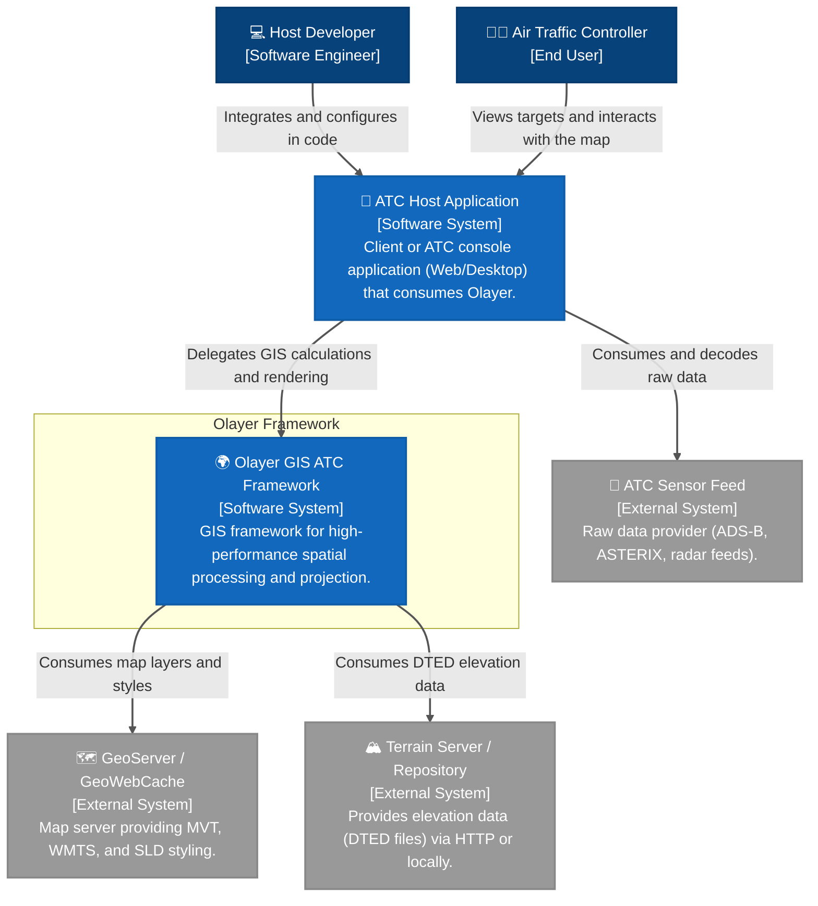
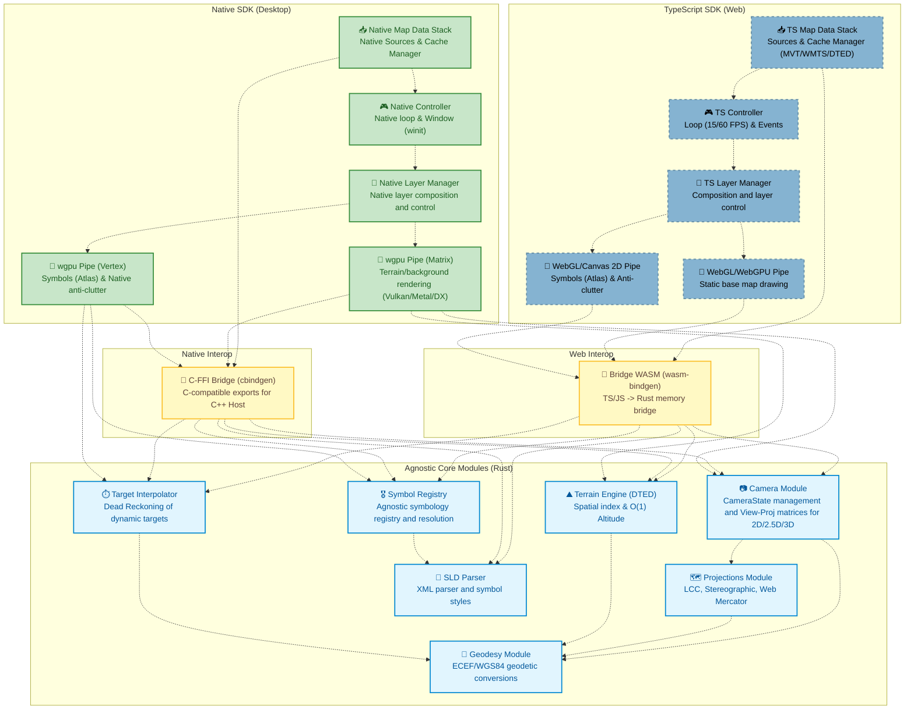
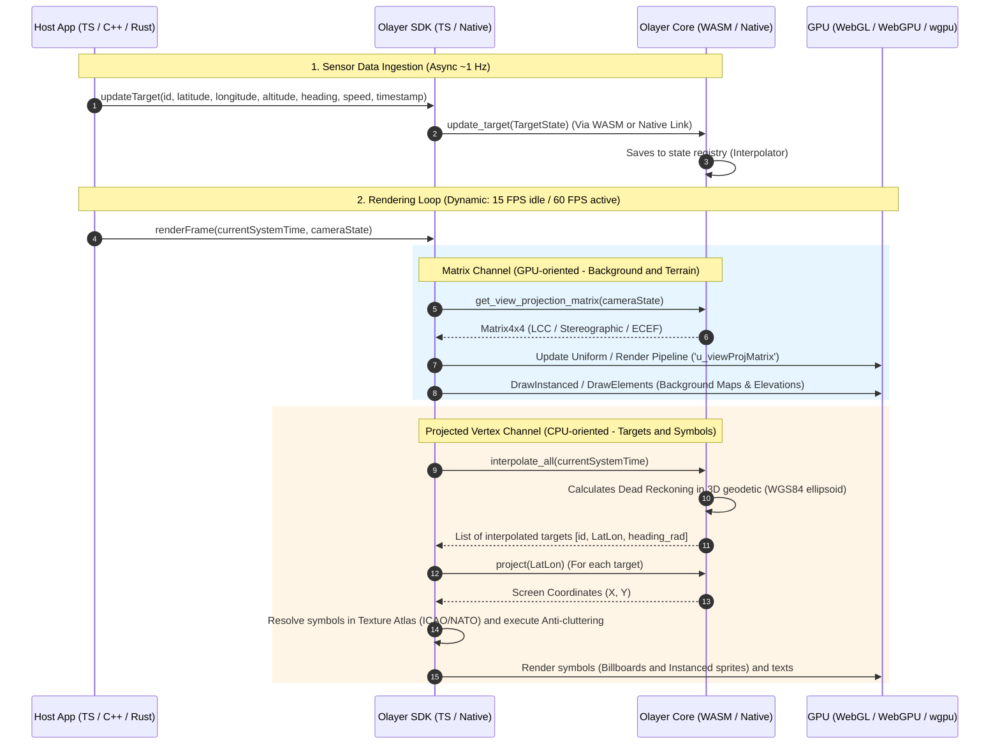
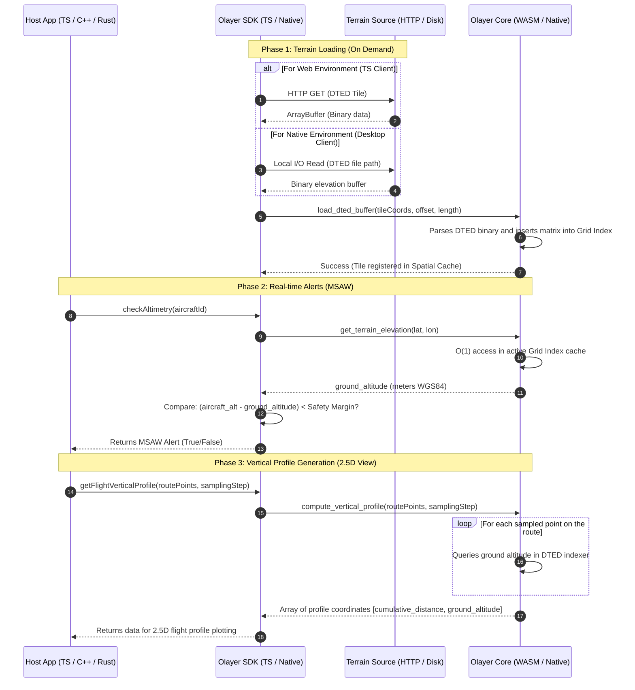

# Software Architecture: Olayer
## Hybrid GIS Framework for Air Traffic Control (ATC)

This document describes the initial architecture of the **Olayer** project, mapped from the requirements defined in the [Technical Specification (spec.md)](file:///c:/Users/rafae/projects/rust/olayer/docs/spec.md). The design uses the **C4 Model** (Context, Containers, Components, and Processes/Code) to illustrate the division of responsibilities, data flows, and mission-critical structural decisions.

---

## 1. Level 1: System Context Diagram

The context diagram describes how the Olayer framework positions itself in relation to the actors (developers and operators) and external systems of the ATC solution.



### Actors and Systems

| Element | Type | Description |
| :--- | :--- | :--- |
| **Air Traffic Controller** | User | Final operator who uses the radar screen to monitor routes, deviations, and safety alerts. |
| **Host Developer** | User | Developer who integrates the Olayer SDK into the client application (Web or Desktop). |
| **Olayer GIS ATC Framework** | System | The project scope: framework responsible for geodetic calculations, projections, target/terrain rendering, and GIS checks. |
| **ATC Host Application** | External System | The host software (e.g., TMA approach control terminal or en-route center). Manages sockets, business rules, and general interfaces. |
| **GeoServer / GeoWebCache** | External System | Map server that centralizes geographic files (sector boundaries, airways) and distributes them in optimized chunks (Tiles). |
| **ATC Sensor Feed** | External System | Network infrastructure that injects radar or ADS-B feeds into the host application. Olayer is agnostic to this network. |
| **Terrain Server / Repository** | External System | File server or local storage that provides terrain elevation data (DTED) upon request. |

---

## 2. Level 2: Container Diagram

Olayer is designed as a hybrid framework. It divides itself into a shared Rust core and specific bindings for web (WebAssembly) and desktop (Native) environments.


### Framework Containers

1. **Olayer Core (Rust - compilable to WASM and Native):**
   * **Responsibility:** All mission-critical mathematical engine. Has no direct I/O access to files or network in the WASM version (passive), processing only memory structures provided by the host layer.
   * **Technology:** Pure Rust (`f64`).
2. **WASM Bindings (wasm-bindgen):**
   * **Responsibility:** Memory transition bridge between the JS virtual machine and the WASM linear memory. Minimizes copies using direct buffer references (`ArrayBuffer` for DTED/MVT).
   * **Technology:** `wasm-bindgen`, `js-sys`, `web-sys`.
3. **Olayer TS SDK (TypeScript):**
   * **Responsibility:** Client SDK/Framework consumed by web applications. Manages the visual `<canvas>` element lifecycle, orchestrates WebGL/WebGPU shaders, and handles anti-overlapping label calculations (anti-cluttering) on the CPU.
   * **Technology:** TypeScript, WebGL 2.0 / WebGPU, Canvas 2D API.
4. **Olayer Native SDK (Rust):**
   * **Responsibility:** Wrapper for native desktop applications. Facilitates Core usage with local rendering engines.
   * **Technology:** Rust, optionally C/C++ bindings (`cbindgen`).

---

## 3. Level 3: Component Diagram (Internals of Core and SDK)

This diagram focuses on the internal modular organization of the **Olayer Core** and **Olayer TS SDK**, illustrating how components cooperate to perform cartographic projections and real-time rendering.



### Component Details

#### 1. Rust Core Modules
* **[Geodesy Module](file:///c:/Users/rafae/projects/rust/olayer/core/src/geodesy):** Provides the mathematical functions based on the WGS84 reference ellipsoid. Performs bidirectional transformations between geographic coordinates $(\phi, \lambda, h)$ and Cartesian ECEF $(X, Y, Z)$.
* **[Camera Module](file:///c:/Users/rafae/projects/rust/olayer/core/src/camera):** Manages the three-dimensional geographic navigation state and camera attitude (center, zoom, bearing/yaw, pitch, roll) and calculates the View-Projection matrices for 2D, 2.5D, and 3D in a unified and performant manner.
* **[Projections Module](file:///c:/Users/rafae/projects/rust/olayer/core/src/projections):** Contains the mathematical formulas to project three-dimensional or geodetic points onto 2D planes. Implements the equations for Stereographic, LCC, and Mercator projections.
* **[Terrain Engine (DTED)](file:///c:/Users/rafae/projects/rust/olayer/core/src/terrain):** Manages DTED files in memory. Builds a simplified 2D spatial index (Grid) where each cell points to the loaded elevation bytes. Allows altitude queries at arbitrary coordinates to run in constant time $O(1)$.
* **[SLD Parser](file:///c:/Users/rafae/projects/rust/olayer/core/src/sld):** Syntactic parser (Parser) of XML that converts the OGC SLD (Styled Layer Descriptor) standard into structured style metadata.
* **[Symbol Registry](file:///c:/Users/rafae/projects/rust/olayer/core/src/symbol_registry):** Unified and agnostic symbology registry that resolves symbol codes (such as VOR or fighter jets) using simplified vector primitives generated from consolidated JSON library files. These JSON symbol files are pre-compiled from SVG files using the CLI tool `tools/symbol-compiler`. Rasterized symbols (PNG/JPG) are injected directly into the client SDK in the Texture Atlas, keeping the core lightweight and free of raster decoders.
* **[Target Interpolator](file:///c:/Users/rafae/projects/rust/olayer/core/src/interpolator):** Maintains the state table of dynamic targets in 3D geodetic space. For each target, records the last known state vector. Computes interpolated positions via 3D Dead Reckoning based on system time (WGS84 LatLon and heading), completely decoupled from screen projection.

#### 2. TypeScript SDK Components (Web Client)
* **TS Controller:** Controls the screen animation loop in the browser using `requestAnimationFrame` and manages dynamic FPS modulation (15 FPS idle / 60 FPS active).
* **TS Layer Manager:** Coordinates the layer stack (Layer Stack) on the Web, managing the optimized paint cycle with isolation of static and dynamic layers.
* **TS Map Data Stack:** Manages the web map data infrastructure. Implements the `MapDataSource` abstractions and manages sub-providers such as `VectorTileSource` (for MVT/GeoServer), `RasterTileSource` (WMTS/OpenStreetMap), and `TerrainTileSource` (dynamic terrain paging). Controls request queues, browser concurrency, and local LRU cache.
* **WebGL/WebGPU GPU Pipeline:** Binds static vertex buffers and renders on the GPU from $4 \times 4$ matrices sent by the WASM bridge.
* **WebGL/Canvas 2D CPU Pipeline:** Renders dynamic targets by resolving sprites in the GPU *Texture Atlas* and calculating label anti-overlapping.

#### 3. Native SDK Components (Desktop Client)
* **Native Controller:** Controls the native frame loop and manages local desktop window creation (using the `winit` crate or the host application's message loop).
* **Native Layer Manager:** Manages the native layer stack for visibility, blending, and repainting at the native level.
* **Native Map Data Stack:** Desktop equivalent of data infrastructure. Manages high-performance network connections (via `reqwest`), tactical format decoding, and efficient local disk I/O for DTED files.
* **wgpu GPU Pipeline:** Compiles pipelines and renders on the GPU (Vulkan, Metal, or DirectX 12) through the Rust `wgpu` library to draw 3D terrain and vector background maps.
* **wgpu CPU/Vertex Pipeline:** Renders dynamic targets on the desktop using instanced calls and *billboards* from a local texture atlas.

#### 4. Interoperability Layers (Bridges)
* **WASM Bridge (wasm-bindgen):** Memory transition and FFI bridge that exports Core Rust functions to the TypeScript/JavaScript format in the browser, using direct memory references.
* **C-FFI Bridge (cbindgen):** C-API export bridge (`libolayer_native.h`) generated by `cbindgen`, exposing interfaces compatible with direct binding for hosts in C, C++, or other compiled languages.

---

## 4. Level 4: Code and Process Flows (Sequence Diagrams)

### 4.1 Ping Ingestion and Dynamic Rendering Loop (FPS Throttling)

This diagram details how the system handles slow sensor data reception (usually 1 Hz) and renders it smoothly on the screen (15 to 60 FPS) using *Dead Reckoning*.



### 4.2 DTED Terrain Loading and Vertical Alert Processing (MSAW)

This diagram illustrates the loading of DTED files into memory and the calculation of vertical alerts and elevation profile, detailing the difference in data consumption between Web and Desktop.



---

## 5. Critical Architectural Decisions (ADRs)

### ADR-001: Hybrid Rendering Pipeline (Matrices vs Vertices)
* **Context:** Drawing complex maps with geographic vectors generates millions of vertices. On the other hand, radar targets (airplanes) require fixedly rotated symbols and legible labels without 3D distortion (*Billboard* effect).
* **Decision:** The hybrid model was adopted.
  * The map background (MVT) and dense terrain are projected and rendered on the GPU using $4\times4$ matrix transformations computed in the Rust Core.
  * The airplane symbols and dynamic textual labels are projected from geodetic to 2D screen coordinates $(X,Y)$ in the Rust Core. The drawing itself occurs in a "flattened" and pixel-perfect manner on the screen, allowing efficient text anti-overlapping algorithms (anti-cluttering) on the CPU.
* **Consequence:** Excellent overall graphics performance combined with absolute readability and safety on ATC screens.

### ADR-002: Passive Resource Ingestion in Rust Core (WASM)
* **Context:** DTED terrain files and SLD styles reside on disk or external geographic servers. Code running in standard WebAssembly in browsers has severe security restrictions for native I/O (file system) and direct HTTP requests from the Rust Core could unnecessarily inflate the final binary.
* **Decision:** The Core in Rust is completely passive. It has no network drivers or disk readers. The TypeScript SDK downloads resources (MVT buffers, SLD XML files, and DTED ArrayBuffers) via native browser APIs (`fetch`) and injects the binary memory pointers into the methods exposed by WebAssembly.
* **Consequence:** Lightweight WASM binary, complete decoupling of data transport logic, and enhanced execution security.

### ADR-003: Motion Interpolation on the Client Side (Dead Reckoning)
* **Context:** Radar or ADS-B feeds arrive at the host application with intervals of 1 to 4 seconds. Updating aircraft on the screen directly at these pings will cause jerky animations and visual discomfort for controllers.
* **Decision:** Implement the kinematic estimation logic in the Core. The Host only reports the real positions with their historical timestamps. The Core performs the linear prediction calculation of the aircraft's current position based on the frame processing time and the reported speed/heading.
* **Consequence:** Continuous and smooth movement at 60 FPS, even under unstable networks or packet reception delays.

### ADR-004: WebAssembly Memory Lifecycle Management and Deallocation
* **Context:** WebAssembly (WASM) shares linear memory with JavaScript. Objects created in Rust (such as structs instantiated via `wasm-bindgen` wrapper) reside in the WASM heap and are not managed by the JavaScript Garbage Collector (GC). If the TypeScript SDK instantiates objects in Rust and loses references in JS without explicitly freeing them, the WASM memory will grow indefinitely, generating *out-of-memory* in long-duration executions (essential in ATC systems).
* **Decision:** The TypeScript SDK will implement strict lifecycle control of Rust/WASM objects.
  - Every structure created in Rust with a short lifecycle (e.g., discarded targets, quick query flight profiles) must have its `.free()` method explicitly invoked by the TS SDK.
  - For dense and variable-sized buffers (such as loaded DTED terrain grids), the SDK will manage a fixed-size cache with LRU (Least Recently Used) replacement policy. When a terrain tile is discarded from the cache, the SDK notifies the Rust Core to free the corresponding memory.
  - The Rust Core will use pre-allocated static vectors for highly dynamic data (such as the list of interpolated targets in the current frame), avoiding repeated memory allocations and deallocations at each rendering frame.
* **Consequence:** Long-term memory usage stability, predictable browser RAM consumption, and prevention of crashes due to memory exhaustion in continuous operational sessions.

### ADR-005: Display Layer Segregation and Graphics Optimization (Texture Atlases & Framebuffer Cache)
* **Context:** Drawing complete maps containing millions of static GIS polygons and relief textures together with dynamic targets in real-time at 60 FPS causes high overhead on the GPU and CPU due to frequent context changes and excessive draw calls. Complex military symbols (NATO APP-6) composed of multiple sub-vectors aggravate this problem if rendered individually each frame.
* **Decision:** The framework will adopt a layer-based segregated rendering strategy:
  - **Cycle Separation:** Static background map layers (MVT and elevation) will be rendered and composited into offscreen Framebuffers (Offscreen Render Targets) only when the camera undergoes physical changes. If the screen is static, the GPU only performs a quick redraw of this cached texture (*blitting*).
  - **Dynamic Texture Atlas:** Complex symbols decoded by the `Symbol Registry` will be rasterized once on the CPU and injected into a common Texture Atlas on the GPU.
  - **Instancing:** To draw thousands of aircraft and targets, the SDK will send a single buffer of dynamic data and perform one instanced draw call (`drawElementsInstanced`) based on the texture offsets of the Atlas, reducing thousands of draw calls to just one.
* **Consequence:** High frame rate (stable 60 FPS), free CPU time on the main thread for tactical processing, and very low battery/resource consumption on static monitoring panels.

### ADR-006: Importing and Resolving Custom Symbols (SVG and PNG)
* **Context:** In addition to standard procedural professional symbologies (ICAO/NATO), the host application needs to inject and render custom icons provided in vector (SVG) or rasterized (PNG) formats. The framework requires a workflow that unifies these external sources and maintains rendering consistency and performance in 2D and 3D visualizations.
* **Decision:** The responsibility for importing formats was separated by asset type, optimizing performance and keeping the Rust Core/WASM lightweight:
  - **Vector Symbols (SVG):** To avoid the computational cost and heavy dependencies of XML/SVG parsing at runtime in WASM, SVG files are processed at build time using the CLI tool **`tools/symbol-compiler`**. This tool maps SVG vector elements to pure Olayer primitives in a consolidated JSON file that is fed into the Core's `DeclarativeProvider` at runtime.
  - **Rasterized Symbols (PNG/JPG):** Rasterized images do not go through the Core. PNG/JPG loading is delegated to the TypeScript SDK via the `TextureAtlasManager::registerImageSymbol` method, which uses the browser's native image loading APIs and draws pixels directly into the Texture Atlas's offscreen canvas for submission to the GPU.
  - **Unification in 2D/3D Streams:** Once loaded into the Texture Atlas with their respective UV coordinates, imported symbols use the same instanced rendering pipeline. In the 2D flow, they are drawn as common flat sprites. In the 3D flow, they are rendered using *Billboard Shaders* that align the flat coordinates to the camera, preventing 3D perspective distortions and ensuring readability.
* **Consequence:** Full visual customization flexibility, zero overhead of heavy decoders or file interpreters in the WASM Core, and consistent high-performance rendering of thousands of simultaneous symbols.

---

## 6. Directory Structure Mapping with Components

The proposed physical repository structure is organized according to the architecture's division of responsibilities:

```text
olayer/
├── core/                         # [C4 Component: Olayer Core Engine]
│   ├── Cargo.toml
│   └── src/
│       ├── geodesy/              # Geodetic Formulas and ECEF Module (WGS84)
│       │   └── mod.rs
│       ├── projections/          # Stereographic, LCC, and Mercator Implementations
│       │   └── mod.rs
│       ├── terrain/              # DTED File Parsing and O(1) Altitude Index
│       │   └── mod.rs
│       ├── sld/                  # XML Parser for SLD Styling
│       │   └── mod.rs
│       └── interpolator/         # Dead Reckoning Logic for Target Tracking
│           └── mod.rs
│
sdk/
├── ts/                       # [C4 Component: Olayer TS SDK]
│   ├── package.json
│   ├── src/
│   │   ├── controller/       # Loop Management, FPS Throttler, and Events
│   │   ├── providers/        # WMTS, MVT, SLD network calls, and DTED injection
│   │   ├── renderer/         # WebGL Renderer (GPU) and Canvas (CPU)
│   │   └── index.ts          # Public TypeScript SDK API
│   ├── tsconfig.json
│   └── wasm/                 # [C4 Component: WASM Bindings Layer]
│       ├── Cargo.toml
│       └── src/
│           └── lib.rs        # Exports with #[wasm_bindgen] for TS SDK
│
└── native/                   # [C4 Component: Olayer Native Environment]
    ├── c_ffi_bridge/         # [C4 Component: C-FFI Bridge]
    │   ├── Cargo.toml
    │   └── src/
    │       └── lib.rs        # C-compatible Exports / cbindgen header
    │
    └── desktop/              # [C4 Component: Olayer Native SDK & Demo]
        ├── Cargo.toml
        └── src/
            ├── lib.rs        # Native static interface / FPS throttler
            └── main.rs       # Native demo wgpu + winit + egui

```

---

## 7. Next Steps for Architecture Validation

To ratify the premises of this architecture document, the following experimental activities are planned:
1. **Mathematical Validation (Geodesy):** Creation of unit tests in the `geodesy` module comparing the geodetic distance between known airports calculated by the core with the official WGS84 reference model.
2. **WASM-TS Bound Benchmark:** Measurement of data transfer latency when loading 1MB DTED buffers between the TypeScript stack and the WASM linear memory to confirm the absence of bottlenecks at the edge.
3. **Dynamic Projection Test:** Rendering of a test sector with rapid runtime switching from Lambert Conformal Conic to Azimuthal Stereographic to ensure correct matrix and vertex updates.
