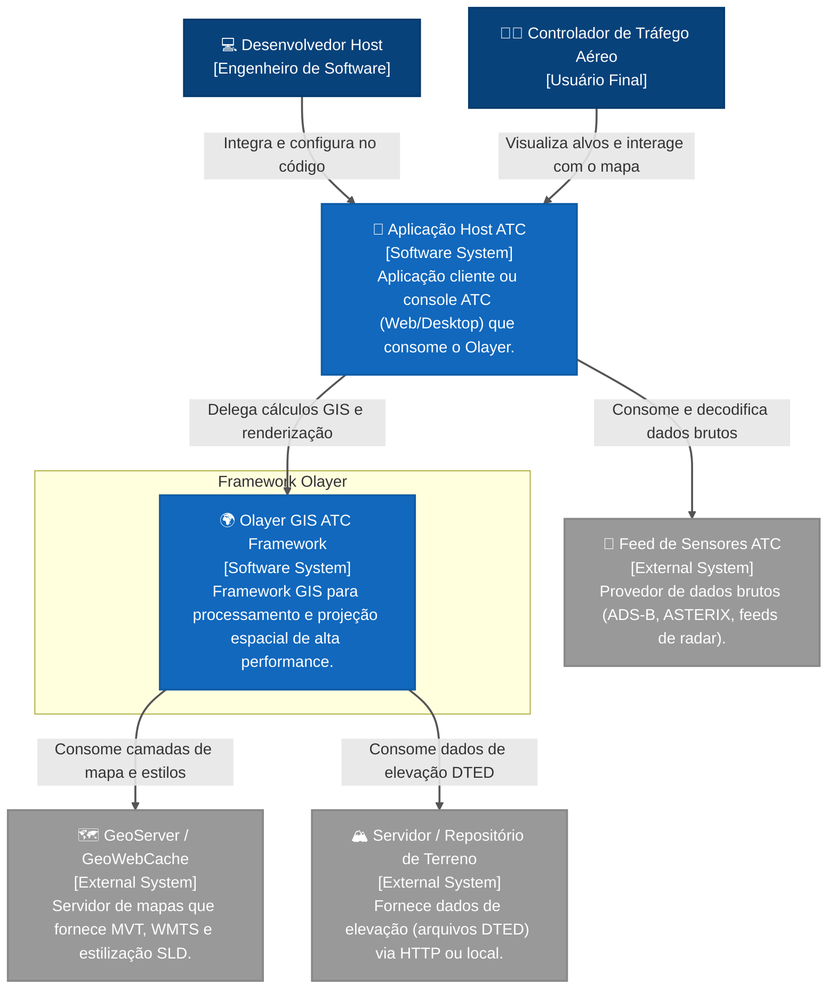
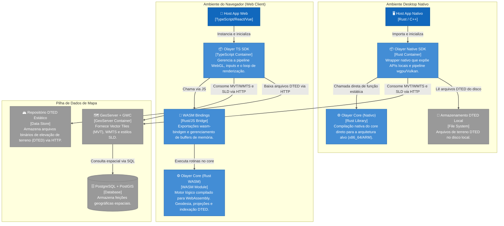
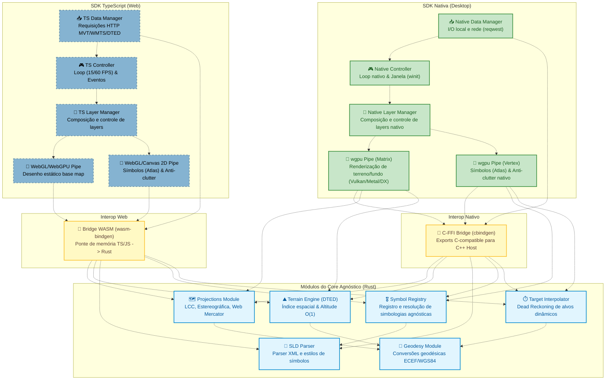
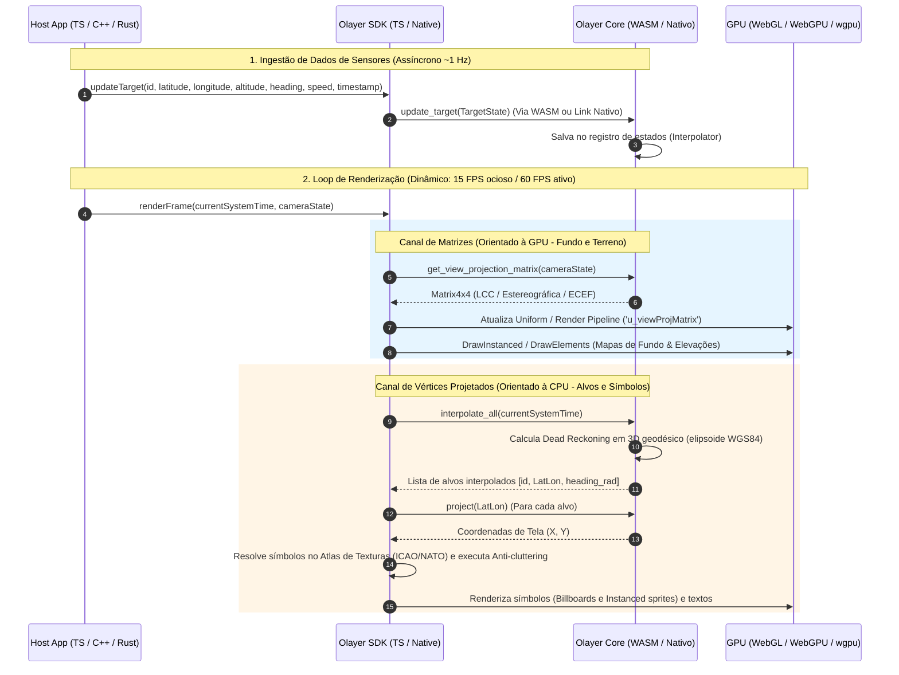
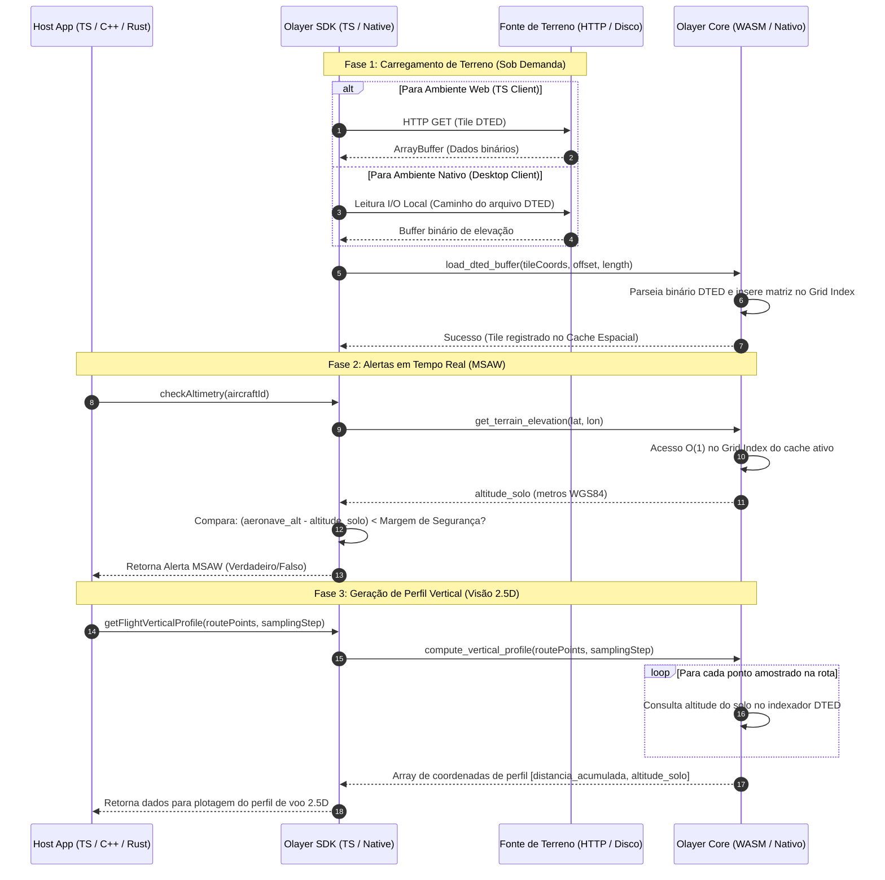

# Arquitetura de Software: Olayer
## Framework GIS Híbrido para Controle de Tráfego Aéreo (ATC)

Este documento descreve a arquitetura inicial do projeto **Olayer**, mapeada a partir dos requisitos definidos na [Especificação Técnica (spec.md)](file:///c:/Users/rafae/projects/rust/olayer/docs/spec.md). O design utiliza o modelo **C4 Model** (Contexto, Contêineres, Componentes e Processos/Código) para ilustrar a divisão de responsabilidades, fluxos de dados e decisões estruturais de missão crítica.

---

## 1. Nível 1: Diagrama de Contexto do Sistema

O diagrama de contexto descreve como o framework Olayer se posiciona em relação aos atores (desenvolvedores e operadores) e aos sistemas externos da solução ATC.



### Atores e Sistemas

| Elemento | Tipo | Descrição |
| :--- | :--- | :--- |
| **Controlador de Tráfego Aéreo** | Usuário | Operador final que utiliza a tela do radar para monitorar rotas, desvios e alertas de segurança. |
| **Desenvolvedor Host** | Usuário | Desenvolvedor que integra a SDK do Olayer no aplicativo cliente (Web ou Desktop). |
| **Olayer GIS ATC Framework** | Sistema | O escopo do projeto: framework responsável por cálculos geodésicos, projeções, renderização de alvos/terreno e checagens GIS. |
| **Aplicação Host ATC** | Sistema Externo | O software hospedeiro (ex: terminal de controle de aproximação TMA ou centro de rota). Gerencia sockets, regras de negócio e interfaces gerais. |
| **GeoServer / GeoWebCache** | Sistema Externo | Servidor de mapas que centraliza arquivos geográficos (limites de setores, aerovias) e distribui em pedaços otimizados (Tiles). |
| **Feed de Sensores ATC** | Sistema Externo | Infraestrutura de rede que injeta feeds de radar ou ADS-B na aplicação host. O Olayer é agnóstico a esta rede. |
| **Servidor / Repositório de Terreno** | Sistema Externo | Servidor de arquivos ou armazenamento local que fornece os dados de elevação do terreno (DTED) requisitados. |

---

## 2. Nível 2: Diagrama de Contêineres

O Olayer é projetado como um framework híbrido. Ele divide-se em um núcleo compartilhado em Rust e bindings específicos para ambientes web (WebAssembly) e desktop (Nativo).



### Contêineres do Framework

1. **Olayer Core (Rust - compilável para WASM e Nativo):**
   * **Responsabilidade:** Todo o motor matemático de missão crítica. Não possui acesso a I/O direto para arquivos ou rede na versão WASM (passivo), processando apenas estruturas de memória fornecidas pela camada hospedeira.
   * **Tecnologia:** Rust puro (`f64`).
2. **WASM Bindings (wasm-bindgen):**
   * **Responsabilidade:** Ponte de transição de memória entre a máquina virtual JS e a memória linear do WASM. Minimiza cópias usando referências diretas de buffers (`ArrayBuffer` para DTED/MVT).
   * **Tecnologia:** `wasm-bindgen`, `js-sys`, `web-sys`.
3. **Olayer TS SDK (TypeScript):**
   * **Responsabilidade:** SDK/Framework cliente consumido por aplicações Web. Gerencia o ciclo de vida do elemento visual `<canvas>`, orquestra shaders WebGL/WebGPU e cuida dos cálculos de anti-sobreposição de etiquetas (anti-cluttering) na CPU.
   * **Tecnologia:** TypeScript, WebGL 2.0 / WebGPU, Canvas 2D API.
4. **Olayer Native SDK (Rust):**
   * **Responsabilidade:** Invólucro para aplicações Desktop nativas. Facilita o uso do Core com engines de renderização locais.
   * **Tecnologia:** Rust, opcionalmente bindings C/C++ (`cbindgen`).

---

## 3. Nível 3: Diagrama de Componentes (Internos do Core e SDK)

Este diagrama foca na organização modular interna do **Olayer Core** e do **Olayer TS SDK**, ilustrando como os componentes cooperam para realizar projeções cartográficas e renderizações em tempo real.



### Detalhamento dos Componentes

#### 1. Módulos do Core Rust
* **[Geodesy Module](file:///c:/Users/rafae/projects/rust/olayer/core/src/geodesy):** Fornece as funções matemáticas baseadas no elipsoide de referência WGS84. Realiza transformações bidirecionais entre coordenadas geográficas $(\phi, \lambda, h)$ e cartesianas ECEF $(X, Y, Z)$.
* **[Projections Module](file:///c:/Users/rafae/projects/rust/olayer/core/src/projections):** Contém as fórmulas matemáticas para projetar pontos tridimensionais ou geodésicos em planos 2D. Implementa as projeções Estereográfica, LCC e Mercator.
* **[Terrain Engine (DTED)](file:///c:/Users/rafae/projects/rust/olayer/core/src/terrain):** Gerencia arquivos DTED em memória. Constrói um índice espacial 2D simplificado (Grid) onde cada célula aponta para os bytes de elevação carregados. Permite que consultas de altitude em coordenadas arbitrárias rodem em tempo constante $O(1)$.
* **[SLD Parser](file:///c:/Users/rafae/projects/rust/olayer/core/src/sld):** Analisador sintático (Parser) de XML que converte o padrão OGC SLD (Styled Layer Descriptor) em metadados de estilo estruturados.
* **[Symbol Registry](file:///c:/Users/rafae/projects/rust/olayer/core/src/symbol_registry):** Registro unificado e agnóstico de simbologia que aceita a importação de símbolos customizados nos formatos **SVG** ou **PNG**, além de delegar a decodificação de códigos de símbolos para provedores específicos (como NATO APP-6 ou ICAO civil), retornando primitivas vetoriais estruturadas ou buffers de pixel prontos para o Atlas de Texturas.
* **[Target Interpolator](file:///c:/Users/rafae/projects/rust/olayer/core/src/interpolator):** Mantém a tabela de estado de alvos dinâmicos no espaço geodésico 3D. Para cada alvo, registra o último vetor de estado conhecido. Computa posições interpoladas via Dead Reckoning tridimensional baseada no tempo do sistema (WGS84 LatLon e heading), de forma totalmente desacoplada da projeção de tela.

#### 2. Componentes da SDK TypeScript (Web Client)
* **TS Controller:** Controla o loop de animação da tela no navegador utilizando `requestAnimationFrame` e gerencia a modulação dinâmica de FPS (15 FPS ocioso / 60 FPS ativo).
* **TS Layer Manager:** Coordena a pilha de camadas (Layer Stack) na Web, gerindo o ciclo de pintura otimizado com isolamento de camadas estáticas e dinâmicas.
* **TS Data Manager:** Realiza as chamadas HTTP assíncronas no navegador (`fetch`) para obter os arquivos vetoriais MVT do GeoServer, imagens WMTS, esquemas SLD e binários DTED.
* **WebGL/WebGPU GPU Pipeline:** Vincula buffers de vértices estáticos e renderiza na GPU a partir de matrizes $4 \times 4$ enviadas pela ponte WASM.
* **WebGL/Canvas 2D CPU Pipeline:** Renderiza alvos dinâmicos resolvendo os sprites no *Atlas de Texturas* da GPU e calculando a anti-sobreposição de etiquetas.

#### 3. Componentes da SDK Nativa (Desktop Client)
* **Native Controller:** Controla o loop nativo de frames e gerencia a criação de janelas desktop locais (utilizando a crate `winit` ou o loop de mensagens da aplicação host).
* **Native Layer Manager:** Gerencia a pilha de camadas nativas para controle de visibilidade, mesclagem e repintura em nível nativo.
* **Native Data Manager:** Gerencia a leitura assíncrona de arquivos DTED no disco rígido local e faz requisições HTTP (via `reqwest` ou biblioteca similar) para buscar MVTs/WMTS do GeoServer.
* **wgpu GPU Pipeline:** Compila pipelines e renderiza na GPU (Vulkan, Metal ou DirectX 12) através da biblioteca Rust `wgpu` para desenhar terrenos tridimensionais e mapas de fundo vetoriais.
* **wgpu CPU/Vertex Pipeline:** Renderiza os alvos dinâmicos no desktop usando chamadas instanciadas e *billboards* a partir de um atlas de textura local.

#### 4. Camadas de Interoperabilidade (Bridges)
* **Bridge WASM (wasm-bindgen):** Ponte de transição de memória e FFI que exporta funções do Core Rust para o formato TypeScript/JavaScript no navegador, usando referências diretas de memória.
* **C-FFI Bridge (cbindgen):** Ponte de exportação C-API (`libolayer_native.h`) gerada pelo `cbindgen`, expondo interfaces compatíveis com vinculação direta para hospedeiros em C, C++ ou outras linguagens compiladas.

---

## 4. Nível 4: Código e Fluxos de Processo (Sequence Diagrams)

### 4.1 Ingestão de Pings e Loop de Renderização Dinâmico (FPS Throttling)

Este diagrama detalha como o sistema lida com o recebimento lento de dados de sensores (geralmente 1 Hz) e o renderiza suavemente na tela (15 a 60 FPS) usando *Dead Reckoning*.



### 4.2 Carga de Terreno DTED e Processamento de Alertas Verticais (MSAW)

Este diagrama ilustra o carregamento de arquivos DTED na memória e o cálculo de alertas verticais e perfil de elevação, detalhando a diferença de consumo de dados entre Web e Desktop.



---

## 5. Decisões Arquiteturais Críticas (ADRs)

### ADR-001: Pipeline Híbrido de Renderização (Matrizes vs Vértices)
* **Contexto:** Desenhar mapas complexos com vetores geográficos gera milhões de vértices. Por outro lado, alvos de radar (aviões) exigem símbolos rotacionados de forma fixa e etiquetas legíveis sem distorção 3D (efeito *Billboard*).
* **Decisão:** Adotou-se o modelo híbrido.
  * O fundo do mapa (MVT) e o terreno denso são projetados e renderizados na GPU usando transformações de matrizes $4\times4$ computadas no Rust Core.
  * Os símbolos de aviões e as etiquetas textuais dinâmicas são projetados de geodésico para coordenadas de tela de 2D $(X,Y)$ no Rust Core. O desenho em si ocorre de forma "achatada" e pixel-perfect na tela, permitindo algoritmos de prevenção de sobreposição de texto (anti-cluttering) eficientes na CPU.
* **Consequência:** Excelente desempenho gráfico global combinado com legibilidade absoluta e segurança no controle de telas ATC.

### ADR-002: Ingestão Passiva de Recursos no Core Rust (WASM)
* **Contexto:** Arquivos DTED de terreno e estilos SLD residem em disco ou em servidores geográficos externos. O código em WebAssembly executando nos browsers padrão possui restrições severas de segurança para I/O nativo (file system) e requisições HTTP diretas por parte do Core Rust podem inflar o binário final desnecessariamente.
* **Decisão:** O Core em Rust é completamente passivo. Ele não possui drivers de rede ou leitores de disco. A SDK TypeScript baixa os recursos (buffers MVT, XML de arquivos SLD e ArrayBuffers DTED) via APIs nativas do navegador (`fetch`) e injeta os ponteiros de memória binária nos métodos expostos pelo WebAssembly.
* **Consequência:** Binário WASM leve, desacoplamento total da lógica de transporte de dados e segurança de execução aprimorada.

### ADR-003: Interpolação de Movimento no Lado do Cliente (Dead Reckoning)
* **Contexto:** Feeds de radar ou ADS-B chegam à aplicação host com intervalos de 1 a 4 segundos. Atualizar as aeronaves na tela diretamente nesses pings causará animações travadas e desconforto visual aos controladores.
* **Decisão:** Implementar a lógica de estimativa cinemática no Core. O Host apenas reporta as posições reais com seus timestamps históricos. O Core realiza o cálculo de predição linear da posição atual da aeronave com base no tempo de processamento do frame e na velocidade/rumo informados.
* **Consequência:** Movimento contínuo e suave a 60 FPS, mesmo sob redes instáveis ou atrasos na recepção de pacotes.

### ADR-004: Gerenciamento de Ciclo de Vida e Desalocação de Memória WebAssembly
* **Contexto:** O WebAssembly (WASM) compartilha uma memória linear com o JavaScript. Objetos criados em Rust (como structs instanciadas via wrapper do `wasm-bindgen`) residem no heap do WASM e não são gerenciados pelo Garbage Collector (GC) do JavaScript. Se a SDK TypeScript instanciar objetos no Rust e perder as referências no JS sem liberá-los explicitamente, a memória do WASM crescerá indefinidamente, gerando *out-of-memory* em execuções de longa duração (essenciais em sistemas ATC).
* **Decisão:** A SDK TypeScript implementará um controle rígido do ciclo de vida dos objetos Rust/WASM.
  - Toda estrutura criada no Rust que possua ciclo de vida curto (ex: alvos descartados, perfis de voo de consulta rápida) deverá ter seu método `.free()` invocado explicitamente pela SDK TS.
  - Para buffers densos e de tamanho variável (como grids DTED de terreno carregados), a SDK gerenciará um cache de tamanho fixo com política de substituição LRU (Least Recently Used). Quando um tile de terreno for descartado do cache, a SDK notificará o Core Rust para liberar a memória correspondente.
  - O Core Rust usará vetores estáticos pré-alocados para dados altamente dinâmicos (como a lista de alvos interpolados no frame atual), evitando alocações e desalocações repetidas de memória a cada frame de renderização.
* **Consequência:** Estabilidade de uso de memória a longo prazo, previsibilidade de consumo de RAM do navegador e prevenção de travamentos por exaustão de memória em sessões operacionais contínuas.

### ADR-005: Segregação de Camadas de Exibição e Otimização Gráfica (Texture Atlases & Framebuffer Cache)
* **Contexto:** Desenhar mapas completos contendo milhões de polígonos GIS estáticos e texturas de relevo juntamente com alvos dinâmicos em tempo real a 60 FPS causa alta sobrecarga na GPU e CPU devido a trocas frequentes de contexto e excesso de draw calls. Símbolos militares complexos (NATO APP-6) compostos por múltiplos sub-vetores agravam esse problema se renderizados individualmente a cada frame.
* **Decisão:** O framework adotará uma estratégia de renderização segregada por camadas:
  - **Separação de Ciclos:** As camadas estáticas de fundo de mapa (MVT e elevação) serão renderizadas e compostas em Framebuffers fora da tela (Offscreen Render Targets) apenas quando a câmera sofrer alteração física. Se a tela estiver estática, a GPU realiza apenas o redesenho rápido dessa textura cacheada (*blitting*).
  - **Atlas de Texturas Dinâmico:** Os símbolos complexos decodificados pelo `Symbol Registry` serão rasterizados uma única vez na CPU e injetados em um Atlas de Texturas comum na GPU.
  - **Instanciamento:** Para desenhar milhares de aeronaves e alvos, a SDK enviará um único buffer de dados dinâmicos e fará uma chamada de desenho instanciada (`drawElementsInstanced`) baseada nos offsets de textura do Atlas, reduzindo milhares de draw calls para apenas uma.
* **Consequência:** Alta taxa de quadros (60 FPS estáveis), tempo de CPU livre na thread principal para processamento tático e baixíssimo consumo de bateria/recursos em painéis de monitoramento estáticos.

### ADR-006: Importação e Resolução de Símbolos Customizados (SVG e PNG)
* **Contexto:** Além das simbologias profissionais procedurais padrão (ICAO/NATO), a aplicação host precisa injetar e renderizar ícones customizados fornecidos nos formatos vetorial (SVG) ou rasterizado (PNG). O framework necessita de um fluxo que unifique estas fontes externas e mantenha a consistência de renderização e performance em visualizações 2D e 3D.
* **Decisão:** O componente `Symbol Registry` e as SDKs processarão as importações de forma a acoplá-las ao ecossistema do Texture Atlas:
  - **Ingestão de PNG:** O arquivo de imagem rasterizada é decodificado em buffer de pixels nativo (na CPU) e enviado para inserção direta em uma sub-região livre do *Texture Atlas* na GPU.
  - **Ingestão de SVG:** Para evitar o alto custo de desenhar caminhos vetoriais na GPU em tempo de execução, o SVG é rasterizado pela SDK na CPU antes do envio para a GPU. No ambiente Web, isso é realizado desenhando o SVG em um canvas offscreen na escala requerida; no ambiente nativo desktop, utiliza-se uma biblioteca leve de rasterização CPU (como `resvg`/`tiny-skia` em Rust).
  - **Unificação nos Streams 2D/3D:** Uma vez carregados no Texture Atlas com suas respectivas coordenadas UV, os símbolos importados utilizam o mesmo pipeline de renderização instanciada. No fluxo 2D, são desenhados como sprites planos comuns. No fluxo 3D, são renderizados usando *Billboard Shaders* que alinham as coordenadas planas à câmera, impedindo distorções tridimensionais de perspectiva e garantindo legibilidade.
* **Consequência:** Flexibilidade na customização visual, independência de formatos externos durante o ciclo de renderização ativa, e preservação da escalabilidade vetorial (no caso do SVG) ao rasterizar sob demanda na resolução ideal do dispositivo (suporte nativo a telas High-DPI/Retina).

---

## 6. Mapeamento da Estrutura de Diretórios com Componentes

A estrutura física proposta para o repositório é organizada conforme a divisão de responsabilidades da arquitetura:

```text
olayer/
├── core/                         # [C4 Component: Olayer Core Engine]
│   ├── Cargo.toml
│   └── src/
│       ├── geodesy/              # Módulo de Fórmulas Geodésicas e ECEF (WGS84)
│       │   └── mod.rs
│       ├── projections/          # Implementações de Estereográfica, LCC e Mercator
│       │   └── mod.rs
│       ├── terrain/              # Parse de arquivos DTED e Índice de Altitude O(1)
│       │   └── mod.rs
│       ├── sld/                  # Parser de XML para Estilização SLD
│       │   └── mod.rs
│       └── interpolator/         # Lógica de Dead Reckoning para rastreio de alvos
│           └── mod.rs
│
├── bindings/
│   └── wasm/                     # [C4 Component: WASM Bindings Layer]
│       ├── Cargo.toml
│       └── src/
│           └── lib.rs            # Exportações com #[wasm_bindgen] para a SDK TS
│
└── sdk/
    ├── ts/                       # [C4 Component: Olayer TS SDK]
    │   ├── package.json
    │   ├── src/
    │   │   ├── controller/       # Gerenciamento de Loop, FPS Throttler e Eventos
    │   │   ├── providers/        # Chamadas de rede WMTS, MVT, SLD e injeção DTED
    │   │   ├── renderer/         # Renderizador WebGL (GPU) e Canvas (CPU)
    │   │   └── index.ts          # API pública da SDK TypeScript
    │   └── tsconfig.json
    │
    └── rust/                     # [C4 Component: Olayer Native SDK]
        ├── Cargo.toml
        └── src/
            └── lib.rs            # Interface estática / wgpu nativo para Desktop
```

---

## 7. Próximos Passos de Validação de Arquitetura

Para ratificar as premissas deste documento de arquitetura, as seguintes atividades experimentais são planejadas:
1. **Validação Matemática (Geodesia):** Criação de testes unitários no módulo `geodesy` comparando a distância geodésica entre aeroportos conhecidos calculada pelo core com o modelo de referência oficial do WGS84.
2. **Benchmark WASM-TS Bound:** Medição da latência de transferência de dados ao carregar buffers DTED de 1MB entre a pilha TypeScript e a memória linear do WASM para confirmar a ausência de gargalos na borda.
3. **Teste de Projeção Dinâmica:** Renderização de um setor de testes com troca rápida em tempo de execução de Lambert Conformal Conic para Estereográfica Azimutal para garantir a atualização correta das matrizes e vértices.
