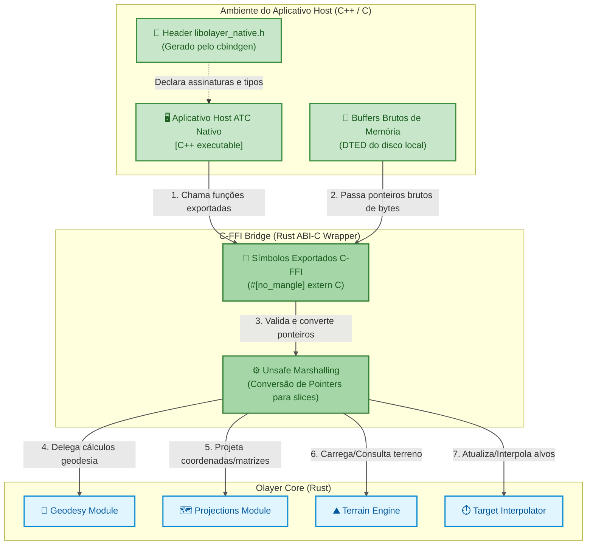

# Bridge C-FFI (Nativo)
## Componentes de Interoperabilidade Desktop Nativa (C4 Model - Nível 3)

Este documento descreve o design detalhado, as diretrizes de compatibilidade binária e o gerenciamento de memória da ponte de interoperabilidade **C-FFI** do Olayer, localizada em `bindings/c_ffi` (ou integrada como módulo exportável do [Olayer Core](file:///c:/Users/rafae/projects/rust/olayer/core)). Este componente expõe as capacidades geométricas de missão crítica do motor em Rust para aplicativos locais escritos em linguagens nativas compiladas (como C, C++, C# ou Go).

---

## 1. Diagrama de Integração C-FFI

A ponte C-FFI opera no nível da ABI (Application Binary Interface) do sistema operacional, expondo símbolos exportados através de convenções de chamada padrão C (`extern "C"`).



---

## 2. Responsabilidades

O componente **C-FFI Bridge** possui as seguintes atribuições principais:
1. **Compatibilidade com a ABI C:** Garantir que todas as funções exportadas utilizem a convenção de chamada de sistema padrão (`extern "C"`) e que as structs tenham layout compatível (`#[repr(C)]`).
2. **Construção de DLLs e Bibliotecas Estáticas:** Compilar o código Rust como biblioteca dinâmica (`.dll`/`.so`/`.dylib`) ou estática (`.lib`/`.a`).
3. **Autogeração de Cabeçalhos (Header Generator):** Utilizar a crate `cbindgen` para gerar automaticamente o arquivo de declarações C/C++ `libolayer_native.h`.
4. **Gerenciamento Seguro de Ponteiros (Pointers Translators):** Converter ponteiros brutos C (`*const u8`, `*const c_char`, etc.) em slices (`&[u8]`) e strings Rust de forma segura dentro de escopos `unsafe`.
5. **Tratamento de Exceções e Código de Erro:** Capturar possíveis pânicos (*unwind panics*) no Rust para impedir que derrubem o processo do host C++ (usando `std::panic::catch_unwind`), retornando códigos de erro estruturados (`int32_t`).

---

## 3. Interfaces Projetadas (C-API Exports)

Para permitir a integração com C/C++, as assinaturas de dados expõem ponteiros opacos para as structs de controle do Rust:

### 3.1 Definições C-Compatíveis
```rust
use std::os::raw::{c_char, c_int};
use olayer_core::geodesy::LatLon;
use olayer_core::terrain::TerrainEngine;
use olayer_core::interpolator::InterpolationEngine;

/// C representation of a geodetic coordinate.
#[repr(C)]
pub struct C_LatLon {
    pub lat: f64,
    pub lon: f64,
    pub height: f64,
}

/// C representation of an interpolated target.
#[repr(C)]
pub struct C_InterpolatedTarget {
    pub id: *mut c_char,
    pub lat: f64,
    pub lon: f64,
    pub height: f64,
    pub heading_rad: f64,
}

/// C representation of a vertical profile point.
#[repr(C)]
pub struct C_ProfilePoint {
    pub distance_meters: f64,
    pub ground_elevation: f64,
    pub lat: f64,
    pub lon: f64,
    pub height: f64,
}
```

### 3.2 Funções da API do Terreno (DTED)
```rust
/// Creates a new TerrainEngine instance and returns an opaque pointer.
#[no_mangle]
pub extern "C" fn olayer_terrain_engine_create() -> *mut TerrainEngine {
    Box::into_raw(Box::new(TerrainEngine::new()))
}

/// Parses and registers a raw DTED buffer. Writes origin coordinates to
/// out_lat_deg / out_lon_deg on success.
/// Returns 0 on success, negative error on failure.
#[no_mangle]
pub unsafe extern "C" fn olayer_terrain_engine_load_tile(
    engine: *mut TerrainEngine,
    data: *const u8,
    length: usize,
    out_lat_deg: *mut i32,
    out_lon_deg: *mut i32,
) -> c_int { ... }

/// Unloads a tile by its integer degree key.
/// Returns 1 if the tile existed, 0 if not, or negative error.
#[no_mangle]
pub unsafe extern "C" fn olayer_terrain_engine_unload_tile(
    engine: *mut TerrainEngine,
    lat_deg: i32,
    lon_deg: i32,
) -> c_int { ... }

/// Resolves ground elevation (metres) at the given geodetic coordinate.
/// Returns 0 on success, negative error on failure.
#[no_mangle]
pub unsafe extern "C" fn olayer_terrain_engine_get_elevation(
    engine: *mut TerrainEngine,
    lat_deg: f64,
    lon_deg: f64,
    out_elevation: *mut f64,
) -> c_int { ... }

/// Generates a vertical terrain profile along a route.
/// The returned C_ProfilePoint array must be freed with olayer_profile_points_free.
/// Returns 0 on success, negative error on failure.
#[no_mangle]
pub unsafe extern "C" fn olayer_terrain_engine_get_vertical_profile(
    engine: *mut TerrainEngine,
    route_lat: *const f64,
    route_lon: *const f64,
    route_height: *const f64,
    route_len: usize,
    step_meters: f64,
    out_profile: *mut *mut C_ProfilePoint,
    out_count: *mut usize,
) -> c_int { ... }

/// Frees a profile point array allocated by Rust.
#[no_mangle]
pub unsafe extern "C" fn olayer_profile_points_free(
    points: *mut C_ProfilePoint,
    count: usize,
) { ... }

/// Destroys a TerrainEngine instance.
#[no_mangle]
pub unsafe extern "C" fn olayer_terrain_engine_free(engine: *mut TerrainEngine) {
    if !engine.is_null() {
        let _ = Box::from_raw(engine);
    }
}
```

### 3.3 Funções da API do Interpolador de Radar (MSAW e Dead Reckoning)
```rust
/// Creates a new InterpolationEngine instance.
#[no_mangle]
pub extern "C" fn olayer_interpolator_create() -> *mut InterpolationEngine {
    Box::into_raw(Box::new(InterpolationEngine::new()))
}

/// Creates a new InterpolationEngine with a custom stale threshold (seconds).
#[no_mangle]
pub extern "C" fn olayer_interpolator_create_with_threshold(
    stale_threshold: f64,
) -> *mut InterpolationEngine {
    Box::into_raw(Box::new(InterpolationEngine::with_stale_threshold(stale_threshold)))
}

/// Updates or inserts a target state.
/// Returns 0 on success, negative error on failure.
#[no_mangle]
pub unsafe extern "C" fn olayer_interpolator_update(
    engine: *mut InterpolationEngine,
    id: *const c_char,
    lat: f64,
    lon: f64,
    height: f64,
    speed_mps: f64,
    track_heading_rad: f64,
    vertical_rate_mps: f64,
    time: f64,
) -> c_int { ... }

/// Removes a target by its ID.
/// Returns 1 if present, 0 if absent, or negative error.
#[no_mangle]
pub unsafe extern "C" fn olayer_interpolator_remove(
    engine: *mut InterpolationEngine,
    id: *const c_char,
) -> c_int { ... }

/// Interpolates all active targets.
/// The returned C_InterpolatedTarget array must be freed with olayer_interpolated_targets_free.
/// Returns 0 on success, negative error on failure.
#[no_mangle]
pub unsafe extern "C" fn olayer_interpolator_interpolate_all(
    engine: *mut InterpolationEngine,
    current_time: f64,
    out_targets: *mut *mut C_InterpolatedTarget,
    out_count: *mut usize,
) -> c_int { ... }

/// Frees an interpolated target array (and each embedded CString) allocated by Rust.
#[no_mangle]
pub unsafe extern "C" fn olayer_interpolated_targets_free(
    targets: *mut C_InterpolatedTarget,
    count: usize,
) { ... }

/// Destroys an InterpolationEngine instance.
#[no_mangle]
pub unsafe extern "C" fn olayer_interpolator_free(engine: *mut InterpolationEngine) {
    if !engine.is_null() {
        let _ = Box::from_raw(engine);
    }
}
```

---

## 4. Gerenciamento de Memória Nativa e Segurança (Ownership Rules)

A integração via FFI nativo exige regras rígidas sobre quem é o "dono" (owner) de cada recurso alocado para evitar vazamentos de memória e falhas de segmentação (*Segmentation Faults*).

### 4.1 Fronteiras de Propriedade da Memória (Ownership Boundary)
* **Regra Geral:** O lado da fronteira FFI que aloca a memória deve ser obrigatoriamente o mesmo que a libera.
* **Dados Alocados pelo Rust:** Quando a ponte Rust aloca um objeto no Heap (ex: `olayer_terrain_engine_create`), o host em C++ recebe um ponteiro bruto (`*mut TerrainEngine`). O host C++ **nunca** deve desalocar este ponteiro chamando `free()` do C ou `delete` do C++. Em vez disso, ele deve chamar o destrutor exportado `olayer_terrain_engine_free`.
* **Dados Alocados pelo Host C++:** Buffers binários de arquivos DTED carregados pelo C++ em memória do sistema são passados ao Rust via ponteiro simples (`*const u8`). O Rust acessa esses bytes estritamente para leitura e **não tenta** liberar ou manter a propriedade do ponteiro original. A responsabilidade por desalocar o buffer de arquivos após a conclusão da leitura permanece 100% no host C++.

### 4.2 Segurança Concorrente (Thread-Safety)
* O Olayer Core é desenhado para ser thread-safe (estruturas implementam `Send` e `Sync` no Rust).
* Ponteiros retornados de construtores (ex: `*mut TerrainEngine`) podem ser compartilhados entre diferentes threads de execução do aplicativo host (como uma thread de processamento tático de radar e uma thread de renderização da interface local wgpu/Vulkan). 
* **Importante:** A segurança concorrente mútua é garantida porque os dados geográficos e modelos matemáticos de leitura (como `TerrainEngine` carregado) realizam apenas leituras simultâneas sem estado interno mutável concorrente. Se modificações dinâmicas (gravações de novos tiles de terreno) ocorrerem em paralelo a leituras, o host C++ deve sincronizar o acesso a esses ponteiros usando travas nativas (`std::mutex` ou equivalentes).
