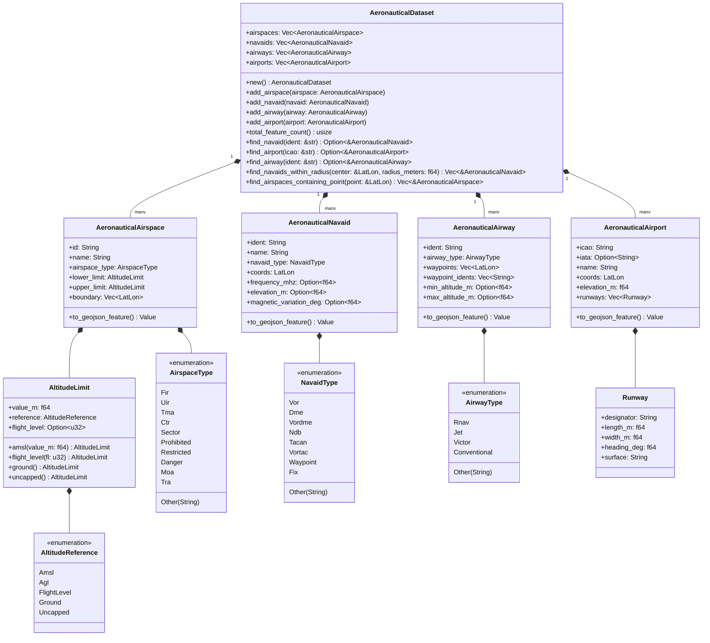
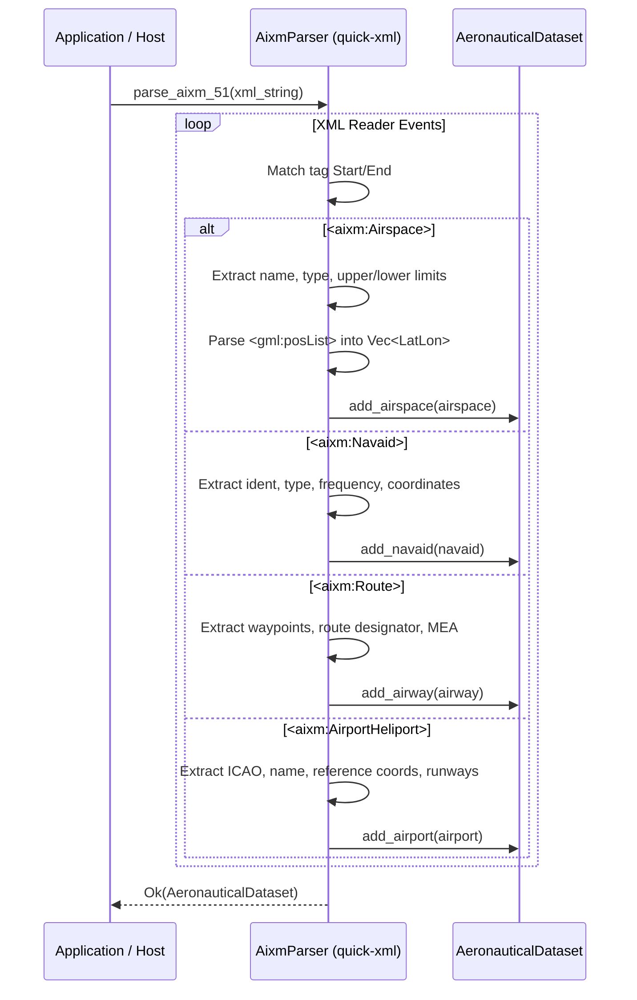

# Component Architecture: Aeronautical Information Ingestion (`core::aeronautical`)

This document describes the architectural specification, data model design, and parsing algorithms of the **Aeronautical Information Engine** of the Olayer Core (`core::aeronautical`). This component provides native, high-performance ingestion of standard civil and military aeronautical datasets (AIXM 5.1 XML and GeoJSON-Aviation), in-memory spatial indexing, point-in-airspace containment queries, and GeoJSON export.

---

## 1. Responsibilities

The **Aeronautical Information Engine** is designed as a passive, zero-I/O mathematical and parsing module with the following responsibilities:

1. **Aeronautical Data Ingestion (`GIS-PROP-004`):**
   - **AIXM 5.1 XML Parser:** Stream-parse Aeronautical Information Exchange Model 5.1 XML documents using `quick-xml` without DOM overhead.
   - **GeoJSON-Aviation Parser:** Ingest structured GeoJSON features containing aviation properties (airspaces, navaids, airways, airports/runways).
2. **Unified Domain Data Model:**
   - Represent complex 3D airspace volumes (`AeronauticalAirspace`) with upper/lower vertical limits (`AltitudeLimit`, `AltitudeReference`: AMSL, AGL, Flight Level, Ground, Uncapped).
   - Represent radio navigation aids (`AeronauticalNavaid`: VOR, DME, NDB, TACAN, VORTAC, Fix/Waypoint) with magnetic variation, frequency, and elevation.
   - Represent ATS Airway routes (`AeronauticalAirway`: RNAV, Jet, Victor, Conventional) with waypoint sequences, minimum en-route altitudes (MEA), and upper flight levels.
   - Represent Aerodromes (`AeronauticalAirport`) with ICAO/IATA identifiers, reference points, elevation, and runway geometry.
3. **In-Memory Repository & Spatial Queries:**
   - Container `AeronauticalDataset` supporting fast case-insensitive identifier lookups (`find_navaid`, `find_airport`, `find_airway`).
   - Radial spatial proximity queries (`find_navaids_within_radius`) using ellipsoidal Haversine distance.
   - Exact spherical polygon containment queries (`find_airspaces_containing_point`) using winding number point-in-polygon from `core::geodesy`.
4. **Interoperability & Serialization:**
   - Full Serde JSON serialization and deserialization.
   - Conversion of in-memory datasets to standard GeoJSON FeatureCollections for web rendering.

---

## 2. Standards and Formats

### 2.1 AIXM 5.1 (Aeronautical Information Exchange Model)
AIXM 5.1 is the global ICAO standard for digital aeronautical data based on GML 3.2:
* **Airspace:** `<aixm:Airspace>` with `<aixm:geometryComponent>` (`<gml:Polygon>` / `<gml:posList>`) and vertical limits `<aixm:upperLimit>` / `<aixm:lowerLimit>`.
* **Navaids:** `<aixm:Navaid>` with `<aixm:designator>`, `<aixm:type>`, and `<gml:Point>` coordinates.
* **Airways:** `<aixm:Route>` and `<aixm:RouteSegment>` with airway designators, waypoint sequences, and minimum altitudes.
* **Airports:** `<aixm:AirportHeliport>` with `<aixm:locationIndicatorICAO>`, `<aixm:elevation>`, and `<aixm:RunwayDirection>`.

### 2.2 GeoJSON-Aviation
A standardized GeoJSON FeatureCollection profile where each Feature's `properties` contain aviation-specific fields:
* `feature_type`: `"airspace"`, `"navaid"`, `"airway"`, or `"airport"`.
* `airspace_type`: `"FIR"`, `"TMA"`, `"CTR"`, `"SECTOR"`, `"RESTRICTED"`, `"DANGER"`, `"PROHIBITED"`, `"MOA"`, `"TRA"`.
* `upper_limit_m` / `lower_limit_m` / `upper_fl` / `lower_fl`.

---

## 3. Structure and Relationship Diagram

---

## 4. Key Algorithms & Execution Flows

### 4.1 AIXM 5.1 Streaming Parser Flow

The AIXM 5.1 parser uses `quick-xml` to iterate through XML elements as an event stream, avoiding the multi-megabyte memory overhead of DOM trees:

### 4.2 Point-in-Airspace Containment Algorithm

When an aircraft geodetic position is queried against the active airspace database:
1. Filters out airspaces whose bounding box does not contain the point.
2. Evaluates horizontal polygon containment using `GeodesicPolygon::contains_point` (spherical winding number).
3. Evaluates vertical containment against the airspace's lower and upper `AltitudeLimit` (taking into account AMSL, AGL, and standard FL conversions).

---

## 5. Error Handling and Invariants

* **Error Enum (`AeronauticalError`):**
  - `XmlParseError(String)`: Malformed XML or unexpected token stream.
  - `GeoJsonParseError(String)`: Missing required GeoJSON geometry or invalid coordinate arrays.
  - `InvalidCoordinate(String)`: Latitude outside $[-\pi/2, \pi/2]$ or longitude outside $[-\pi, \pi]$.
  - `InvalidAltitude(String)`: Negative altitude or invalid FL format.
  - `MissingField(String)`: Essential tag missing in feature definition.
* **Invariants:**
  - Internal coordinates are always stored in radians `LatLon { lat, lon, height }`.
  - Degree conversion occurs strictly at the parser boundary.

---

## 6. Interoperability and Boundary Contracts

* **WebAssembly (`olayer-wasm`):**
  - `WasmAeronauticalDataset`: Wrapped dataset container with `parse_aixm_51(xml)`, `parse_geojson_aviation(geojson)`, `to_geojson()`, `find_airspaces_containing_point(lat, lon, alt)`.
* **C-FFI (`olayer-native`):**
  - `olayer_aeronautical_parse_aixm(xml_bytes, len, out_handle)`
  - `olayer_aeronautical_parse_geojson(json_bytes, len, out_handle)`
  - `olayer_aeronautical_query_containment(handle, lat_rad, lon_rad, alt_m, out_ids, max_ids, out_count)`
  - `olayer_aeronautical_free(handle)`
* **TypeScript SDK (`olayer-sdk`):**
  - `AeronauticalLayer`: High-performance vector styling layer with automatic classification and LOD filtering.
