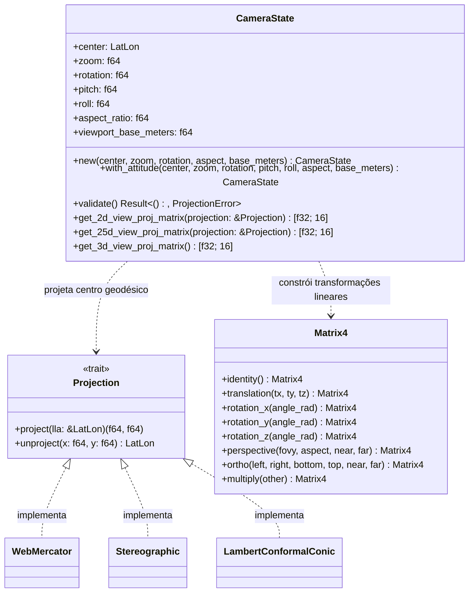

# Arquitetura do Componente: Camera Engine (`core::camera`)

Este documento descreve o design técnico, a modelagem matemática e a arquitetura modular do módulo **Camera Engine** do Olayer Core. Este componente unifica o gerenciamento do estado de visualização do mapa e calcula as matrizes de visualização e projeção (View-Projection Matrices) para as representações planas bidimensionais (2D), tridimensionais inclinadas (2.5D) e globais tridimensionais (3D).

---

## 1. Responsabilidades

O **Camera Engine** centraliza a lógica de navegação espacial e transformação geométrica do framework, encarregado de:
1. **Estado Unificado da Câmera (`CameraState`):** Manter os parâmetros de posição geográfica (latitude, longitude, altitude) e orientação espacial (zoom, rotação/bearing, inclinação/pitch, rolagem/roll).
2. **Cálculo de Matrizes Multivisualização:**
   * **Modo 2D (Plano):** Geração de matrizes ortográficas com suporte a translação e rotação (azimute/bearing).
   * **Modo 2.5D (Perspectiva Tilted Flat):** Geração de matrizes de perspectiva 3D aplicadas a um plano projetado, permitindo controle dinâmico de inclinação (pitch/tilt) declinada e rotação (bearing).
   * **Modo 3D (Globo Virtual):** Geração de matrizes de visualização orbital em torno do elipsoide terrestre WGS84, integrando translações, altitude de voo e orientação total (pitch, yaw, roll) da câmera local.
3. **Validação de Parâmetros:** Garantir a estabilidade geométrica, impedindo singularidades de projeção ou divisões por zero (ex.: zoom nulo, aspect ratio negativo).

---

## 2. Diagrama de Estruturas e Interações

O diagrama a seguir apresenta a relação do `CameraState` com as projeções geográficas e o ciclo de renderização.



---

## 3. Estrutura Física do Módulo

O Camera Engine está integrado no núcleo do Olayer Core. A organização dos arquivos e do namespace é a seguinte:

```text
core/src/
├── camera/
│   ├── errors.rs        # [NEW] Definição do enum CameraError e formatação de erros
│   ├── tests.rs         # [NEW] Testes unitários do componente
│   └── mod.rs           # Definição de CameraState e métodos de matrizes 2D/2.5D/3D
├── lib.rs               # Registro do módulo: pub mod camera;
└── projections/
    └── mod.rs           # Re-exports de compatibilidade (pub use crate::camera::CameraState)
```

---

## 4. Detalhes Matemáticos e Pipelines de Transformação

### 4.1 Parâmetros de Atitude e Projeção
O estado da câmera é definido por:
* **$\text{center}$ (LatLon):** Ponto geodésico de foco no elipsoide WGS84.
* **$\text{zoom}$ ($z$):** Fator multiplicador de escala linear.
* **$\text{rotation}$ ($\theta$):** Rotação horizontal (bearing / yaw) em radianos.
* **$\text{pitch}$ ($\psi$):** Inclinação vertical (pitch / tilt) em radianos. Um valor de $0$ representa uma visualização nadir pura (olhando direto para baixo).
* **$\text{roll}$ ($\phi$):** Ângulo de rolagem (roll) lateral da câmera em radianos.

---

### 4.2 Pipeline de Matriz 2D (Ortográfica Plana)
A câmera ortográfica translada a posição projetada do alvo para a origem, aplica a rotação horizontal no plano e faz a projeção ortogonal.
1. **Projeção do Centro:** $P_c = (x_c, y_c) = \text{project}(\text{center})$.
2. **Matriz de View ($V$):**
   $$V = R_z(-\theta) \cdot T(-x_c, -y_c, 0)$$
3. **Dimensões do Viewport em Metros:**
   $$w = \frac{\text{viewport\_base\_meters}}{z}, \quad h = \frac{w}{\text{aspect\_ratio}}$$
4. **Matriz de Projeção ($P$):**
   $$P = \text{Ortho}\left(-\frac{w}{2}, \frac{w}{2}, -\frac{h}{2}, \frac{h}{2}, -1000.0, 1000.0\right)$$
5. **View-Projection final:** $VP = P \cdot V$.

---

### 4.3 Pipeline de Matriz 2.5D (Perspectiva Plana com Declinação)
Diferente da projeção ortográfica, o modo 2.5D simula uma câmera em perspectiva física apontada para o plano do mapa com um ângulo de inclinação (pitch) ajustável.
1. **Translação do Ponto Foco para a Origem:**
   $$T_{\text{target}} = T(-x_c, -y_c, 0)$$
2. **Rotação Horizontal (Yaw/Bearing):**
   $$R_z = R_z(-\theta)$$
3. **Inclinação (Pitch/Tilt):**
   $$R_x = R_x(\psi)$$
   *Nota: $\psi = 35^\circ$ provê uma excelente perspectiva declinada (bird's-eye view), minimizando a distorção dos alvos no horizonte superior comparado ao antigo valor estático de $55^\circ$.*
4. **Rolagem Local (Roll):**
   $$R_y = R_y(\phi)$$
5. **Afastamento da Câmera (Distância Focal Virtual):**
   A distância da câmera ao plano do mapa é calculada proporcionalmente à largura atual do viewport para manter a coerência visual ao alterar o zoom:
   $$d = w \cdot 0.8$$
   $$T_{\text{dist}} = T(0, 0, -d)$$
6. **Matriz de View ($V$):**
   $$V = T_{\text{dist}} \cdot R_y \cdot R_x \cdot R_z \cdot T_{\text{target}}$$
7. **Matriz de Projeção ($P$):**
   A matriz de perspectiva projeta frustums piramidais de visão com planos near/far dinâmicos:
   $$P = \text{Perspective}\left(\text{fovy} = 45^\circ, \text{aspect}, \text{near} = 0.01d, \text{far} = 10d\right)$$
8. **View-Projection final:** $VP = P \cdot V$.

---

### 4.4 Pipeline de Matriz 3D (Globo Virtual Orbital)
No modo 3D orbital, o elipsoide terrestre é centrado na origem cartesiana $(0, 0, 0)$ de coordenadas ECEF (Earth-Centered, Earth-Fixed). A câmera é rotacionada em torno do globo com base na latitude e longitude geodésicas e, em seguida, rotacionada localmente com base na sua atitude (bearing, pitch, roll).
1. **Distância Orbital:**
   $$d_{\text{orbital}} = R_{\text{terra}} + \frac{d_{\text{base}}}{z}$$
   Onde $R_{\text{terra}} = 6.378.137\text{ m}$ (Raio Equatorial WGS84) e $d_{\text{base}} = 15.000.000\text{ m}$.
2. **Posicionamento Geográfico (Rotação da Terra para Foco):**
   Translada a câmera para a distância orbital e a posiciona rotacionando o espaço conforme a latitude e longitude:
   $$T_{\text{orbital}} = T(0, 0, -d_{\text{orbital}})$$
   $$R_{\text{lat}} = R_x\left(\phi_c - \frac{\pi}{2}\right)$$
   $$R_{\text{lon}} = R_z\left(-\lambda_c - \frac{\pi}{2}\right)$$
3. **Orientação Local da Câmera (Yaw, Pitch, Roll):**
   $$R_{\text{cam\_z}} = R_z(-\theta)$$
   $$R_{\text{cam\_x}} = R_x(\psi)$$
   $$R_{\text{cam\_y}} = R_y(\phi)$$
4. **Matriz de View ($V$):**
   $$V = T_{\text{orbital}} \cdot R_{\text{cam\_y}} \cdot R_{\text{cam\_x}} \cdot R_{\text{cam\_z}} \cdot R_{\text{lat}} \cdot R_{\text{lon}}$$
5. **Matriz de Projeção ($P$):**
   $$P = \text{Perspective}\left(\text{fovy} = 45^\circ, \text{aspect}, \text{near} = 50.000\text{ m}, \text{far} = 40.000.000\text{ m}\right)$$
6. **View-Projection final:** $VP = P \cdot V$.

---

## 5. Critérios de Performance e Design

1. **Separação de Preocupações:** O cálculo matricial 3D e 2.5D puro não depende do estado das APIs gráficas da Web ou do ambiente de execução. Ele reside integralmente no Olayer Core (`rust`), permitindo a reusabilidade imediata tanto em WebAssembly quanto em FFI nativo.
2. **Encapsulamento Sem Alocação Dinâmica:** O retorno de matrizes em `[f32; 16]` garante que nenhuma alocação na Heap seja realizada durante o cálculo de visualização, maximizando o desempenho em loops a 60 FPS.
3. **Robustez na Interpolação:** A compatibilidade com `WasmCameraState` garante que rotações, inclinações e níveis de zoom sejam uniformemente integrados nas projeções de tela 2D executadas via CPU (Canvas 2D), prevenindo desvios de renderização de alvos de radar sobre o grid WebGL de background.
