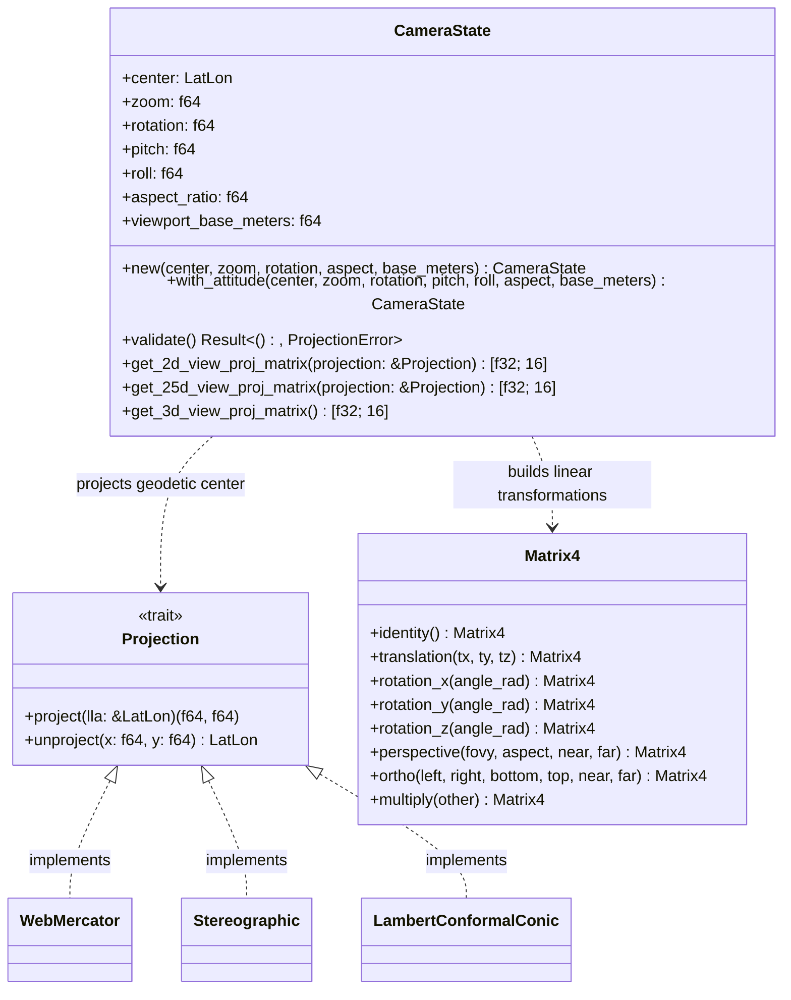

# Component Architecture: Camera Engine (`core::camera`)

This document describes the technical design, mathematical modeling, and modular architecture of the **Camera Engine** module of the Olayer Core. This component unifies the map visualization state management and calculates the View-Projection matrices for the flat 2D, tilted 3D (2.5D), and global 3D representations.

---

## 1. Responsibilities

The **Camera Engine** centralizes the spatial navigation logic and geometric transformation of the framework, responsible for:
1. **Unified Camera State (`CameraState`):** Maintain the parameters of geographic position (latitude, longitude, altitude) and spatial orientation (zoom, rotation/bearing, inclination/pitch, roll/roll).
2. **Multiview Matrix Calculation:**
   * **2D Mode (Flat):** Generation of orthographic matrices with translation and rotation support (azimuth/bearing).
   * **2.5D Mode (Tilted Flat Perspective):** Generation of 3D perspective matrices applied to a projected plane, allowing dynamic control of inclination (pitch/tilt) declined and rotation (bearing).
   * **3D Mode (Virtual Globe):** Generation of orbital view matrices around the WGS84 terrestrial ellipsoid, integrating translations, flight altitude, and full camera orientation (pitch, yaw, roll).
3. **Parameter Validation:** Guarantee geometric stability, preventing projection singularities or divisions by zero (e.g., null zoom, negative aspect ratio).

---

## 2. Structure and Interaction Diagram

The following diagram presents the relationship of `CameraState` with geographic projections and the rendering cycle.



---

## 3. Physical Module Structure

The Camera Engine is integrated into the Olayer Core nucleus. The file and namespace organization is as follows:

```text
core/src/
├── camera/
│   ├── errors.rs        # [NEW] Definition of the CameraError enum and error formatting
│   ├── tests.rs         # [NEW] Component unit tests
│   └── mod.rs           # Definition of CameraState and 2D/2.5D/3D matrix methods
├── lib.rs               # Module registration: pub mod camera;
└── projections/
    └── mod.rs           # Compatibility re-exports (pub use crate::camera::CameraState)
```

---

## 4. Mathematical Details and Transformation Pipelines

### 4.1 Attitude and Projection Parameters
The camera state is defined by:
* **$\text{center}$ (LatLon):** Geodetic focus point on the WGS84 ellipsoid.
* **$\text{zoom}$ ($z$):** Linear scale multiplier factor.
* **$\text{rotation}$ ($\theta$):** Horizontal rotation (bearing / yaw) in radians.
* **$\text{pitch}$ ($\psi$):** Vertical inclination (pitch / tilt) in radians. A value of $0$ represents a pure nadir view (looking straight down).
* **$\text{roll}$ ($\phi$):** Camera lateral roll angle in radians.

---

### 4.2 2D Matrix Pipeline (Flat Orthographic)
The orthographic camera translates the projected target position to the origin, applies horizontal rotation in the plane, and performs orthogonal projection.
1. **Center Projection:** $P_c = (x_c, y_c) = \text{project}(\text{center})$.
2. **View Matrix ($V$):**
   $$V = R_z(-\theta) \cdot T(-x_c, -y_c, 0)$$
3. **Viewport Dimensions in Meters:**
   $$w = \frac{\text{viewport\_base\_meters}}{z}, \quad h = \frac{w}{\text{aspect\_ratio}}$$
4. **Projection Matrix ($P$):**
   $$P = \text{Ortho}\left(-\frac{w}{2}, \frac{w}{2}, -\frac{h}{2}, \frac{h}{2}, -1000.0, 1000.0\right)$$
5. **Final View-Projection:** $VP = P \cdot V$.

---

### 4.3 2.5D Matrix Pipeline (Flat Perspective with Declination)
Different from orthographic projection, the 2.5D mode simulates a physical perspective camera pointed at the map plane with an adjustable inclination angle (pitch).
1. **Translation of Focus Point to Origin:**
   $$T_{\text{target}} = T(-x_c, -y_c, 0)$$
2. **Horizontal Rotation (Yaw/Bearing):**
   $$R_z = R_z(-\theta)$$
3. **Inclination (Pitch/Tilt):**
   $$R_x = R_x(\psi)$$
   *Note: $\psi = 35^\circ$ provides an excellent declined perspective (bird's-eye view), minimizing target distortion on the upper horizon compared to the old static value of $55^\circ$.*
4. **Local Roll (Roll):**
   $$R_y = R_y(\phi)$$
5. **Camera Distance (Virtual Focal Distance):**
   The camera distance to the map plane is calculated proportionally to the current viewport width to maintain visual coherence when changing zoom:
   $$d = w \cdot 0.8$$
   $$T_{\text{dist}} = T(0, 0, -d)$$
6. **View Matrix ($V$):**
   $$V = T_{\text{dist}} \cdot R_y \cdot R_x \cdot R_z \cdot T_{\text{target}}$$
7. **Projection Matrix ($P$):**
   The perspective matrix projects pyramid vision frustums with dynamic near/far planes:
   $$P = \text{Perspective}\left(\text{fovy} = 45^\circ, \text{aspect}, \text{near} = 0.01d, \text{far} = 10d\right)$$
8. **Final View-Projection:** $VP = P \cdot V$.

---

### 4.4 3D Matrix Pipeline (Orbital Virtual Globe)
In the orbital 3D mode, the terrestrial ellipsoid is centered at the Cartesian origin $(0, 0, 0)$ of ECEF (Earth-Centered, Earth-Fixed) coordinates. The camera is rotated around the globe based on geodetic latitude and longitude, and then rotated locally based on its attitude (bearing, pitch, roll).
1. **Orbital Distance:**
   $$d_{\text{orbital}} = R_{\text{earth}} + \frac{d_{\text{base}}}{z}$$
    Where $R_{\text{earth}} = \text{Ellipsoid::wgs84().a} \approx 6,378,137\text{ m}$ (dynamically retrieved from the Geodesy Engine's WGS84 ellipsoid model definition) and $d_{\text{base}} = 15,000,000\text{ m}$.
2. **Geographic Positioning (Earth Rotation to Focus):**
   Translates the camera to the orbital distance and positions it by rotating space according to latitude and longitude:
   $$T_{\text{orbital}} = T(0, 0, -d_{\text{orbital}})$$
   $$R_{\text{lat}} = R_x\left(\phi_c - \frac{\pi}{2}\right)$$
   $$R_{\text{lon}} = R_z\left(-\lambda_c - \frac{\pi}{2}\right)$$
3. **Local Camera Orientation (Yaw, Pitch, Roll):**
   $$R_{\text{cam\_z}} = R_z(-\theta)$$
   $$R_{\text{cam\_x}} = R_x(\psi)$$
   $$R_{\text{cam\_y}} = R_y(\phi)$$
4. **View Matrix ($V$):**
   $$V = T_{\text{orbital}} \cdot R_{\text{cam\_y}} \cdot R_{\text{cam\_x}} \cdot R_{\text{cam\_z}} \cdot R_{\text{lat}} \cdot R_{\text{lon}}$$
5. **Projection Matrix ($P$):**
   $$P = \text{Perspective}\left(\text{fovy} = 45^\circ, \text{aspect}, \text{near} = 50.000\text{ m}, \text{far} = 40.000.000\text{ m}\right)$$
6. **Final View-Projection:** $VP = P \cdot V$.

---

## 5. Performance and Design Criteria

1. **Separation of Concerns:** The pure 3D and 2.5D matrix calculation does not depend on the state of Web graphics APIs or the execution environment. It resides entirely in the Olayer Core (`rust`), allowing immediate reusability in both WebAssembly and native FFI.
2. **Encapsulation Without Dynamic Allocation:** The return of matrices in `[f32; 16]` guarantees that no Heap allocation is performed during the view calculation, maximizing performance in loops at 60 FPS.
3. **Interpolation Robustness:** Compatibility with `WasmCameraState` guarantees that rotations, inclinations, and zoom levels are uniformly integrated into the 2D screen projections executed via CPU (Canvas 2D), preventing radar target rendering deviations over the WebGL background grid.
