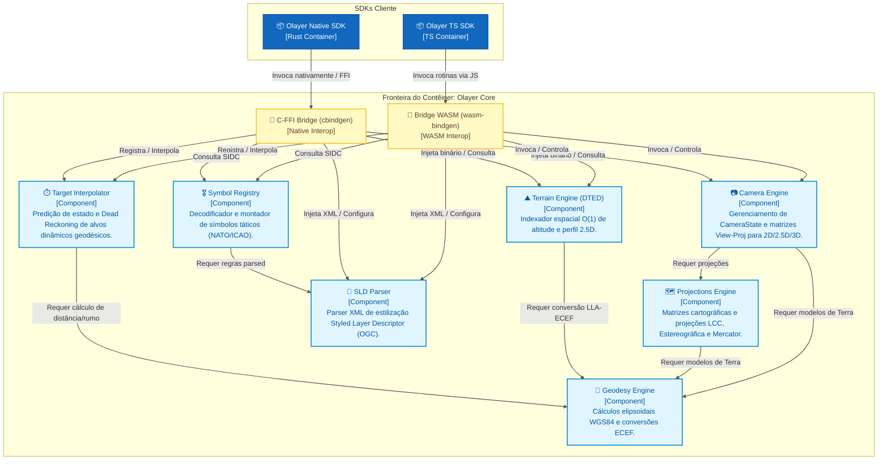
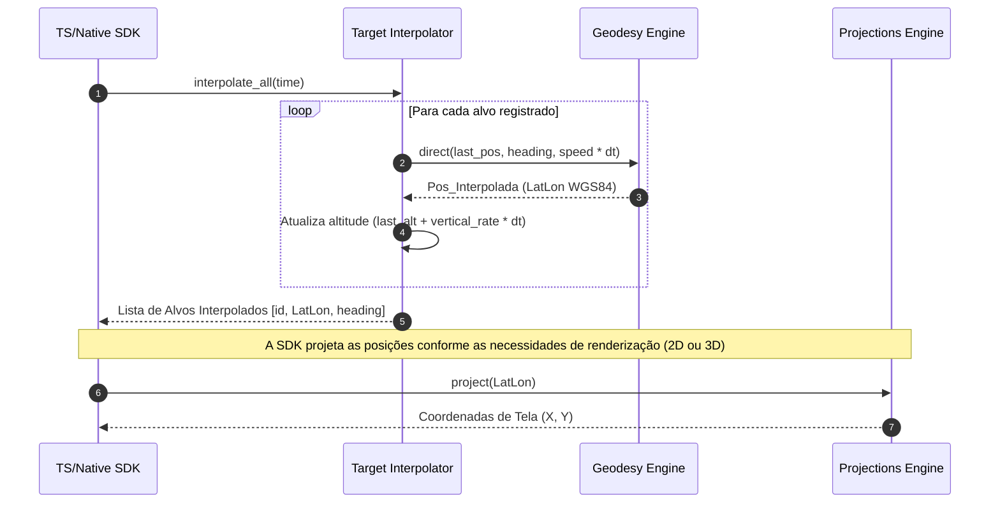
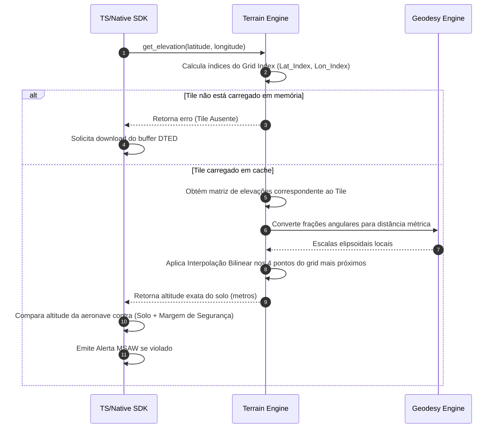

# Componentes do Olayer Core
## Detalhamento de Arquitetura (C4 Model - Nível 3)

Este documento apresenta a especificação detalhada dos componentes que compõem o **Olayer Core**, o motor lógico e matemático escrito em Rust. Seguindo o modelo C4 de arquitetura (Nível 3: Diagrama de Componentes), este detalhamento define as responsabilidades, interfaces e fluxos de dados internos do núcleo do framework.

---

## 1. Diagrama de Componentes do Olayer Core

O Olayer Core opera como um contêiner lógico passivo. Ele não gerencia I/O de rede ou disco diretamente (especialmente no ambiente WebGL/WASM), recebendo dados por meio das pontes de interoperabilidade (WASM e FFI) e fornecendo respostas processadas.



---

## 2. Detalhamento dos Componentes Internos

### 📐 2.1 Geodesy Engine (`core::geodesy`)
O componente central de matemática geodésica. Toda a precisão métrica de segurança do tráfego aéreo depende deste módulo.
* **Responsabilidades:**
  * Realizar transformações de coordenadas tridimensionais entre o formato geodésico elipsoidal $(\phi, \lambda, h)$ e cartesiano geocêntrico ECEF $(X, Y, Z)$ utilizando o elipsoide **WGS84**.
  * Calcular a distância ortodrômica (grande círculo) entre pontos terrestres utilizando a fórmula de Vincenty (para alta precisão elipsoidal) e Haversine (para processamento rápido).
  * Computar rumo (*bearing* / *azimuth*) inicial e final entre coordenadas geodésicas.
  * Projetar pontos de destino a partir de um ponto inicial, ângulo de azimute e distância geodésica.
* **Interfaces e Estruturas de Dados:**
  ```rust
  pub struct LatLon {
      pub lat: f64, // Latitude em radianos
      pub lon: f64, // Longitude em radianos
      pub alt: f64, // Altura acima do elipsoide em metros
  }

  pub struct Point3D {
      pub x: f64,
      pub y: f64,
      pub z: f64,
  }

  pub fn lla_to_ecef(lla: &LatLon) -> Point3D;
  pub fn ecef_to_lla(ecef: &Point3D) -> LatLon;
  pub fn geodetic_distance(p1: &LatLon, p2: &LatLon) -> f64;
  pub fn geodetic_bearing(p1: &LatLon, p2: &LatLon) -> f64;
  ```
* **Dependências:** Sem dependências internas. Componente folha do Core.

### 🗺️ 2.2 Projections Engine (`core::projections`)
* **Responsabilidades:**
  * Projetar pontos geodésicos em planos 2D para as projeções suportadas:
    * **Lambert Conformal Conic (LCC):** Definida por dois paralelos padrão, latitude de origem e meridiano central. Ideal para rotas En-Route.
    * **Estereográfica Azimutal:** Definida por um ponto de origem central (geralmente a antena do radar da TMA). Ideal para áreas terminais.
    * **Web Mercator (EPSG:3857):** Compatibilidade com mapas base de mercado.
* **Interfaces e Estruturas de Dados:**
  ```rust
  pub enum ProjectionType {
      LambertConformalConic { std_parallel_1: f64, std_parallel_2: f64, origin_lat: f64, origin_lon: f64 },
      Stereographic { center_lat: f64, center_lon: f64 },
      WebMercator,
  }

  pub trait Projection {
      fn project(&self, lla: &LatLon) -> Result<(f64, f64), ProjectionError>;
      fn unproject(&self, x: f64, y: f64) -> Result<LatLon, ProjectionError>;
      fn get_view_proj_matrix(&self, camera: &CameraState) -> Result<[f32; 16], ProjectionError>;
  }
  ```
* **Dependências:** `Geodesy Engine` (para conversões espaciais e escalas de deformação).

### 📷 2.3 Camera Engine (`core::camera`)
Componente encarregado do gerenciamento do estado de navegação geográfica e atitude da câmera, além da geração das matrizes View-Projection 2D, 2.5D e 3D.
* **Responsabilidades:**
  * Armazenar o estado da câmera (`CameraState`) incluindo posição de centro, zoom, bearing/rotação (yaw), inclinação (pitch/tilt) e rolagem (roll).
  * Computar as matrizes View-Projection $4 \times 4$ de forma unificada:
    * **2D:** Projeção ortográfica rotacionada.
    * **2.5D:** Projeção perspectiva sobre o plano do mapa com pitch dinâmico.
    * **3D:** Projeção perspectiva orbital em relação ao elipsoide terrestre.
* **Interfaces e Estruturas de Dados:**
  ```rust
  pub struct CameraState {
      pub center: LatLon,
      pub zoom: f64,
      pub rotation: f64, // bearing/yaw em radianos
      pub pitch: f64,    // inclinação em radianos (nadir = 0)
      pub roll: f64,     // rolagem lateral em radianos
      pub aspect_ratio: f64,
      pub viewport_base_meters: f64,
  }

  impl CameraState {
      pub const fn new(center: LatLon, zoom: f64, rotation: f64, aspect_ratio: f64, viewport_base_meters: f64) -> Self;
      pub const fn with_attitude(center: LatLon, zoom: f64, rotation: f64, pitch: f64, roll: f64, aspect_ratio: f64, viewport_base_meters: f64) -> Self;
      pub fn validate(&self) -> Result<(), ProjectionError>;
      pub fn get_2d_view_proj_matrix(&self, projection: &dyn Projection) -> Result<[f32; 16], ProjectionError>;
      pub fn get_25d_view_proj_matrix(&self, projection: &dyn Projection) -> Result<[f32; 16], ProjectionError>;
      pub fn get_3d_view_proj_matrix(&self) -> Result<[f32; 16], ProjectionError>;
  }
  ```
* **Dependências:** `Geodesy Engine` e `Projections Engine`.

### ⛰️ 2.4 Terrain Engine (`core::terrain`)
Indexador de alta performance para dados de elevação digital de terreno (DTED - Digital Terrain Elevation Data).
* **Responsabilidades:**
  * Ler e analisar buffers binários correspondentes a arquivos DTED (Níveis 0, 1 ou 2) injetados passivamente.
  * Construir e atualizar um indexador espacial plano (*Grid Index*) contendo os tiles ativos na memória.
  * Consultar a altitude exata do solo para uma coordenada geográfica $(\phi, \lambda)$ em tempo constante $O(1)$ utilizando interpolação bilinear entre as células do grid carregado.
  * Gerar o perfil de corte vertical do relevo ao longo de uma sequência de pontos de rota (vetor de altitudes interpoladas).
* **Interfaces e Estruturas de Dados:**
  ```rust
  pub struct DtedTile {
      pub lat_index: i32,
      pub lon_index: i32,
      pub resolution_lat: usize,
      pub resolution_lon: usize,
      pub elevations: Vec<i16>, // Altitudes em metros
  }

  pub struct TerrainIndex {
      // Tabela de espalhamento ou matriz plana dos tiles ativos
      tiles: HashMap<(i32, i32), DtedTile>,
  }

  impl TerrainIndex {
      pub fn load_tile(&mut self, lat_idx: i32, lon_idx: i32, data: &[u8]) -> Result<(), TerrainError>;
      pub fn get_elevation(&self, lat: f64, lon: f64) -> Option<f64>;
      pub fn get_vertical_profile(&self, route: &[LatLon], step_meters: f64) -> Vec<(f64, f64)>; // (distancia, altitude)
  }
  ```
* **Dependências:** `Geodesy Engine` (para interpolar distâncias métricas e converter resoluções angulares).

### 📄 2.5 SLD Parser (`core::sld`)
Tradutor do padrão de estilização de mapas OGC Styled Layer Descriptor (SLD).
* **Responsabilidades:**
  * Fazer o parse XML de documentos SLD e extrair regras de renderização visual para feições de mapa.
  * Filtrar estilos por nível de escala (*MinScaleDenominator* e *MaxScaleDenominator*).
  * Extrair estilos específicos de:
    * **Polígonos e Linhas:** Cores de preenchimento, opacidade, espessuras e padrões de tracejado (para limites de setores ATC e aerovias).
    * **Pontos e Ícones:** Definições de marcadores, tamanhos e vinculação de identificadores de símbolos.
    * **Texto (Etiquetas):** Fontes, tamanhos, cores de halo e offsets.
* **Interfaces e Estruturas de Dados:**
  ```rust
  pub struct RuleStyle {
      pub min_scale: f64,
      pub max_scale: f64,
      pub stroke_color: Option<String>,
      pub stroke_width: Option<f32>,
      pub fill_color: Option<String>,
      pub fill_opacity: Option<f32>,
      pub label_expression: Option<String>,
      pub font_size: Option<f32>,
  }

  pub struct StyleRegistry {
      pub layers: HashMap<String, Vec<RuleStyle>>,
  }

  pub fn parse_sld(xml_content: &str) -> Result<StyleRegistry, ParserError>;
  ```
* **Dependências:** Sem dependências do Core (utiliza bibliotecas externas em Rust para parsing XML rápido, ex: `quick-xml`).

### 🎖️ 2.6 Symbol Registry (`core::symbol_registry`)
O registro central e coordenador de geradores de simbologia. O componente é totalmente agnóstico a padrões visuais específicos, delegando a decodificação para provedores plugáveis (como NATO APP-6, ICAO civil ou meteorologia).
* **Responsabilidades:**
  * Permitir o registro dinâmico de múltiplos provedores de simbologia (`SymbologyProvider`).
  * Consultar a cadeia de provedores ativos para resolver códigos de símbolos em um formato geométrico intermediário (`ResolvedSymbol`) composto por primitivas vetoriais (caminhos SVG, círculos, textos).
  * Servir de ponte para a estilização dinâmica obtida via `SLD Parser`.
  * Fornecer dados de geometria limpos e unificados para a SDK construir o Texture Atlas de forma otimizada.
* **Interfaces e Estruturas de Dados:**
  ```rust
  /// Primitivas vetoriais para desenho procedural de símbolos na CPU/GPU
  #[derive(Debug, Clone)]
  pub enum SymbolPrimitive {
      Path {
          commands: String, // Comandos formato SVG Path (ex: "M 0,0 L 10,10 Z")
          fill: Option<Color>,
          stroke: Option<Stroke>,
      },
      Circle {
          cx: f64,
          cy: f64,
          r: f64,
          fill: Option<Color>,
          stroke: Option<Stroke>,
      },
      Text {
          content: String,
          offset_x: f64,
          offset_y: f64,
          font_size: f32,
          color: Color,
      },
  }

  #[derive(Debug, Clone)]
  pub struct Color {
      pub r: u8, pub g: u8, pub b: u8, pub a: u8,
  }

  #[derive(Debug, Clone)]
  pub struct Stroke {
      pub color: Color,
      pub width: f32,
      pub dash_array: Option<Vec<f32>>,
  }

  /// Símbolo resolvido e pronto para renderização ou rasterização
  #[derive(Debug, Clone)]
  pub struct ResolvedSymbol {
      pub symbol_id: String,
      pub primitives: Vec<SymbolPrimitive>,
      pub bbox: (f64, f64, f64, f64), // (min_x, min_y, max_x, max_y)
      pub anchor: (f64, f64),         // Ponto de ancoragem (ex: 0.0, 0.0 para o centro)
  }

  /// Interface para provedores de simbologias específicas (ex: NATO, ICAO, Clima)
  pub trait SymbologyProvider {
      fn name(&self) -> &str;
      fn can_resolve(&self, code: &str) -> bool;
      fn resolve(&self, code: &str, style: &StyleRegistry) -> Result<ResolvedSymbol, SymbologyError>;
  }

  /// Registro unificado de simbologia
  pub struct SymbolRegistry {
      providers: Vec<Box<dyn SymbologyProvider + Send + Sync>>,
  }

  impl SymbolRegistry {
      pub fn register_provider(&mut self, provider: Box<dyn SymbologyProvider + Send + Sync>);
      pub fn resolve_symbol(&self, code: &str, style: &StyleRegistry) -> Result<ResolvedSymbol, SymbologyError>;
  }
  ```
* **Dependências:** `SLD Parser` (para aplicação de regras de preenchimento, contorno e texto nos símbolos).

### 🎖️ 2.6.1 Customização e Extensibilidade (Bibliotecas de Símbolos Personalizadas)
Para permitir que o usuário final do framework defina e crie suas próprias bibliotecas de símbolos sem alterar o núcleo do Olayer, o sistema suporta duas abordagens principais:

#### A. Abordagem Programática (Via Rust Crate/SDK)
O desenvolvedor host pode criar seu próprio resolvedor de símbolos implementando a trait `SymbologyProvider` e registrando-o na inicialização.

```rust
/// Exemplo de provedor customizado criado pelo usuário do framework
pub struct CustomAidsSymbologyProvider;

impl SymbologyProvider for CustomAidsSymbologyProvider {
    fn name(&self) -> &str {
        "CustomAidsProvider"
    }

    fn can_resolve(&self, code: &str) -> bool {
        code.starts_with("custom-aid:")
    }

    fn resolve(&self, code: &str, _style: &StyleRegistry) -> Result<ResolvedSymbol, SymbologyError> {
        // Exemplo: "custom-aid:radio-beacon" -> Desenha um triângulo duplo
        let primitives = vec![
            SymbolPrimitive::Path {
                commands: "M -10,-10 L 0,10 L 10,-10 Z M -5,-5 L 0,5 L 5,-5 Z".to_string(),
                fill: Some(Color { r: 0, g: 255, b: 128, a: 255 }),
                stroke: Some(Stroke {
                    color: Color { r: 0, g: 100, b: 50, a: 255 },
                    width: 1.5,
                    dash_array: None,
                }),
            }
        ];
        
        Ok(ResolvedSymbol {
            symbol_id: code.to_string(),
            primitives,
            bbox: (-10.0, -10.0, 10.0, 10.0),
            anchor: (0.0, 0.0),
        })
    }
}
```

#### B. Abordagem Declarativa (Via Arquivos de Configuração JSON/YAML)
O Core fornece um provedor nativo genérico chamado `DeclarativeProvider` que consome uma especificação em arquivo (JSON/YAML) para criar uma biblioteca de símbolos customizados.

##### Exemplo de arquivo de definição de símbolos (`custom_symbols.json`):
```json
{
  "library_name": "CustomATC",
  "symbols": {
    "custom:heliport": {
      "bbox": [-16.0, -16.0, 16.0, 16.0],
      "anchor": [0.0, 0.0],
      "primitives": [
        {
          "type": "Circle",
          "cx": 0.0,
          "cy": 0.0,
          "r": 12.0,
          "fill": { "r": 0, "g": 128, "b": 255, "a": 255 },
          "stroke": { "color": { "r": 0, "g": 64, "b": 128, "a": 255 }, "width": 2.0 }
        },
        {
          "type": "Text",
          "content": "H",
          "offset_x": -4.0,
          "offset_y": 5.0,
          "font_size": 14.0,
          "color": { "r": 255, "g": 255, "b": 255, "a": 255 }
        }
      ]
    }
  }
}
```

##### Estrutura do Provedor Declarativo no Rust Core:
```rust
pub struct DeclarativeProvider {
    library_name: String,
    symbols: HashMap<String, ResolvedSymbol>,
}

impl DeclarativeProvider {
    pub fn from_json(json_content: &str) -> Result<Self, serde_json::Error> {
        // Realiza o parse das primitivas geométricas descritas em formato JSON
    }
}

impl SymbologyProvider for DeclarativeProvider {
    fn name(&self) -> &str {
        &self.library_name
    }

    fn can_resolve(&self, code: &str) -> bool {
        self.symbols.contains_key(code)
    }

    fn resolve(&self, code: &str, _style: &StyleRegistry) -> Result<ResolvedSymbol, SymbologyError> {
        self.symbols.get(code).cloned().ok_or(SymbologyError::SymbolNotFound(code.to_string()))
    }
}
```

### ⏱️ 2.7 Target Interpolator (`core::interpolator`)
O módulo dinâmico encarregado de sincronizar e suavizar o rastreamento de alvos dinâmicos no espaço tridimensional geodésico através de *Dead Reckoning*.
* **Responsabilidades:**
  * Manter uma tabela dinâmica em memória com os estados físicos reais recebidos dos sensores para cada alvo (aeronaves, veículos terrestres, etc.).
  * Computar a posição e rumo interpolados no elipsoide em 3D em tempo de execução com base no tempo de simulação atual e na taxa de frames do cliente (15 a 60 FPS).
  * Manter a representação física 3D desacoplada da projeção para a tela, permitindo que a posição interpolada seja usada tanto em projeções 2D, perfil vertical 2.5D ou renderização direta 3D (ECEF).
* **Interfaces e Estruturas de Dados:**
  ```rust
  pub struct TargetState {
      pub id: String,
      pub last_position: LatLon,   // Lat/Lon em radianos, altitude em metros
      pub speed_mps: f64,          // Velocidade horizontal em metros por segundo
      pub track_heading_rad: f64,  // Rumo do alvo em radianos [0, 2π)
      pub vertical_rate_mps: f64,  // Velocidade vertical em metros por segundo
      pub last_ping_time: f64,     // Timestamp do sensor (segundos)
  }

  pub struct InterpolatedTarget {
      pub id: String,
      pub position: LatLon,        // Posição 3D interpolada no elipsoide
      pub heading_rad: f64,        // Rumo interpolado em radianos
  }

  pub struct InterpolationEngine {
      targets: HashMap<String, TargetState>,
  }

  impl InterpolationEngine {
      pub fn new() -> Self;
```tion: LatLon,        // Posição 3D interpolada no elipsoide
      pub heading_rad: f64,        // Rumo interpolado em radianos
  }

  pub struct InterpolationEngine {
      targets: HashMap<String, TargetState>,
  }

  impl InterpolationEngine {
      pub fn new() -> Self;
      pub fn update_target(&mut self, state: TargetState) -> Result<(), InterpolatorError>;
      pub fn interpolate_all(&self, current_time: f64) -> Result<Vec<InterpolatedTarget>, InterpolatorError>;
  }
  ```
* **Dependências:** `Geodesy Engine` (para extrapolação geodésica direta de rumo, distância e variação vertical de altitude).

---

## 3. Fluxos de Dados Críticos do Core

### 3.1 Pipeline de Projeção e Desenho de Alvos
Este fluxo ilustra como os estados de movimento são interpolados tridimensionalmente no globo e posteriormente projetados pela SDK cliente:



### 3.2 Processamento de Alerta Verticais (MSAW)
Este fluxo descreve como o `Terrain Engine` calcula a altitude do solo sob demanda em $O(1)$ para emitir avisos de colisão contra o relevo.



---

> [!NOTE]
> **Políticas de Gestão de Memória:** O contêiner Core não possui coletor de lixo. No ambiente WebAssembly, a SDK TypeScript deve gerenciar ativamente o ciclo de vida dos objetos Rust. Para cada instância gerada pelo Core via `wasm-bindgen` que saia de escopo na SDK, o método `.free()` correspondente deve ser chamado para desalocar a memória linear.

> [!IMPORTANT]
> **Thread-Safety:** O Core Rust foi desenhado para ser thread-safe (`Send` e `Sync` implementados nas structs de controle). No modo nativo (SDK Desktop), as instâncias de `TerrainEngine` e `ProjectionsEngine` podem ser consultadas em paralelo por threads de renderização e threads de controle tático.
