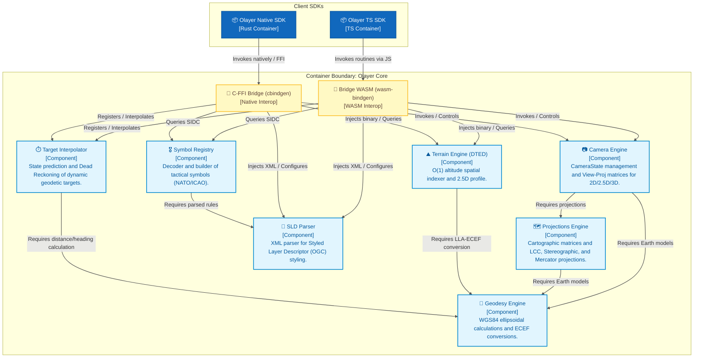
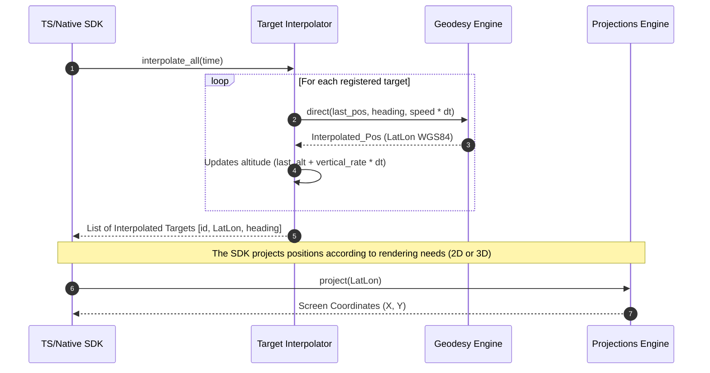
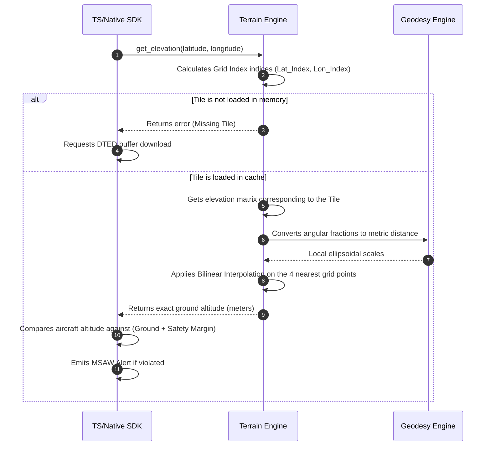

# Olayer Core Components
## Architecture Details (C4 Model - Level 3)

This document presents the detailed specification of the components that compose the **Olayer Core**, the logical and mathematical engine written in Rust. Following the C4 architecture model (Level 3: Component Diagram), this detail defines the responsibilities, interfaces, and internal data flows of the framework's core.

---

## 1. Olayer Core Component Diagram

The Olayer Core operates as a passive logical container. It does not manage network or disk I/O directly (especially in the WebGL/WASM environment), receiving data through interoperability bridges (WASM and FFI) and providing processed responses.



---

## 2. Internal Component Details

### 📐 2.1 Geodesy Engine (`core::geodesy`)
The central component of geodetic mathematics. All metric safety precision of air traffic depends on this module.
* **Responsibilities:**
  * Perform three-dimensional coordinate transformations between ellipsoidal geodetic format $(\phi, \lambda, h)$ and geocentric Cartesian ECEF $(X, Y, Z)$ using the **WGS84** ellipsoid.
  * Calculate the orthodromic (great circle) distance between terrestrial points using the Vincenty formula (for high ellipsoidal precision) and Haversine (for fast processing).
  * Compute initial and final *bearing* / *azimuth* between geodetic coordinates.
  * Project destination points from an initial point, azimuth angle, and geodetic distance.
* **Interfaces and Data Structures:**
  ```rust
  pub struct LatLon {
      pub lat: f64,    // Latitude in radians
      pub lon: f64,    // Longitude in radians
      pub height: f64, // Height above the ellipsoid in meters
  }

  pub struct Point3D {
      pub x: f64,
      pub y: f64,
      pub z: f64,
  }

  pub fn lla_to_ecef(lla: &LatLon) -> Point3D;
  pub fn ecef_to_lla(ecef: &Point3D) -> LatLon;
  pub fn geodetic_distance(p1: &LatLon, p2: &LatLon) -> f64;
  pub fn geodetic_bearing(p1: &LatLon, p2: &LatLon) -> f64;
  ```
* **Dependencies:** No internal dependencies. Leaf component of the Core.

### 🗺️ 2.2 Projections Engine (`core::projections`)
* **Responsibilities:**
  * Project geodetic points onto 2D planes for the supported projections:
    * **Lambert Conformal Conic (LCC):** Defined by two standard parallels, latitude of origin, and central meridian. Ideal for En-Route routes.
    * **Azimuthal Stereographic:** Defined by a central origin point (usually the TMA radar antenna). Ideal for terminal areas.
    * **Web Mercator (EPSG:3857):** Compatibility with market base maps.
* **Interfaces and Data Structures:**
  ```rust
  pub enum ProjectionType {
      LambertConformalConic { std_parallel_1: f64, std_parallel_2: f64, origin_lat: f64, origin_lon: f64 },
      Stereographic { center_lat: f64, center_lon: f64 },
      WebMercator,
  }

  pub trait Projection {
      fn project(&self, lla: &LatLon) -> Result<(f64, f64), ProjectionError>;
      fn unproject(&self, x: f64, y: f64) -> Result<LatLon, ProjectionError>;
      fn get_view_proj_matrix(&self, camera: &CameraState) -> Result<[f32; 16], ProjectionError>;
  }
  ```
* **Dependencies:** `Geodesy Engine` (for spatial conversions and deformation scales).

### 📷 2.3 Camera Engine (`core::camera`)
Component responsible for managing the geographic navigation state and camera attitude, as well as generating the 2D, 2.5D, and 3D View-Projection matrices.
* **Responsibilities:**
  * Store the camera state (`CameraState`) including center position, zoom, bearing/rotation (yaw), inclination (pitch/tilt), and roll (roll).
  * Compute the unified $4 \times 4$ View-Projection matrices:
    * **2D:** Rotated orthographic projection.
    * **2.5D:** Perspective projection over the map plane with dynamic pitch.
    * **3D:** Orbital perspective projection relative to the terrestrial ellipsoid.
* **Interfaces and Data Structures:**
  ```rust
  pub struct CameraState {
      pub center: LatLon,
      pub zoom: f64,
      pub rotation: f64, // bearing/yaw in radians
      pub pitch: f64,    // inclination in radians (nadir = 0)
      pub roll: f64,     // lateral roll in radians
      pub aspect_ratio: f64,
      pub viewport_base_meters: f64,
  }

  impl CameraState {
      pub const fn new(center: LatLon, zoom: f64, rotation: f64, aspect_ratio: f64, viewport_base_meters: f64) -> Self;
      pub const fn with_attitude(center: LatLon, zoom: f64, rotation: f64, pitch: f64, roll: f64, aspect_ratio: f64, viewport_base_meters: f64) -> Self;
      pub fn validate(&self) -> Result<(), ProjectionError>;
      pub fn get_2d_view_proj_matrix(&self, projection: &dyn Projection) -> Result<[f32; 16], ProjectionError>;
      pub fn get_25d_view_proj_matrix(&self, projection: &dyn Projection) -> Result<[f32; 16], ProjectionError>;
      pub fn get_3d_view_proj_matrix(&self) -> Result<[f32; 16], ProjectionError>;
  }
  ```
* **Dependencies:** `Geodesy Engine` and `Projections Engine`.

### ⛰️ 2.4 Terrain Engine (`core::terrain`)
High-performance indexer for Digital Terrain Elevation Data (DTED - Digital Terrain Elevation Data).
* **Responsibilities:**
  * Read and analyze binary buffers corresponding to DTED files (Levels 0, 1, or 2) passively injected.
  * Build and update a flat spatial indexer (*Grid Index*) containing the active tiles in memory.
  * Query the exact ground altitude for a geographic coordinate $(\phi, \lambda)$ in constant time $O(1)$ using bilinear interpolation between the loaded grid cells.
  * Generate the vertical terrain cut profile along a sequence of route points (vector of interpolated altitudes).
* **Interfaces and Data Structures:**
  ```rust
  pub struct TileKey {
      pub lat_deg: i32,
      pub lon_deg: i32,
  }

  pub struct DtedTile {
      pub origin_lat: i32,
      pub origin_lon: i32,
      pub num_rows: usize,
      pub num_cols: usize,
      pub lat_spacing_arcsec: u32,
      pub lon_spacing_arcsec: u32,
      pub elevations: Vec<i16>, // Altitudes in meters
  }

  pub struct ProfilePoint {
      pub distance_meters: f64,
      pub ground_elevation: f64,
      pub coords: LatLon,
  }

  pub struct TerrainEngine {
      tiles: HashMap<TileKey, DtedTile>,
  }

  impl TerrainEngine {
      pub fn new() -> Self;
      pub fn load_tile(&mut self, data: &[u8]) -> Result<TileKey, TerrainError>;
      pub fn unload_tile(&mut self, key: &TileKey) -> bool;
      pub fn get_elevation(&self, lat_deg: f64, lon_deg: f64) -> Result<f64, TerrainError>;
      pub fn get_vertical_profile(&self, route: &[LatLon], step_meters: f64) -> Result<Vec<ProfilePoint>, TerrainError>;
  }
  ```
* **Dependencies:** `Geodesy Engine` (to interpolate metric distances and convert angular resolutions).

### 📄 2.5 SLD Parser (`core::sld`)
Translator of the OGC Styled Layer Descriptor (SLD) map styling standard.
* **Responsibilities:**
  * Parse XML of SLD documents and extract visual rendering rules for map features.
  * Filter styles by scale level (*MinScaleDenominator* and *MaxScaleDenominator*).
  * Extract specific styles for:
    * **Polygons and Lines:** Fill colors, opacity, thicknesses, and dash patterns (for ATC sector boundaries and airways).
    * **Points and Icons:** Marker definitions, sizes, and symbol identifier binding.
    * **Text (Labels):** Fonts, sizes, halo colors, and offsets.
* **Interfaces and Data Structures:**
  ```rust
  pub struct RuleStyle {
      pub min_scale: f64,
      pub max_scale: f64,
      pub stroke_color: Option<String>,
      pub stroke_width: Option<f32>,
      pub fill_color: Option<String>,
      pub fill_opacity: Option<f32>,
      pub label_expression: Option<String>,
      pub font_size: Option<f32>,
  }

  pub struct StyleRegistry {
      pub layers: HashMap<String, Vec<RuleStyle>>,
  }

  pub fn parse_sld(xml_content: &str) -> Result<StyleRegistry, ParserError>;
  ```
* **Dependencies:** No Core dependencies (uses external Rust libraries for fast XML parsing, e.g., `quick-xml`).

### 🎖️ 2.6 Symbol Registry (`core::symbol_registry`)
The central registry and coordinator of symbology generators. The component is completely agnostic to specific visual standards, delegating decoding to pluggable providers. By default, it features native, built-in support for NATO APP-6 / MIL-STD-2525 and civil ICAO standard symbologies.
* **Responsibilities:**
  * Allow dynamic registration of multiple symbology providers (`SymbologyProvider`).
  * Provide native, built-in providers: `NatoProvider` (for MIL-STD-2525 / APP-6 military tactical symbols) and `IcaoProvider` (for Annex 4 civil aviation navaids).
  * Query the active provider chain to resolve symbol codes into an intermediate geometric format (`ResolvedSymbol`) composed of vector primitives (SVG paths, circles, texts).
  * Serve as a bridge for dynamic styling obtained via `SLD Parser`.
  * Provide clean and unified geometry data for the SDK to build the Texture Atlas in an optimized way.
* **Interfaces and Data Structures:**
  ```rust
  /// Vector primitives for procedural symbol drawing on CPU/GPU
  #[derive(Debug, Clone)]
  pub enum SymbolPrimitive {
      Path {
          commands: String, // SVG Path format commands (e.g., "M 0,0 L 10,10 Z")
          fill: Option<Color>,
          stroke: Option<Stroke>,
      },
      Circle {
          cx: f64,
          cy: f64,
          r: f64,
          fill: Option<Color>,
          stroke: Option<Stroke>,
      },
      Text {
          content: String,
          offset_x: f64,
          offset_y: f64,
          font_size: f32,
          color: Color,
      },
  }

  #[derive(Debug, Clone)]
  pub struct Color {
      pub r: u8, pub g: u8, pub b: u8, pub a: u8,
  }

  #[derive(Debug, Clone)]
  pub struct Stroke {
      pub color: Color,
      pub width: f32,
      pub dash_array: Option<Vec<f32>>,
  }

  /// Resolved symbol ready for rendering or rasterization
  #[derive(Debug, Clone)]
  pub struct ResolvedSymbol {
      pub symbol_id: String,
      pub primitives: Vec<SymbolPrimitive>,
      pub bbox: (f64, f64, f64, f64), // (min_x, min_y, max_x, max_y)
      pub anchor: (f64, f64),         // Anchor point (e.g., 0.0, 0.0 for center)
  }

  /// Interface for specific symbology providers (e.g., NATO, ICAO, Weather)
  pub trait SymbologyProvider {
      fn name(&self) -> &str;
      fn can_resolve(&self, code: &str) -> bool;
      fn resolve(&self, code: &str, style: &StyleRegistry) -> Result<ResolvedSymbol, SymbologyError>;
  }

  /// Native NATO APP-6 / MIL-STD-2525 tactical provider
  pub struct NatoProvider;
  impl SymbologyProvider for NatoProvider { ... }

  /// Native ICAO Annex 4 civil aviation navaids provider
  pub struct IcaoProvider;
  impl SymbologyProvider for IcaoProvider { ... }

  /// Unified symbology registry
  pub struct SymbolRegistry {
      providers: Vec<Box<dyn SymbologyProvider + Send + Sync>>,
  }

  impl SymbolRegistry {
      pub fn new() -> Self;
      pub fn register_provider(&mut self, provider: Box<dyn SymbologyProvider + Send + Sync>);
      pub fn resolve_symbol(&self, code: &str, style: &StyleRegistry) -> Result<ResolvedSymbol, SymbologyError>;
  }
  ```
* **Dependencies:** `SLD Parser` (for applying fill, outline, and text rules to symbols).

### 🎖️ 2.6.1 Customization and Extensibility (Custom Symbol Libraries)
To allow the end user of the framework to define and create their own symbol libraries without altering the Olayer core, the system supports two main approaches:

#### A. Programmatic Approach (Via Rust Crate/SDK)
The host developer can create their own symbol resolver by implementing the `SymbologyProvider` trait and registering it at initialization.

```rust
/// Example of a custom provider created by the framework user
pub struct CustomAidsSymbologyProvider;

impl SymbologyProvider for CustomAidsSymbologyProvider {
    fn name(&self) -> &str {
        "CustomAidsProvider"
    }

    fn can_resolve(&self, code: &str) -> bool {
        code.starts_with("custom-aid:")
    }

    fn resolve(&self, code: &str, _style: &StyleRegistry) -> Result<ResolvedSymbol, SymbologyError> {
        // Example: "custom-aid:radio-beacon" -> Draws a double triangle
        let primitives = vec![
            SymbolPrimitive::Path {
                commands: "M -10,-10 L 0,10 L 10,-10 Z M -5,-5 L 0,5 L 5,-5 Z".to_string(),
                fill: Some(Color { r: 0, g: 255, b: 128, a: 255 }),
                stroke: Some(Stroke {
                    color: Color { r: 0, g: 100, b: 50, a: 255 },
                    width: 1.5,
                    dash_array: None,
                }),
            }
        ];
        
        Ok(ResolvedSymbol {
            symbol_id: code.to_string(),
            primitives,
            bbox: (-10.0, -10.0, 10.0, 10.0),
            anchor: (0.0, 0.0),
        })
    }
}
```

#### B. Declarative Approach (Via JSON/YAML Configuration Files)
The Core provides a native generic provider called `DeclarativeProvider` that consumes a specification in a file (JSON/YAML) to create a custom symbol library.

##### Example of symbol definition file (`custom_symbols.json`):
```json
{
  "library_name": "CustomATC",
  "symbols": {
    "custom:heliport": {
      "bbox": [-16.0, -16.0, 16.0, 16.0],
      "anchor": [0.0, 0.0],
      "primitives": [
        {
          "type": "Circle",
          "cx": 0.0,
          "cy": 0.0,
          "r": 12.0,
          "fill": { "r": 0, "g": 128, "b": 255, "a": 255 },
          "stroke": { "color": { "r": 0, "g": 64, "b": 128, "a": 255 }, "width": 2.0 }
        },
        {
          "type": "Text",
          "content": "H",
          "offset_x": -4.0,
          "offset_y": 5.0,
          "font_size": 14.0,
          "color": { "r": 255, "g": 255, "b": 255, "a": 255 }
        }
      ]
    }
  }
}
```

##### Declarative Provider Structure in the Rust Core:
```rust
pub struct DeclarativeProvider {
    library_name: String,
    symbols: HashMap<String, ResolvedSymbol>,
}

impl DeclarativeProvider {
    pub fn from_json(json_content: &str) -> Result<Self, serde_json::Error> {
        // Parses the geometric primitives described in JSON format
    }
}

impl SymbologyProvider for DeclarativeProvider {
    fn name(&self) -> &str {
        &self.library_name
    }

    fn can_resolve(&self, code: &str) -> bool {
        self.symbols.contains_key(code)
    }

    fn resolve(&self, code: &str, _style: &StyleRegistry) -> Result<ResolvedSymbol, SymbologyError> {
        self.symbols.get(code).cloned().ok_or(SymbologyError::SymbolNotFound(code.to_string()))
    }
}
```

### ⏱️ 2.7 Target Interpolator (`core::interpolator`)
The dynamic module responsible for synchronizing and smoothing the tracking of dynamic targets in 3D geodetic space through *Dead Reckoning*.
* **Responsibilities:**
  * Maintain a dynamic in-memory table with the physical real states received from sensors for each target (aircraft, ground vehicles, etc.).
  * Compute the interpolated position and heading on the 3D ellipsoid at runtime based on the current simulation time and the client's frame rate (15 to 60 FPS).
  * Maintain the 3D physical representation decoupled from screen projection, allowing the interpolated position to be used in both 2D projections, 2.5D vertical profile, or direct 3D rendering (ECEF).
* **Interfaces and Data Structures:**
  ```rust
  pub struct TargetState {
      pub id: String,
      pub last_position: LatLon,   // Lat/Lon in radians, height in metres
      pub speed_mps: f64,          // Horizontal speed in meters per second
      pub track_heading_rad: f64,  // Target heading in radians [0, 2π)
      pub vertical_rate_mps: f64,  // Vertical speed in meters per second
      pub last_ping_time: f64,     // Sensor timestamp (seconds)
  }

  pub struct InterpolatedTarget {
      pub id: String,
      pub position: LatLon,        // 3D interpolated position on the ellipsoid
      pub heading_rad: f64,        // Interpolated heading in radians
  }

  pub struct InterpolationEngine {
      targets: HashMap<String, TargetState>,
  }

  impl InterpolationEngine {
      pub fn new() -> Self;
      pub fn update_target(&mut self, state: TargetState) -> Result<(), InterpolatorError>;
      pub fn interpolate_all(&self, current_time: f64) -> Result<Vec<InterpolatedTarget>, InterpolatorError>;
  }
  ```
* **Dependencies:** `Geodesy Engine` (for direct geodetic heading extrapolation, distance, and vertical altitude variation).

---

## 3. Critical Core Data Flows

### 3.1 Target Projection and Drawing Pipeline
This flow illustrates how movement states are interpolated three-dimensionally on the globe and subsequently projected by the client SDK:



### 3.2 Vertical Alert Processing (MSAW)
This flow describes how the `Terrain Engine` calculates ground altitude on demand in $O(1)$ to emit terrain collision warnings.



---

> [!NOTE]
> **Memory Management Policies:** The Core container does not have a garbage collector. In the WebAssembly environment, the TypeScript SDK must actively manage the lifecycle of Rust objects. For each instance generated by the Core via `wasm-bindgen` that goes out of scope in the SDK, the corresponding `.free()` method must be called to deallocate the linear memory.

> [!IMPORTANT]
> **Thread-Safety:** The Rust Core was designed to be thread-safe (`Send` and `Sync` implemented on the control structs). In native mode (Desktop SDK), instances of `TerrainEngine` and `ProjectionsEngine` can be queried in parallel by rendering threads and tactical control threads.
