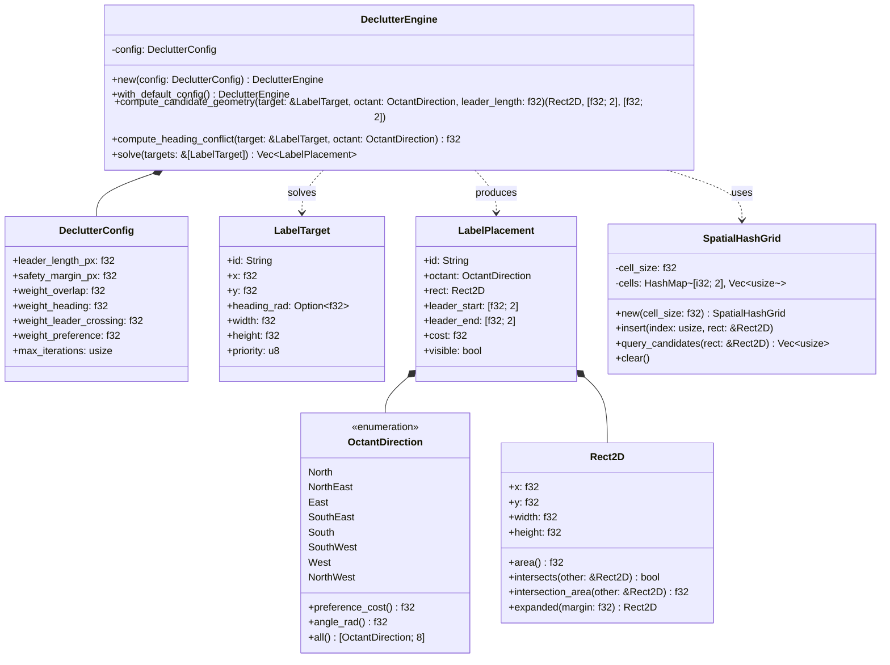
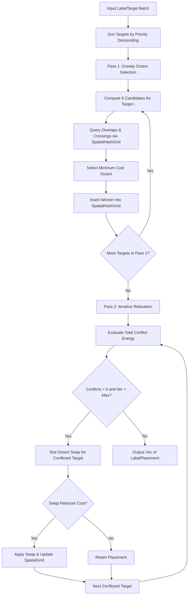

# Component Architecture: Label Anti-Cluttering Engine (`core::declutter`)

This document describes the architectural specification, geometric models, and multi-objective optimization algorithms of the **Label Anti-Cluttering Engine** of the Olayer Core (`core::declutter`). This component provides native, high-performance 8-octant deconfliction for dynamic radar target data blocks with velocity vector avoidance, leader line crossing minimization, and spatial hash grid acceleration.

---

## 1. Responsibilities

The **Label Anti-Cluttering Engine** operates as a pure-Rust, zero-I/O mathematical solver designed to resolve label layout in $< 1\text{ ms}$ for 500+ simultaneous radar targets:

1. **8-Octant Dynamic Candidate Geometry (`core::declutter::types`):**
   - Generate candidate bounding boxes and leader arm connection anchors across 8 standard radial directions:
     $$\text{North} (0^\circ), \text{NE} (45^\circ), \text{East} (90^\circ), \text{SE} (135^\circ), \text{South} (180^\circ), \text{SW} (225^\circ), \text{West} (270^\circ), \text{NW} (315^\circ)$$
   - Apply standard aviation human-factors preference weighting ($\text{NE} = 0.0$ default bias, $\text{SE} = 1.0$, $\text{NW} = 2.0$, $\text{SW} = 3.0$, cardinal directions $= 4.0\dots 7.0$).
2. **Multi-Objective Cost Optimization:**
   - **Label Overlap Area:** Penalize intersection area between bounding boxes ($\text{OverlapArea} \times w_{\text{overlap}}$).
   - **Aircraft Velocity Vector Deconfliction:** Penalize leader arms placed in the angular cone of the aircraft's heading/velocity vector to prevent obscuring speed leader ticks ($\Delta\theta < 45^\circ \implies \text{Penalty}$).
   - **Leader Line Crossing Avoidance:** Detect and heavily penalize overlapping leader arm line segments ($\text{Crossings} \times w_{\text{leader}}$).
   - **Preference Bias:** Guide relaxation towards standard top-right / bottom-right positions when uncontested.
3. **Uniform 2D Spatial Hash Grid (`core::declutter::spatial_grid`):**
   - Partition screen space into uniform grid cells ($32\text{ px} \times 32\text{ px}$) to accelerate bounding box collisions and line intersection tests from $O(N^2)$ to $O(1)$ per candidate query.
4. **Two-Pass Force-Directed Relaxation:**
   - **Pass 1 (Greedy Initialization):** Sort targets by priority and select the lowest-cost octant against previously assigned targets.
   - **Pass 2 (Iterative Local Refinement):** Iteratively test alternative octant swaps to escape local minima and eliminate residual overlaps.

---

## 2. Mathematical Model & Cost Formulation

### 2.1 8-Octant Leader Arm Trigonometry

Given target screen position $(T_x, T_y)$, label size $(W, H)$, leader length $L$, and diagonal component $D = L \cdot \frac{\sqrt{2}}{2}$:

| Octant | Box Position $(X_{\text{rect}}, Y_{\text{rect}})$ | Leader End Anchor $(E_x, E_y)$ |
|:---|:---|:---|
| **North** | $(T_x - W/2, T_y - L - H)$ | $(T_x, T_y - L)$ [Bottom-Center] |
| **NorthEast** | $(T_x + D, T_y - D - H/2)$ | $(T_x + D, T_y - D)$ [Middle-Left] |
| **East** | $(T_x + L, T_y - H/2)$ | $(T_x + L, T_y)$ [Middle-Left] |
| **SouthEast** | $(T_x + D, T_y + D - H/2)$ | $(T_x + D, T_y + D)$ [Middle-Left] |
| **South** | $(T_x - W/2, T_y + L)$ | $(T_x, T_y + L)$ [Top-Center] |
| **SouthWest** | $(T_x - D - W, T_y + D - H/2)$ | $(T_x - D, T_y + D)$ [Middle-Right] |
| **West** | $(T_x - L - W, T_y - H/2)$ | $(T_x - L, T_y)$ [Middle-Right] |
| **NorthWest** | $(T_x - D - W, T_y - D - H/2)$ | $(T_x - D, T_y - D)$ [Middle-Right] |

### 2.2 Objective Cost Function

For candidate placement $P_i$ of target $i$:
$$\text{TotalCost}(P_i) = w_{\text{overlap}} \cdot \sum_{j \ne i} \text{Area}(P_i \cap P_j) + w_{\text{heading}} \cdot C_{\text{hdg}}(P_i) + w_{\text{leader}} \cdot \sum_{j \ne i} \text{Cross}(L_i, L_j) + w_{\text{pref}} \cdot \text{Cost}_{\text{pref}}(P_i)$$

Where:
* $C_{\text{hdg}}(P_i) = \max\left(0, 1.0 - \frac{|\text{Angle}(P_i) - \theta_{\text{heading}}|}{\pi / 4}\right)$
* $\text{Cross}(L_i, L_j) \in \{0, 1\}$ computed via 2D vector cross-product orientation test.

---

## 3. Structure and Relationship Diagram

---

## 4. Key Algorithms & Execution Flows

---

## 5. Performance & Memory Profile

* **Time Complexity:**
  - Spatial hash grid insertion and query: $O(1)$ amortized per box.
  - Greedy Pass 1: $8 \times O(1) \times N = O(N)$.
  - Relaxation Pass 2: $K \times O(N_{\text{conflicts}})$, typically terminating in $\le 3$ iterations.
  - Benchmark performance: $< 0.8\text{ ms}$ for 500 simultaneous targets on modern x86/ARM CPUs.
* **Zero Allocation Hot Loop:**
  - Flat array interface in WASM and C-FFI avoids JSON parsing or heap thrashing during 60 FPS animation loops.

---

## 6. Interoperability & Boundary Contracts

* **WebAssembly (`olayer-wasm`):**
  - `solve_label_placements_flat(targets_flat, leader_len, margin) -> Result<Vec<f32>, JsValue>`
  - `solve_label_placements_json(targets_json, leader_len) -> Result<String, JsValue>`
* **C-FFI (`olayer-native`):**
  - `C_LabelTarget`, `C_LabelPlacement`
  - `olayer_declutter_solve_labels(targets, len, leader_len, margin, out_placements, max_placements, out_count)`
* **TypeScript SDK (`olayer-sdk`):**
  - `LabelAntiClutterEngine` (`sdk/ts/src/renderer/declutter.ts`).
  - Integrated into `CPURenderer.drawTarget()` and dynamic target rendering loop.
