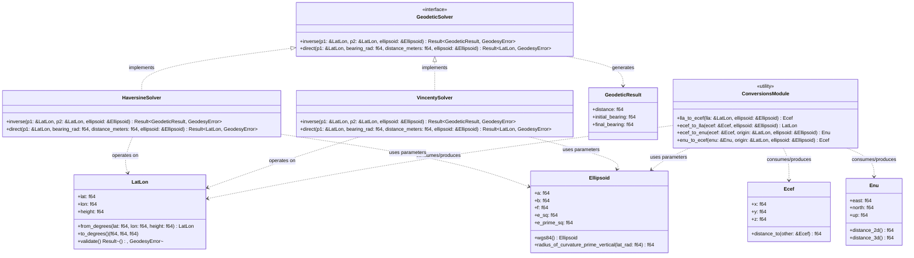

# Component Architecture: Geodesy Engine (`core::geodesy`)

This document describes the detailed design, class structure, and implementation decisions of the **Geodesy Engine** module of the Olayer Core. This component provides the essential mathematical foundations for all operations of the Hybrid GIS, guaranteeing ellipsoidal precision and consistency for air traffic data.

---

## 1. Responsibilities

The **Geodesy Engine** is designed as a pure, high-performance mathematical library, with the following assignments:
1. **Coordinate Representation:** Define robust types for Geodetic (LLA), Geocentric Cartesian (ECEF), and Local Cartesian (ENU) coordinates.
2. **Coordinate Transformations:** Convert coordinates between LLA, ECEF, and ENU systems with error tolerance below 1 millimeter based on the **WGS84** reference ellipsoid.
3. **Geodetic Problem Resolution (Direct and Inverse):**
   * **Inverse (Distance and Heading):** Calculate the shortest distance over the ellipsoidal curve between two points and their departure and arrival azimuths.
   * **Direct (Point Projection):** Extrapolate new geographic coordinates from an origin, an initial heading, and a traveled distance.
4. **Multisolver Modes:** Provide high-precision resolutions (Vincenty) and optimized resolutions for massive processing (Haversine/Spherical).

---

## 2. Structure and Relationship Diagram

The following diagram describes the data structure organization and mathematical resolvers in the `core::geodesy` module.



---

## 3. Physical Module Structure (`core/src/geodesy`)

The Rust source code organization for the component follows the framework's modular pattern:

```text
core/src/geodesy/
├── mod.rs               # Public module facade (re-exports of geodesy module)
├── coords.rs            # Definition of LatLon, Ecef, and Enu structs
├── errors.rs            # Error enum (GeodesyError) and formatting
├── ellipsoid.rs         # Ellipsoidal parameters and constants (WGS84)
├── conversions.rs       # Conversion algorithms between LLA, ECEF, and ENU
└── solvers/             # Geodetic calculation strategies
    ├── mod.rs           # GeodeticSolver trait and common definers
    ├── haversine.rs     # Spherical solver (Fast, O(1))
    └── vincenty.rs      # Ellipsoidal solver (Iterative, High Precision)
```

---

## 4. Implementation and Algorithm Details

### 4.1 Angular Representation Structure
All native Rust trigonometric mathematical functions (`f64::sin`, `f64::cos`, etc.) consume angles in **radians**.
* **Design Decision:** Internally, structs operate strictly in **radians** to avoid redundant conversion cycles during successive calculations.
* The external input and output bridges (WASM/FFI) accept and return decimal degrees, converting them at the module boundary using the convenience functions `from_degrees` and `to_degrees`.

### 4.2 ECEF $\leftrightarrow$ LLA Conversion
* **LLA to ECEF:** Direct calculation through the primary vertical radius of curvature $N(\phi)$:
  $$N(\phi) = \frac{a}{\sqrt{1 - e^2 \sin^2\phi}}$$
  $$X = (N(\phi) + h) \cos\phi \cos\lambda$$
  $$Y = (N(\phi) + h) \cos\phi \sin\lambda$$
  $$Z = \left(N(\phi)(1 - e^2) + h\right) \sin\phi$$
* **ECEF to LLA:** Implementation of **Bowring's Vector Method** (Bowring's Vector Method), which provides micrometric precision instantly without the need for expensive iteration loops, ideal for embedded and high-frequency WASM applications.

### 4.3 Local ENU Conversion (East-North-Up)
To represent targets on the radar screen relative to the ground station (local antenna origin), the system performs conversion by projecting the Cartesian ECEF difference vector onto the ellipsoidal tangent plane of the antenna.
* The conversion rotates the Cartesian coordinate difference $\mathbf{\Delta x} = \mathbf{x}_{target} - \mathbf{x}_{origin}$ by the local rotation matrix based on the origin's latitude $\phi_0$ and longitude $\lambda_0$:
  $$\begin{bmatrix} e \\ n \\ u \end{bmatrix} = \begin{bmatrix} -\sin\lambda_0 & \cos\lambda_0 & 0 \\ -\sin\phi_0\cos\lambda_0 & -\sin\phi_0\sin\lambda_0 & \cos\phi_0 \\ \cos\phi_0\cos\lambda_0 & \cos\phi_0\sin\lambda_0 & \sin\phi_0 \end{bmatrix} \begin{bmatrix} X_{target} - X_{origin} \\ Y_{target} - Y_{origin} \\ Z_{target} - Z_{origin} \end{bmatrix}$$

### 4.4 The Geodetic Resolvers (Vincenty vs Haversine)
* **Vincenty Solver (Operational Standard):**
  * Uses Vincenty equations based on geodesics on a revolution ellipsoid.
  * Achieves precision of up to $0.5\text{ mm}$ on the WGS84 reference ellipsoid.
  * *Exception Handling:* The algorithm is iterative and may fail to converge for extreme antipodal points (longitude difference close to $180^\circ$). The resolver must identify the iteration limit (`MAX_ITERATIONS = 200`) and return an error code or make a transparent fallback to spherical calculation.
* **Haversine Solver (Performance Focus):**
  * Models the Earth as a perfect sphere with mean radius $R_1 = \frac{2a + b}{3}$ or $R = 6371000\text{ m}$.
  * Used for fast preliminary geographic filters of targets out of antenna range before refined checks by the alert processor.

---

## 5. Performance Criteria

1. **Zero Allocations:** No geodetic calculation or coordinate conversion function should perform allocations on the heap (`Vec`, `HashMap`, etc.). All operations are purely arithmetic based on registers or local stack memory references.
2. **Stateless Solvers:** The `VincentySolver` and `HaversineSolver` structs are free of mutable state, allowing multiple threads to access their methods concurrently without the need for mutual exclusion locks (`Mutex`).
3. **FPU Symmetrization:** The code should be compiled activating vectorization optimizations for simultaneous trigonometric calculations whenever possible on the native pipeline.
