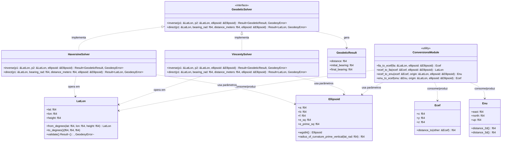

# Arquitetura do Componente: Geodesy Engine (`core::geodesy`)

Este documento descreve o design detalhado, a estrutura de classes e as decisões de implementação do módulo **Geodesy Engine** do Olayer Core. Este componente fornece as fundações matemáticas essenciais para todas as operações do GIS Híbrido, garantindo precisão e consistência elipsoidal para dados de tráfego aéreo.

---

## 1. Responsabilidades

O **Geodesy Engine** é projetado como uma biblioteca matemática pura de alto desempenho, com as seguintes atribuições:
1. **Representação de Coordenadas:** Definir tipos robustos para coordenadas Geodésicas (LLA), Cartesianas Geocêntricas (ECEF) e Cartesianas Locais (ENU).
2. **Transformações de Coordenadas:** Converter coordenadas entre sistemas LLA, ECEF e ENU com tolerância a erros inferior a 1 milímetro com base no elipsoide de referência **WGS84**.
3. **Resolução de Problemas Geodésicos (Direto e Inverso):**
   * **Inverso (Distância e Rumo):** Calcular a menor distância sobre a curva elipsoidal entre dois pontos e seus azimutes de partida e chegada.
   * **Direto (Projeção de Ponto):** Extrapolar novas coordenadas geográficas a partir de uma origem, um rumo inicial e uma distância percorrida.
4. **Modos Multissolver:** Fornecer resoluções de alta precisão (Vincenty) e resoluções otimizadas para processamento massivo (Haversine/Esférico).

---

## 2. Diagrama de Estruturas e Relacionamentos

O diagrama a seguir descreve a organização das estruturas de dados e resolvedores matemáticos no módulo `core::geodesy`.



---

## 3. Estrutura Física do Módulo (`core/src/geodesy`)

A organização do código-fonte em Rust para o componente segue o princípio de separação de domínios:

```text
core/src/geodesy/
├── mod.rs               # Facade pública do módulo (re-exports do módulo geodesy)
├── coords.rs            # Definição das structs LatLon, Ecef e Enu
├── ellipsoid.rs         # Parâmetros e constantes elipsoidais (WGS84)
├── conversions.rs       # Algoritmos de conversão entre LLA, ECEF e ENU
└── solvers/             # Estratégias de cálculo geodésico
    ├── mod.rs           # Trait GeodeticSolver e definidoras comuns
    ├── haversine.rs     # Solver esférico (Rápido, O(1))
    └── vincenty.rs      # Solver elipsoidal (Iterativo, Alta Precisão)
```

---

## 4. Detalhamento de Implementação e Algoritmos

### 4.1 Estrutura de Representação Angular
Todas as funções matemáticas trigonométricas nativas do Rust (`f64::sin`, `f64::cos`, etc.) consomem ângulos em **radianos**.
* **Decisão de Design:** Internamente, as structs operam estritamente em **radianos** para evitar ciclos de conversão redundantes durante cálculos sucessivos.
* As pontes externas de entrada e saída (WASM/FFI) aceitam e devolvem graus decimais, convertendo-os na fronteira do módulo usando as funções de conveniência `from_degrees` e `to_degrees`.

### 4.2 Conversão ECEF $\leftrightarrow$ LLA
* **LLA para ECEF:** Cálculo direto através do raio de curvatura da vertical primária $N(\phi)$:
  $$N(\phi) = \frac{a}{\sqrt{1 - e^2 \sin^2\phi}}$$
  $$X = (N(\phi) + h) \cos\phi \cos\lambda$$
  $$Y = (N(\phi) + h) \cos\phi \sin\lambda$$
  $$Z = \left(N(\phi)(1 - e^2) + h\right) \sin\phi$$
* **ECEF para LLA:** Implementação do **Método Fechado de Bowring** (Bowring's Vector Method), que fornece precisão micrométrica instantânea sem a necessidade de loops de iteração dispendiosos, ideal para aplicações embarcadas e WASM de alta frequência.

### 4.3 Conversão Local ENU (East-North-Up)
Para representar alvos na tela do radar em relação à estação terrestre (origem local da antena), o sistema realiza a conversão projetando o vetor de diferença cartesiana ECEF no plano tangente elipsoidal da antena.
* A conversão rotaciona a diferença de coordenadas cartesiana $\mathbf{\Delta x} = \mathbf{x}_{alvo} - \mathbf{x}_{origem}$ pela matriz de rotação local baseada na latitude $\phi_0$ e longitude $\lambda_0$ da origem:
  $$\begin{bmatrix} e \\ n \\ u \end{bmatrix} = \begin{bmatrix} -\sin\lambda_0 & \cos\lambda_0 & 0 \\ -\sin\phi_0\cos\lambda_0 & -\sin\phi_0\sin\lambda_0 & \cos\phi_0 \\ \cos\phi_0\cos\lambda_0 & \cos\phi_0\sin\lambda_0 & \sin\phi_0 \end{bmatrix} \begin{bmatrix} X_{alvo} - X_{origem} \\ Y_{alvo} - Y_{origem} \\ Z_{alvo} - Z_{origem} \end{bmatrix}$$

### 4.4 Os Resolvedores Geodésicos (Vincenty vs Haversine)
* **Vincenty Solver (Padrão Operacional):**
  * Utiliza as equações de Vincenty baseadas em geodésicas em um elipsoide de revolução.
  * Atinge precisão de até $0.5\text{ mm}$ no elipsoide de referência WGS84.
  * *Tratamento de Exceções:* O algoritmo é iterativo e pode falhar na convergência para pontos antipodais extremos (diferença de longitude próxima a $180^\circ$). O resolvedor deve identificar o limite de iterações (`MAX_ITERATIONS = 200`) e retornar um código de erro ou fazer o fallback transparente para o cálculo esférico.
* **Haversine Solver (Foco em Performance):**
  * Modela a Terra como uma esfera perfeita com raio médio $R_1 = \frac{2a + b}{3}$ ou $R = 6371000\text{ m}$.
  * Utilizado para filtros geográficos preliminares rápidos de alvos fora de alcance da antena antes das checagens refinadas do processador de alertas.

---

## 5. Critérios de Performance

1. **Zero Allocations:** Nenhuma função de cálculo geodésico ou conversão de coordenadas deve realizar alocações no heap (`Vec`, `HashMap`, etc.). Todas as operações são puramente aritméticas baseadas em registradores ou referências locais da stack de memória.
2. **Stateless Solvers:** As structs `VincentySolver` e `HaversineSolver` são livres de estado mutável, permitindo que múltiplos threads acessem seus métodos concorrentemente sem a necessidade de travas de exclusão mútua (`Mutex`).
3. **Simetrização FPU:** O código deve ser compilado ativando otimizações de vetorização para cálculos trigonométricos simultâneos sempre que possível na pipeline nativa.
