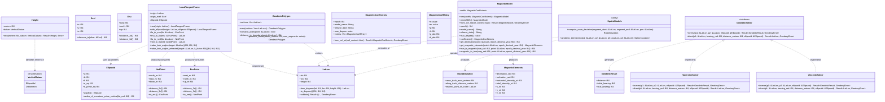

# Component Architecture: Geodesy Engine (`core::geodesy`)

This document describes the detailed design, class structure, and implementation decisions of the **Geodesy Engine** module of the Olayer Core. This component provides the essential mathematical foundations for all operations of the Hybrid GIS, guaranteeing ellipsoidal precision, local topocentric transformations, spherical harmonics geomagnetism (WMM), and geodesic spatial analysis for air traffic and tactical display systems.

---

## 1. Responsibilities

The **Geodesy Engine** is designed as a pure, high-performance mathematical library, with the following assignments:
1. **Coordinate Representation:** Define robust types for Geodetic (LLA), Geocentric Cartesian (ECEF), Local Cartesian (ENU/NED), and associated geometric primitives.
2. **Coordinate Transformations:** Convert coordinates between LLA, ECEF, ENU, and NED systems with error tolerance below 1 millimeter based on the **WGS84** reference ellipsoid.
3. **Local Tangent Plane & Sensor Modeling (`GIS-PROP-001`):** Project geodetic points to airport/radar tangent frames and calculate radar look angles (slant range, azimuth, elevation) including standard 4/3 tropospheric refraction bending.
4. **World Magnetic Model (`GIS-PROP-001`):** Provide built-in spherical harmonic expansion (WMM-2025 degree 12) to compute magnetic declination, inclination, horizontal/total intensity, and bidirectional True $\leftrightarrow$ Magnetic bearing conversions.
5. **Geodetic Problem Resolution (Direct and Inverse):**
   * **Inverse (Distance and Heading):** Calculate the shortest distance over the ellipsoidal curve between two points and their departure and arrival azimuths.
   * **Direct (Point Projection):** Extrapolate new geographic coordinates from an origin, an initial heading, and a traveled distance.
6. **Geodesic Spatial Analysis Engine (`GIS-PROP-002`):**
   * **Airspace Sector Containment:** Spherical winding number point-in-polygon containment robust across the antimeridian and polar singularities.
   * **Cross-Track Error (XTK) & Along-Track Distance (ATD):** Precision metric deviation and projected route progress relative to geodesic route segments.
   * **Geodesic Buffers & Corridors:** Generate constant-width geodesic buffer polygons with vertex arc discretization.
   * **Geodesic Line-Line Intersection:** Determine exact intersection points of two airway segments on the globe using 3D great circle normals.
7. **Multisolver Modes:** Provide high-precision resolutions (Vincenty) and optimized resolutions for massive processing (Haversine/Spherical).
8. **Vertical Reference Types:** Represent validated heights and their vertical datum without depending on terrain sampling or rendering.

---

## 2. Structure and Relationship Diagram

The following diagram describes the data structure organization and mathematical resolvers in the `core::geodesy` module.


```mermaid
classDiagram
    direction TB

    %% Coordinate Structure Definitions
    class LatLon {
        +lat: f64
        +lon: f64
        +height: f64
        +from_degrees(lat: f64, lon: f64, height: f64) LatLon
        +to_degrees() (f64, f64, f64)
        +validate() Result~() , GeodesyError~
    }

    class Height {
        +meters: f64
        +datum: VerticalDatum
        +new(meters: f64, datum: VerticalDatum) Result~Height, Error~
    }

    class VerticalDatum {
        <<enumeration>>
        Ellipsoidal
        Orthometric
    }

    class Ecef {
        +x: f64
        +y: f64
        +z: f64
        +distance_to(other: &Ecef) f64
    }

    class Enu {
        +east: f64
        +north: f64
        +up: f64
        +distance_2d() f64
        +distance_3d() f64
    }

    class EnuPoint {
        +east_m: f64
        +north_m: f64
        +up_m: f64
        +distance_2d() f64
        +distance_3d() f64
        +to_ned() NedPoint
    }

    class NedPoint {
        +north_m: f64
        +east_m: f64
        +down_m: f64
        +distance_2d() f64
        +distance_3d() f64
        +to_enu() EnuPoint
    }

    class LocalTangentFrame {
        +origin: LatLon
        -origin_ecef: Ecef
        -ellipsoid: Ellipsoid
        +new(origin: LatLon) LocalTangentFrame
        +with_ellipsoid(origin: LatLon, ellipsoid: Ellipsoid) LocalTangentFrame
        +lla_to_enu(lla: &LatLon) EnuPoint
        +enu_to_lla(enu: &EnuPoint) LatLon
        +lla_to_ned(lla: &LatLon) NedPoint
        +ned_to_lla(ned: &NedPoint) LatLon
        +radar_look_angles(target: &LatLon) (f64, f64, f64)
        +radar_look_angles_refracted(target: &LatLon, k_factor: f64) (f64, f64, f64)
    }

    %% Ellipsoid Definition
    class Ellipsoid {
        +a: f64
        +b: f64
        +f: f64
        +e_sq: f64
        +e_prime_sq: f64
        +wgs84() Ellipsoid
        +radius_of_curvature_prime_vertical(lat_rad: f64) f64
    }

    %% World Magnetic Model (WMM) - Dynamic and Future-Proof
    class MagneticModel {
        -coeffs: MagneticCoefficients
        +new(coeffs: MagneticCoefficients) MagneticModel
        +wmm2025() MagneticModel
        +from_cof_str(cof_content: &str) Result~MagneticModel, GeodesyError~
        +epoch() f64
        +model_name() String
        +release_date() String
        +max_degree() usize
        +coefficients() MagneticCoefficients
        +get_declination(point: &LatLon, epoch_decimal_year: f64) f64
        +get_magnetic_elements(point: &LatLon, epoch_decimal_year: f64) MagneticElements
        +true_to_magnetic(true_rad: f64, point: &LatLon, epoch_decimal_year: f64) f64
        +magnetic_to_true(mag_rad: f64, point: &LatLon, epoch_decimal_year: f64) f64
    }

    class MagneticCoefficients {
        +epoch: f64
        +model_name: String
        +release_date: String
        +max_degree: usize
        +entries: Vec~MagneticCoeffEntry~
        +from_cof_str(cof_content: &str) Result~MagneticCoefficients, GeodesyError~
    }

    class MagneticCoeffEntry {
        +n: usize
        +m: usize
        +g: f64
        +h: f64
        +g_dot: f64
        +h_dot: f64
    }

    class MagneticElements {
        +declination_rad: f64
        +inclination_rad: f64
        +horizontal_intensity_nt: f64
        +total_intensity_nt: f64
        +x_nt: f64
        +y_nt: f64
        +z_nt: f64
    }

    %% Geodesic Spatial Analysis Engine
    class GeodesicPolygon {
        +vertices: Vec~LatLon~
        +new(vertices: Vec~LatLon~) GeodesicPolygon
        +contains_point(point: &LatLon) bool
        +distance_to_boundary(point: &LatLon) f64
        +generate_buffer(radius_meters: f64, num_segments: usize) GeodesicPolygon
    }

    class RouteDeviation {
        +cross_track_error_meters: f64
        +along_track_distance_meters: f64
        +nearest_point_on_route: LatLon
    }

    class SpatialModule {
        <<utility>>
        +compute_route_deviation(segment_start: &LatLon, segment_end: &LatLon, pos: &LatLon) RouteDeviation
        +geodesic_intersection(p1: &LatLon, p2: &LatLon, p3: &LatLon, p4: &LatLon) Option~LatLon~
    }

    %% Geodesy Interfaces and Solvers
    class GeodeticSolver {
        <<interface>>
        +inverse(p1: &LatLon, p2: &LatLon, ellipsoid: &Ellipsoid) Result~GeodeticResult, GeodesyError~
        +direct(p1: &LatLon, bearing_rad: f64, distance_meters: f64, ellipsoid: &Ellipsoid) Result~LatLon, GeodesyError~
    }

    class VincentySolver {
        +inverse(p1: &LatLon, p2: &LatLon, ellipsoid: &Ellipsoid) Result~GeodeticResult, GeodesyError~
        +direct(p1: &LatLon, bearing_rad: f64, distance_meters: f64, ellipsoid: &Ellipsoid) Result~LatLon, GeodesyError~
    }

    class HaversineSolver {
        +inverse(p1: &LatLon, p2: &LatLon, ellipsoid: &Ellipsoid) Result~GeodeticResult, GeodesyError~
        +direct(p1: &LatLon, bearing_rad: f64, distance_meters: f64, ellipsoid: &Ellipsoid) Result~LatLon, GeodesyError~
    }

    class GeodeticResult {
        +distance: f64
        +initial_bearing: f64
        +final_bearing: f64
    }

    %% Relationships
    LocalTangentFrame ..> LatLon : origin/target
    LocalTangentFrame ..> EnuPoint : produces/consumes
    LocalTangentFrame ..> NedPoint : produces/consumes
    LocalTangentFrame ..> Ellipsoid : uses parameters

    MagneticModel ..> LatLon : computes at
    MagneticModel ..> MagneticElements : produces

    GeodesicPolygon ..> LatLon : vertices
    SpatialModule ..> LatLon : operates on
    SpatialModule ..> RouteDeviation : produces

    GeodeticSolver <|.. VincentySolver : implements
    GeodeticSolver <|.. HaversineSolver : implements
    GeodeticSolver ..> GeodeticResult : generates
    Height ..> VerticalDatum : identifies reference
```

---

## 3. Physical Module Structure (`core/src/geodesy`)

The Rust source code organization for the component follows the framework's modular pattern:

```text
core/src/geodesy/
├── mod.rs               # Public module facade (re-exports of geodesy module)
├── coords.rs            # Definition of LatLon, Ecef, and Enu structs
├── altitude.rs          # Height and VerticalDatum value objects
├── errors.rs            # Error enum (GeodesyError) and formatting
├── ellipsoid.rs         # Ellipsoidal parameters and constants (WGS84)
├── conversions.rs       # Conversion algorithms between LLA, ECEF, and ENU
├── local_frame.rs       # Local tangent plane (ENU/NED), Radar look angles (GIS-PROP-001)
├── magnetic.rs          # World Magnetic Model (WMM-2025) declination engine (GIS-PROP-001)
├── spatial.rs           # Geodesic spatial analysis, containment, buffers, XTK/ATD (GIS-PROP-002)
├── math.rs              # Normalization and angle helpers
├── solvers/             # Geodetic calculation strategies
│   ├── mod.rs           # GeodeticSolver trait and common definers
│   ├── haversine.rs     # Spherical solver (Fast, O(1))
│   └── vincenty.rs      # Ellipsoidal solver (Iterative, High Precision)
└── tests.rs             # Unit and integration tests
```

`geodesy::altitude` owns only the vertical reference and validation of a height. It does not query `TerrainEngine` and does not implement `ClampToGround` or other scene-placement policies. Those policies belong to `core::terrain::altitude`.

---

## 4. Implementation and Algorithm Details

### 4.1 Angular Representation Structure
All native Rust trigonometric mathematical functions (`f64::sin`, `f64::cos`, etc.) consume angles in **radians**.
* **Design Decision:** Internally, structs operate strictly in **radians** to avoid redundant conversion cycles during successive calculations.
* The external input and output bridges (WASM/FFI) accept and return decimal degrees, converting them at the module boundary using the convenience functions `from_degrees` and `to_degrees`.

### 4.2 ECEF $\leftrightarrow$ LLA Conversion
* **LLA to ECEF:** Direct calculation through the primary vertical radius of curvature $N(\phi)$:
  $$N(\phi) = \frac{a}{\sqrt{1 - e^2 \sin^2\phi}}$$
  $$X = (N(\phi) + h) \cos\phi \cos\lambda$$
  $$Y = (N(\phi) + h) \cos\phi \sin\lambda$$
  $$Z = \left(N(\phi)(1 - e^2) + h\right) \sin\phi$$
* **ECEF to LLA:** Implementation of **Bowring's Vector Method**, which provides micrometric precision instantly without the need for expensive iteration loops, ideal for embedded and high-frequency WASM applications.

### 4.3 Local ENU Conversion (East-North-Up)
To represent targets on the radar screen relative to the ground station (local antenna origin), the system performs conversion by projecting the Cartesian ECEF difference vector onto the ellipsoidal tangent plane of the antenna.
* The conversion rotates the Cartesian coordinate difference $\mathbf{\Delta x} = \mathbf{x}_{target} - \mathbf{x}_{origin}$ by the local rotation matrix based on the origin's latitude $\phi_0$ and longitude $\lambda_0$:
  $$\begin{bmatrix} e \\ n \\ u \end{bmatrix} = \begin{bmatrix} -\sin\lambda_0 & \cos\lambda_0 & 0 \\ -\sin\phi_0\cos\lambda_0 & -\sin\phi_0\sin\lambda_0 & \cos\phi_0 \\ \cos\phi_0\cos\lambda_0 & \cos\phi_0\sin\lambda_0 & \sin\phi_0 \end{bmatrix} \begin{bmatrix} X_{target} - X_{origin} \\ Y_{target} - Y_{origin} \\ Z_{target} - Z_{origin} \end{bmatrix}$$

### 4.4 The Geodetic Resolvers (Vincenty vs Haversine)
* **Vincenty Solver (Operational Standard):**
  * Uses Vincenty equations based on geodesics on a revolution ellipsoid.
  * Achieves precision of up to $0.5\text{ mm}$ on the WGS84 reference ellipsoid.
  * *Exception Handling:* The algorithm is iterative and may fail to converge for extreme antipodal points (longitude difference close to $180^\circ$). The resolver identifies the iteration limit (`MAX_ITERATIONS = 200`) and executes a transparent fallback to spherical calculation.
* **Haversine Solver (Performance Focus):**
  * Models the Earth as a perfect sphere with mean radius $R_1 = \frac{2a + b}{3}$ or $R = 6371000\text{ m}$.
  * Used for fast preliminary geographic filters of targets out of antenna range before refined checks by the alert processor.

### 4.5 Local Tangent Plane (ENU / NED) & Radar Look Angles (`GIS-PROP-001`)
* **Local Tangent Frame (`LocalTangentFrame`):** Encapsulates the origin geodetic reference point and precomputes its ECEF vector. Provides direct transforms `LLA <-> ENU` and `LLA <-> NED`.
* **Radar Look Angles (Slant Range, Azimuth, Elevation):**
  Given local topocentric coordinates $(E, N, U)$:
  $$R_{\text{slant}} = \sqrt{E^2 + N^2 + U^2}, \quad \text{Azimuth} = \text{atan2}(E, N) \pmod{2\pi}, \quad \text{Elevation} = \arcsin\left(\frac{U}{R_{\text{slant}}}\right)$$
* **Tropospheric Refraction (4/3 Effective Earth Radius Model):**
  Standard atmospheric refraction bends radar beams downward, extending the radio horizon. With effective curvature parameter $k = 4/3$:
  $$\Delta h_{\text{refract}} = \frac{R_{2\text{D}}^2}{2 k R_{\text{earth}}}$$
  $$\text{Elevation}_{\text{refracted}} = \arcsin\left(\frac{U - \Delta h_{\text{refract}}}{R_{\text{slant}}}\right)$$

### 4.6 Future-Proof World Magnetic Model (`GIS-PROP-001` & Dynamic `WMM.COF` Ingestion)
* **Decoupled & Dynamic Architecture:** To support future epoch updates (WMM-2030, WMM-2035, custom regional models) without requiring code modifications or recompilation, `MagneticModel` is decoupled from hardcoded tables. It supports parsing official NOAA / NGA / BGS standard `WMM.COF` files and strings via `MagneticModel::from_cof_str(cof_content)`.
* **Built-in Default:** For zero-config applications, `MagneticModel::wmm2025()` / `MagneticModel::default()` bundles the official WMM-2025 coefficient dataset out of the box.
* **Spherical Harmonic Calculation:**
  Computes magnetic field components from the Gaussian spherical harmonic potential:
  $$V(r, \theta, \lambda, t) = a \sum_{n=1}^{N} \left(\frac{a}{r}\right)^{n+1} \sum_{m=0}^{n} \left(g_n^m(t) \cos(m\lambda) + h_n^m(t) \sin(m\lambda)\right) P_n^m(\cos\theta)$$
* Evaluates Schmidt semi-normalized Legendre functions $P_n^m(\cos\theta)$ and derivative recursions for any degree $N$.
* Applies secular variations for decimal epoch $t$: $g_n^m(t) = g_n^m(t_0) + (t - t_0)\dot{g}_n^m$.
* Rotates geocentric field $(X', Y', Z')$ to geodetic topocentric coordinates $(X, Y, Z)$ using WGS84 ellipsoidal flattening:
  $$\text{Declination } D = \text{atan2}(Y, X), \quad \text{Inclination } I = \text{atan2}(Z, \sqrt{X^2 + Y^2})$$
* **Bearing Conversions:**
  $$\text{Bearing}_{\text{mag}} = (\text{Bearing}_{\text{true}} - D) \pmod{2\pi}$$
  $$\text{Bearing}_{\text{true}} = (\text{Bearing}_{\text{mag}} + D) \pmod{2\pi}$$

### 4.7 Cross-Track Error (XTK) & Along-Track Distance (ATD) (`GIS-PROP-002`)
* Given airway segment $A \rightarrow B$ and position $P$:
  * Angular distance $\delta_{13} = d(A, P) / R$, segment course $\theta_{12}$, and bearing $\theta_{13} = \text{bearing}(A, P)$.
  * Cross-track angular offset: $\delta_{\text{xt}} = \arcsin(\sin\delta_{13} \sin(\theta_{13} - \theta_{12}))$.
    $$\text{XTK} = \delta_{\text{xt}} \cdot R \quad (\text{positive = right of track, negative = left})$$
  * Along-track angular progress:
    $$\delta_{\text{at}} = \text{sign}(\cos(\theta_{13} - \theta_{12})) \cdot \arccos\left(\text{clamp}\left(\frac{\cos\delta_{13}}{\cos\delta_{\text{xt}}}, -1.0, 1.0\right)\right)$$
    $$\text{ATD} = \delta_{\text{at}} \cdot R$$
  * Nearest point $N = \text{direct}(A, \theta_{12}, \text{ATD})$.

### 4.8 Spherical Winding Number Polygon Containment (`GIS-PROP-002`)
* Evaluates point-in-polygon containment on the sphere using the **Spherical Winding Number**:
  For target $P$ and polygon edges $(V_i, V_{i+1})$, compute the unit tangent projection vector:
  $$\mathbf{u}_i = \frac{\mathbf{v}_i - (\mathbf{v}_i \cdot \mathbf{p})\mathbf{p}}{\|\mathbf{v}_i - (\mathbf{v}_i \cdot \mathbf{p})\mathbf{p}\|}$$
  $$\Delta \theta_i = \text{atan2}((\mathbf{u}_i \times \mathbf{u}_{i+1}) \cdot \mathbf{p}, \mathbf{u}_i \cdot \mathbf{u}_{i+1})$$
  $$W(P) = \frac{1}{2\pi} \sum_{i=0}^{n-1} \Delta \theta_i$$
* Point $P$ is inside when $|W(P)| > 0.5$. This method has **zero coordinate singularities** at the antimeridian ($180^\circ / -180^\circ$) and the poles.

### 4.9 Geodesic Line-Line Intersection & Buffer Generation (`GIS-PROP-002`)
* **Line-Line Intersection:** For segments $A \rightarrow B$ and $C \rightarrow D$, great circles are planes through the Earth's center with normals $\mathbf{n}_1 = \frac{\mathbf{a} \times \mathbf{b}}{\|\mathbf{a} \times \mathbf{b}\|}$, $\mathbf{n}_2 = \frac{\mathbf{c} \times \mathbf{d}}{\|\mathbf{c} \times \mathbf{d}\|}$. The intersection vector $\mathbf{L} = \frac{\mathbf{n}_1 \times \mathbf{n}_2}{\|\mathbf{n}_1 \times \mathbf{n}_2\|}$ (and $-\mathbf{L}$) is checked for bounding interval containment on both segments.
* **Geodesic Buffers:** Generates constant-width lateral offsets by projecting normal offset lines along edges and interpolating arc fans at corner vertices.

---

## 5. Performance Criteria

1. **Zero Allocations:** Coordinate conversions, radar look angles, magnetic field evaluations, and route deviation checks perform zero heap allocations.
2. **Stateless Solvers & Models:** `LocalTangentFrame`, `MagneticModel`, and spatial geometry functions are immutable and thread-safe (`Send + Sync`).
3. **High-Throughput Airspace Containment:** Spherical winding number containment executes in $O(N)$ operations on 3D Cartesian registers with no trigonometric branch singularities.
