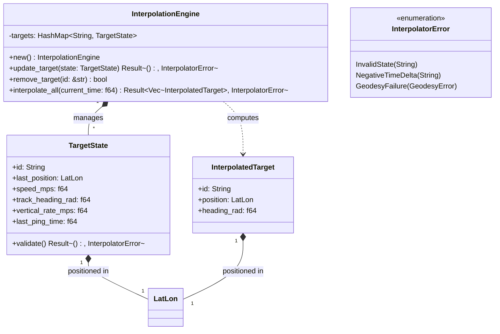

# Component Architecture: Target Interpolator (`core::interpolator`)

This document details the technical design, geodetic kinematic equations, and data structures of the **Target Interpolator** component of the Olayer Core. This module is responsible for synchronizing and predicting the three-dimensional trajectory of dynamic geodetic targets (aircraft, ground vehicles, vessels, UAVs, etc.) at runtime using *Dead Reckoning*.

---

## 1. Responsibilities

The **Target Interpolator** operates as a passive, high-performance kinematic prediction engine, responsible for:
1. **Target State Tracking:** Store an in-memory indexed table with the physical real states (`TargetState`) reported periodically by sensors (radar, ADS-B, GPS) for each tactical target.
2. **3D Geodetic Kinematic Prediction (*Dead Reckoning*):** Calculate the estimated three-dimensional position $(\phi, \lambda, h)$ on the globe from the elapsed time since the last sensor ping, using the WGS84 ellipsoidal model.
3. **Projection Decoupling:** Maintain the physical estimate of targets strictly in geodetic space, free of 2D screen coordinates or boundaries. The final screen projection and translation are the responsibility of the client SDK, which consumes the data and applies the active Olayer Core cartographic projection.
4. **Asynchronous Updates:** Transparently handle sensor updates received at variable and low frequencies (e.g., ~1 Hz) and interpolate them continuously to the client's display frame rate (15 to 60 FPS).

---

## 2. Structure and Relationship Diagram



---

## 3. Physical Module Structure (`core/src/interpolator`)

The physical Rust source organization follows the framework's modular pattern:

```text
core/src/interpolator/
├── mod.rs               # Module facade (Re-exports)
├── errors.rs            # Error enum (InterpolatorError)
├── state.rs             # TargetState and InterpolatedTarget structures
├── engine.rs            # InterpolationEngine logic
└── tests.rs             # Kinematics and extrapolation tests
```

---

## 4. *Dead Reckoning* Mathematical Formulation

At each update or frame request, the interpolation engine estimates the new coordinate for the system timestamp $t_{\text{current}}$ based on the sensor timestamp $t_{\text{last\_ping}}$:

### 4.1 Time Delta ($dt$)
$$dt = t_{\text{current}} - t_{\text{last\_ping}}$$
*If $dt < 0$, the corresponding target is ignored and omitted from that frame's response to avoid a single sensor's temporal deviations interfering with the rest of the target batch (clock skew).*

### 4.2 Horizontal Geodetic Translation
The target's horizontal movement over the WGS84 ellipsoid is obtained by solving the **Direct Geodetic Problem**:
1. Horizontal distance traveled:
   $$d = v_{\text{horizontal}} \times dt$$
2. The origin point $p_0 = (\phi_{\text{last}}, \lambda_{\text{last}})$, the initial heading/azimuth $\alpha = \psi_{\text{initial}}$, and the distance $d$ are passed to the **Vincenty Solver** (or Haversine Solver in case of fallback) of the `Geodesy Engine`:
   $$p_{\text{interpolated}} = \text{direct}(p_0, \alpha, d, \text{WGS84})$$
   $$\phi_{\text{new}} = p_{\text{interpolated}}.\phi, \quad \lambda_{\text{new}} = p_{\text{interpolated}}.\lambda$$

### 4.3 Vertical Altitude Variation
The altitude above the ellipsoid ($h$) is extrapolated linearly by the rate of climb or descent:
$$h_{\text{new}} = h_{\text{last}} + (v_{\text{vertical}} \times dt)$$

### 4.4 Interpolated Heading
In simple linear maneuvers, the heading is assumed constant:
$$\psi_{\text{new}} = \psi_{\text{initial}}$$

---

## 5. Performance and Robustness Criteria

1. **Avoid Heap Allocations in Loop:** The list returned by `interpolate_all` is pre-allocated with capacity based on the number of active targets (`Vec::with_capacity(self.targets.len())`) to eliminate redundant allocations at each frame.
2. **Sensor Delay Tolerance:** If a target does not receive pings for a long interval (e.g., $dt > 30.0\text{ seconds}$), the engine may suspend it from dynamic calculation (*stale target*) to avoid physically unrealistic extrapolations.
3. **Precision and Speed:** For targets at high speeds (supersonic aircraft/fighter jets), using the precise Vincenty resolver ensures that extrapolation follows real great circle trajectories, avoiding significant deviations present in simplified planar approximations.
