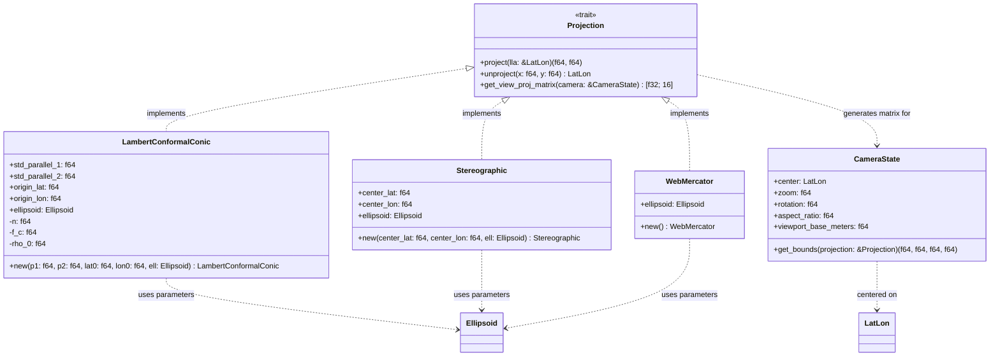

# Component Architecture: Projections Engine (`core::projections`)

This document describes the technical design, cartographic equations, and modular structure of the **Projections Engine** module of the Olayer Core. This component translates three-dimensional geodetic coordinates (LLA) into projected 2D planes and generates the visualization matrices consumed by the WebGL, WebGPU, and Vulkan graphics pipelines.

---

## 1. Responsibilities

The **Projections Engine** is the framework's flat cartographic representation engine, responsible for:
1. **Cartographic Abstraction:** Define a unified interface (`Projection` trait) that encapsulates the behavior of projections.
2. **Mission-Critical Projections:**
   * **Lambert Conformal Conic (LCC):** Conformal conic projection with two standard parallels, essential for *En-Route* visualizations (high precision in continental route maps).
   * **Azimuthal Stereographic (Ellipsoidal):** Azimuthal projection with tangency point at the radar antenna, preserving local angles for terminal approaches (TMA).
   * **Web Mercator (EPSG:3857):** Compatibility with commercial base map providers (Vector/Raster Tiles).
3. **Camera and Matrix Calculation:** Compute projection and visualization transformation matrices (View-Projection Matrix $4 \times 4$) from a three-dimensional camera state (`CameraState`).

---

## 2. Structure and Trait Diagram

The following class diagram presents the design and relationships of the projection components.



---

## 3. Physical Module Structure (`core/src/projections`)

The code division follows the physical structure below:

```text
core/src/projections/
├── mod.rs               # Module facade (Projection Trait, CameraState, re-exports)
├── errors.rs            # Error enum (ProjectionError) and formatting
├── lcc.rs               # Lambert Conformal Conic implementation
├── stereographic.rs     # Azimuthal Stereographic implementation
├── mercator.rs          # Web Mercator implementation
└── matrix.rs            # Mathematical utilities for 4x4 matrix transformations
```

---

## 4. Mathematical and Implementation Details

### 4.1 Lambert Conformal Conic (LCC)
The ellipsoidal LCC projection is configured by two standard parallels ($\phi_1$ and $\phi_2$), an origin latitude $\phi_0$, and a central meridian $\lambda_0$.
* **Constant Calculation (Pre-processing at instantiation):**
  $$n = \frac{\ln(m_1 / m_2)}{\ln(t_1 / t_2)}$$
  $$F = \frac{m_1}{n \cdot t_1^n}$$
  $$\rho(\phi) = a \cdot F \cdot t^n$$
  Where $m = \frac{\cos\phi}{\sqrt{1 - e^2 \sin^2\phi}}$ and $t = \tan(\pi/4 - \phi/2) \cdot \left(\frac{1 + e\sin\phi}{1 - e\sin\phi}\right)^{e/2}$.
* **Projection (LLA $\rightarrow$ 2D):**
  $$\theta = n \cdot (\lambda - \lambda_0)$$
  $$\rho = a \cdot F \cdot t(\phi)^n$$
  $$x = \rho \sin\theta$$
  $$y = \rho_0 - \rho \cos\theta$$

### 4.2 Azimuthal Stereographic (Ellipsoidal)
For angle preservation and precision near the TMA radar center ($\phi_c, \lambda_c$), the ellipsoidal stereographic projection is modeled according to Snyder.
* **Projection (LLA $\rightarrow$ 2D):**
  The conversion uses an auxiliary sphere (Conformal Latitude $\chi$) to adjust the ellipsoid's oblateness:
  $$\tan(\pi/4 + \chi/2) = \tan(\pi/4 + \phi/2) \cdot \left(\frac{1 - e\sin\phi}{1 + e\sin\phi}\right)^{e/2}$$
  The spherical stereographic projection is calculated on the conformal latitude $\chi$ relative to the center $\chi_c$.

### 4.3 View-Projection $4 \times 4$ Matrix
The View-Projection matrix is responsible for translating, rotating, and scaling the projected 2D geographic data to the GPU's normalized display space (Normalized Device Coordinates - NDC) continuously.
* **Step 1 (Camera):** Project the camera's geodetic center $(\phi_c, \lambda_c)$ using the current projection to obtain the Cartesian point $P_c = (x_c, y_c)$.
* **Step 2 (View Matrix):**
  The view matrix translates the world by $(-x_c, -y_c)$ and applies the camera rotation (azimuth $\theta$):
  $$V = R_z(-\theta) \cdot T(-x_c, -y_c, 0)$$
* **Step 3 (Projection Matrix):**
  An orthographic projection based on the camera zoom and screen proportion (*aspect ratio*) is used:
  $$w = \frac{\text{viewport\_base\_meters}}{\text{zoom}}$$
  $$h = \frac{w}{\text{aspect\_ratio}}$$
  $$P = \text{Ortho}\left(-\frac{w}{2}, \frac{w}{2}, -\frac{h}{2}, \frac{h}{2}, -1000.0, 1000.0\right)$$
* **Step 4 (View-Projection):**
  $$VP = P \cdot V$$
  The result is returned in a flat 16-element vector (`[f32; 16]`) in **column-major** order (GLSL/WGSL shader standard).

---

## 5. Performance and Design Criteria

1. **Constant Caching:** Projection constants that depend only on initial parameters (such as $n$ and $F$ in LCC) must be calculated once during struct initialization and stored in private fields, avoiding recalculation at each frame.
2. **Column-Major layout:** The ordering of the $4\times4$ matrix elements must be strictly in columns for fast injection into Uniform Buffers without GPU transposition cost.
3. **f64 Precision:** All raw data coordinate transformations (LLA $\leftrightarrow$ 2D) run in 64-bit floating point precision (`f64`). Only the final View-Projection matrix assembly is truncated to 32 bits (`f32`) for matching with standard graphics hardware.
