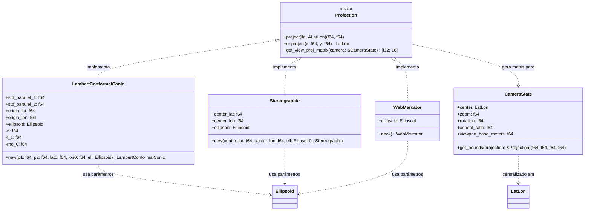

# Arquitetura do Componente: Projections Engine (`core::projections`)

Este documento descreve o design técnico, as equações cartográficas e a estrutura modular do módulo **Projections Engine** do Olayer Core. Este componente traduz coordenadas geodésicas tridimensionais (LLA) em planos projetados bidimensionais (2D) e gera as matrizes de visualização consumidas pelas pipelines gráficas WebGL, WebGPU e Vulkan.

---

## 1. Responsabilidades

O **Projections Engine** é o motor de representação cartográfica plana do framework, encarregado de:
1. **Abstração Cartográfica:** Definir uma interface unificada (`Projection` trait) que encapsula o comportamento das projeções.
2. **Projeções de Missão Crítica:**
   * **Lambert Conformal Conic (LCC):** Projeção cônica conforme com dois paralelos padrão, essencial para visualizações *En-Route* (alta precisão em mapas de rotas continentais).
   * **Estereográfica Azumital (Ellipsoidal):** Projeção azimutal com ponto de tangência na antena do radar, preservando ângulos locais para aproximações terminais (TMA).
   * **Web Mercator (EPSG:3857):** Compatibilidade com provedores comerciais de mapas de fundo (Vector/Raster Tiles).
3. **Cálculo de Câmera e Matrizes:** Computar matrizes de transformação de projeção e visualização (View-Projection Matrix $4 \times 4$) a partir de um estado tridimensional de câmera (`CameraState`).

---

## 2. Diagrama de Estruturas e Trait

O diagrama de classes a seguir apresenta o design e as relações dos componentes de projeção.



---

## 3. Estrutura Física do Módulo (`core/src/projections`)

A divisão do código segue a estrutura física abaixo:

```text
core/src/projections/
├── mod.rs               # Facade do módulo (Trait Projection, CameraState, re-exports)
├── errors.rs            # Enum de erros (ProjectionError) e formatação
├── lcc.rs               # Implementação da Lambert Conformal Conic
├── stereographic.rs     # Implementação da Estereográfica Azimutal
├── mercator.rs          # Implementação da Web Mercator
└── matrix.rs            # Utilitários matemáticos para transformações de matrizes 4x4
```

---

## 4. Detalhes Matemáticos e de Implementação

### 4.1 Lambert Conformal Conic (LCC)
A projeção LCC elipsoidal é configurada por dois paralelos padrão ($\phi_1$ e $\phi_2$), uma latitude de origem $\phi_0$ e um meridiano central $\lambda_0$.
* **Cálculo de Constantes (Pré-processamento na instanciação):**
  $$n = \frac{\ln(m_1 / m_2)}{\ln(t_1 / t_2)}$$
  $$F = \frac{m_1}{n \cdot t_1^n}$$
  $$\rho(\phi) = a \cdot F \cdot t^n$$
  Onde $m = \frac{\cos\phi}{\sqrt{1 - e^2 \sin^2\phi}}$ e $t = \tan(\pi/4 - \phi/2) \cdot \left(\frac{1 + e\sin\phi}{1 - e\sin\phi}\right)^{e/2}$.
* **Projeção (LLA $\rightarrow$ 2D):**
  $$\theta = n \cdot (\lambda - \lambda_0)$$
  $$\rho = a \cdot F \cdot t(\phi)^n$$
  $$x = \rho \sin\theta$$
  $$y = \rho_0 - \rho \cos\theta$$

### 4.2 Estereográfica Azimutal (Elipsoidal)
Para preservação de ângulos e precisão nas proximidades do centro do radar da TMA ($\phi_c, \lambda_c$), a projeção estereográfica elipsoidal é modelada conforme Snyder.
* **Projeção (LLA $\rightarrow$ 2D):**
  A conversão utiliza uma esfera auxiliar (Latitude Conforme $\chi$) para ajustar a oblabilidade do elipsoide:
  $$\tan(\pi/4 + \chi/2) = \tan(\pi/4 + \phi/2) \cdot \left(\frac{1 - e\sin\phi}{1 + e\sin\phi}\right)^{e/2}$$
  Calcula-se a projeção estereográfica esférica sobre a latitude conforme $\chi$ em relação ao centro $\chi_c$.

### 4.3 Matriz View-Projection $4 \times 4$
A matriz View-Projection é responsável por transladar, rotacionar e escalar os dados geográficos 2D projetados para o espaço de exibição normalizado (Normalized Device Coordinates - NDC) da GPU de forma contínua.
* **Passo 1 (Câmera):** Projetar o centro geodésico da câmera $(\phi_c, \lambda_c)$ usando a projeção corrente para obter o ponto cartesiano $P_c = (x_c, y_c)$.
* **Passo 2 (View Matrix):**
  A matriz de visualização translada o mundo por $(-x_c, -y_c)$ e aplica a rotação da câmera (azimute $\theta$):
  $$V = R_z(-\theta) \cdot T(-x_c, -y_c, 0)$$
* **Passo 3 (Projection Matrix):**
  Usa-se uma projeção ortográfica baseada no zoom da câmera e na proporção da tela (*aspect ratio*):
  $$w = \frac{\text{viewport\_base\_meters}}{\text{zoom}}$$
  $$h = \frac{w}{\text{aspect\_ratio}}$$
  $$P = \text{Ortho}\left(-\frac{w}{2}, \frac{w}{2}, -\frac{h}{2}, \frac{h}{2}, -1000.0, 1000.0\right)$$
* **Passo 4 (View-Projection):**
  $$VP = P \cdot V$$
  O resultado é retornado em vetor plano de 16 elementos (`[f32; 16]`) em ordem **column-major** (padrão de shaders GLSL/WGSL).

---

## 5. Critérios de Performance e Design

1. **Caching de Constantes:** Constantes de projeção que dependem apenas de parâmetros iniciais (como $n$ e $F$ na LCC) devem ser calculadas uma única vez durante a inicialização da struct e armazenadas em campos privados, evitando recalcular em cada frame.
2. **Column-Major layout:** A ordenação dos elementos da matriz $4\times4$ deve ser estritamente em colunas para injeção rápida em Uniform Buffers sem custo de transposição na GPU.
3. **Precisão f64:** Todas as transformações de coordenadas de dados crus (LLA $\leftrightarrow$ 2D) rodam em precisão de ponto flutuante de 64 bits (`f64`). Apenas a montagem final da matriz View-Projection é truncada para 32 bits (`f32`) para correspondência com hardware gráfico padrão.
