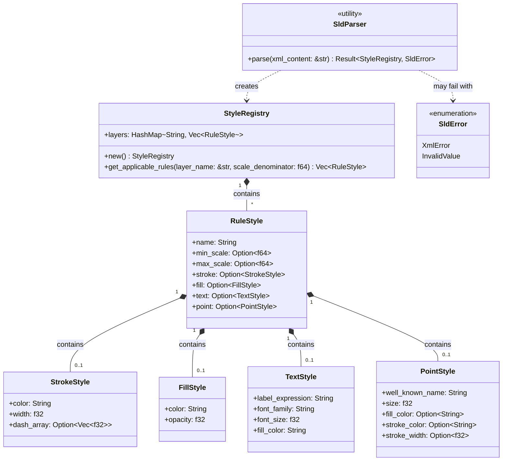

# Component Architecture: SLD Parser (`core::sld`)

This document describes the architecture specification, data structure design, and XML file analysis strategy of the **SLD Parser** component of the Olayer Core. This module translates OGC Styled Layer Descriptor (SLD) documents into structured visual rendering rules consumed by the visual components and the symbol registry.

---

## 1. Responsibilities

The **SLD Parser** is designed to operate as a passive, high-performance module in the Rust Core with the following responsibilities:
1. **XML-to-Struct Analysis:** Interpret SLD schemas in XML in a performant manner compatible with WebAssembly (WASM), without depending on excessive heap allocations.
2. **Scale Resolution:** Read and structure scale denominators (`MinScaleDenominator` and `MaxScaleDenominator`) for dynamic visibility filtering of features based on the camera's zoom level.
3. **Vector Styling Extraction:** Extract basic visual properties for:
   * **Lines (`LineSymbolizer`):** Outlines, widths, and dash patterns (dash arrays).
   * **Polygons (`PolygonSymbolizer`):** Fills and opacity.
   * **Texts/Labels (`TextSymbolizer`):** Fonts, sizes, colors, and data binding expressions (`PropertyName`).
   * **Points and Icons (`PointSymbolizer`):** Basic geometric markers and size.

---

## 2. Structure and Relationship Diagram

The following diagram represents the data structures and the resulting model from the SLD document analysis.



---

## 3. Supported XML Tag Mapping

The parser will interpret the following standard OGC SLD tags:

| XML Element | Rust Mapping | Description |
| :--- | :--- | :--- |
| `<NamedLayer>` | Key in `StyleRegistry.layers` | Identifies the layer to which the style applies (e.g., "Airways", "Sectors"). |
| `<Rule>` | `RuleStyle` | A grouping containing filters and drawing symbolizers. |
| `<MinScaleDenominator>` | `min_scale: Option<f64>` | Minimum display scale. |
| `<MaxScaleDenominator>` | `max_scale: Option<f64>` | Maximum display scale. |
| `<LineSymbolizer>` | `stroke: Option<StrokeStyle>` | Linear geometry symbolizer. |
| `<PolygonSymbolizer>` | `fill: Option<FillStyle>` | Area feature symbolizer. |
| `<TextSymbolizer>` | `text: Option<TextStyle>` | Text label symbolizer. |
| `<PointSymbolizer>` | `point: Option<PointStyle>` | Point marking symbolizer. |
| `<CssParameter name="stroke">` | `StrokeStyle.color` | Line color in hexadecimal format (e.g., `#1A2B3C`). |
| `<CssParameter name="stroke-width">` | `StrokeStyle.width` | Line thickness in pixels. |
| `<CssParameter name="stroke-dasharray">` | `StrokeStyle.dash_array` | Dash pattern (e.g., "5 2" becomes `vec![5.0, 2.0]`). |
| `<CssParameter name="fill">` | `FillStyle.color` | Polygon fill color. |
| `<CssParameter name="fill-opacity">` | `FillStyle.opacity` | Fill transparency (from `0.0` to `1.0`). |
| `<PropertyName>` | `TextStyle.label_expression` | Feature property name from which the text is extracted. |
| `<CssParameter name="font-family">` | `TextStyle.font_family` | Text font family. |
| `<CssParameter name="font-size">` | `TextStyle.font_size` | Text size in pixels. |
| `<WellKnownName>` | `PointStyle.well_known_name` | Point geometry (e.g., `circle`, `square`, `triangle`). |

---

## 4. Implementation and XML Library Details

### 4.1 XML Crate: `quick-xml`
To guarantee performance under limited resources (especially in the browser via WASM), we will adopt the **`quick-xml`** crate for having the following characteristics:
* **Event-based Reader (SAX):** Avoids loading the entire XML DOM tree into memory at once.
* **Zero-Allocation:** Performs reading through temporary slices of the input string (`&str`) drastically reducing the load of the JavaScript virtual machine's Garbage Collector.
* **WASM Compatibility:** Compiles natively to WebAssembly without depending on native operating system libraries (such as `libxml2`).

### 4.2 Parsing Logic
The parser will use an event reading loop (SAX style) maintaining a simplified state machine to track the element in focus (Layer Name $\rightarrow$ Rule $\rightarrow$ Symbolizer $\rightarrow$ Parameters).
* When finding `<NamedLayer>`, the parser reads the corresponding `<Name>` and initializes a rules vector.
* When reading `<CssParameter>` tags, it checks the `name` attribute to correctly map the parameter to the active structure.
* When parsing numeric values (`f32` / `f64`), it performs robust conversions handling possible failures (for example, returning default values in case of empty or malformed strings).

### 4.3 Rule Query Methods
The `StyleRegistry` will provide a fast interface for active rule filtering based on screen zoom:
```rust
impl StyleRegistry {
    pub fn get_applicable_rules(&self, layer_name: &str, scale_denominator: f64) -> Vec<RuleStyle> {
        self.layers
            .get(layer_name)
            .map(|rules| {
                rules
                    .iter()
                    .filter(|rule| {
                        let min_ok = rule.min_scale.map_or(true, |min| scale_denominator >= min);
                        let max_ok = rule.max_scale.map_or(true, |max| scale_denominator <= max);
                        min_ok && max_ok
                    })
                    .cloned()
                    .collect()
            })
            .unwrap_or_default()
    }
}
```
This interface will allow the SDK to instantly obtain the style to be applied for the features to be rendered on the screen for the active zoom level.
