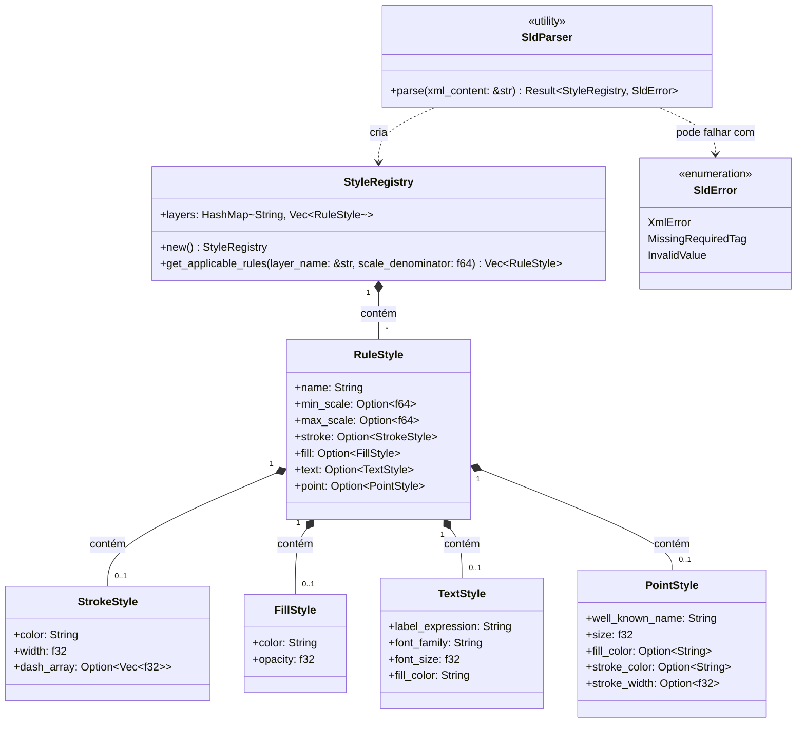

# Arquitetura do Componente: SLD Parser (`core::sld`)

Este documento descreve a especificação de arquitetura, o design das estruturas de dados e a estratégia de análise de arquivos XML do componente **SLD Parser** do Olayer Core. Este módulo traduz documentos Styled Layer Descriptor (SLD) do padrão OGC em regras estruturadas de estilo consumidas pelos componentes visuais e pelo registro de símbolos.

---

## 1. Responsabilidades

O **SLD Parser** é projetado para operar como um módulo passivo e de alto desempenho no Rust Core com as seguintes responsabilidades:
1. **Análise de XML XML-to-Struct:** Interpretar esquemas SLD em XML de forma performática e compatível com WebAssembly (WASM), sem depender de alocações excessivas no heap.
2. **Resolução de Escalas:** Ler e estruturar denominadores de escala (`MinScaleDenominator` e `MaxScaleDenominator`) para filtragem dinâmica de visibilidade de feições baseado no nível de zoom da câmera.
3. **Extração de Estilização Vetorial:** Extrair propriedades visuais básicas para:
   * **Linhas (`LineSymbolizer`):** Contornos, larguras e padrões de tracejado (dash arrays).
   * **Polígonos (`PolygonSymbolizer`):** Preenchimentos e opacidade.
   * **Textos/Etiquetas (`TextSymbolizer`):** Fontes, tamanhos, cores e expressões de amarração de dados (`PropertyName`).
   * **Pontos e Ícones (`PointSymbolizer`):** Marcadores geométricos básicos e tamanho.

---

## 2. Diagrama de Estruturas e Relacionamento

O diagrama a seguir representa as estruturas de dados e o modelo resultante da análise do documento SLD.



---

## 3. Mapeamento de Tags XML Suportadas

O parser interpretará as seguintes tags padrão do OGC SLD:

| Elemento XML | Mapeamento no Rust | Descrição |
| :--- | :--- | :--- |
| `<NamedLayer>` | Chave no `StyleRegistry.layers` | Identifica a camada à qual o estilo se aplica (ex: "Aerovias", "Setores"). |
| `<Rule>` | `RuleStyle` | Um agrupador contendo filtros e simbolizadores de desenho. |
| `<MinScaleDenominator>` | `min_scale: Option<f64>` | Escala mínima de exibição. |
| `<MaxScaleDenominator>` | `max_scale: Option<f64>` | Escala máxima de exibição. |
| `<LineSymbolizer>` | `stroke: Option<StrokeStyle>` | Simbolizador de geometria linear. |
| `<PolygonSymbolizer>` | `fill: Option<FillStyle>` | Simbolizador de feições de área. |
| `<TextSymbolizer>` | `text: Option<TextStyle>` | Simbolizador de etiquetas de texto. |
| `<PointSymbolizer>` | `point: Option<PointStyle>` | Simbolizador de marcações pontuais. |
| `<CssParameter name="stroke">` | `StrokeStyle.color` | Cor de linha em formato hexadecimal (ex: `#1A2B3C`). |
| `<CssParameter name="stroke-width">` | `StrokeStyle.width` | Espessura de linha em pixels. |
| `<CssParameter name="stroke-dasharray">` | `StrokeStyle.dash_array` | Padrão de tracejado (ex: "5 2" vira `vec![5.0, 2.0]`). |
| `<CssParameter name="fill">` | `FillStyle.color` | Cor de preenchimento de polígonos. |
| `<CssParameter name="fill-opacity">` | `FillStyle.opacity` | Transparência do preenchimento (de `0.0` a `1.0`). |
| `<PropertyName>` | `TextStyle.label_expression` | Nome da propriedade da feição de onde o texto é extraído. |
| `<CssParameter name="font-family">` | `TextStyle.font_family` | Família tipográfica do texto. |
| `<CssParameter name="font-size">` | `TextStyle.font_size` | Tamanho do texto em pixels. |
| `<WellKnownName>` | `PointStyle.well_known_name` | Geometria do ponto (ex: `circle`, `square`, `triangle`). |

---

## 4. Detalhamento de Implementação e Biblioteca XML

### 4.1 Crate XML: `quick-xml`
Para garantir performance sob recursos limitados (especialmente no navegador via WASM), adotaremos a crate **`quick-xml`** por ter as seguintes características:
* **Reader baseado em eventos (SAX):** Evita carregar toda a árvore DOM do XML em memória de uma vez.
* **Zero-Allocation:** Realiza leitura através de fatias temporárias da string de entrada (`&str`) reduzindo drasticamente a carga do Garbage Collector da máquina virtual Javascript.
* **Compatibilidade com WASM:** Compila nativamente para WebAssembly sem depender de bibliotecas nativas de sistema operacional (como `libxml2`).

### 4.2 Lógica de Parseamento
O parser utilizará um loop de leitura de eventos (SAX style) mantendo uma máquina de estados simplificada para rastrear o elemento em foco (Layer Name $\rightarrow$ Rule $\rightarrow$ Symbolizer $\rightarrow$ Parameters).
* Ao encontrar `<NamedLayer>`, o parser lê o `<Name>` correspondente e inicializa um vetor de regras.
* Ao ler tags de `<CssParameter>`, ele verifica o atributo `name` para mapear corretamente o parâmetro para a estrutura ativa.
* Ao parsear valores numéricos (`f32` / `f64`), ele realiza conversões robustas tratando possíveis falhas (por exemplo, retornando valores padrão em caso de strings vazias ou mal-formadas).

### 4.3 Métodos de Consulta de Regras
O `StyleRegistry` fornecerá uma interface rápida para filtragem ativa de regras com base no zoom de tela:
```rust
impl StyleRegistry {
    pub fn get_applicable_rules(&self, layer_name: &str, scale_denominator: f64) -> Vec<RuleStyle> {
        self.layers
            .get(layer_name)
            .map(|rules| {
                rules
                    .iter()
                    .filter(|rule| {
                        let min_ok = rule.min_scale.map_or(true, |min| scale_denominator >= min);
                        let max_ok = rule.max_scale.map_or(true, |max| scale_denominator <= max);
                        min_ok && max_ok
                    })
                    .cloned()
                    .collect()
            })
            .unwrap_or_default()
    }
}
```
Essa interface permitirá à SDK obter instantaneamente o estilo a ser aplicado para as feições a serem renderizadas na tela para o nível de zoom ativo.
