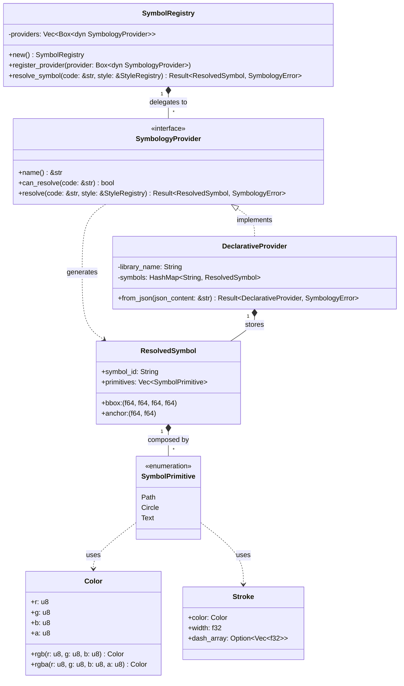

# Component Architecture: Symbol Registry (`core::symbol_registry`)

This document describes the architecture specification, data structure design, and dynamic symbology resolution mechanisms of the **Symbol Registry** component of the Olayer Core. This component acts as the unified and agnostic symbology registry, converting symbol identifiers into vector geometric primitives and integrating them with SLD styles.

---

## 1. Responsibilities

The **Symbol Registry** is designed to operate in a modular and extensible manner in the Rust Core with the following responsibilities:
1. **Provider-Agnostic Architecture:** Allow dynamic registration of multiple specific resolvers (`SymbologyProvider`), delegating the decoding of symbol codes (such as NATO APP-6 or ICAO civil) to the respective providers.
2. **Intermediate Vector Primitives:** Define a clean and unified geometric representation (`ResolvedSymbol` and `SymbolPrimitive`) so that the client SDK can rasterize or load symbols into the Texture Atlas in an optimized way.
3. **Dynamic Styling Bridge:** Merge the base style of a resolved symbol with the dynamic rules defined in the SLD parser (`sld::StyleRegistry`), allowing the host application to change fill colors, thicknesses, and dash patterns at runtime.
4. **Declarative Resolution:** Provide a native resolver that consumes symbol library specifications in JSON format (`DeclarativeProvider`), allowing the creation and customization of collections without altering the Olayer core.

---

## 2. Structure and Relationship Diagram



---

## 3. Physical Module Structure (`core/src/symbol_registry`)

The Rust source code organization for the component follows the domain separation principle:

```text
core/src/symbol_registry/
├── mod.rs               # Module facade (Re-exports)
├── errors.rs            # Error enum (SymbologyError)
├── primitives.rs        # Definitions of Color, Stroke, ResolvedSymbol, and SymbolPrimitive
├── registry.rs          # Provider chain management and SLD merging
└── providers/           # Specific symbology providers
    ├── mod.rs           # SymbologyProvider trait
    └── declarative.rs   # JSON-based resolver
```

---

## 4. Implementation Details

### 4.1 Resolution Chain (Chain of Responsibility)
The `SymbolRegistry` struct maintains an ordered list of registered providers. Upon receiving a symbol code to resolve via `resolve_symbol`:
1. Queries each provider via `.can_resolve(code)`.
2. The first provider that returns `true` is responsible for constructing the symbol via `.resolve(code, style)`.
3. If no provider recognizes the code, returns `Err(SymbologyError::ProviderNotFound)`.

### 4.2 Merging with SLD Rules
After the `ResolvedSymbol` is generated by the provider, the `SymbolRegistry` engine queries the `StyleRegistry` to check if there are styling rules linked to the `symbol_id`.
* If the SLD contains a fill rule (`FillStyle`) or outline (`StrokeStyle`), these attributes overwrite the default values of all compatible primitives (`Path` and `Circle`) of the resolved symbol.
* Colors specified in SLD as hexadecimal strings (e.g., `#FF5733`) are internally converted to the `Color` struct by the integrated auxiliary parser.

### 4.3 Declarative Format (JSON) and Offline Compilation
The `DeclarativeProvider` allows dynamic loading of consolidated symbol libraries in JSON. Instead of writing these complex JSON files by hand, the standard flow uses the CLI tool **`tools/symbol-compiler`** at build time.

The compiler reads SVG files, extracts elements such as `<path>`, `<circle>`, `<text>`, converts CSS/SVG colors and their opacities, and generates a declarative library in the following compatible format:
```json
{
  "library_name": "MyCollection",
  "symbols": {
    "my:symbol": {
      "bbox": [-10.0, -10.0, 10.0, 10.0],
      "anchor": [0.0, 0.0],
      "primitives": [
        {
          "type": "Circle",
          "cx": 0.0,
          "cy": 0.0,
          "r": 8.0,
          "fill": { "r": 255, "g": 0, "b": 0, "a": 255 },
          "stroke": { "color": { "r": 0, "g": 0, "b": 0, "a": 255 }, "width": 1.5 }
        }
      ]
    }
  }
}
```

---

## 5. Performance Criteria

1. **Symbol Caching:** The `DeclarativeProvider` pre-allocates symbols on the heap and maintains them in a read cache (`HashMap`), guaranteeing fast queries in constant time $O(1)$.
2. **Primitive Compaction:** Outline geometries (SVG Path format) are kept in compacted command strings, minimizing heap memory allocation overhead and simplifying WASM transfer.
3. **Optimized Color Parsing:** The hexadecimal color string parser avoids allocations and uses fast base conversions (`from_str_radix` on stack memory slices) to achieve maximum throughput in style decoding.
