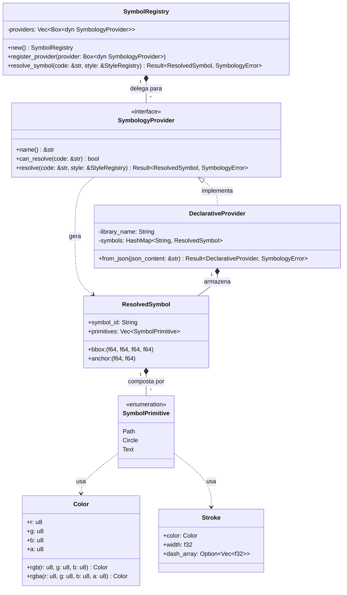

# Arquitetura do Componente: Symbol Registry (`core::symbol_registry`)

Este documento descreve a especificação de arquitetura, o design das estruturas de dados e os mecanismos de resolução de simbologia dinâmica do componente **Symbol Registry** do Olayer Core. Este componente atua como o registro unificado e agnóstico de simbologias, convertendo identificadores de símbolos em primitivas geométricas vetoriais e integrando-os com estilos SLD.

---

## 1. Responsabilidades

O **Symbol Registry** é projetado para operar de forma modular e extensível no Rust Core com as seguintes responsabilidades:
1. **Arquitetura Agnóstica de Provedores:** Permitir o registro dinâmico de múltiplos resolvedores específicos (`SymbologyProvider`), delegando a decodificação de códigos de símbolos (como NATO APP-6 ou ICAO civil) para os respectivos provedores.
2. **Primitivas Vetoriais Intermediárias:** Definir uma representação geométrica limpa e unificada (`ResolvedSymbol` e `SymbolPrimitive`) de forma que a SDK cliente possa rasterizar ou carregar os símbolos no Atlas de Texturas de forma otimizada.
3. **Ponte de Estilização Dinâmica:** Mesclar o estilo base de um símbolo resolvido com as regras dinâmicas definidas no parser de SLD (`sld::StyleRegistry`), permitindo que a aplicação host altere cores de preenchimento, espessuras e tracejados em tempo de execução.
4. **Resolução Declarativa:** Prover um resolvedor nativo que consome especificações de biblioteca de símbolos em formato JSON (`DeclarativeProvider`), permitindo a criação e customização de coleções sem alterar o núcleo do Olayer.

---

## 2. Diagrama de Estruturas e Relacionamento



---

## 3. Estrutura Física do Módulo (`core/src/symbol_registry`)

A organização do código-fonte em Rust para o componente segue o princípio de separação de domínios:

```text
core/src/symbol_registry/
├── mod.rs               # Facade do módulo (Re-exports)
├── errors.rs            # Enum de erros (SymbologyError)
├── primitives.rs        # Definições de Color, Stroke, ResolvedSymbol e SymbolPrimitive
├── registry.rs          # Gerenciamento da cadeia de provedores e mesclagem SLD
└── providers/           # Provedores específicos de simbologia
    ├── mod.rs           # Trait SymbologyProvider
    └── declarative.rs   # Resolvedor baseado em arquivo JSON
```

---

## 4. Detalhes de Implementação

### 4.1 Cadeia de Resolução (Chain of Responsibility)
A struct `SymbolRegistry` mantém uma lista ordenada de provedores registrados. Ao receber um código de símbolo para resolver via `resolve_symbol`:
1. Consulta cada provedor via `.can_resolve(code)`.
2. O primeiro provedor que retornar `true` é encarregado de construir o símbolo via `.resolve(code, style)`.
3. Caso nenhum provedor reconheça o código, retorna `Err(SymbologyError::ProviderNotFound)`.

### 4.2 Mesclagem com Regras SLD
Após a geração do `ResolvedSymbol` pelo provedor, a engine do `SymbolRegistry` consulta o `StyleRegistry` para verificar se existem regras de estilização vinculadas ao `symbol_id`.
* Se o SLD contiver uma regra de preenchimento (`FillStyle`) ou contorno (`StrokeStyle`), esses atributos sobrescrevem os valores padrão de todas as primitivas compatíveis (`Path` e `Circle`) do símbolo resolvido.
* As cores especificadas em SLD como strings hexadecimais (ex: `#FF5733`) são convertidas internamente para a struct `Color` pelo parser auxiliar integrado.

### 4.3 Formato Declarativo (JSON) e Compilação Offline
O `DeclarativeProvider` permite o carregamento dinâmico de bibliotecas de símbolos consolidadas em JSON. Em vez de escrever esses arquivos JSON complexos à mão, o fluxo padrão utiliza a ferramenta CLI **`tools/symbol-compiler`** em tempo de build.

O compilador lê os arquivos SVG, extrai elementos como `<path>`, `<circle>`, `<text>`, converte cores CSS/SVG e suas opacidades e gera uma biblioteca declarativa no seguinte formato compatível:
```json
{
  "library_name": "MinhaColecao",
  "symbols": {
    "meu:simbolo": {
      "bbox": [-10.0, -10.0, 10.0, 10.0],
      "anchor": [0.0, 0.0],
      "primitives": [
        {
          "type": "Circle",
          "cx": 0.0,
          "cy": 0.0,
          "r": 8.0,
          "fill": { "r": 255, "g": 0, "b": 0, "a": 255 },
          "stroke": { "color": { "r": 0, "g": 0, "b": 0, "a": 255 }, "width": 1.5 }
        }
      ]
    }
  }
}
```

---

## 5. Critérios de Performance

1. **Caching de Símbolos:** O `DeclarativeProvider` pré-aloca os símbolos no heap e os mantém em um cache de leitura (`HashMap`), garantindo consultas rápidas em tempo constante $O(1)$.
2. **Compactação de Primitivas:** As geometrias de contorno (formato SVG Path) são mantidas em strings de comandos compactadas, minimizando o overhead de alocação de memória na heap e simplificando a transferência WASM.
3. **Parse Otimizado de Cores:** O parser de strings hexadecimais de cores evita alocações e usa conversões de base rápidas (`from_str_radix` sobre fatias de memória stack) para alcançar máxima vazão na decodificação de estilos.
