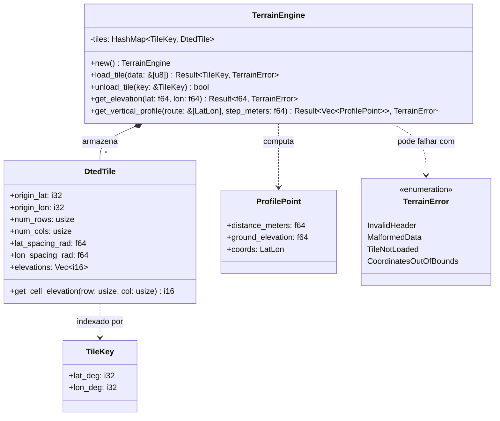

# Arquitetura do Componente: Terrain Engine (`core::terrain`)

Este documento descreve a especificação de arquitetura, o design das estruturas de dados e os algoritmos espaciais do **Terrain Engine** do Olayer Core. Este componente fornece o suporte a dados de elevação digital de relevo (DTED) para consultas de altitude em tempo constante $O(1)$ e cálculo de perfil vertical de rotas.

---

## 1. Responsabilidades

O **Terrain Engine** é projetado para processar dados altimétricos passivamente no Rust Core, com as seguintes responsabilidades:
1. **Parser Binário de Arquivos DTED:** Interpretar buffers binários de arquivos no padrão militar DTED (Níveis 0, 1 e 2) sem requisições diretas de I/O em disco (compatível com WASM).
2. **Indexador Espacial em Memória (Grid Index):** Armazenar e organizar múltiplos tiles de elevação ativos indexados por suas coordenadas geográficas de origem (graus inteiros de latitude/longitude).
3. **Interpolação Bilinear em Tempo Constante $O(1)$:** Estimar a altitude exata de qualquer coordenada LLA com base nas quatro células do grid mais próximas, suavizando a transição entre pontos de amostragem do relevo.
4. **Geração de Perfil Vertical (Visão 2.5D):** Calcular um vetor de distâncias acumuladas e altitudes interpoladas do solo ao longo de uma sequência de pontos de rota (percurso de voo).
5. **MSAW (Minimum Safe Altitude Warning):** Prover a base matemática ultra-rápida para que as SDKs validem se a altitude atual ou projetada da aeronave infringe a margem de segurança do solo.

---

## 2. Detalhamento Técnico do Formato DTED

Os arquivos DTED dividem o globo em blocos de $1^\circ \times 1^\circ$ de arco geográfico. A estrutura física de um arquivo DTED é composta por blocos sequenciais estruturados em Big-Endian:

### 2.1 Cabeçalhos (Headers)
* **UHL (User Header Label):** Primeiros 80 bytes. Contém a longitude e latitude do canto sudoeste (origem do bloco) e o espaçamento angular horizontal/vertical do grid.
* **DSI (Data Set Identification):** Próximos 648 bytes. Contém metadados adicionais de precisão, níveis de segurança do dado e nível do DTED.
* **ACC (Accuracy Description):** Próximos 2700 bytes. Contém descrições de acurácia.

### 2.2 Blocos de Registros de Dados (Data Records)
Após os cabeçalhos, o arquivo é composto por colunas de dados ordenadas de Oeste para Leste. Cada coluna representa uma longitude fixa e contém valores de altitude ordenados do Sul para o Norte:
* **Byte de Sentinela (Block ID):** `0xAA` (1 byte).
* **Contador de Sequência de Longitude:** 3 bytes.
* **Contador de Sequência de Latitude:** 3 bytes.
* **Dados de Elevação:** Sequência de inteiros com sinal de 16 bits (`i16` em Big-Endian).
  * **Level 0:** 121 valores por coluna (espaçamento de 30 arc-sec ~ 900m).
  * **Level 1:** 1201 valores por coluna (espaçamento de 3 arc-sec ~ 90m).
  * **Level 2:** 3601 valores por coluna (espaçamento de 1 arc-sec ~ 30m).
* **Checksum:** 4 bytes no final de cada coluna.

*Nota: O valor `-32767` (ou inferior) é tratado como sentinela para dados nulos ou ausentes (oceano profundo ou falha de leitura).*

---

## 3. Diagrama de Estruturas e Relacionamento



---

## 4. Algoritmo de Interpolação Bilinear

Para qualquer coordenada geográfica arbitrária $(\phi, \lambda)$ que resida dentro dos limites de um tile carregado, a altitude exata é estimada interpolando linearmente nos dois eixos com base nas quatro células vizinhas mais próximas.

```text
       col_i      col_i+1
row_j+1  P11 ------ P12
          |          |
          |    P     |  <- P = (lat, lon)
          |          |
row_j    P01 ------ P02
```

### Passos Matemáticos:
1. Determinar o tile correspondente convertendo a latitude e longitude em inteiros (`floor`).
2. Calcular os índices fracionários da célula do grid correspondente:
   $$col_f = \frac{\lambda - \lambda_{origem}}{\Delta\lambda_{spacing}}$$
   $$row_f = \frac{\phi - \phi_{origem}}{\Delta\phi_{spacing}}$$
3. Obter os limites inteiros inferiores e superiores:
   $$col_0 = \lfloor col_f \rfloor, \quad col_1 = col_0 + 1$$
   $$row_0 = \lfloor row_f \rfloor, \quad row_1 = row_0 + 1$$
4. Computar os fatores de peso local entre 0.0 e 1.0:
   $$tx = col_f - col_0$$
   $$ty = row_f - row_0$$
5. Buscar os quatro valores de elevação correspondentes:
   $$z_{00} = E(row_0, col_0), \quad z_{01} = E(row_0, col_1)$$
   $$z_{10} = E(row_1, col_0), \quad z_{11} = E(row_1, col_1)$$
6. Aplicar a fórmula de interpolação bilinear:
   $$z_{left} = z_{00} \cdot (1 - ty) + z_{10} \cdot ty$$
   $$z_{right} = z_{01} \cdot (1 - ty) + z_{11} \cdot ty$$
   $$z_{final} = z_{left} \cdot (1 - tx) + z_{right} \cdot tx$$

Se algum dos quatro pontos vizinhos contiver a sentinela de dados nulos (`-32767`), o ponto correspondente é ignorado ou tratado como altitude 0.0.

---

## 5. Algoritmo de Perfil Vertical (Corte 2.5D)

Para gerar o perfil de corte vertical do relevo ao longo de uma aerovia/rota:

1. **Amostragem Geodésica:** Para cada segmento de reta da rota (de um fixo ao outro), calcula-se a distância geodésica acumulada utilizando a `Geodesy Engine` (Vincenty ou Haversine).
2. **Divisão em Passos (Step Size):** O percurso é discretizado em passos métricos uniformes (ex: a cada $500\text{m}$).
3. **Interpolação de Posições:** Para cada passo do trajeto, computa-se a coordenada intermediária $(\phi_i, \lambda_i)$ utilizando a projeção direta geodésica.
4. **Consulta altimétrica:** Executa-se a consulta `get_elevation` para cada uma das coordenadas geradas.
5. **Retorno estruturado:** O resultado é uma lista sequencial de estruturas `ProfilePoint` contendo a distância total a partir da origem, a elevação do solo e as coordenadas do ponto.
