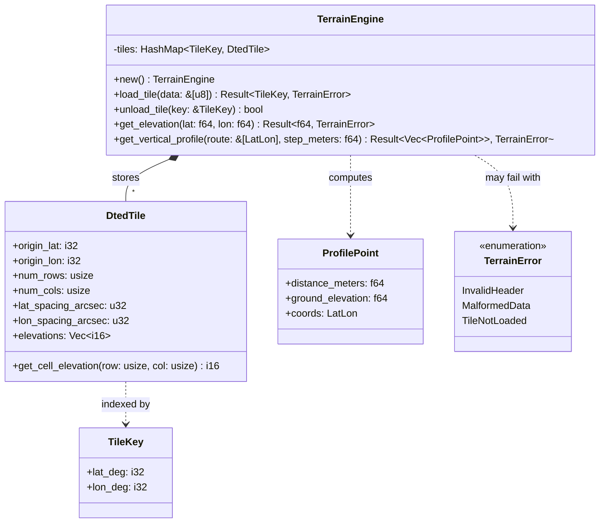

# Component Architecture: Terrain Engine (`core::terrain`)

This document describes the architecture specification, data structure design, and spatial algorithms of the **Terrain Engine** of the Olayer Core. This component provides support for Digital Terrain Elevation Data (DTED) for altitude queries in constant time $O(1)$ and route vertical profile calculation.

---

## 1. Responsibilities

The **Terrain Engine** is designed to process altimetric data passively in the Rust Core, with the following responsibilities:
1. **Binary File Parser of DTED Files:** Interpret binary buffers of files in the military DTED standard (Levels 0, 1, and 2) without direct disk I/O requests (compatible with WASM).
2. **In-Memory Spatial Indexer (Grid Index):** Store and organize multiple active elevation tiles indexed by their geographic origin coordinates (integer degrees of latitude/longitude).
3. **Bilinear Interpolation in Constant Time $O(1)$:** Estimate the exact altitude of any LLA coordinate based on the four nearest grid cells, smoothing the transition between relief sampling points.
4. **Vertical Profile Generation (2.5D View):** Calculate a vector of accumulated distances and interpolated ground altitudes along a sequence of route points (flight path).
5. **MSAW (Minimum Safe Altitude Warning):** Provide the ultra-fast mathematical basis for the SDKs to validate whether the current or projected aircraft altitude infringes the ground safety margin.

---

## 2. Technical Detail of the DTED Format

DTED files divide the globe into blocks of $1^\circ \times 1^\circ$ of geographic arc. The physical structure of a DTED file is composed of sequential blocks structured in Big-Endian:

### 2.1 Headers
* **UHL (User Header Label):** First 80 bytes. Contains the longitude and latitude of the southwest corner (block origin) and the horizontal/vertical grid angular spacing.
* **DSI (Data Set Identification):** Next 648 bytes. Contains additional precision metadata, data security levels, and DTED level.
* **ACC (Accuracy Description):** Next 2700 bytes. Contains accuracy descriptions.

### 2.2 Data Record Blocks
After the headers, the file is composed of columns of data ordered from West to East. Each column represents a fixed longitude and contains altitude values ordered from South to North:
* **Sentinel Byte (Block ID):** `0xAA` (1 byte).
* **Longitude Sequence Counter:** 3 bytes.
* **Latitude Sequence Counter:** 3 bytes.
* **Elevation Data:** Sequence of 16-bit signed integers (`i16` in Big-Endian).
  * **Level 0:** 121 values per column (spacing of 30 arc-sec ~ 900m).
  * **Level 1:** 1201 values per column (spacing of 3 arc-sec ~ 90m).
  * **Level 2:** 3601 values per column (spacing of 1 arc-sec ~ 30m).
* **Checksum:** 4 bytes at the end of each column.

*Note: The value `-32767` (or lower) is treated as a sentinel for null or absent data (deep ocean or read failure).*

---

## 3. Structure and Relationship Diagram



---

## 4. Bilinear Interpolation Algorithm

For any arbitrary geographic coordinate $(\phi, \lambda)$ that resides within the bounds of a loaded tile, the exact altitude is estimated by linearly interpolating on both axes based on the four nearest neighboring cells.

```text
       col_i      col_i+1
row_j+1  P11 ------ P12
          |          |
          |    P     |  <- P = (lat, lon)
          |          |
row_j    P01 ------ P02
```

### Mathematical Steps:
1. Determine the corresponding tile by converting latitude and longitude to integers (`floor`).
2. Calculate the fractional cell indices of the corresponding grid:
   $$col_f = \frac{\lambda - \lambda_{origin}}{\Delta\lambda_{spacing}}$$
   $$row_f = \frac{\phi - \phi_{origin}}{\Delta\phi_{spacing}}$$
3. Obtain the lower and upper integer bounds:
   $$col_0 = \lfloor col_f \rfloor, \quad col_1 = col_0 + 1$$
   $$row_0 = \lfloor row_f \rfloor, \quad row_1 = row_0 + 1$$
4. Compute local weight factors between 0.0 and 1.0:
   $$tx = col_f - col_0$$
   $$ty = row_f - row_0$$
5. Fetch the four corresponding elevation values:
   $$z_{00} = E(row_0, col_0), \quad z_{01} = E(row_0, col_1)$$
   $$z_{10} = E(row_1, col_0), \quad z_{11} = E(row_1, col_1)$$
6. Apply the bilinear interpolation formula:
   $$z_{left} = z_{00} \cdot (1 - ty) + z_{10} \cdot ty$$
   $$z_{right} = z_{01} \cdot (1 - ty) + z_{11} \cdot ty$$
   $$z_{final} = z_{left} \cdot (1 - tx) + z_{right} \cdot tx$$

If any of the four neighboring points contains the null data sentinel (`-32767`), the corresponding point is ignored or treated as altitude 0.0.

---

## 5. Vertical Profile Algorithm (2.5D Cut)

To generate the terrain vertical cut profile along an airway/route:

1. **Geodetic Sampling:** For each straight line segment of the route (from one fix to another), the cumulative geodetic distance is calculated using the `Geodesy Engine` (Vincenty or Haversine).
2. **Step Division (Step Size):** The path is discretized into uniform metric steps (e.g., every $500\text{m}$).
3. **Position Interpolation:** For each step of the path, the intermediate coordinate $(\phi_i, \lambda_i)$ is computed using the direct geodetic projection.
4. **Altimeter Query:** The `get_elevation` query is executed for each of the generated coordinates.
5. **Structured Return:** The result is a sequential list of `ProfilePoint` structures containing the total distance from the origin, the ground elevation, and the point's coordinates.
