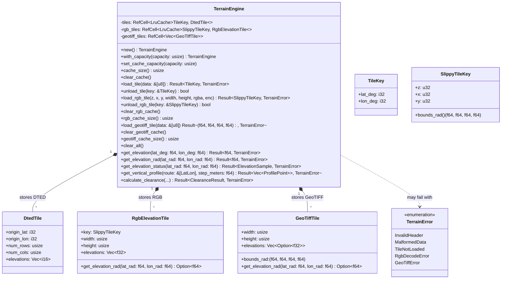

# Component Architecture: Terrain Engine (`core::terrain`)

This document describes the architecture specification, data structure design, and spatial algorithms of the **Terrain Engine** of the Olayer Core. This component provides multi-source elevation ingestion for Digital Terrain Elevation Data (DTED), Mapbox/Terrarium RGB Slippy Tiles, and Cloud-Optimized GeoTIFFs (COG) for altitude queries in constant time $O(1)$, MSAW safety clearance, and route vertical profile calculation.

---

## 1. Responsibilities

The **Terrain Engine** processes altimetric data passively in the Rust Core, with the following responsibilities:
1. **Multi-Source Elevation Ingestion:**
   - **Military DTED Parser:** Interpret binary buffers of DTED files (Levels 0, 1, and 2) without direct disk I/O requests (compatible with WASM).
   - **Civil RGB Tile Decoder:** High-speed vectorized decoders for **Mapbox Terrain-RGB** ($0.1\text{m}$ precision) and **Mapzen/Nextzen Terrarium** ($1.0\text{m}$ precision), with spherical Mercator $(Z, X, Y)$ spatial indexing.
   - **Pure-Rust GeoTIFF / COG Parser:** Decode Float32, Float64, and Int16 raster grids, extracting tiepoints (`ModelTiepointTag`), pixel scales (`ModelPixelScaleTag`), and NoData sentinels (`GDAL_NODATA`).
2. **Multi-Source In-Memory Spatial Indexing:** Store active DTED tiles, Slippy RGB tiles, and GeoTIFF elevation grids in LRU caches with automatic memory reclamation.
3. **Multi-Source Tiered Fallback:** Transparently query elevations in priority order:
   $$\text{DTED} \longrightarrow \text{Web Mercator RGB Tile} \longrightarrow \text{GeoTIFF Raster}$$
4. **Bilinear Interpolation in Constant Time $O(1)$:** Estimate exact altitude at any geographic coordinate based on neighboring raster cells.
5. **Vertical Profile Generation (2.5D View):** Calculate cumulative distance, ground elevation, and coordinate path along flight routes.
6. **MSAW (Minimum Safe Altitude Warning):** Provide ultra-fast mathematical ground safety evaluation against aircraft altitude.

---

## 2. Elevation Data Formats

### 2.1 Military DTED (Levels 0, 1, 2)
DTED files divide the globe into blocks of $1^\circ \times 1^\circ$ of geographic arc. The physical structure is composed of sequential blocks in Big-Endian:
* **UHL (User Header Label):** 80 bytes with southwest corner origin and angular spacing.
* **DSI (Data Set Identification):** 648 bytes with security and DTED level metadata.
* **ACC (Accuracy Description):** 2700 bytes with horizontal/vertical accuracy descriptions.
* **Data Records:** Column-ordered elevation strips (`i16` Big-Endian) with sentinel `-32767` for null/ocean data.

### 2.2 Civil Mapbox RGB & Terrarium Tiles
Web Mercator Slippy tiles $(Z, X, Y)$ containing encoded 24-bit elevation values:
* **Mapbox Terrain-RGB:**
  $$h = -10000.0 + (R \cdot 6553.6 + G \cdot 25.6 + B \cdot 0.1)$$
* **Mapzen / Nextzen Terrarium:**
  $$h = (R \cdot 256.0 + G + B / 256.0) - 32768.0$$

### 2.3 Cloud-Optimized GeoTIFF (COG)
Standard TIFF 6.0 Image File Directories (IFD) with Geographic Tag extensions:
* **Tag 33550 (`ModelPixelScaleTag`):** $(\Delta x, \Delta y, \Delta z)$ angular/metric scale per pixel.
* **Tag 33922 (`ModelTiepointTag`):** Raster pixel $(I, J, K)$ to geographic $(\text{lon}_0, \text{lat}_0, z_0)$ anchor.
* **Tag 42113 (`GDAL_NODATA`):** ASCII string representation of nodata sentinel value.

---

## 3. Structure and Relationship Diagram

```mermaid
classDiagram
    direction TB

    class TerrainEngine {
        -tiles: RefCell~LruCache~TileKey, DtedTile~~
        -rgb_tiles: RefCell~LruCache~SlippyTileKey, RgbElevationTile~~
        -geotiff_tiles: RefCell~Vec~GeoTiffTile~~
        +new() TerrainEngine
        +with_capacity(capacity: usize) TerrainEngine
        +set_cache_capacity(capacity: usize)
        +cache_size() usize
        +clear_cache()
        +load_tile(data: &[u8]) Result~TileKey, TerrainError~
        +unload_tile(key: &TileKey) bool
        +load_rgb_tile(z, x, y, width, height, rgba, enc) Result~SlippyTileKey, TerrainError~
        +unload_rgb_tile(key: &SlippyTileKey) bool
        +clear_rgb_cache()
        +rgb_cache_size() usize
        +load_geotiff_tile(data: &[u8]) Result~(f64, f64, f64, f64), TerrainError~
        +clear_geotiff_cache()
        +geotiff_cache_size() usize
        +clear_all()
        +get_elevation(lat_deg: f64, lon_deg: f64) Result~f64, TerrainError~
        +get_elevation_rad(lat_rad: f64, lon_rad: f64) Result~f64, TerrainError~
        +get_elevation_status(lat_rad: f64, lon_rad: f64) Result~ElevationSample, TerrainError~
        +get_vertical_profile(route: &[LatLon], step_meters: f64) Result~Vec~ProfilePoint~~, TerrainError~
        +calculate_clearance(...) Result~ClearanceResult, TerrainError~
    }

    class TileKey {
        +lat_deg: i32
        +lon_deg: i32
    }

    class SlippyTileKey {
        +z: u32
        +x: u32
        +y: u32
        +bounds_rad() (f64, f64, f64, f64)
    }

    class DtedTile {
        +origin_lat: i32
        +origin_lon: i32
        +num_rows: usize
        +num_cols: usize
        +elevations: Vec~i16~
    }

    class RgbElevationTile {
        +key: SlippyTileKey
        +width: usize
        +height: usize
        +elevations: Vec~f32~
        +get_elevation_rad(lat_rad: f64, lon_rad: f64) Option~f64~
    }

    class GeoTiffTile {
        +width: usize
        +height: usize
        +bounds_rad: (f64, f64, f64, f64)
        +elevations: Vec~Option~f32~~
        +get_elevation_rad(lat_rad: f64, lon_rad: f64) Option~f64~
    }

    class TerrainError {
        <<enumeration>>
        InvalidHeader
        MalformedData
        TileNotLoaded
        RgbDecodeError
        GeoTiffError
    }

    TerrainEngine "1" *-- "*" DtedTile : stores DTED
    TerrainEngine "1" *-- "*" RgbElevationTile : stores RGB
    TerrainEngine "1" *-- "*" GeoTiffTile : stores GeoTIFF
    TerrainEngine ..> TerrainError : may fail with
```

---

## 4. Multi-Source Bilinear Interpolation & Sampling

For any geographic coordinate $(\phi, \lambda)$, `TerrainEngine` evaluates terrain in tiered hierarchy:
1. **DTED Check:** If coordinate falls in a loaded DTED $1^\circ \times 1^\circ$ tile, bilinear interpolation is computed across the DTED arc-second grid.
2. **RGB Slippy Tile Check:** If not in DTED, checks loaded Web Mercator RGB tiles (selecting highest zoom $Z$). Latitude is mapped to Mercator isometric coordinate $q = \ln(\tan(\pi/4 + \phi/2))$ and interpolated across pixel $(u, v)$.
3. **GeoTIFF Raster Check:** If not in RGB tiles, checks loaded GeoTIFF bounding boxes and interpolates across $(col, row)$ indices with NoData handling.

---

## 5. Vertical Profile Algorithm (2.5D Cut)

1. **Geodetic Sampling:** For each straight segment of the route, cumulative geodetic distance is calculated using Vincenty / Haversine geodesics.
2. **Step Division:** Path is discretized into uniform metric steps (e.g. $500\text{m}$).
3. **Position Interpolation:** Intermediate coordinates $(\phi_i, \lambda_i)$ are computed via direct geodetic projection.
4. **Altimetric Sampling:** The multi-source `get_elevation` engine query resolves ground altitude for each sample point.
5. **Structured Return:** Returns sequential `ProfilePoint` list containing distance, elevation, and 3D coordinate.
