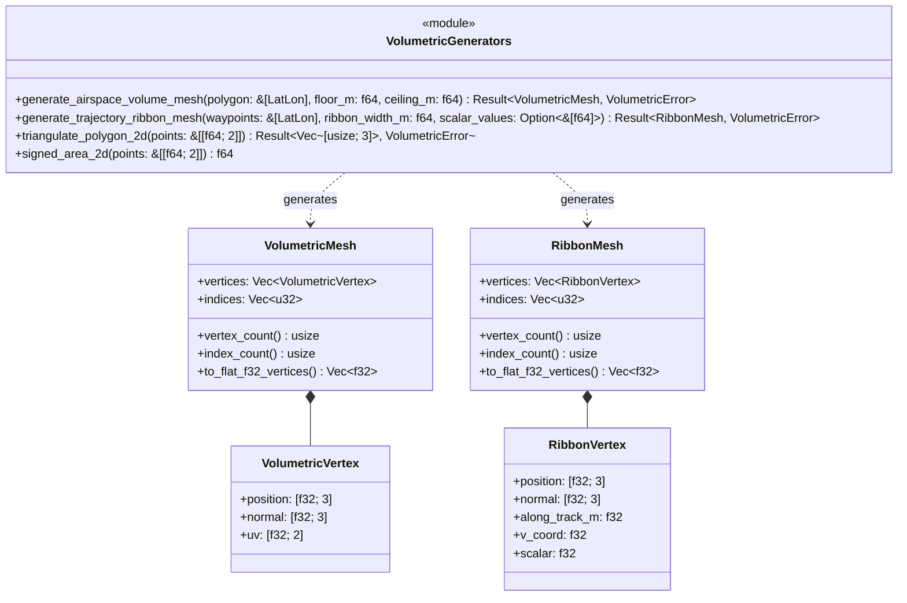

# Component Architecture: 3D Volumetric Mesh Engine (`core::volumetric`)

This document describes the architectural specification, geometric algorithms, and GPU mesh generation models of the **3D Volumetric Mesh Engine** of the Olayer Core (`core::volumetric`). This component provides pure-Rust procedural mesh synthesis for 3D extruded airspace polyhedrons (FIR, TMA, CTR, Special Use Airspaces) and continuous 3D flight trajectory ribbons with altitude/scalar gradient mapping.

---

## 1. Responsibilities

The **3D Volumetric Mesh Engine** is a mathematical and procedural geometry generation module with the following assignments:

1. **2D Polygon Triangulation (`core::volumetric::triangulation`):**
   - Implement robust **Ear Clipping Triangulation** with signed area orientation detection (Counter-Clockwise vs Clockwise) and collinear vertex handling.
2. **3D Airspace Polyhedron Extrusion (`core::volumetric::airspace_mesh`):**
   - Extrude 2D geodetic boundaries $[\phi_i, \lambda_i]$ between floor altitude $h_{\text{floor}}$ and ceiling altitude $h_{\text{ceiling}}$ into closed 3D polyhedrons in Geocentric Cartesian (ECEF) coordinates.
   - Synthesize smooth quad side-walls with outward-pointing surface normals for lighting and Fresnel rim shaders.
   - Triangulate bottom and top polygonal caps using local tangent plane planar projection and outward vertical normals.
3. **3D Flight Trajectory Ribbon Extrusion (`core::volumetric::ribbon_mesh`):**
   - Extrude a continuous 3D ribbon along a series of geodetic flight waypoints $[\phi_i, \lambda_i, h_i]$.
   - Compute segment tangent vectors, lateral bisectors (mitered joins), and along-track cumulative distance.
   - Synthesize vertex attributes with normalized $U/V$ texture coordinates and scalar values (altitude, ground speed, or energy level) for dynamic fragment color ramps.

---

## 2. Mathematical Foundations & Coordinate Frames

### 2.1 ECEF Procedural Mesh Synthesis

To avoid cartographic distortion and seam tearing across the globe, all volumetric mesh vertices are generated directly in Geocentric Cartesian coordinates (ECEF):

$$\begin{aligned}
X &= (N(\phi) + h) \cos\phi \cos\lambda \\
Y &= (N(\phi) + h) \cos\phi \sin\lambda \\
Z &= (N(\phi)(1 - e^2) + h) \sin\phi
\end{aligned}$$

where $N(\phi) = \frac{a}{\sqrt{1 - e^2 \sin^2\phi}}$.

### 2.2 Ear Clipping Triangulation

For a simple polygon with $N$ vertices:
1. Compute 2D signed area:
   $$A = \frac{1}{2} \sum_{i=0}^{N-1} (x_i y_{i+1} - x_{i+1} y_i)$$
   $A > 0 \implies \text{CCW}$, $A < 0 \implies \text{CW}$.
2. A vertex $V_i$ with neighbors $V_{i-1}$ and $V_{i+1}$ is an **ear** if:
   - The interior angle at $V_i$ is strictly convex ($< 180^\circ$).
   - No other remaining polygon vertex lies strictly inside triangle $(V_{i-1}, V_i, V_{i+1})$.
3. Iteratively clip ears until only 3 vertices remain, yielding $N - 2$ triangles in $O(N^2)$ time.

### 2.3 Trajectory Ribbon Mitered Extrusion

At waypoint $P_i$ between segments $S_{i-1} = P_i - P_{i-1}$ and $S_i = P_{i+1} - P_i$:
* Unit segment tangents: $\hat{T}_{i-1} = \frac{S_{i-1}}{\|S_{i-1}\|}$, $\hat{T}_i = \frac{S_i}{\|S_i\|}$
* Upward normal from ellipsoid center: $\hat{U}_i = \frac{P_i}{\|P_i\|}$
* Segment lateral normals: $\hat{R}_{i-1} = \hat{T}_{i-1} \times \hat{U}_i$, $\hat{R}_i = \hat{T}_i \times \hat{U}_i$
* Bisector lateral vector: $\hat{B}_i = \frac{\hat{R}_{i-1} + \hat{R}_i}{\|\hat{R}_{i-1} + \hat{R}_i\|}$
* Left / Right vertices: $V_{\text{left}} = P_i - \frac{W}{2} \hat{B}_i$, $V_{\text{right}} = P_i + \frac{W}{2} \hat{B}_i$.

---

## 3. Structure and Relationship Diagram



---

## 4. Key Algorithms & Execution Flows

### 4.1 Airspace Polyhedron Mesh Generation

```mermaid
flowchart TD
    A[Input Polygon LatLon, floor_m, ceiling_m] --> B[Convert to Bottom and Top ECEF Rings]
    B --> C[Generate Vertical Sidewall Quads]
    C --> D[Compute Outward Face Normals for Sidewalls]
    D --> E[Project 2D Polygon to Planar Frame]
    E --> F[Run Ear Clipping Triangulation]
    F --> G[Generate Bottom Cap Triangles (Inverted Normals)]
    F --> H[Generate Top Cap Triangles (Upward Normals)]
    G --> I[Merge Vertices and Indices into VolumetricMesh]
    H --> I
    I --> J[Return VolumetricMesh]
```

---

## 5. Error Handling and Invariants

* **Error Enum (`VolumetricError`):**
  - `InsufficientPoints(String)`: Airspace polygon has $< 3$ points or ribbon has $< 2$ waypoints.
  - `InvalidAltitudeRange(String)`: Floor altitude $\ge$ ceiling altitude.
  - `TriangulationFailed(String)`: Self-intersecting or degenerate polygon.
  - `MismatchedScalarCount(String)`: Scalar values count does not match waypoint count.
* **Invariants:**
  - Mesh indices are always 0-indexed `u32` compatible with WebGL/WGPU `IndexFormat::Uint32`.
  - Vertex buffers use interleaved `[f32; 8]` (`[x, y, z, nx, ny, nz, u, v]`) for airspaces and `[f32; 9]` (`[x, y, z, nx, ny, nz, along_track, v, scalar]`) for ribbons.

---

## 6. Interoperability & Boundary Contracts

* **WebAssembly (`olayer-wasm`):**
  - `generate_airspace_volume_mesh(polygon_flat_deg, floor_m, ceiling_m) -> Result<WasmVolumetricMesh, JsValue>`
  - `generate_trajectory_ribbon_mesh(waypoints_flat_deg, ribbon_width_m, scalars) -> Result<WasmRibbonMesh, JsValue>`
* **C-FFI (`olayer-native`):**
  - `olayer_volumetric_generate_airspace_mesh`
  - `olayer_volumetric_generate_trajectory_ribbon`
* **WGPU Desktop Native Pipeline (`olayer-native`):**
  - `WgpuVolumetricPipeline`: Hardware-accelerated Fresnel rim glow and gradient color ramps.
* **TypeScript SDK (`olayer-sdk`):**
  - `VolumetricAirspaceLayer` and `TrajectoryRibbonLayer`.
