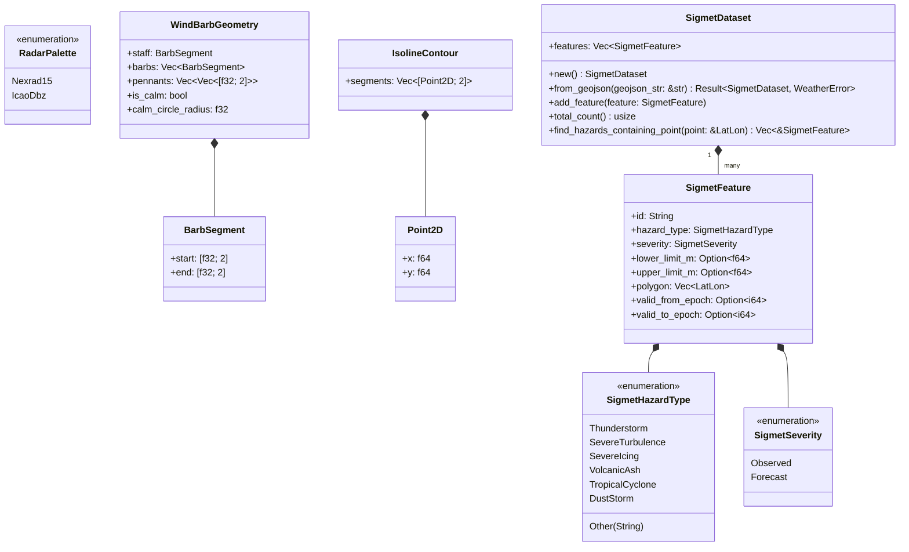

# Component Architecture: Meteorological Overlays Engine (`core::weather`)

This document describes the architectural specification, mathematical algorithms, and visualization models of the **Meteorological Overlays Engine** of the Olayer Core (`core::weather`). This component provides native processing for radar reflectivity colorization, WMO/ICAO wind barb vector generation, Marching Squares isoline contouring, and SIGMET/AIRMET hazard polygon containment.

---

## 1. Responsibilities

The **Meteorological Overlays Engine** is a pure mathematical and algorithmic module designed to process weather data in real time:

1. **Radar Reflectivity Colorization (`GIS-PROP-006`):**
   - Colorize weather radar grids (WSR-88D NEXRAD Level II/III, GRIB2, NetCDF) from raw decibels of reflectivity ($\text{dBZ}$) into 32-bit RGBA pixel buffers.
   - Support standard **NOAA NEXRAD 15-level** and **ICAO Severe Convective** color lookup tables with alpha blending for low-reflectivity precipitation thresholds.
2. **Standard Aviation Wind Barbs (WMO Publication No. 306 / ICAO Annex 3):**
   - Synthesize 2D vector geometry for meteorological wind stations given wind speed in knots and wind direction in radians.
   - Decompose wind intensity into pennants ($50\text{ kt}$ triangles), long barbs ($10\text{ kt}$ lines), and short barbs ($5\text{ kt}$ lines).
   - Support calm wind rings ($< 2.5\text{ kt}$) and automatic barb orientation mirroring for the Southern Hemisphere (pointing counter-clockwise).
3. **Marching Squares Isoline Generator:**
   - Extract continuous contour line segments from scalar fields (e.g. temperature, barometric pressure, turbulence index, or radar reflectivity).
   - Resolve cell topologies using a 16-case lookup table with linear edge interpolation along cell boundaries for smooth curves.
4. **Aviation Severe Weather Advisories (SIGMET / AIRMET / Convective SIGMET):**
   - Ingest polygon hazard areas from GeoJSON and IWXXM XML (Thunderstorm, Severe Turbulence, Severe Icing, Volcanic Ash, Tropical Cyclone).
   - Provide 3D containment spatial queries (`find_hazards_containing_point`) taking into account vertical lower/upper limits (FL/AMSL) and geodetic polygons.

---

## 2. Mathematical & Cartographic Formats

### 2.1 Radar Reflectivity ($\text{dBZ}$) Scale

Reflectivity $Z$ is related to radar power return:
$$\text{dBZ} = 10 \log_{10}(Z)$$

| dBZ Range | Precipitation Intensity | NEXRAD Color Palette |
|:---|:---|:---|
| $< 5\text{ dBZ}$ | Below Noise Floor | Fully Transparent (`#00000000`) |
| $5 - 15\text{ dBZ}$ | Very Light Rain / Mist | Light Cyan (`#04E9E7`) |
| $15 - 30\text{ dBZ}$ | Light Rain / Moderate Snow | Emerald Green (`#019000` to `#00E000`) |
| $30 - 45\text{ dBZ}$ | Moderate / Heavy Rain | Yellow to Amber (`#E7C000` to `#E70000`) |
| $45 - 60\text{ dBZ}$ | Intense Thunderstorm / Small Hail | Dark Red to Purple (`#B00000` to `#FF00FF`) |
| $> 65\text{ dBZ}$ | Extreme Hail / Tornado Vortex Signature | Bright White (`#FFFFFF`) |

### 2.2 Wind Barb Decomposition (WMO No. 306)

Wind barbs point into the oncoming wind vector. Speed $v$ is discretized into integer counts:
* $N_{\text{pennant}} = \lfloor v / 50 \rfloor$ (50-knot filled triangular flag)
* Remainder $r_1 = v \pmod{50}$
* $N_{\text{long}} = \lfloor (r_1 + 2.5) / 10 \rfloor$ (10-knot full barb)
* Remainder $r_2 = r_1 - N_{\text{long}} \cdot 10$
* $N_{\text{short}} = \begin{cases} 1 & \text{if } r_2 \ge 2.5 \\ 0 & \text{otherwise} \end{cases}$ (5-knot half barb)

For speeds $v < 2.5\text{ kt}$, a calm concentric circle ($r = 4.0\text{ px}$) is generated without a staff.

---

## 3. Structure and Relationship Diagram



---

## 4. Key Algorithms & Execution Flows

### 4.1 Marching Squares Isoline Algorithm

The scalar field $G(x, y)$ is evaluated over a regular 2D grid:

1. For each grid cell $(i, j)$ with corners $V_0, V_1, V_2, V_3$, compute 4-bit topology index:
   $$\text{index} = (V_0 \ge T) \cdot 1 + (V_1 \ge T) \cdot 2 + (V_2 \ge T) \cdot 4 + (V_3 \ge T) \cdot 8$$
2. For each active edge crossed by contour $T$, compute exact linear interpolation:
   $$t = \frac{T - V_a}{V_b - V_a}, \quad P_{\text{edge}} = P_a + t \cdot (P_b - P_a)$$
3. Connect interpolated edge intersections according to the 16 Marching Squares lookup table.

```mermaid
flowchart TD
    A[Input 2D Grid & Threshold T] --> B[Loop Grid Cells (i, j)]
    B --> C[Compute 4-Bit Topology Index]
    C --> D{Index == 0 or 15?}
    D -- Yes --> E[No Boundary Crossing]
    D -- No --> F[Linear Interpolate Edge Coordinates]
    F --> G[Emit Line Segments to IsolineContour]
    E --> H[Next Cell]
    G --> H
    H --> I{All Cells Processed?}
    I -- No --> B
    I -- Yes --> J[Return Vector of IsolineContour]
```

---

## 5. Error Handling and Invariants

* **Error Enum (`WeatherError`):**
  - `InvalidGridDimensions(String)`: Width/height mismatch with raw buffer length.
  - `InvalidGeoJson(String)`: Malformed GeoJSON hazard format.
  - `UnsupportedPalette(String)`: Unrecognized radar palette identifier.
  - `InvalidThreshold(String)`: Threshold out of range for isoline generation.
* **Invariants:**
  - `colorize_dbz_grid` outputs exact $W \times H \times 4$ bytes (interleaved RGBA).
  - Wind barb angles are strictly parsed in radians internally ($[0, 2\pi]$).

---

## 6. Interoperability & Boundary Contracts

* **WebAssembly (`olayer-wasm`):**
  - `colorize_dbz_grid(grid, width, height, palette_id)`
  - `generate_wind_barb_geometry(x, y, speed_kts, dir_rad, length, southern_hemisphere)`
  - `generate_isolines(grid, width, height, threshold, min_val, max_val)`
  - `WasmSigmetDataset`
* **C-FFI (`olayer-native`):**
  - `olayer_weather_colorize_dbz`
  - `olayer_weather_generate_wind_barb`
  - `olayer_weather_generate_isolines`
  - `olayer_sigmet_parse_geojson` and `olayer_sigmet_find_hazards`
* **TypeScript SDK (`olayer-sdk`):**
  - `WeatherRadarLayer`, `WindBarbsLayer`, `SigmetLayer`.
