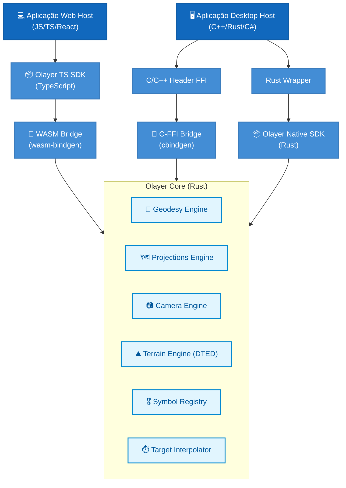

# Guia de Desenvolvimento e Interfaces: Framework GIS Olayer

Este documento serve como o guia definitivo e referência técnica para desenvolvedores utilizarem o **Olayer**, um framework GIS de alto desempenho projetado para sistemas de controle de tráfego aéreo (ATC) e displays táticos. O Olayer é composto por um núcleo comum em Rust (**Olayer Core**), empacotado para navegadores via WebAssembly (**Olayer TS SDK**) e para desktops de alto desempenho nativos com renderização via Vulkan/Metal/DX12 (**Olayer Native SDK**).

---

## 1. Arquitetura Geral do Framework

O Olayer foi arquitetado segundo o princípio de separação de domínios e independência de I/O. O **Olayer Core** funciona de forma passiva, processando cálculos matemáticos e geodésicos puros, enquanto os SDKs gerenciam o ciclo de vida, renderização gráfica e entrada/saída de dados específica de cada ecossistema.



---

## 2. API do Olayer Core (Rust)

A biblioteca principal (**Olayer Core**) é escrita em Rust e está localizada em [`core/src`](../core/src). Suas principais interfaces de programação são:

### 2.1. Geodésia (`core::geodesy`)
Responsável pelas equações elipsoidais baseadas no modelo da Terra **WGS84**.
*   **[LatLon](../core/src/geodesy/coords.rs)**: Representa uma coordenada geodésica 3D elipsoidal:
    ```rust
    pub struct LatLon {
        pub lat: f64,    // Latitude em radianos
        pub lon: f64,    // Longitude em radianos
        pub height: f64, // Altitude acima do elipsoide em metros
    }
    ```
*   **[Ecef](../core/src/geodesy/coords.rs)** / **[Enu](../core/src/geodesy/coords.rs)**: Representações Cartesianas tridimensionais (Geocêntrica e Local Tangente).
*   **Funções de Conversão ([conversions.rs](../core/src/geodesy/conversions.rs))**:
    *   `lla_to_ecef(lla: &LatLon) -> Ecef`
    *   `ecef_to_lla(ecef: &Ecef) -> LatLon`
    *   `lla_to_enu(lla: &LatLon, anchor: &LatLon) -> Enu`
*   **Solvers Geodésicos ([solvers/](../core/src/geodesy/solvers))**:
    *   `VincentySolver::distance(p1: &LatLon, p2: &LatLon) -> Result<f64, GeodesyError>`: Distância ortodrômica de alta precisão.
    *   `HaversineSolver::distance(p1: &LatLon, p2: &LatLon) -> f64`: Distância esférica de execução rápida.

### 2.2. Projeções Cartográficas (`core::projections`)
Implementa projeções para representação bidimensional da Terra em planos de tela.
*   **[Projection](../core/src/projections/mod.rs#L21-L49)** (Trait):
    *   `fn project(&self, lla: &LatLon) -> Result<(f64, f64), ProjectionError>`: Converte LLA em metros planares.
    *   `fn unproject(&self, x: f64, y: f64) -> Result<LatLon, ProjectionError>`: Converte metros planares de volta em LLA.
    *   `fn get_view_proj_matrix(&self, camera: &CameraState) -> Result<[f32; 16], ProjectionError>`: Gera matriz combinada de Visualização-Projeção $4 \times 4$.
*   **Implementações Nativas**:
    *   `LambertConformalConic`: Ideal para rotas continentais de longa distância (En-Route).
    *   `Stereographic`: Projeção azimutal local, ideal para áreas de controle terminal (TMA).
    *   `WebMercator`: Compatibilidade padrão com mapas web do mercado.

### 2.3. Câmera e Visualização (`core::camera`)
Gerencia o observador tridimensional do mapa e sua orientação.
*   **[CameraState](../core/src/camera/mod.rs#L14)**:
    ```rust
    pub struct CameraState {
        pub center: LatLon,             // Ponto geodésico focal
        pub zoom: f64,                  // Nível de escala linear
        pub rotation: f64,              // Rotação horizontal (Azimute/Yaw) em radianos
        pub pitch: f64,                 // Inclinação vertical (Tilt/Pitch) em radianos
        pub roll: f64,                  // Rotação lateral (Roll) em radianos
        pub aspect_ratio: f64,          // Proporção de tela (largura / altura)
        pub viewport_base_meters: f64,  // Extensão base de visualização do mapa em metros
    }
    ```
*   **Geração de Matrizes**:
    *   `get_2d_view_proj_matrix(&self, projection: &dyn Projection) -> Result<[f32; 16], CameraError>`
    *   `get_25d_view_proj_matrix(&self, projection: &dyn Projection) -> Result<[f32; 16], CameraError>`
    *   `get_3d_view_proj_matrix(&self) -> Result<[f32; 16], CameraError>` (Globo orbital 3D)

### 2.4. Motor de Terreno (`core::terrain`)
Indexador espacial de dados de altimetria em formato **DTED** (Níveis 0, 1 ou 2).
*   **[TerrainEngine](../core/src/terrain/mod.rs)**:
    *   `pub fn new() -> Self`: Cria instância com cache vazio.
    *   `pub fn load_tile(&mut self, data: &[u8]) -> Result<TileKey, TerrainError>`: Indexa em memória e em tempo constante $O(1)$ os dados de um arquivo DTED binário bruto.
    *   `pub fn get_elevation(&self, lat_deg: f64, lon_deg: f64) -> Result<f64, TerrainError>`: Retorna a altitude exata usando interpolação bilinear a partir das quatro células de grade mais próximas.
    *   `pub fn get_vertical_profile(&self, route: &[LatLon], step_meters: f64) -> Result<Vec<ProfilePoint>, TerrainError>`: Gera o perfil de corte vertical do terreno ao longo de uma rota proposta.

### 2.5. Registro de Simbologia Tática (`core::symbol_registry`)
Decodificador extensível de códigos de símbolos para primitivas geométricas vetoriais.
*   **[SymbolRegistry](../core/src/symbol_registry/registry.rs)**:
    *   `pub fn register_provider(&mut self, provider: Box<dyn SymbologyProvider>)`: Adiciona um resolvedor de símbolos à cadeia de responsabilidade.
    *   `pub fn resolve_symbol(&self, code: &str, style: &StyleRegistry) -> Result<ResolvedSymbol, SymbologyError>`: Mapeia o código em um conjunto de círculos, caminhos SVG e textos de maneira unificada.
*   **Provedores Nativos Inclusos**:
    *   `NatoProvider` ([nato.rs](../core/src/symbol_registry/providers/nato.rs)): Decodifica códigos SIDC do padrão militar NATO APP-6 / MIL-STD-2525.
    *   `IcaoProvider` ([icao.rs](../core/src/symbol_registry/providers/icao.rs)): Decodifica auxílios de navegação civil segundo o ICAO Annex 4.
    *   `DeclarativeProvider` ([declarative.rs](../core/src/symbol_registry/providers/declarative.rs)): Permite carregar bibliotecas de símbolos customizadas escritas em formato JSON no runtime.

### 2.6. Interpolador Tático (`core::interpolator`)
Preditor de movimento dinâmico e rastreamento de alvos (*Dead Reckoning*).
*   **[InterpolationEngine](../core/src/interpolator/mod.rs)**:
    *   `pub fn update_target(&mut self, state: TargetState) -> Result<(), InterpolatorError>`: Insere ou atualiza o último vetor de telemetria recebido de um sensor de radar para um determinado alvo.
    *   `pub fn interpolate_all(&self, current_time: f64) -> Result<Vec<InterpolatedTarget>, InterpolatorError>`: Calcula e suaviza a posição geodésica 3D e rumo (*heading*) de todos os alvos ativos no tempo especificado (gerando movimentação sem engasgos até 60 FPS).

---

## 3. Interfaces do Olayer TS SDK (Web)

O SDK de TypeScript encontra-se em [`sdk/ts`](../sdk/ts) e é compilado para rodar em qualquer navegador moderno com suporte a **WebGL2**.

### 3.1. Classe Principal: `OlayerController`
Controlador unificado que faz a gerência de contextos canvas, laço de renderização, interações de drag/zoom do usuário e throttling automático de frames (alterna entre 60 FPS ativo e 15 FPS ocioso para economia de bateria do host).

*   **Propriedades Públicas Importantes**:
    *   `layerManager: LayerManager`: Gerenciador da pilha de desenho.
    *   `dataManager: MapDataStack`: Cache local e gerenciador de fontes de dados.
    *   `symbolRegistry: WasmSymbolRegistry`: Interface com o resolvedor do core de símbolos.
    *   `atlasManager: TextureAtlasManager`: Empacotador automático de símbolos na GPU.
*   **Principais Métodos**:
    *   `startLoop() / stopLoop()`: Controla a execução do motor gráfico.
    *   `setViewMode(value: "2D" | "2.5D" | "3D")`: Altera o modo tridimensional de exibição.
    *   `setCenter(latRad: number, lonRad: number)` / `setZoom(zoom: number)`: Ajusta coordenadas geográficas de foco.
    *   `destroy()`: Realiza limpeza total da memória RAM e buffers de GPU associados ao WASM e WebGL.

### 3.2. Gerenciador de Camadas: `Layer` e `LayerManager`
Define a ordenação e fluxo de repintura lógica:
*   **`Layer`** (Classe Abstrata):
    *   `abstract renderStatic(gl: WebGL2RenderingContext, viewProjMatrix: Float32Array): void`: Chamado quando a câmera muda (redesenha malhas geográficas densas como malhas de terreno e mapas de imagem de fundo).
    *   `abstract renderDynamic(ctx: CanvasRenderingContext2D, currentTime: number): void`: Executado a cada frame para desenhar overlays de tempo real (texto de etiquetas, alvos de radar, sweeps de varredura).
*   **`LayerManager`**:
    *   `addLayer(layer: Layer)`: Adiciona camada ao topo da pilha.
    *   `reorderLayer(id: string, newIndex: number)`: Reordena a profundidade de desenho.

### 3.3. Provedores de Dados (`MapDataStack` e Fontes)
*   **`MapDataStack`**: Agrupa caches de dados ativos de terreno, mapas raster e feições vetoriais.
*   **Fontes Concretas de Dados**:
    *   `RasterTileSource`: Carrega dinamicamente tiles de imagens (OSM/WMTS) em cache e as sobe como texturas da GPU.
    *   `VectorTileSource`: Lê arquivos de feições vetoriais (fronteiras de FIR, espaços aéreos regulados).
    *   `TerrainTileSource`: Faz o download sob demanda de buffers de elevação terrestres e os injeta diretamente no `WasmTerrainEngine`.

---

## 4. Interfaces do Olayer Native SDK (Desktop)

O SDK nativo de Desktop reside em [`sdk/native`](../sdk/native) e expõe tanto uma API nativa robusta em Rust, quanto uma interface estável em C puro (FFI) para integração em sistemas legados C/C++, C# ou Java.

### 4.1. Componentes Rust Nativos
*   **`NativeController`** ([native_controller](../sdk/native/src/native_controller/mod.rs)):
    Equivalente ao controlador TS SDK para Desktop. Encapsula o `TerrainEngine` e `InterpolationEngine` e implementa o controle dinâmico de taxa de quadros (*FPS Throttler*).
*   **`NativeLayerManager`** ([native_layer_manager](../sdk/native/src/native_layer_manager/mod.rs)):
    Controla a renderização ordenada em planos de fundo, linhas geodésicas, alvos de radar e HUDs via GPU.
*   **`WgpuGpuPipeline`** ([wgpu_gpu_pipeline](../sdk/native/src/wgpu_gpu_pipeline/mod.rs)):
    Compila e gerencia shaders baseados em **WGSL** rodando direto em APIs modernas de baixo nível (Vulkan/Metal/DX12).
*   **`WgpuCpuVertexPipeline`** ([wgpu_cpu_vertex_pipeline](../sdk/native/src/wgpu_cpu_vertex_pipeline/mod.rs)):
    Efetua a projeção matemática de latitude/longitude 3D para as coordenadas da janela da aplicação host, mantendo os alvos táticos como painéis fixos orientados à câmera (*Billboards*), impedindo distorções no texto das etiquetas.

### 4.2. Ponte de Interoperabilidade C-FFI (`libolayer_native.h`)
A ponte C-FFI localiza-se em [`sdk/native/src/c_ffi_bridge`](../sdk/native/src/c_ffi_bridge) e expõe as funções documentadas no header **[`libolayer_native.h`](../sdk/native/libolayer_native.h)**:

```c
/* Opaque handles instanciados no Heap de memória do Rust */
typedef struct TerrainEngine TerrainEngine;
typedef struct InterpolationEngine InterpolationEngine;

/* Estrutura de dados compatível com C de ponto de corte vertical */
struct C_ProfilePoint {
  double distance_meters;
  double ground_elevation;
  double lat;
  double lon;
  double height;
};

/* Estrutura de dados de alvo tático interpolado */
struct C_InterpolatedTarget {
  char *id;
  double lat;
  double lon;
  double height;
  double heading_rad;
};

/* Funções de controle do Motor de Terreno (Elevation & DTED) */
TerrainEngine *olayer_terrain_engine_create(void);
int olayer_terrain_engine_load_tile(TerrainEngine *engine, const uint8_t *data, uintptr_t length, int32_t *out_lat_deg, int32_t *out_lon_deg);
int olayer_terrain_engine_get_elevation(TerrainEngine *engine, double lat_deg, double lon_deg, double *out_elevation);
int olayer_terrain_engine_get_vertical_profile(TerrainEngine *engine, const double *route_lat, const double *route_lon, const double *route_height, uintptr_t route_len, double step_meters, struct C_ProfilePoint **out_profile, uintptr_t *out_count);
void olayer_profile_points_free(struct C_ProfilePoint *points, uintptr_t count);
void olayer_terrain_engine_free(TerrainEngine *engine);

/* Funções de controle do Interpolador (Radar target dead-reckoning) */
InterpolationEngine *olayer_interpolator_create(void);
int olayer_interpolator_update(InterpolationEngine *engine, const char *id, double lat, double lon, double height, double speed_mps, double track_heading_rad, double vertical_rate_mps, double time);
int olayer_interpolator_interpolate_all(InterpolationEngine *engine, double current_time, struct C_InterpolatedTarget **out_targets, uintptr_t *out_count);
void olayer_interpolated_targets_free(struct C_InterpolatedTarget *targets, uintptr_t count);
void olayer_interpolator_free(InterpolationEngine *engine);
```

---

## 5. Exemplos Práticos de Integração

### 5.1. Exemplo de Inicialização no Navegador (Web/TypeScript)

Este exemplo demonstra como inicializar o motor, definir a câmera geodésica de visualização e carregar uma camada de mapa OpenStreetMap.

```typescript
import init, { OlayerController, WasmProjection, WasmProjectionType } from "olayer-sdk";

async function startMap() {
  // 1. Inicializa o arquivo WASM
  await init();

  // 2. Seleciona elementos do DOM de renderização
  const glCanvas = document.getElementById("gl-canvas") as HTMLCanvasElement;
  const canvas2D = document.getElementById("canvas-2d") as HTMLCanvasElement;

  // 3. Define a Projeção (ex: Estereográfica centrada na terminal de Brasília)
  const bsblLat = -15.869 * (Math.PI / 180);
  const bsblLon = -47.917 * (Math.PI / 180);
  const projection = WasmProjection.create_stereographic(bsblLat, bsblLon);

  // 4. Cria o controlador
  const controller = new OlayerController({
    glCanvas,
    canvas2D,
    projection,
    initialCenterLatRad: bsblLat,
    initialCenterLonRad: bsblLon,
    initialZoom: 1.5,
    viewportBaseMeters: 250000.0 // 250 Km de raio de visualização
  });

  // Torna acessível globalmente para as camadas internas
  (window as any).olayerController = controller;

  // 5. Configura e adiciona uma camada raster base (OpenStreetMap)
  const rasterSource = new RasterTileSource(
    controller.gl, 
    (x, y, z) => `https://tile.openstreetmap.org/${z}/${x}/${y}.png`
  );
  const baseMapLayer = new TileLayer("osm-base", rasterSource);
  controller.layerManager.addLayer(baseMapLayer);

  // 6. Inicia o laço contínuo de renderização
  controller.startLoop();
}

startMap().catch(console.error);
```

### 5.2. Exemplo de Integração Nativa (Desktop / C++)

Este código em C++ puro demonstra o carregamento e inicialização do framework GIS Olayer via FFI para cálculos de terreno de alta performance.

```cpp
#include <iostream>
#include <vector>
#include <fstream>
#include "libolayer_native.h"

int main() {
    std::cout << "[Host App] Inicializando Olayer Terrain Engine nativo..." << std::endl;

    // 1. Instancia o motor de altimetria na pilha de memória do Rust
    TerrainEngine* engine = olayer_terrain_engine_create();
    if (!engine) {
        std::cerr << "Falha ao criar o motor de terreno Olayer." << std::endl;
        return -1;
    }

    // 2. Carrega arquivo DTED binário (simulação de leitura de disco)
    std::ifstream file("S23W047.DT1", std::ios::binary | std::ios::ate);
    if (file.is_open()) {
        std::streamsize size = file.tellg();
        file.seekg(0, std::ios::beg);

        std::vector<uint8_t> buffer(size);
        if (file.read((char*)buffer.data(), size)) {
            int32_t out_lat, out_lon;
            // Carrega e indexa o tile na grade
            int status = olayer_terrain_engine_load_tile(engine, buffer.data(), buffer.size(), &out_lat, &out_lon);
            if (status >= 0) {
                std::cout << "Tile indexado com sucesso no quadrante: " << out_lat << " Lat, " << out_lon << " Lon" << std::endl;
            }
        }
    }

    // 3. Consulta rápida de altitude (ex: coordenadas próximas a Congonhas / SP)
    double target_lat = -23.626;
    double target_lon = -46.656;
    double out_elevation = 0.0;

    int res = olayer_terrain_engine_get_elevation(engine, target_lat, target_lon, &out_elevation);
    if (res >= 0) {
        std::cout << "Altitude no aeroporto de Congonhas: " << out_elevation << " metros" << std::endl;
    } else {
        std::cout << "Coordenada fora da grade de terreno indexada." << std::endl;
    }

    // 4. Liberação explícita de memória do Heap para evitar memory leaks
    olayer_terrain_engine_free(engine);
    std::cout << "Recursos desalocados com segurança." << std::endl;
    return 0;
}
```
