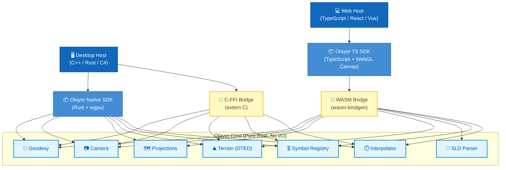

# Developer Guide: Olayer GIS Framework

This is the definitive developer reference for **Olayer**, a high-performance GIS framework for
air traffic control (ATC) systems and tactical displays. Olayer consists of a shared Rust core
(**Olayer Core**), packaged for browsers via WebAssembly (**Olayer TS SDK**) and for desktop
applications via native rendering with Vulkan/Metal/DX12 (**Olayer Native SDK**).

---

## 1. Architecture Overview

Olayer follows strict domain separation and I/O independence. The **Olayer Core** operates
passively — processing pure mathematical and geodetic calculations — while the SDKs manage
the lifecycle, graphics rendering, and data I/O specific to each ecosystem.



The Core has **no filesystem or network I/O**. It only processes memory structures
provided by the host layer — essential for WebAssembly compatibility.

---

## 2. Quick Start

### 2.1 Repository Structure

```
olayer/
├── core/                     # Pure Rust engine (crate: olayer-core)
│   ├── src/geodesy/          #   WGS84 conversions, solvers (Vincenty, Haversine)
│   ├── src/camera/           #   CameraState and 2D/2.5D/3D VP matrices
│   ├── src/projections/      #   Stereographic, LCC, WebMercator
│   ├── src/terrain/          #   DTED parsing and O(1) bilinear interpolation
│   ├── src/sld/              #   OGC SLD XML parser (quick-xml)
│   ├── src/symbol_registry/  #   Pluggable symbology (NATO APP-6, ICAO, Declarative)
│   └── src/interpolator/     #   Dead-reckoning target interpolation
├── sdk/ts/                   # Browser TypeScript SDK (npm: olayer-sdk)
│   ├── src/controller/       #   Animation loop, FPS throttling, camera input
│   ├── src/layers/           #   Layer, LayerManager, TileLayer, VectorTileLayer
│   ├── src/providers/        #   TerrainTileSource, RasterTileSource, VectorTileSource
│   ├── src/renderer/         #   WebGLRenderer (GPU), CPURenderer (Canvas 2D), TextureAtlas
│   └── wasm/                 #   WASM bindings crate (crate: olayer-wasm)
├── sdk/native/               # Desktop Native SDK (crate: olayer-native)
│   ├── src/native_controller/#   Facade with FPS throttler
│   ├── src/native_layer_manager/# Layer stack with Layer trait
│   ├── src/native_map_data_stack/# Generic MapDataSource registry + TerrainDataSource
│   ├── src/wgpu_gpu_pipeline/#    WGSL grid shader + vertex generation
│   ├── src/wgpu_cpu_vertex_pipeline/# CPU LLA→screen projection + SVG raster
│   ├── src/c_ffi_bridge/     #   C ABI exports + cbindgen header
│   └── demo/                 #   Desktop demo (winit + wgpu + egui)
├── tools/symbol-compiler/    # CLI to compile SVG libraries → JSON
└── docs/                     # Architecture, spec, plan, per-module docs
```

### 2.2 Build Order

```
1. cd sdk/ts/wasm && wasm-pack build --target web
2. cd sdk/ts && npm install
3. cargo build --workspace --exclude olayer-desktop-demo
```

The desktop demo (`sdk/native/demo`) requires a GPU and windowing system; exclude
it from headless builds.

### 2.3 Test Commands

```bash
# All Rust tests (headless)
cargo test --workspace --exclude olayer-desktop-demo

# Linter
cargo clippy --workspace --exclude olayer-desktop-demo --all-targets

# TypeScript SDK tests
cd sdk/ts && npm run test:run

# WASM browser tests
cd sdk/ts/wasm && wasm-pack test --headless

# Benchmarks (Core geodesy)
cd core && cargo bench

# Benchmarks (Native grid generation)
cd sdk/native && cargo bench
```

---

## 3. Core API Reference (`olayer-core`)

All Core APIs use **radians** for angles (lat, lon, heading, bearing). Degrees are
accepted only at external boundaries — WASM/FFI bridges, CLI tools, and tests.

### 3.1 Geodesy (`core::geodesy`)

```rust
use olayer_core::geodesy::{LatLon, Ecef, Enu};

// Geodetic coordinate (radians)
let lla = LatLon::new(lat_rad, lon_rad, height_meters);
let lla = LatLon::from_degrees(lat_deg, lon_deg, height_meters);
let (lat_deg, lon_deg, height) = lla.to_degrees();
lla.validate()?;  // checks ranges

// Cartesian coordinates
let ecef = olayer_core::geodesy::lla_to_ecef(&lla, &Ellipsoid::wgs84());
let lla2 = olayer_core::geodesy::ecef_to_lla(&ecef, &Ellipsoid::wgs84());

// Tangent-plane coordinates (East-North-Up relative to anchor)
let enu = olayer_core::geodesy::lla_to_enu(&lla, &anchor, &Ellipsoid::wgs84());

// Geodetic distance / bearing (two solvers available)
use olayer_core::geodesy::solvers::{VincentySolver, HaversineSolver, GeodeticSolver};
let ellipsoid = Ellipsoid::wgs84();
let result = VincentySolver.inverse(&p1, &p2, &ellipsoid)?;
// result.distance, result.initial_bearing, result.final_bearing (radians)

// Direct problem: project from origin by bearing and distance
let dest = VincentySolver.direct(&origin, bearing_rad, distance_m, &ellipsoid)?;
```

| Struct | Fields | Notes |
|--------|--------|-------|
| `LatLon` | `lat: f64, lon: f64, height: f64` | Radians; height in metres above ellipsoid |
| `Ecef` | `x: f64, y: f64, z: f64` | Metres, Earth-centered |
| `Enu` | `east: f64, north: f64, up: f64` | Metres, local tangent plane |
| `GeodeticResult` | `distance, initial_bearing, final_bearing` | Radians for bearings |

**Solver accuracy**: Vincenty ~1 mm (ellipsoidal), Haversine ~1 m (spherical).
Vincenty falls back to Haversine on non-convergence (near-antipodal points).

### 3.2 Projections (`core::projections`)

```rust
use olayer_core::projections::{Projection, Stereographic, LambertConformalConic, WebMercator};

let ellipsoid = Ellipsoid::wgs84();

// Stereographic (ideal for TMA / approach radar)
let proj = Stereographic::new(center_lat_rad, center_lon_rad, ellipsoid);

// Lambert Conformal Conic (ideal for en-route)
let proj = LambertConformalConic::new(
    std_par1_rad, std_par2_rad, origin_lat_rad, origin_lon_rad, ellipsoid
);

// Web Mercator (EPSG:3857)
let proj = WebMercator::new(ellipsoid);  // also impl Default

// Project / unproject
let (x_m, y_m) = proj.project(&lla)?;
let lla = proj.unproject(x_m, y_m)?;

// View-Projection matrix for GPU
let vp: [f32; 16] = proj.get_view_proj_matrix(&camera_state)?;
```

| Projection | Behaviour at Singularities |
|------------|---------------------------|
| Stereographic | Returns `Err(Singularity)` at antipode |
| LCC | Clamps latitude to ±89.9° |
| WebMercator | Clamps latitude to ±85.05° |

### 3.3 Camera (`core::camera`)

```rust
use olayer_core::camera::CameraState;

let camera = CameraState::with_attitude(
    center_lla,       // LatLon focal point
    1.0,              // zoom (linear scale)
    0.0,              // rotation / bearing / yaw (radians)
    35_f64.to_radians(), // pitch / tilt (radians, 0 = nadir)
    0.0,              // roll (radians)
    width / height,   // aspect_ratio
    250_000.0,        // viewport_base_meters
);

// Simplified constructor (pitch = roll = 0)
let camera = CameraState::new(center_lla, zoom, rotation, aspect, viewport_meters);

// Validation
camera.validate()?;  // checks zoom > 0, aspect > 0, viewport > 0

// VP matrices (column-major [f32; 16])
let vp_2d  = camera.get_2d_view_proj_matrix(&projection)?;
let vp_25d = camera.get_25d_view_proj_matrix(&projection)?;
let vp_3d  = camera.get_3d_view_proj_matrix()?;
```

The 3D matrix uses `Ellipsoid::wgs84().a` for Earth radius. 2D and 2.5D
require the active projection; 3D operates directly in ECEF.

### 3.4 Terrain Engine (`core::terrain`)

```rust
use olayer_core::terrain::{TerrainEngine, TileKey, ProfilePoint};

let mut engine = TerrainEngine::new();

// Load a DTED buffer (Level 0/1/2)
let tile_key: TileKey = engine.load_tile(&dted_bytes)?;
//   tile_key.lat_deg: i32, tile_key.lon_deg: i32

// O(1) elevation lookup (bilinear interpolation, degrees)
let elevation: f64 = engine.get_elevation(lat_deg, lon_deg)?;

// Unload a tile
engine.unload_tile(&tile_key);

// Vertical profile along a route
let profile: Vec<ProfilePoint> = engine.get_vertical_profile(&route_points, step_meters)?;
//   ProfilePoint { distance_meters, ground_elevation, coords: LatLon }

// TileKey is re-exported at terrain module level
use olayer_core::terrain::TileKey;
```

**TerrainError variants**: `InvalidHeader`, `MalformedData`, `TileNotLoaded(lat_deg, lon_deg)`.

The DTED parser supports:
- Levels 0, 1, 2 (121, 1201, 3601 samples per column)
- Both DMS (`230000S`) and decimal-degree (`23.500S`) UHL origin formats
- Null sentinel `-32767` treated as 0.0 m
- Column-major internal storage with block sentinel (`0xAA`) verification
- Floating-point boundary snap via `tile_key_floor` (1e-12 tolerance)

### 3.5 Symbol Registry (`core::symbol_registry`)

Three built-in providers:

```rust
use olayer_core::symbol_registry::{
    SymbolRegistry, NatoProvider, IcaoProvider, DeclarativeProvider,
};

let mut registry = SymbolRegistry::new();

// Register providers (queried in registration order)
registry.register_provider(Box::new(NatoProvider::new()));
registry.register_provider(Box::new(IcaoProvider::new()));
registry.register_provider(Box::new(DeclarativeProvider::from_json(json_str)?));

// Resolve a symbol (SLD style overrides are applied automatically)
let symbol = registry.resolve_symbol("nato:friend:fighter", &style_registry)?;
// Returns ResolvedSymbol { symbol_id, primitives: Vec<SymbolPrimitive>, bbox, anchor }
```

**NATO APP-6 / MIL-STD-2525** (`NatoProvider`):
| Prefix | Format | Example |
|--------|--------|---------|
| `nato:` / `mil:` | Compact tokens | `nato:friend:fighter`, `mil:hostile:armor` |
| `nato:` / `mil:` | Full 15-char SIDC | `nato:SFAPUCI------A--` |

Supports affiliations (Friend/Hostile/Neutral/Unknown) with frame shapes
(rectangle/diamond/square/circle) and battle dimensions (Air/Ground/Surface/Subsurface/Space)
with appropriate inner icons. Hostile units get a direction-of-movement line.
SIDC position-2 letters (F/H/N/U/P/A/S) and digits (0-6) are both supported.

**ICAO Civil Aviation** (`IcaoProvider`):
| Code | Navaid Type |
|------|-------------|
| `icao:vor` | VOR (hexagon + center dot) |
| `icao:vordme` | VOR-DME (hexagon + DME box) |
| `icao:vortac` | VORTAC (hexagon + TACAN triangle) |
| `icao:dme` | DME (rectangle) |
| `icao:ndb` | NDB (circle, magenta) |
| `icao:tacan` | TACAN (circle + inscribed triangle) |
| `icao:airport` | Airport (circle + runway strip) |
| `icao:heliport` | Heliport (circle + "H" text) |
| `icao:waypoint` | Waypoint (triangle) |
| `icao:runway` | Runway Threshold (arrow) |

### 3.6 Target Interpolator (`core::interpolator`)

```rust
use olayer_core::interpolator::{InterpolationEngine, TargetState};

let mut engine = InterpolationEngine::new();           // 30s stale threshold
let mut engine = InterpolationEngine::with_stale_threshold(15.0); // custom threshold

// Update target state (position in radians, speed in m/s, heading in radians)
let state = TargetState {
    id: "AZU1234".into(),
    last_position: LatLon::from_degrees(-23.5, -46.6, 10000.0),
    speed_mps: 250.0,
    track_heading_rad: 0.785,  // NE direction
    vertical_rate_mps: 0.0,
    last_ping_time: system_time_secs,
};
engine.update_target(state)?;

// Interpolate all targets to current time
let targets: Vec<InterpolatedTarget> = engine.interpolate_all(current_time)?;
// InterpolatedTarget { id, position: LatLon, heading_rad }

engine.remove_target("AZU1234");  // returns bool
```

**Robustness**: Targets with negative `dt` (clock skew) are silently skipped
rather than aborting the batch. Stale targets (`dt > stale_threshold`) are
also skipped. Vincenty primary solver with Haversine fallback.

### 3.7 SLD Parser (`core::sld`)

```rust
use olayer_core::sld;

let style = sld::parse(xml_string)?;
// Returns StyleRegistry { layers: HashMap<String, Vec<RuleStyle>> }

// Query applicable rules for a scale denominator
let rules = style.get_applicable_rules("Airways", 5000.0);
```

The parser is namespace-agnostic (strips `sld:`/`se:` prefixes), supports both
SLD 1.0 (`CssParameter`) and SE 1.1 (`SvgParameter`), and handles all four
symbolizer types: Line, Polygon, Text, Point.

### 3.8 Error Handling Conventions

Each Core module has its own error enum implementing `Display + std::error::Error`:

| Module | Error Type | Variants |
|--------|-----------|----------|
| `geodesy` | `GeodesyError` | `LatitudeOutOfRange(f64)`, `LongitudeOutOfRange(f64)` |
| `projections` | `ProjectionError` | `InvalidCameraState`, `Singularity`, `ConvergenceFailed` |
| `camera` | `CameraError` | `InvalidZoom`, `InvalidAspectRatio`, `InvalidViewportBase`, `Projection(ProjectionError)` |
| `terrain` | `TerrainError` | `InvalidHeader(String)`, `MalformedData(String)`, `TileNotLoaded(i32,i32)` |
| `sld` | `SldError` | `XmlError(String)`, `InvalidValue(String)` |
| `symbol_registry` | `SymbologyError` | `ProviderNotFound`, `SymbolNotFound(String)`, `InvalidFormat(String)` |
| `interpolator` | `InterpolatorError` | `InvalidState(String)`, `NegativeTimeDelta(String)`, `GeodesyFailure(GeodesyError)` |

Cross-module errors use `From` conversions (e.g., `From<ProjectionError> for CameraError`).

---

## 4. WASM Bridge API (`olayer-wasm`)

The WASM bridge wraps every Core engine in `#[wasm_bindgen]` structs and
converts errors to `JsValue` strings.

### 4.1 TypeScript Import

```typescript
import init, {
  WasmLatLon, WasmTileKey,
  WasmTerrainEngine, WasmInterpolationEngine,
  WasmCameraState, WasmProjection, WasmProjectionType,
  WasmStyleRegistry, WasmSymbolRegistry,
  lla_to_ecef, ecef_to_lla,
} from "olayer-wasm";

await init();  // Load and instantiate the WASM module
```

### 4.2 Terrain

```typescript
const terrain = new WasmTerrainEngine();

// Load DTED buffer (Uint8Array → WASM linear memory)
const tileKey: WasmTileKey = terrain.load_tile(dtedBuffer);
// tileKey.lat_deg, tileKey.lon_deg (integers)

// Query elevation (decimal degrees)
const elevation: number = terrain.get_elevation(lat_deg, lon_deg);

// Vertical profile (flat arrays in degrees)
const profile = terrain.get_vertical_profile(
  new Float64Array([lat0, lon0, h0, lat1, lon1, h1]), step_meters
);
// Returns flat Float64Array: [dist0, elev0, lat0, lon0, h0, ...]

terrain.unload_tile(lat_deg, lon_deg);
terrain.free();  // MUST call to release WASM heap memory
```

### 4.3 Interpolator

```typescript
const interp = new WasmInterpolationEngine();
// or: const interp = new WasmInterpolationEngine(15.0); // stale threshold

// Coordinates in radians, altitude in meters
interp.update_target(id, lat_rad, lon_rad, height, speed_mps, heading_rad, vrate_mps, time);

// Returns JsValue (JSON string via serde_wasm_bindgen)
const targets = interp.interpolate_all(current_time);
// Parse: JSON.parse(targets) → [{id, position: {lat, lon, height}, heading_rad}, ...]

interp.remove_target(id);
interp.free();
```

### 4.4 Projections

```typescript
const proj = WasmProjection.new_stereographic(center_lat_rad, center_lon_rad);
// Or: WasmProjection.new_lcc(sp1_rad, sp2_rad, origin_lat_rad, origin_lon_rad);
// Or: WasmProjection.new_web_mercator();

const [x, y] = proj.project(lat_rad, lon_rad, height_m);
const lla = proj.unproject(x, y);
const vp: Float64Array = proj.get_view_proj_matrix(cameraState);
const vp3d = proj.get_3d_view_proj_matrix(cameraState);
```

### 4.5 Camera

```typescript
const camera = new WasmCameraState(center_lat, center_lon, zoom, rotation, aspect, viewport);
const matrix = camera.get_2d_view_proj_matrix(projection);
```

### 4.6 Symbol Registry

```typescript
const registry = new WasmSymbolRegistry();
registry.register_declarative_provider(jsonLibraryString);

const style = WasmStyleRegistry.parse(sldXmlString);
const symbol = registry.resolve_symbol("icao:vor", style);
// Returns JsValue (JSON string with primitives, bbox, anchor)
```

### 4.7 Direct Geodetic Conversions

```typescript
// Free functions (no WASM struct needed)
const [x, y, z] = lla_to_ecef(lat_rad, lon_rad, height_m);
const lla = ecef_to_lla(x, y, z);  // Returns WasmLatLon
```

### 4.8 WASM Memory Management

Every WASM object created with `new` MUST have `.free()` called when no longer needed.
The JavaScript GC does not track WASM heap allocations. For long-running ATC sessions,
implement an LRU cache with explicit `unload_tile` / `free` on eviction.

---

## 5. TypeScript SDK (`olayer-sdk`)

### 5.1 Initialization

```typescript
import init, {
  OlayerController, WasmProjection, WasmProjectionType,
  RasterTileSource, TileLayer, MapDataStack,
} from "olayer-sdk";

await init();

const controller = new OlayerController({
  glCanvas: document.getElementById("gl-canvas") as HTMLCanvasElement,
  canvas2D: document.getElementById("canvas-2d") as HTMLCanvasElement,
  projection: WasmProjection.new_stereographic(centerLatRad, centerLonRad),
  initialCenterLatRad: centerLatRad,
  initialCenterLonRad: centerLonRad,
  initialZoom: 1.5,
  viewportBaseMeters: 250000.0,
});

// Required for TileLayer/VectorTileLayer to access the controller
(window as any).olayerController = controller;

// Start the render loop (60 FPS active / 15 FPS idle)
controller.startLoop();
```

### 5.2 Camera Control

```typescript
controller.setCenter(latRad, lonRad);
controller.setZoom(zoom);
controller.setRotation(rotationRad);
controller.setViewMode("2D" | "2.5D" | "3D");
controller.triggerActive();  // Boost to 60 FPS for 1 second
```

### 5.3 Layer System

```typescript
// Abstract base class with static/dynamic cycle segregation
abstract class Layer {
  abstract renderStatic(gl: WebGL2RenderingContext, viewProjMatrix: Float32Array): void;
  abstract renderDynamic(ctx: CanvasRenderingContext2D, currentTime: number): void;
}

// Raster tile layer
const rasterSource = new RasterTileSource(gl, (x, y, z) => `https://tile.osm.org/${z}/${x}/${y}.png`);
const layer = new TileLayer("osm-base", rasterSource);
controller.layerManager.addLayer(layer);

// LayerManager controls
controller.layerManager.addLayer(layer);
controller.layerManager.removeLayer("osm-base");
controller.layerManager.reorderLayer("osm-base", 0);
```

### 5.4 Data Sources

```typescript
const stack = new MapDataStack();

// Terrain
const terrainSource = new TerrainTileSource(
  controller.terrainEngine,
  (key) => `/api/dted/${key.lat_deg}/${key.lon_deg}.dt1`
);
stack.registerSource(terrainSource);

// Raster (WMTS/OSM)
const rasterSource = new RasterTileSource(gl);
stack.registerSource(rasterSource);

// Vector (MVT/GeoJSON)
const vectorSource = new VectorTileSource();
stack.registerSource(vectorSource);

// Aggregate cache management
stack.clearCache();
const size = stack.getCacheSize();
```

### 5.5 Texture Atlas

```typescript
// Procedural symbol from WASM
const uv: SymbolUV = controller.atlasManager.registerWasmSymbol(resolvedSymbol);
// Returns { u0, v0, u1, v1 } for texture coordinates

// Raster image symbol
const uv = await controller.atlasManager.registerImageSymbol("custom-icon", pngBlob);

// Access the GPU texture
const texture: WebGLTexture = controller.atlasManager.getTexture();
```

### 5.6 Cleanup

```typescript
// Full teardown: frees all WASM objects, WebGL resources, and Canvas contexts
controller.destroy();
```

---

## 6. Native SDK (`olayer-native`)

### 6.1 Native Controller

```rust
use olayer_native::native_controller::NativeController;

let mut controller = NativeController::new(center_lat_rad, center_lon_rad);
// Defaults: Stereographic, 2D, pitch 35°, viewport 250000 m, zoom 1.0

// FPS throttling
controller.trigger_active();              // Boost to 60 FPS
let fps: u32 = controller.get_target_fps(); // 60 (active) or 15 (idle)
// Returns to idle after 1 second of inactivity
```

### 6.2 Layer Manager

```rust
use olayer_native::native_layer_manager::{NativeLayerManager, Layer};

// Implement Layer trait for custom layers
impl Layer for MyRenderLayer {
    fn id(&self) -> &str { "my_layer" }
    fn is_visible(&self) -> bool { self.visible }
    fn set_visible(&mut self, v: bool) { self.visible = v; }
    fn is_static(&self) -> bool { false } // false = dynamic (redrawn every frame)
}

let mut mgr = NativeLayerManager::new();
mgr.add_layer(Box::new(my_layer))?;
mgr.remove_layer("my_layer");
mgr.reorder_layer("my_layer", 0)?;
mgr.set_layer_visibility("my_layer", false)?;
mgr.set_all_visibility(true);

// Segregated access for render cycle optimization
let static_layers: Vec<&dyn Layer> = mgr.visible_static_layers();
let dynamic_layers: Vec<&dyn Layer> = mgr.visible_dynamic_layers();
```

### 6.3 Map Data Stack

```rust
use olayer_native::native_map_data_stack::{NativeMapDataStack, TerrainDataSource, MapDataSource};

let mut stack = NativeMapDataStack::new();

// Use the TerrainDataSource (concrete MapDataSource implementation)
let mut terrain = TerrainDataSource::new("dted");
terrain.load_file("/path/to/tile.dt1")?;
let elev = terrain.get_elevation(lat_deg, lon_deg)?;
terrain.unload_tile(lat_deg, lon_deg);
terrain.clear_cache();  // unloads all tiles

// Register custom data sources
stack.register_source(Box::new(terrain))?;
let source = stack.get_source("dted");
stack.clear_cache();  // clears all registered sources

// Direct helpers for existing TerrainEngine (backward compatible)
stack.load_dted_file("/path/to/tile.dt1", &mut engine)?;
stack.load_dted_buffer(&buffer, &mut engine)?;
```

### 6.4 GPU Pipeline (Grid)

```rust
use olayer_native::wgpu_gpu_pipeline::WgpuGpuPipeline;

let mut gpu = WgpuGpuPipeline::new(&device, surface_format);

// Generate grid vertices on CPU (pure, benchmarkable)
let vertices: Vec<f32> = WgpuGpuPipeline::generate_grid_vertices(&controller);

// Upload to GPU
gpu.rebuild_grid_buffers(&controller, &device, &queue);

// Render
gpu.render(&mut render_pass);
```

### 6.5 CPU/Vertex Pipeline (Targets)

```rust
use olayer_native::wgpu_cpu_vertex_pipeline::{
    project_lla_to_screen, rasterize_svg, WgpuCpuVertexPipeline,
};

// Project LLA → screen pixels (handles 2D/2.5D/3D with horizon culling)
let screen_pos: Option<egui::Pos2> = project_lla_to_screen(
    lat_rad, lon_rad, height_m,
    "2D", &camera_state, projection, &vp_matrix, screen_w, screen_h,
);

// Draw interpolated targets
let cpu = WgpuCpuVertexPipeline::new();
cpu.draw_targets(&painter, &targets, &selected_id, &controller, &vp, w, h, &speeds);

// Rasterize SVG to RGBA pixels
let pixels: Vec<u8> = rasterize_svg(svg_string, 64, 64)?;
```

---

## 7. C-FFI Bridge (Native Interop)

The C-FFI bridge is auto-generated via `cbindgen` (see `sdk/native/cbindgen.toml`).
Header: `sdk/native/libolayer_native.h`.

### 7.1 Error Convention

All functions return `int32_t`:
- `>= 0` — success
- `-1` — null pointer / invalid argument
- `-2` — parse error / tile not loaded / symbol not found
- `-3` — invalid UTF-8 in string parameter
- `-4` — invalid state (e.g., negative speed)
- `-99` — Rust panic caught via `catch_unwind`

### 7.2 Terrain Functions

```c
TerrainEngine* olayer_terrain_engine_create(void);

int olayer_terrain_engine_load_tile(
    TerrainEngine* engine,
    const uint8_t* data, size_t length,
    int32_t* out_lat_deg, int32_t* out_lon_deg
);

int olayer_terrain_engine_unload_tile(TerrainEngine* engine, int32_t lat_deg, int32_t lon_deg);

int olayer_terrain_engine_get_elevation(
    TerrainEngine* engine, double lat_deg, double lon_deg, double* out_elevation
);

int olayer_terrain_engine_get_vertical_profile(
    TerrainEngine* engine,
    const double* route_coords, size_t route_count,   // flat [lat, lon, h, ...]
    double step_meters,
    C_ProfilePoint** out_profile, size_t* out_count
);

void olayer_profile_points_free(C_ProfilePoint* points, size_t count);
void olayer_terrain_engine_free(TerrainEngine* engine);
```

### 7.3 Interpolator Functions

```c
InterpolationEngine* olayer_interpolator_create(void);
InterpolationEngine* olayer_interpolator_create_with_threshold(double stale_threshold);

int olayer_interpolator_update(
    InterpolationEngine* engine,
    const char* id,
    double lat, double lon, double height,
    double speed_mps, double track_heading_rad,
    double vertical_rate_mps, double time
);

int olayer_interpolator_remove(InterpolationEngine* engine, const char* id);

int olayer_interpolator_interpolate_all(
    InterpolationEngine* engine, double current_time,
    C_InterpolatedTarget** out_targets, size_t* out_count
);

void olayer_interpolated_targets_free(C_InterpolatedTarget* targets, size_t count);
void olayer_interpolator_free(InterpolationEngine* engine);
```

### 7.4 Memory Ownership Rules

- **Rust allocates → Rust frees**: Objects returned from `_create()` functions
  must be freed with the corresponding `_free()` function. Never call C's `free()`
  on Rust-allocated pointers.
- **Host allocates → Host frees**: Binary buffers passed as `const uint8_t* data`
  are read-only; Rust does not take ownership. Host is responsible for freeing them.
- Thread safety: `TerrainEngine` and `InterpolationEngine` implement `Send + Sync`.
  Reads from multiple threads are safe; concurrent mutations require external
  synchronisation (e.g., `std::mutex`).

---

## 8. Symbol Workflow

### 8.1 Compiling SVG Libraries

```
tools/symbol-compiler/
├── src/compiler.ts   # SVG → JSON logic
├── src/cli.ts        # CLI entry point
└── src/test.ts       # Manual assertion tests
```

**Steps:**

1. Place SVG files in a `symbols/` directory.
2. Create a `symbols.config.json`:

```json
{
  "libraryName": "CustomATC",
  "symbols": {
    "civil:plane": "symbols/aircraft.svg",
    "mil:fighter": "symbols/fighter_jet.svg"
  }
}
```

3. Run the compiler:

```bash
cd tools/symbol-compiler
npx tsx src/cli.ts -c symbols.config.json -o ../sdk/ts/demo/assets/compiled.json
```

4. Load at runtime:

```typescript
const json = await fetch("/assets/compiled.json").then(r => r.text());
registry.register_declarative_provider(json);
```

### 8.2 Registering Raster Symbols (PNG)

```typescript
const uv = await controller.atlasManager.registerImageSymbol("custom-icon", imageBlob);
```

### 8.3 Custom Programmatic Providers (Rust)

```rust
struct MyProvider;

impl SymbologyProvider for MyProvider {
    fn name(&self) -> &str { "MyProvider" }
    fn can_resolve(&self, code: &str) -> bool { code.starts_with("my:") }
    fn resolve(&self, code: &str, _style: &StyleRegistry) -> Result<ResolvedSymbol, SymbologyError> {
        Ok(ResolvedSymbol {
            symbol_id: code.to_string(),
            primitives: vec![SymbolPrimitive::Circle {
                cx: 0.0, cy: 0.0, r: 8.0,
                fill: Some(Color::rgb(255, 128, 0)),
                stroke: Some(Stroke::new(Color::rgb(0, 0, 0), 1.5)),
            }],
            bbox: (-8.0, -8.0, 8.0, 8.0),
            anchor: (0.0, 0.0),
        })
    }
}

let mut registry = SymbolRegistry::new();
registry.register_provider(Box::new(MyProvider));
```

---

## 9. Testing Guide

### 9.1 Rust Test Organisation

- All tests use `#[test]` and live alongside source code (inline or `tests.rs`).
- FFI tests use `#[cfg(test)]` with `unsafe { }` blocks for pointer operations.
- WASM has two test tiers: pure `#[test]` in `unit_tests` module (no browser)
  and `#[wasm_bindgen_test]` for browser-only tests.

### 9.2 Core Test Patterns

```rust
// Terrain: mock DTED buffer construction
fn create_mock_dted() -> Vec<u8> { /* ... */ }

// Projections: roundtrip validation
let projected = proj.project(&lla)?;
let roundtripped = proj.unproject(projected.0, projected.1)?;
assert!((roundtripped.lat - lla.lat).abs() < 1e-10);

// Camera: matrix properties
let vp = camera.get_2d_view_proj_matrix(&proj)?;
assert_eq!(vp.len(), 16); // column-major [f32; 16]

// Interpolator: time-based validation
engine.update_target(state_at_t0)?;
let targets = engine.interpolate_all(t0 + 0.5)?;
// Verify interpolated position at t0 + 0.5s
```

### 9.3 TypeScript Test Patterns

```typescript
// Vitest with initSync for WASM
import { describe, it, expect } from "vitest";
import initWasm, { WasmTerrainEngine, WasmTileKey } from "olayer-wasm";

// Load WASM binary synchronously for Node.js tests
const wasmBuffer = readFileSync("./wasm/pkg/olayer_wasm_bg.wasm");
initWasm(wasmBuffer);

describe("TerrainTileSource", () => {
  it("should inject and unload tiles", () => {
    const engine = new WasmTerrainEngine();
    const key = engine.load_tile(mockDtedBuffer());
    expect(key).toBeInstanceOf(WasmTileKey);
    expect(engine.unload_tile(key.lat_deg, key.lon_deg)).toBe(true);
    engine.free();
  });
});
```

### 9.4 Running Tests

```bash
# Rust (headless)
cargo test --workspace --exclude olayer-desktop-demo

# Rust with benchmark output
cargo bench --package olayer-native --bench grid_generation

# TypeScript
cd sdk/ts && npm run test:run

# WASM browser tests
cd sdk/ts/wasm && wasm-pack test --headless
```

---

## 10. Common Patterns and Pitfalls

### 10.1 Angle Conventions

| Context | Unit |
|---------|------|
| Core Rust `LatLon.lat`, `LatLon.lon` | Radians |
| Core Rust heading, bearing, rotation, pitch, roll | Radians |
| WASM `WasmLatLon.lat`, `WasmLatLon.lon` | Radians |
| WASM `update_target(lat, lon, ...)` | Radians |
| WASM `get_elevation(lat, lon)` | **Degrees** |
| WASM `get_vertical_profile(route, ...)` | **Degrees** |
| C-FFI `olayer_terrain_engine_get_elevation(lat, lon, ...)` | **Degrees** |
| C-FFI `olayer_interpolator_update(lat, lon, ...)` | Radians |
| TypeScript `OlayerController.setCenter(lat, lon)` | Radians |

**Golden rule**: Terrain elevation queries use degrees at the boundary;
all other geodetic math uses radians.

### 10.2 WASM Memory

- Always call `.free()` on WASM objects when done.
- For DTED caches, implement LRU with `unload_tile` + eviction tracking.
- Never hold WASM objects indefinitely — they live in linear memory,
  not the JavaScript GC heap.

### 10.3 Projection Centers

When a camera moves, call `Projection::update_center` (if available) or
recreate the projection with the new center. Stereographic and LCC are
center-dependent; Web Mercator is not.

### 10.4 Keeping SDKs in Sync

Any change to the Rust Core usually needs corresponding changes in:

1. `sdk/ts/wasm/src/lib.rs` — WASM bindings
2. `sdk/native/src/c_ffi_bridge/mod.rs` — C-FFI bindings

The TS controller (`sdk/ts/src/controller/index.ts`) duplicates camera logic
with the native controller (`sdk/native/src/native_controller/mod.rs`).
Keep behaviour consistent between both.

### 10.5 Adding a New Projection

1. Implement the `Projection` trait in `core/src/projections/`.
2. Add a `WasmProjection::new_<name>` factory in `sdk/ts/wasm/src/lib.rs`.
3. Wire the projection switching in `sdk/native/demo/src/main.rs` (if desktop demo
   should support it).
4. Add projection → roundtrip → unproject tests.

### 10.6 Adding a New Symbology Provider

1. Implement `SymbologyProvider` in `core/src/symbol_registry/providers/`.
2. Register it in `providers/mod.rs` (`pub mod` + `pub use`).
3. Re-export from `core/src/symbol_registry/mod.rs`.
4. Add tests for: `can_resolve`, `resolve`, `name`, integration with `SymbolRegistry`.

---

## 11. Code Conventions

- **Angles**: All internal Rust APIs use radians. Degrees are accepted only at
  external boundaries (tests, WASM/FFI, CLI tools).
- **Numeric precision**: Geodetic math uses `f64`. GPU matrices use `f32`
  column-major `[f32; 16]`.
- **Coordinates**: `LatLon { lat, lon, height }` — `height` in metres above
  the ellipsoid.
- **Error handling**: Core engines return `Result<T, ModuleError>`.
  WASM bindings convert errors to `JsValue` strings.
  C-FFI returns negative `int32_t` codes (0 = success).
- **Immutability**: Prefer `&self` over `&mut self` where possible.
  `interpolate_all`, `get_elevation`, `project` all use `&self`.
- **Inlining**: Use `#[inline]` on hot-path functions that are small and
  called frequently (FPS throttling, matrix operations, per-target projections).
- **Tests**: Inline `#[test]` in a `#[cfg(test)] mod tests { }` block,
  or in a parallel `tests.rs` file for larger modules.

### 11.1 TypeScript Conventions

- Avoid `as any` casts; prefer adding proper public getters/setters on
  `OlayerController`.
- Layer implementations use `(window as any).olayerController` for controller
  access (set during initialisation).
- Tests use `vitest` with `jsdom` environment.

---

## 12. Performance Benchmarks

| Benchmark | Time | Module |
|-----------|------|--------|
| `lla_to_ecef` | ~110 ns | core::geodesy |
| `ecef_to_lla` | ~180 ns | core::geodesy |
| `vincenty_inverse` | ~2.5 µs | core::geodesy |
| `vincenty_inverse` (antipodal) | ~260 µs | core::geodesy |
| `generate_grid_vertices_2d` | ~420 µs | native::wgpu_gpu_pipeline |
| `generate_grid_vertices_3d` | ~90 µs | native::wgpu_gpu_pipeline |

Run benchmarks:
```bash
cargo bench -p olayer-core          # Geodesy
cargo bench -p olayer-native        # Grid generation
```

---

## 13. Adding a New Terrain Tile

```rust
use olayer_core::terrain::{TerrainEngine, TileKey};

// 1. Read DTED binary from disk or network
let dted_bytes: Vec<u8> = std::fs::read("S23W047.DT1")?;

// 2. Parse and index
let key: TileKey = engine.load_tile(&dted_bytes)?;

// 3. Query
let elev = engine.get_elevation(-23.5, -47.0)?;  // degrees

// 4. Remove when tile leaves viewport
engine.unload_tile(&key);
```

---

## 14. CI Expectations

A healthy PR should pass:

```bash
cargo test --workspace --exclude olayer-desktop-demo
cargo clippy --workspace --exclude olayer-desktop-demo --all-targets
cd sdk/ts/wasm && wasm-pack build --target web
cd sdk/ts && npm install && npm run test:run
```

---

## 15. Full Integration Examples

### 15.1 Web Browser (TypeScript)

```typescript
import init, {
  OlayerController, WasmProjection, WasmProjectionType,
  RasterTileSource, TileLayer, TerrainTileSource, MapDataStack,
} from "olayer-sdk";

async function startMap() {
  await init();

  const glCanvas = document.getElementById("gl-canvas") as HTMLCanvasElement;
  const canvas2D = document.getElementById("canvas-2d") as HTMLCanvasElement;

  const bsblLat = -15.869 * (Math.PI / 180);
  const bsblLon = -47.917 * (Math.PI / 180);
  const projection = WasmProjection.new_stereographic(bsblLat, bsblLon);

  const controller = new OlayerController({
    glCanvas, canvas2D, projection,
    initialCenterLatRad: bsblLat,
    initialCenterLonRad: bsblLon,
    initialZoom: 1.5,
    viewportBaseMeters: 250000.0,
  });

  (window as any).olayerController = controller;

  // OSM base layer
  const osmSource = new RasterTileSource(
    controller.gl,
    (x, y, z) => `https://tile.openstreetmap.org/${z}/${x}/${y}.png`
  );
  controller.layerManager.addLayer(new TileLayer("osm-base", osmSource));

  // Terrain elevation source
  const terrainSource = new TerrainTileSource(
    controller.terrainEngine,
    (key) => `/api/terrain/${key.lat_deg}/${key.lon_deg}.dt1`
  );
  controller.dataManager.registerSource(terrainSource);

  controller.startLoop();
}

startMap().catch(console.error);
```

### 15.2 Desktop C++ (via C-FFI)

```cpp
#include <iostream>
#include <vector>
#include <fstream>
#include "libolayer_native.h"

int main() {
    TerrainEngine* engine = olayer_terrain_engine_create();
    if (!engine) { std::cerr << "Engine creation failed\n"; return -1; }

    // Load DTED tile
    std::ifstream file("S23W047.DT1", std::ios::binary | std::ios::ate);
    std::vector<uint8_t> buffer(file.tellg());
    file.seekg(0); file.read(reinterpret_cast<char*>(buffer.data()), buffer.size());

    int32_t lat_deg, lon_deg;
    olayer_terrain_engine_load_tile(engine, buffer.data(), buffer.size(), &lat_deg, &lon_deg);

    // Query elevation
    double elevation;
    int rc = olayer_terrain_engine_get_elevation(engine, -23.626, -46.656, &elevation);
    if (rc >= 0) {
        std::cout << "Elevation: " << elevation << " m\n";
    }

    olayer_terrain_engine_free(engine);
    return 0;
}
```

### 15.3 Desktop Rust (via Native SDK)

```rust
use olayer_native::native_controller::NativeController;
use olayer_native::native_map_data_stack::TerrainDataSource;

fn main() -> Result<(), Box<dyn std::error::Error>> {
    let mut controller = NativeController::new(0.0, 0.0);
    let mut terrain = TerrainDataSource::new("primary");

    terrain.load_file("S23W047.DT1")?;
    let elev = terrain.get_elevation(-23.626, -46.656)?;
    println!("Elevation: {elev} m");

    controller.trigger_active();
    let fps = controller.get_target_fps();
    println!("Target FPS: {fps}");

    Ok(())
}
```
