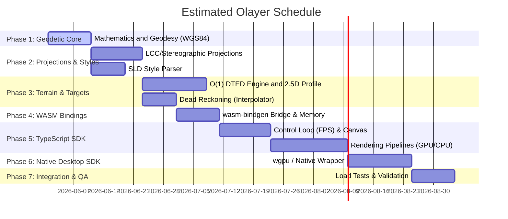

# Development Plan: Olayer
## Implementation Schedule and Milestones of the Hybrid GIS Framework

This document establishes the modular development plan for the construction of **Olayer**, dividing the project into incremental phases and delivery milestones (*milestones*). The planning follows the strict separation of responsibilities defined in the [System Architecture (arch.md)](file:///c:/Users/rafae/projects/rust/olayer/docs/arch.md) and the [Technical Specification (spec.md)](file:///c:/Users/rafae/projects/rust/olayer/docs/spec.md).

---

## Overview of the Roadmap (Roadmap)

---

## Phase Details

### Phase 1: Geodetic Core and WGS84 Mathematics
* **Objective:** Establish the mathematical precision of the framework, implementing pure geodetic calculation.
* **Tasks:**
  * [ ] Create data structures for Geodetic coordinates $(\phi, \lambda, h)$ and ECEF $(X, Y, Z)$ in `f64` precision.
  * [ ] Implement bidirectional geodetic conversions $\leftrightarrow$ ECEF.
  * [ ] Implement great circle distance calculations (Vincenty Formula / Haversine) and Azimuth.
  * [ ] Create unit test suite validating against real WGS84 ellipsoid data.
* **Test Plan:**
  * [ ] Run Rust unit test suite comparing distance calculations and conversions with reference tools (GeographicLib / PROJ) requiring tolerance less than 1mm.
  * [ ] Validate mathematical behavior at boundary points (geographic poles, Equator, and Antimeridian transition +-180°).
* **Milestones (Milestone 1):** Mathematical validation approved, with accumulated error less than 1 millimeter.

### Phase 2: Cartographic Projections, SLD Parser, Symbol Library, and Camera Engine
* **Objective:** Allow the translation of globe coordinates to 2D planes, configure the styling engine, resolve structured symbologies, and dynamically manage camera attitude.
* **Tasks:**
  * [ ] Implement the **Lambert Conformal Conic (LCC)** projection with configurable standard parallels.
  * [ ] Implement the **Azimuthal Stereographic** projection with focus on the radar center (TMA).
  * [ ] Implement the **Web Mercator** projection (EPSG:3857) for standard background maps.
  * [ ] Develop the XML parser for the OGC **SLD (Styled Layer Descriptor)** standard, translating geographic styles into simple style dictionaries.
  * [ ] Develop the **`Symbol Registry`** module for decoding and validation of military tactical codes (NATO SIDC) and civil radio-aids (ICAO).
  * [ ] Develop the **`Camera Engine`** component (`core::camera`) managing `CameraState` (with zoom, bearing, pitch, roll) and calculating View-Projection matrices for 2D, 2.5D (with declined tilt), and 3D modes.
* **Test Plan:**
  * [ ] Run cross-projection tests (project and unproject known points to verify mathematical reversibility).
  * [ ] Test SLD parsing containing invalid or corrupted tags to certify that the parser does not cause panics in the application.
  * [ ] Validate correct NATO SIDC (APP-6) resolution for affiliations and varied types, testing behavior against unknown or malformed SIDC codes.
  * [ ] Validate matrices generated by the `Camera Engine` verifying correct mapping of known points to NDC space under rotation, tilt, and scale.
* **Milestones (Milestone 2):** Projection algorithms validated, SLD parser reading files without exceptions, structured symbol generator composed, and Camera Engine providing robust mathematical matrices.

### Phase 3: DTED Terrain Engine and Target Interpolation
* **Objective:** Add passive geographic elevation and continuous kinematic estimation of aircraft movement.
* **Tasks:**
  * [ ] Create in-memory spatial indexer (Grid Index) for binary DTED files.
  * [ ] Implement geographic coordinate lookup in $O(1)$ time returning ground altitude.
  * [ ] Develop vertical terrain cut profile algorithm (2.5D View).
  * [ ] Implement the `Target Interpolator` module (Dead Reckoning) using linear kinematics to smooth trajectories of dynamic targets.
* **Test Plan:**
  * [ ] Test the consistency of the DTED file parser from faked binary buffers in memory.
  * [ ] Validate the physical precision of kinematic interpolation in fractional time intervals (e.g., verify estimated position at instant $T+0.250s$).
  * [ ] Measure the latency of MSAW calculation to guarantee integrity under high operational query rates.
* **Milestones (Milestone 3):** Interpolated radar simulation and altimetry checking operating in constant time in the Rust Core.

### Phase 4: Interoperability Layers (WASM and C-FFI) and Memory Management
* **Objective:** Prepare the Rust Core to be consumed both in browsers (via WASM/TS) and in local hosts (C++/C via FFI), guaranteeing zero resource leaks.
* **Tasks:**
  * [ ] Configure `wasm-pack` compilation and expose Core functions and structures via `wasm-bindgen`.
  * [ ] Integrate `cbindgen` into the native build process to generate C-compatible headers (`libolayer_native.h`) from the Core's FFI directives.
  * [ ] Implement optimized bridges for transferring large volumes of data (binary DTED and MVT buffers) using shared linear memory.
  * [ ] Implement explicit memory deallocation policy (`.free()` calls) in the TS SDK and mapping of native FFI destructors (per ADR-004).
  * [ ] Configure LRU tile cache for DTED with active memory eviction on the WASM heap and native cache.
* **Test Plan:**
  * [ ] Run automated tests in headless browser via `wasm-bindgen-test` to homologate WebAssembly signatures.
  * [ ] Compile a simple C++ program to validate the auto-generated `.h` headers and attest correct passing of geodetic structs via FFI.
  * [ ] Automated Leak Checking tests monitoring the growth of the WASM/C heap after massively creating and destroying dynamic structures.
* **Milestones (Milestone 4):** WASM packages and native dynamic/static libraries generated with validated FFI and approved leak tests.

### Phase 5: TypeScript SDK (Web Environment)
* **Objective:** Build the visual framework consumed on the Web, managing the display lifecycle and interaction.
* **Tasks:**
  * [ ] Configure TS repository (Vite, esbuild, TypeScript) and load the WASM module asynchronously.
  * [ ] Develop the `TS Controller` and intelligent rendering loop with support for dynamic FPS rates (15 FPS idle / 60 FPS active).
  * [ ] Create the **`Layer Manager`** to coordinate the layer stack (Layer Stack) and segregate repainting of static and dynamic layers.
  * [ ] Create the `Data Provider Manager` for asynchronous GeoServer requests (MVT, WMTS, SLD) and terrain server (DTED).
  * [ ] Develop the `GPU Pipeline` (WebGL 2.0 / WebGPU) for real-time rendering of matrices, terrain, and MVT vector layers with Framebuffer texture caching.
  * [ ] Implement dynamic **Texture Atlas** compilation on the GPU and target rendering via instanced calls (`drawElementsInstanced`).
  * [ ] Develop the `CPU Pipeline` for pixel-perfect target plotting and implement the **Anti-cluttering** label algorithm on the browser thread.
  * [ ] Implement interactive camera controls on the interface (zoom, bearing, pitch, roll) and bidirectional synchronization with mouse gestures (right button / Shift+drag to tilt and rotate).
* **Test Plan:**
  * [ ] Automated visual regression tests (Snapshot Testing) comparing Canvas 2D/WebGL screen captures against approved reference frames.
  * [ ] Unit test the rendering segregation of static vs dynamic layers in the `Layer Manager`.
  * [ ] Simulate continuous mouse/pan events to verify if the `TS Controller` actually limits the frame rate and returns to idle mode (15 FPS) autonomously.
* **Milestones (Milestone 5):** Functional radar screen in the browser running at 60 FPS with active hybrid rendering and full dynamic camera control.

### Phase 6: Native Rust SDK (Desktop Environment)
* **Objective:** Enable the use of the framework in local desktop applications of ultra-high performance (native Rust and FFI).
* **Tasks:**
  * [ ] Implement the local SDK wrapper connecting directly with the Core Rust static APIs (without WASM).
  * [ ] Develop the `Native Controller` using the `winit` crate for native rendering loop and window management.
  * [ ] Create the `Native Layer Manager` for control and composition of the layer stack (static and dynamic) in the desktop environment.
  * [ ] Develop the local graphics pipeline using the `wgpu` library for support to Vulkan, Metal, and DirectX 12.
  * [ ] Implement dynamic local Texture Atlas compilation and instanced rendering via the native `wgpu` pipeline.
  * [ ] Configure asynchronous direct reading of DTED files from the local application hard disk.
  * [ ] Adapt the native SDK and local controls to expose the full camera attitude (zoom, bearing, pitch, roll).
* **Test Plan:**
  * [ ] Run native rendering tests saving local wgpu buffers as PNG images and performing visual diff.
  * [ ] Run the local graphics test suite in CI environments using software-emulated graphics adapters (such as llvmpipe/lavapipe) to guarantee stable headless operation.
* **Milestones (Milestone 6):** Native Desktop application compiled successfully displaying the same visual resources as the web version, with attested FFI support.

### Phase 7: Integrated Tests, Operational Validation, and Benchmarks
* **Objective:** Homologate the framework in simulated real-world high-load scenarios.
* **Tasks:**
  * [ ] Create test scenario integrating the framework with an active **GeoServer**.
  * [ ] Run stress benchmark injecting more than 5,000 active aircraft simultaneously with Dead Reckoning at 60 FPS.
  * [ ] Measure and validate data transfer latency through the JS/WASM bridge.
  * [ ] Validate MSAW scenarios (terrain collision alerts) at runtime.
* **Test Plan:**
  * [ ] Extreme Load Test: Continuous injection of 5,000+ targets with update at 1 Hz, requiring rendering at 60 FPS without abrupt drop in update rate.
  * [ ] Endurance Test: Uninterrupted execution of the application for 24 hours simulating real traffic to audit memory RAM growth in the host and browser (tools: Chrome DevTools Profiler / Valgrind / Instruments).
* **Milestones (Milestone 7):** Technical homologation report attesting FPS stability and stable memory consumption after 24 hours of continuous stress.

---

## General Delivery Acceptance Criteria

For the framework to be considered ready for production:
1. **Zero Memory Leaks:** No residual memory leaks from WASM in the heap or CPU in prolonged 24-hour execution.
2. **Frame Rate Stability:** Maintain stable 60 FPS during pan/zoom interactions with more than 2,000 plotted aircraft.
3. **Visual Consistency:** Radar targets, labels, and SLD symbologies must behave in a visually identical manner in 2D, 2.5D, and 3D modes.
