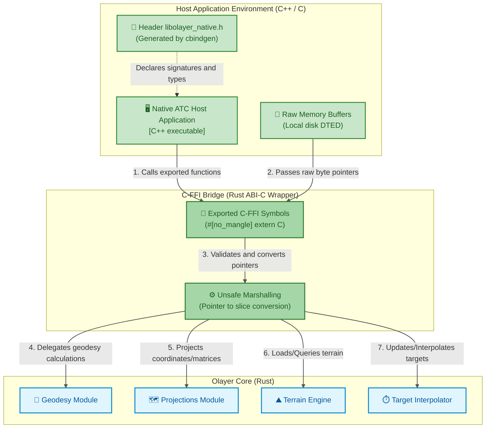

# Architecture: C-FFI Bridge (Native)

This document details the architectural design, technical specification, binary compatibility guidelines, and memory management of the **C-FFI** interoperability bridge of Olayer, located in [c_ffi_bridge](../../../../sdk/native/c_ffi_bridge).

This component exposes the mission-critical geometric capabilities of the Rust engine to local applications written in natively compiled languages (such as C, C++, C#, or Go).

---

## 1. C-FFI Integration Diagram (C4 Model - Level 3)

The C-FFI bridge operates at the ABI (Application Binary Interface) level of the operating system, exposing exported symbols through standard C calling conventions (`extern "C"`).



---

## 2. Responsibilities

The **C-FFI Bridge** component has the following main assignments:
1. **C ABI Compatibility:** Ensure that all exported functions use the standard system calling convention (`extern "C"`) and that structs have compatible layout (`#[repr(C)]`).
2. **DLL and Static Library Construction:** Compile the Rust code as a dynamic library (`.dll`/`.so`/`.dylib`) or static (`.lib`/`.a`).
3. **Header Autogeneration (Header Generator):** Use the `cbindgen` crate to automatically generate the C/C++ declarations file `libolayer_native.h`.
4. **Safe Pointer Management (Pointers Translators):** Convert raw C pointers (`*const u8`, `*const c_char`, etc.) into Rust slices (`&[u8]`) and strings safely within `unsafe` scopes.
5. **Exception Handling and Error Code:** Capture possible Rust *panics* (*unwind panics*) to prevent them from crashing the C++ host process (using `std::panic::catch_unwind`), returning structured numeric error codes (`int32_t`).

---

## 3. Designed Interfaces (C-API Exports)

To allow integration with C/C++, the data signatures expose opaque pointers to the Rust control structs. The complete low-level implementations are in [c_ffi_bridge/src/lib.rs](../../../../sdk/native/c_ffi_bridge/src/lib.rs).

### 3.1 C-Compatible Definitions
```rust
use std::os::raw::{c_char, c_int};
use olayer_core::geodesy::LatLon;
use olayer_core::terrain::TerrainEngine;
use olayer_core::interpolator::InterpolationEngine;

/// C representation of a geodetic coordinate.
#[repr(C)]
pub struct C_LatLon {
    pub lat: f64,
    pub lon: f64,
    pub height: f64,
}

/// C representation of an interpolated target.
#[repr(C)]
pub struct C_InterpolatedTarget {
    pub id: *mut c_char,
    pub lat: f64,
    pub lon: f64,
    pub height: f64,
    pub heading_rad: f64,
}

/// C representation of a vertical profile point.
#[repr(C)]
pub struct C_ProfilePoint {
    pub distance_meters: f64,
    pub ground_elevation: f64,
    pub lat: f64,
    pub lon: f64,
    pub height: f64,
}
```

### 3.2 Terrain API Functions (DTED)
* `olayer_terrain_engine_create`: Instantiates the terrain engine on the Rust Heap and returns an opaque pointer (`*mut TerrainEngine`).
* `olayer_terrain_engine_load_tile`: Parses and registers a raw binary DTED buffer in memory. Writes the origin coordinates to the passed pointers.
* `olayer_terrain_engine_unload_tile`: Removes a terrain cell from memory by its coordinate degree.
* `olayer_terrain_engine_get_elevation`: Queries and returns the ground altitude at the specified geographic point in constant time $O(1)$.
* `olayer_terrain_engine_get_vertical_profile`: Calculates the terrain vertical profile under the provided route.
* `olayer_profile_points_free`: Frees the memory of the profile point array allocated by Rust.
* `olayer_terrain_engine_free`: Safely destroys the terrain engine instance.

### 3.3 Radar Interpolator API Functions (MSAW and Dead Reckoning)
* `olayer_interpolator_create`: Instantiates the interpolation engine and returns an opaque pointer.
* `olayer_interpolator_create_with_threshold`: Instantiates with a custom timeout before expiring obsolete states.
* `olayer_interpolator_update`: Updates or inserts the kinematic state vector of an aircraft.
* `olayer_interpolator_remove`: Removes a target from monitoring by ID.
* `olayer_interpolator_interpolate_all`: Calculates the physical positioning of all active targets for the current system time using *Dead Reckoning*.
* `olayer_interpolated_targets_free`: Safely deallocates the array of targets returned by the Rust interpolator (including the embedded C-compatible strings).
* `olayer_interpolator_free`: Deallocates the interpolation engine instance.

---

## 4. Exception Handling and Panic Safety

If a Rust panic attempts to unwind the stack (*unwinding*) across the FFI boundary to C/C++ code, this will result in undefined behavior (Undefined Behavior) and imminent crash of the host application.

To mitigate this, each exposed call in the bridge uses the `std::panic::catch_unwind` function to capture failures and map them to safe numeric returns:
```rust
let result = std::panic::catch_unwind(std::panic::AssertUnwindSafe(|| {
    engine_ref.load_tile(data_slice)
}));

match result {
    Ok(Ok(key)) => 0, // Success
    Ok(Err(_)) => -2,  // Logically mapped error
    Err(_) => -99,    // Panic captured and safely contained
}
```

---

## 5. Native Memory Management and Safety (Ownership Rules)

Native FFI integration requires rigid rules about who is the "owner" of each allocated resource to prevent memory leaks and segmentation faults (*Segmentation Faults*).

### 5.1 Memory Ownership Boundaries (Ownership Boundary)
* **General Rule:** The side of the FFI boundary that allocates the memory must be the same one that frees it.
* **Data Allocated by Rust:** When the Rust bridge allocates an object on the Heap (e.g., `olayer_terrain_engine_create`), the host in C++ receives a raw pointer (`*mut TerrainEngine`). The C++ host **must never** deallocate this pointer by calling C's `free()` or C++'s `delete`. Instead, it must call the corresponding exported destructor (e.g., `olayer_terrain_engine_free`).
* **Data Allocated by the C++ Host:** Binary buffers of DTED files loaded by C++ into system memory are passed to Rust via simple pointer (`*const u8`). Rust accesses these bytes strictly for reading and **does not attempt** to free or take ownership of the original pointer. The responsibility for deallocating the file buffer after reading completion remains 100% with the C++ host.

### 5.2 Concurrency Safety (Thread-Safety)
* The Olayer Core is designed to be thread-safe (structs implement `Send` and `Sync` in Rust).
* Pointers returned from constructors (e.g., `*mut TerrainEngine`) can be shared between different execution threads of the host application (such as a radar tactical processing thread and a local wgpu/Vulkan interface rendering thread).
* **Important:** Mutual concurrent safety is guaranteed because the geographic data and mathematical models of reading (such as loaded `TerrainEngine`) perform only simultaneous reads without internal mutable concurrent state. If dynamic modifications (writing of new terrain tiles) occur in parallel with reads, the C++ host must synchronize access to these pointers using native locks (`std::mutex` or equivalents).
