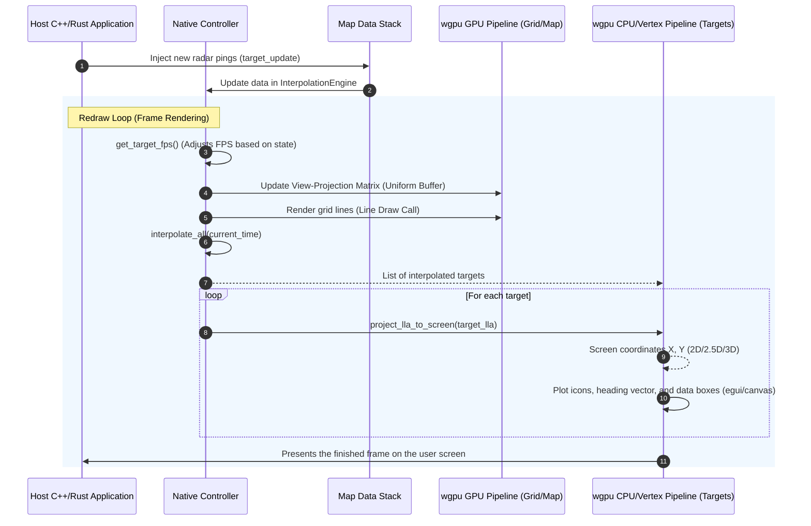

# Native SDK Components (Desktop)

This document details technically the components of the **Olayer** Native SDK, as defined in the [Software Architecture (arch.md)](../../arch.md). The native Rust engine is designed for high-performance integration in desktop air traffic control (ATC) systems, supporting GPU-accelerated rendering and interoperability with languages such as C and C++.

---

## Component Index

1. [Native Controller](#1-native-controller)
2. [Native Layer Manager](#2-native-layer-manager)
3. [Native Map Data Stack](#3-native-map-data-stack)
4. [wgpu GPU Pipeline](#4-wgpu-gpu-pipeline)
5. [wgpu CPU/Vertex Pipeline](#5-wgpu-cpuvertex-pipeline)
6. [C-FFI Bridge (cbindgen)](#6-c-ffi-bridge-cbindgen)

---

## 1. Native Controller

### Responsibility
The `Native Controller` manages the global execution state of the SDK in the native desktop environment. It serves as the main entry point and orchestrator that unites the geodetic, interpolation, cartographic projection, and camera engines. In addition, it implements the dynamic frame rate control mechanism (**FPS Throttling**), switching between 60 FPS (active mode, during user interactions or frequent updates) and 15 FPS (idle/idle mode) to save processing and CPU resources.

### Key Data Structures
* `NativeController` (defined in [mod.rs](../../../sdk/native/src/native_controller/mod.rs)):
  * `terrain`: [TerrainEngine](../../../core/src/terrain) - Terrain elevation search engine (DTED).
  * `interpolator`: [InterpolationEngine](../../../core/src/interpolator) - Dead Reckoning engine for radar targets.
  * `projection`: `Box<dyn Projection + Send + Sync>` - Active projection (e.g., [Stereographic](../../../core/src/projections), [LambertConformalConic](../../../core/src/projections)).
  * `camera`: [CameraState](../../../core/src/camera) - Camera attitude and position state for visualization/projection calculation.
  * `is_active`: `bool` - Flag indicating whether the application is in a high-activity state.
  * `last_active_time`: `std::time::Instant` - Timestamp of the last interaction or important event.
  * `active_timeout`: `std::time::Duration` - Time limit before returning to idle state.

### Main Methods
* `new(center_lat: f64, center_lon: f64) -> Self`: Initializes the controller with a camera centered on the provided coordinates and default azimuthal stereographic projection.
* `trigger_active(&mut self)`: Updates the active timestamp and signals high activity (60 FPS).
* `check_active(&mut self) -> bool`: Validates whether the activity period has expired, updating `is_active`.
* `get_target_fps(&mut self) -> u32`: Returns the target frame rate (60 for active, 15 for idle).

---

## 2. Native Layer Manager

### Responsibility
The `Native Layer Manager` is responsible for controlling the map display layer stack (e.g., static background map, geodetic grid lines, tactical targets, and interface overlays). It manages the visibility of each layer and decides the repaint order (*compositing*). Instead of repainting all dense geographic elements every frame, it supports the segregation of graphics cycles, instructing the pipeline to draw static elements into cache textures when the camera does not change state.

### Key Data Structures
* `Layer` trait (defined in [mod.rs](../../../sdk/native/src/native_layer_manager/mod.rs)):
  * `id(&self) -> &str` — Unique identifier.
  * `is_visible(&self) -> bool` — Whether the layer is currently visible.
  * `set_visible(&mut self, visible: bool)` — Toggle visibility.
  * `is_static(&self) -> bool` — Whether the layer is static (rarely changes) or dynamic (updated every frame).
* `NativeLayerManager`:
  * `layers: Vec<Box<dyn Layer>>` — Stack of active layers in render order (back-to-front).
  * `show_grid`, `show_targets`, `show_hud`, `show_terrain` — Convenience boolean toggles for the hardcoded layers used by the demo app.

### Main Methods
* `add_layer(layer: Box<dyn Layer>) -> Result<(), String>` — Adds a new layer to the top of the stack. Returns `Err` if the ID already exists.
* `remove_layer(id: &str) -> bool` — Removes a layer by its identifier. Returns `true` if found.
* `reorder_layer(id: &str, new_index: usize) -> Result<(), String>` — Moves a layer to a specific position in the stack.
* `get_layers() -> &[Box<dyn Layer>]` — Returns all layers in render order.
* `visible_static_layers() -> Vec<&dyn Layer>` — Returns visible static layers.
* `visible_dynamic_layers() -> Vec<&dyn Layer>` — Returns visible dynamic layers.
* `set_layer_visibility(id: &str, visible: bool) -> Result<(), String>` — Toggles visibility for a specific layer.
* `set_all_visibility(visible: bool)` — Toggles all layers on or off.

### Operation Flow in the Native Loop
As implemented in the event loop in [main.rs](../../../sdk/native/demo/src/main.rs):
1. **Background and Static Grid Painting:** WGPU clears the buffer with the ATC radar theme color and draws the grid lines based on the updated `grid_vertex_buffer`.
2. **Target Layer Painting (Radar Overlay):** Draws the list of dynamic targets over the map and grids.
3. **Interface Drawing (HUD/Egui Overlay):** Adds buttons, projection controls, and informative windows (e.g., 2.5D flight profile) at the top of the stack, rendered through integration with `egui_wgpu::Renderer`.

---

## 3. Native Map Data Stack

### Responsibility
The `Native Map Data Stack` manages the ingestion and local caching of static and dynamic cartographic and operational data resources for the desktop application. Unlike the Web ecosystem (which consumes data via browser network), in the desktop environment this component can access the local file system asynchronously, performing quick loading of DTED terrain files on disk and decoding them directly into the Rust Core's linear memory.

### Key Data Structures
* `MapDataSource` trait (defined in [mod.rs](../../../sdk/native/src/native_map_data_stack/mod.rs)):
  * `id(&self) -> &str` — Unique identifier for the data source.
  * `clear_cache(&mut self)` — Clears the local provider cache.
  * `cache_size(&self) -> usize` — Returns the number of cached items.
* `NativeMapDataStack`:
  * `sources: HashMap<String, Box<dyn MapDataSource>>` — Registry of registered data sources.
  * `register_source(source: Box<dyn MapDataSource>) -> Result<(), String>` — Registers a new data source. Returns `Err` if the ID already exists.
  * `get_source(id: &str) -> Option<&dyn MapDataSource>` — Retrieves a registered source by ID.
  * `clear_cache()` — Clears the caches of all registered sources.
  * `get_cache_size() -> usize` — Returns the aggregate cache size across all sources.
  * `load_dted_file(path: &str, terrain: &mut TerrainEngine) -> Result<(), String>` — Loads a DTED tile from a file path into the given terrain engine (backward-compatible helper).
  * `load_dted_buffer(buffer: &[u8], terrain: &mut TerrainEngine) -> Result<(), String>` — Loads a DTED tile from a raw buffer into the given terrain engine.
* `TerrainDataSource` (concrete `MapDataSource` implementation):
  * Wraps a `TerrainEngine` and tracks loaded tiles so it can implement `clear_cache` and `cache_size`.
  * `load_file(path: &str) -> Result<(), String>` — Loads a DTED tile from disk.
  * `load_buffer(buffer: &[u8]) -> Result<(), String>` — Loads a DTED tile from a raw buffer.
  * `unload_tile(lat_deg: i32, lon_deg: i32) -> bool` — Unloads a specific tile by its coordinate degrees.
  * `get_elevation(lat_deg: f64, lon_deg: f64) -> Result<f64, String>` — Queries elevation at the given coordinate degrees.

### Data Integration
* **Local Disk I/O:** Loads binary DTED tiles mapped on the geographic grid directly into the [TerrainEngine](../../../core/src/terrain) struct using `load_tile`.
* **Sensor Flow:** Receives external radar feeds at ~1 Hz rates and supplies the native [InterpolationEngine](../../../core/src/interpolator) via the `update_target` method.

---

## 4. wgpu GPU Pipeline

### Responsibility
The `wgpu GPU Pipeline` is the hardware-accelerated rendering engine for native environments (Desktop). It manages and compiles graphics pipelines accelerated via low-level APIs (Vulkan, Metal, or DirectX 12) using the Rust `wgpu` crate. This pipeline processes dense geographic and relief data represented by 3D projection and visualization transformation matrices (MVP) computed in the Rust Core.

### Rendering Components
* **Shader Compilation (WGSL):** Executes the grid shader (`vs_main` and `fs_main` defined in [mod.rs](../../../sdk/native/src/wgpu_gpu_pipeline/mod.rs)) to project and color the meridians and parallels.
* **Uniform Buffers:** Maintains buffers for sending the combined View-Projection matrix (`mat4x4<f32>`) and grid color data to the GPU.
* **Vertex Buffers:** Fills the grid vertex buffer dynamically via `rebuild_grid_buffers` every time the camera or active projection is changed.

---

## 5. wgpu CPU/Vertex Pipeline

### Responsibility
The `wgpu CPU/Vertex Pipeline` handles the projection and plotting of dynamic targets (aircraft) and their respective metadata (text labels, velocity vectors, and heading) that cannot suffer 3D spatial distortions ( **Billboard** effect). The coordinate transformation calculation from geodetic (latitude, longitude, altitude) to flat screen pixel coordinates $(X, Y)$ is done on the CPU by the Core, and the SDK performs the rendering of geometric primitives (circles, rectangles, vectors) and text on the graphical interface.

### Dynamic Projection Logic
In the file [mod.rs](../../../sdk/native/src/wgpu_cpu_vertex_pipeline/mod.rs):
* `project_lla_to_screen`: Translates geodetic coordinates based on the active projection and visualization matrix.
  * **In 3D mode:** Converts LLA coordinates to 3D ECEF rectangular coordinates using the WGS84 ellipsoid, applies horizon occlusion culling (horizon occlusion culling), and multiplies by the 3D view matrix.
  * **In 2.5D mode:** Projects the aircraft base two-dimensionally using the active planar projection and adds altitude as the Z axis, then projects with the 2.5D perspective camera matrix.
  * **In 2D mode:** Projects two-dimensionally using the active cartographic projection (Stereographic, LCC, Mercator) and translates/rotates according to the camera bearing/zoom.
* **Target Rendering with Egui Painter:** The SDK draws aircraft as filled circles, surrounded by rectangles on selected targets, with lines representing the planned heading vector for 1 minute ahead and text blocks containing the callsign, Altitude (Flight Level), and Speed (knots).

---

## 6. C-FFI Bridge (cbindgen)

### Responsibility
The `C-FFI Bridge` provides a binary interface compatible with the C language (`libolayer_native.h`), allowing client applications written in C, C++, C#, or other natively compiled languages to directly consume the mathematical and logical engines of the Olayer Core in Rust.

### FFI Interoperability Architecture
The FFI bridge is located in the subproject [c_ffi_bridge](../../../sdk/native/src/c_ffi_bridge) and implements:
* **FFI-compatible Data Structures (`#[repr(C]`):**
  * `C_LatLon` - Pair of geodetic coordinates.
  * `C_InterpolatedTarget` - Interpolated target records with C-compatible strings (`*mut c_char`).
  * `C_ProfilePoint` - Point in the vertical profile graph.
* **Opaque Pointer Management:** Instantiates `TerrainEngine` and `InterpolationEngine` instances on the Rust heap and exposes opaque pointers (`*mut TerrainEngine`) for host control.
* **Panic Unwind Prevention (`catch_unwind`):** Ensures that panics occurring within the Rust crates do not cross the FFI boundary to the host application (which would result in undefined behavior / crash), returning structured negative error codes.

---

## Native Interaction and Flow Diagram

The diagram below illustrates the high-level cooperation of the native components during a typical radar tactical rendering frame:

