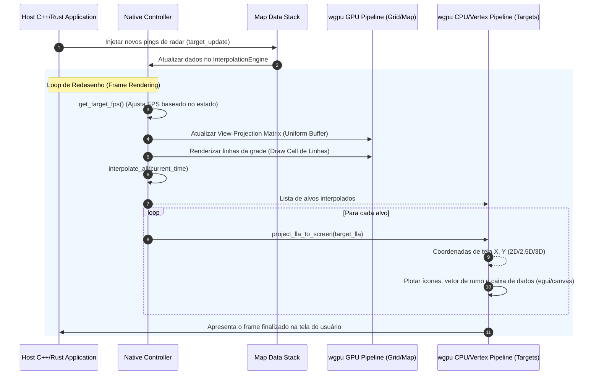

# Componentes da SDK Nativa (Desktop)

Este documento detalha tecnicamente os componentes da SDK Nativa do **Olayer**, conforme definido na [Arquitetura de Software (arch.md)](file:///c:/Users/rafae/projects/rust/olayer/docs/arch.md). O motor nativo em Rust é projetado para integração de alto desempenho em sistemas de controle de tráfego aéreo (ATC) desktop, suportando renderização acelerada por GPU e interoperação com linguagens como C e C++.

---

## Índice dos Componentes

1. [Native Controller](#1-native-controller)
2. [Native Layer Manager](#2-native-layer-manager)
3. [Native Map Data Stack](#3-native-map-data-stack)
4. [wgpu GPU Pipeline](#4-wgpu-gpu-pipeline)
5. [wgpu CPU/Vertex Pipeline](#5-wgpu-cpuvertex-pipeline)
6. [C-FFI Bridge (cbindgen)](#6-c-ffi-bridge-cbindgen)

---

## 1. Native Controller

### Responsabilidade
O `Native Controller` gerencia o estado global de execução da SDK no ambiente nativo desktop. Ele serve como o ponto de entrada principal e orquestrador que une os motores geodésico, de interpolação, de projeção e a câmera. Além disso, implementa o mecanismo de controle dinâmico de taxa de quadros (**FPS Throttling**), chaveando entre 60 FPS (modo ativo, durante interações do usuário ou atualizações frequentes) e 15 FPS (modo ocioso/idle) para economizar recursos de processamento e CPU.

### Estruturas de Dados Chave
* `NativeController` (definida em [mod.rs](file:///c:/Users/rafae/projects/rust/olayer/sdk/native/src/native_controller/mod.rs)):
  * `terrain`: [TerrainEngine](file:///c:/Users/rafae/projects/rust/olayer/core/src/terrain) - Motor de busca de elevação do terreno (DTED).
  * `interpolator`: [InterpolationEngine](file:///c:/Users/rafae/projects/rust/olayer/core/src/interpolator) - Motor de Dead Reckoning para alvos radar.
  * `projection`: `Box<dyn Projection + Send + Sync>` - Projeção ativa (Ex: [Stereographic](file:///c:/Users/rafae/projects/rust/olayer/core/src/projections), [LambertConformalConic](file:///c:/Users/rafae/projects/rust/olayer/core/src/projections)).
  * `camera`: [CameraState](file:///c:/Users/rafae/projects/rust/olayer/core/src/camera) - Estado de atitude e posição da câmera para cálculo de visualização/projeção.
  * `is_active`: `bool` - Flag indicando se a aplicação está em estado de alta atividade.
  * `last_active_time`: `std::time::Instant` - Marca temporal da última interação ou evento importante.
  * `active_timeout`: `std::time::Duration` - Tempo limite antes de retornar ao estado ocioso.

### Métodos Principais
* `new(center_lat: f64, center_lon: f64) -> Self`: Inicializa o controlador com uma câmera centrada nas coordenadas fornecidas e projeção estereográfica azimutal padrão.
* `trigger_active(&mut self)`: Atualiza a marca temporal ativa e sinaliza alta atividade (60 FPS).
* `check_active(&mut self) -> bool`: Valida se o período de atividade expirou, atualizando `is_active`.
* `get_target_fps(&mut self) -> u32`: Retorna a taxa de quadros alvo (60 para ativo, 15 para ocioso).

---

## 2. Native Layer Manager

### Responsabilidade
O `Native Layer Manager` é responsável por controlar a pilha de camadas de exibição do mapa desktop (Ex: fundo de mapa estático, linhas da grade geodésica, alvos táticos e overlays de interface). Ele gerencia a visibilidade de cada camada e decide a ordem de repintura (*compositing*). Em vez de repintar todos os elementos geográficos densos a cada frame, ele suporta a segregação de ciclos gráficos, instruindo o pipeline a desenhar elementos estáticos em texturas de cache quando a câmera não muda de estado.

### Fluxo de Funcionamento no Loop Nativo
Como implementado no loop de eventos em [main.rs](file:///c:/Users/rafae/projects/rust/olayer/sdk/native/demo/src/main.rs):
1. **Pintura de Fundo e Grades Estáticas:** O WGPU limpa o buffer com a cor do tema de radar ATC e desenha as linhas da grade baseando-se no `grid_vertex_buffer` atualizado.
2. **Pintura da Camada de Alvos (Radar Overlay):** Desenha a lista de alvos dinâmicos por cima do mapa e das grades.
3. **Desenho de Interface (HUD/Egui Overlay):** Adiciona botões, controles de projeção e janelas informativas (ex: perfil de voo 2.5D) no topo da pilha, renderizado através da integração com o `egui_wgpu::Renderer`.

---

## 3. Native Map Data Stack

### Responsabilidade
O `Native Map Data Stack` gerencia a ingestão e o cache local de recursos estáticos e dinâmicos de dados cartográficos e operacionais para a aplicação desktop. Diferente do ecossistema Web (que consome dados via rede do navegador), no ambiente desktop este componente pode acessar o sistema de arquivos local de forma assíncrona, efetuando o carregamento rápido de arquivos de terreno DTED no disco e decodificando-os diretamente para a memória linear do Rust Core.

### Integração de Dados
* **I/O de Disco Local:** Carrega tiles binários DTED mapeados na grade geográfica diretamente para a struct [TerrainEngine](file:///c:/Users/rafae/projects/rust/olayer/core/src/terrain) usando `load_tile`.
* **Fluxo de Sensores:** Recebe fluxos de radar externos a taxas de ~1 Hz e abastece o [InterpolationEngine](file:///c:/Users/rafae/projects/rust/olayer/core/src/interpolator) nativo através do método `update_target`.

---

## 4. wgpu GPU Pipeline

### Responsabilidade
O `wgpu GPU Pipeline` é a engine de renderização baseada em hardware para ambientes nativos (Desktop). Ele gerencia e compila pipelines gráficos acelerados via APIs de baixo nível (Vulkan, Metal ou DirectX 12) utilizando a crate `wgpu` do Rust. Este pipeline processa dados geográficos e de relevo densos representados por matrizes de transformação de projeção e visualização tridimensionais (MVP) computadas no Rust Core.

### Componentes de Renderização
* **Compilação de Shaders (WGSL):** Executa o shader de grade (`vs_main` e `fs_main` definidos em [mod.rs](file:///c:/Users/rafae/projects/rust/olayer/sdk/native/src/wgpu_gpu_pipeline/mod.rs)) para projetar e colorir os meridianos e paralelos.
* **Buffers de Uniforms:** Mantém buffers para envio da matriz combinada de View-Projection (`mat4x4<f32>`) e dados de cores da grade para a GPU.
* **Vertex Buffers:** Preenche o buffer de vértices da grade dinamicamente via `rebuild_grid_buffers` toda vez que a câmera ou a projeção ativa é alterada.

---

## 5. wgpu CPU/Vertex Pipeline

### Responsabilidade
O `wgpu CPU/Vertex Pipeline` cuida da projeção e plotagem de alvos dinâmicos (aeronaves) e seus respectivos metadados (etiquetas de texto, vetores de velocidade e rumo) que não podem sofrer distorções espaciais 3D (efeito *Billboard*). O cálculo de transformação de coordenadas geodésicas (latitude, longitude, altitude) para coordenadas planas de tela em pixels $(X, Y)$ é feito na CPU pelo Core, e a SDK realiza a renderização das primitivas geométricas (círculos, retângulos, vetores) e texto na interface gráfica.

### Lógica de Projeção Dinâmica
No arquivo [mod.rs](file:///c:/Users/rafae/projects/rust/olayer/sdk/native/src/wgpu_cpu_vertex_pipeline/mod.rs):
* `project_lla_to_screen`: Traduz as coordenadas geodésicas baseadas na projeção ativa e matriz de visualização.
  * **No modo 3D:** Converte coordenadas LLA para coordenadas cartesianas ECEF tridimensionais, aplica culling de oclusão da curvatura da terra (horizon occlusion culling) e multiplica pela matriz de visualização 3D.
  * **No modo 2.5D:** Projeta a base da aeronave bidimensionalmente usando a projeção planar ativa e adiciona a altitude como o eixo Z, projetando depois com a matriz perspectiva 2.5D da câmera.
  * **No modo 2D:** Projeta bidimensionalmente usando a projeção cartográfica ativa (Stereographic, LCC, Mercator) e translada/rotaciona de acordo com o bearing/zoom da câmera.
* **Renderização de Alvos com Egui Painter:** A SDK desenha as aeronaves como círculos cheios, cercadas por retângulos nos alvos selecionados, com linhas que representam o vetor de rumo planejado para 1 minuto à frente e blocos de texto contendo o callsign, Altitude (Flight Level) e Velocidade (knots).

---

## 6. C-FFI Bridge (cbindgen)

### Responsabilidade
A `C-FFI Bridge` fornece uma interface binária compatível com a linguagem C (`libolayer_native.h`), permitindo que aplicações clientes escritas em C, C++, C# ou outras linguagens compiladas nativamente consumam diretamente os motores matemáticos e lógicos do Olayer Core em Rust.

### Arquitetura de Interoperabilidade FFI
A ponte FFI está localizada no subprojeto [c_ffi_bridge](file:///c:/Users/rafae/projects/rust/olayer/sdk/native/src/c_ffi_bridge) e implementa:
* **Estruturas de Dados FFI compatíveis (`#[repr(C)]`):**
  * `C_LatLon` - Par de coordenadas geodésicas.
  * `C_InterpolatedTarget` - Registro de alvos interpolados com strings C-compatible (`*mut c_char`).
  * `C_ProfilePoint` - Ponto no gráfico do perfil vertical.
* **Gerenciamento de Ponteiros Opacos:** Instancia instâncias de `TerrainEngine` e `InterpolationEngine` no heap do Rust e expõe ponteiros opacos (`*mut TerrainEngine`) para controle do host.
* **Prevenção de Unwind de Pânico (`catch_unwind`):** Garante que panics ocorridos dentro das crates Rust não cruzem a fronteira FFI para a aplicação host (o que resultaria em comportamento indefinido / crash), retornando códigos de erro negativos estruturados.

---

## Diagrama de Interações e Fluxo Nativo

O diagrama abaixo ilustra a cooperação de alto nível dos componentes nativos durante um frame típico de renderização tática de radar:

