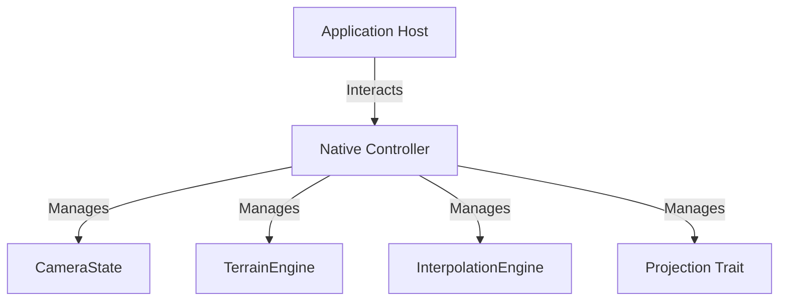
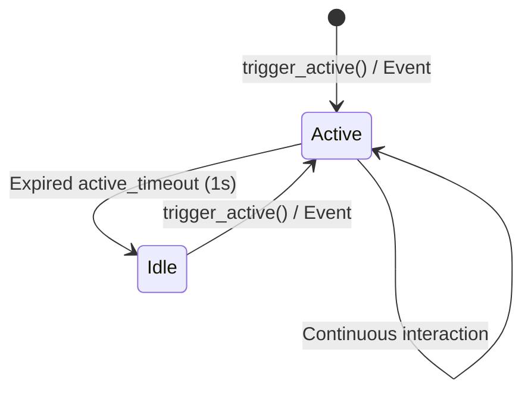

# Architecture: Native Controller

This document details the architectural design and technical specification of the **Native Controller** component of the Olayer Native SDK.

---

## 1. Overview

The [NativeController](../../../../sdk/native/src/native_controller/mod.rs) acts as a **Facade** design pattern and central orchestrator for the Native SDK. It unifies and encapsulates the complex functionalities of geodesy, camera attitude, cartographic projection, and kinematic interpolation provided by the Rust Core, facilitating consumption by the host application.



---

## 2. Architectural Decisions and Patterns

### 2.1 FPS Throttling (Dynamic Frame Rate Modulation)
To optimize CPU and GPU usage in desktop air traffic control systems (where the terminal may spend long periods without operator activity), the `Native Controller` implements an FPS modulation pattern:
* **Active State (60 FPS):** Activated when the user interacts (mouse drag, zoom, selection) or when new radar data arrives.
* **Idle State (15 FPS):** Activated automatically if no interaction or update occurs within the time limit defined by `active_timeout`.



---

## 3. Data Structures and Signatures

The component is implemented in [sdk/native/src/native_controller/mod.rs](../../../../sdk/native/src/native_controller/mod.rs).

### Main Structure
```rust
pub struct NativeController {
    pub terrain: TerrainEngine,
    pub interpolator: InterpolationEngine,
    pub projection: Box<dyn Projection + Send + Sync>,
    pub camera: CameraState,
    pub view_mode: String,
    is_active: bool,
    last_active_time: std::time::Instant,
    active_timeout: std::time::Duration,
}
```

### Methods and Flows
1. **Instantiation (`new`):**
   Creates an instance with centered stereographic projection and default camera attitude.
2. **State Control:**
   * `trigger_active(&mut self)`: Forces the active state by renewing the timestamp.
   * `check_active(&mut self) -> bool`: Compares `last_active_time.elapsed()` with `active_timeout` to update and return the `is_active` flag.
   * `get_target_fps(&mut self) -> u32`: Returns the target frame rate (60 if active, 15 if idle).

---

## 4. Integration with the Host Application

In the native event loop (managed in [main.rs](../../../../sdk/native/demo/src/main.rs)), the host application queries `get_target_fps` at the end of each rendering iteration to determine the main thread sleep time (`sleep`) before the next redraw:

```rust
let target_fps = controller.get_target_fps();
let frame_delay = std::time::Duration::from_millis(1000 / target_fps as u64);
std::thread::sleep(frame_delay);
window.request_redraw();
```
