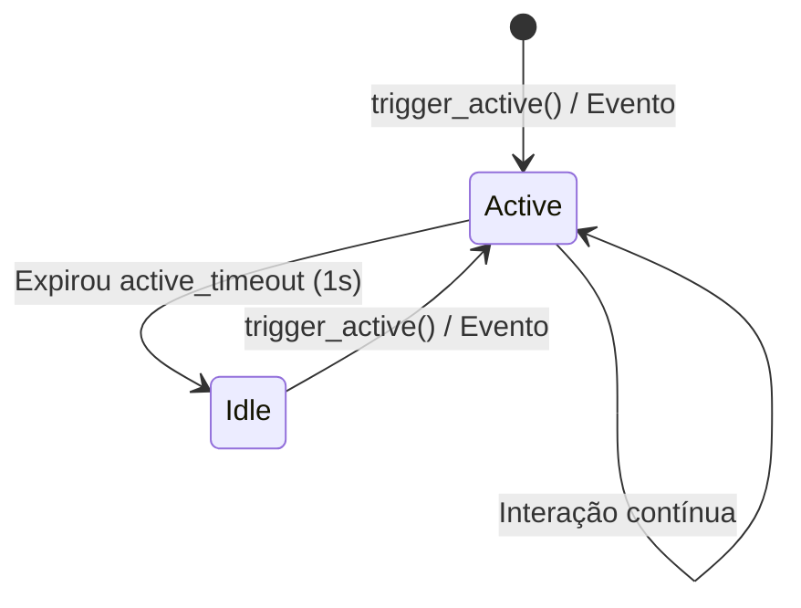

# Arquitetura: Native Controller

Este documento detalha o design arquitetural e a especificação técnica do componente **Native Controller** do SDK Nativo do Olayer.

---

## 1. Visão Geral

O [NativeController](file:///c:/Users/rafae/projects/rust/olayer/sdk/native/src/native_controller/mod.rs) atua como um padrão de design **Facade** (Fachada) e orquestrador central para o SDK Nativo. Ele unifica e encapsula as funcionalidades complexas de geodésia, atitude de câmera, projeção cartográfica e interpolação cinemática fornecidas pelo Rust Core, facilitando o consumo por parte da aplicação host.


---

## 2. Decisões Arquiteturais e Padrões

### 2.1 FPS Throttling (Modulação Dinâmica de Frame Rate)
Para otimizar o uso de CPU e GPU em sistemas de controle de tráfego aéreo desktop (onde o terminal pode passar longos períodos sem atividade do operador), o `Native Controller` implementa um padrão de modulação de FPS:
* **Estado Ativo (60 FPS):** Ativado quando o usuário interage (mouse drag, zoom, seleção) ou quando novos dados de radar chegam.
* **Estado Ocioso (15 FPS):** Ativado automaticamente se nenhuma interação ou atualização ocorrer dentro do intervalo limite definido por `active_timeout`.



---

## 3. Estruturas de Dados e Assinaturas

O componente está implementado em [sdk/native/src/native_controller/mod.rs](file:///c:/Users/rafae/projects/rust/olayer/sdk/native/src/native_controller/mod.rs).

### Estrutura Principal
```rust
pub struct NativeController {
    pub terrain: TerrainEngine,
    pub interpolator: InterpolationEngine,
    pub projection: Box<dyn Projection + Send + Sync>,
    pub camera: CameraState,
    pub view_mode: String,
    is_active: bool,
    last_active_time: std::time::Instant,
    active_timeout: std::time::Duration,
}
```

### Métodos e Fluxos
1. **Instanciação (`new`):**
   Cria uma instância com projeção estereográfica centralizada e atitude de câmera padrão.
2. **Controle de Estado:**
   * `trigger_active(&mut self)`: Força o estado ativo renovando a marca temporal.
   * `check_active(&mut self) -> bool`: Compara `last_active_time.elapsed()` com `active_timeout` para atualizar e retornar a flag `is_active`.
   * `get_target_fps(&mut self) -> u32`: Retorna a taxa alvo de quadros (60 se ativo, 15 se ocioso).

---

## 4. Integração com a Aplicação Host

No loop de eventos nativo (gerenciado em [main.rs](file:///c:/Users/rafae/projects/rust/olayer/sdk/native/demo/src/main.rs)), a aplicação host consulta `get_target_fps` ao final de cada iteração de renderização para determinar o tempo de suspensão (`sleep`) do thread principal antes do próximo redesenho:

```rust
let target_fps = controller.get_target_fps();
let frame_delay = std::time::Duration::from_millis(1000 / target_fps as u64);
std::thread::sleep(frame_delay);
window.request_redraw();
```
