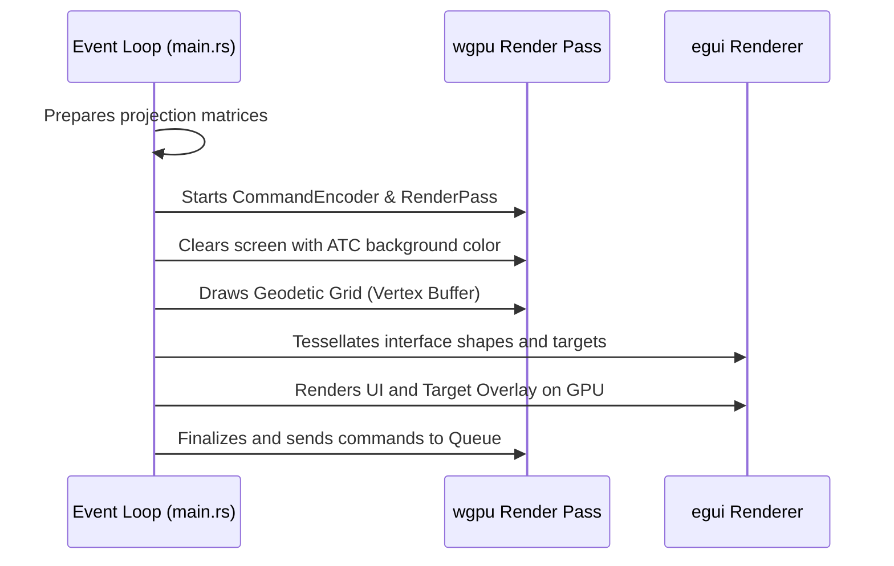

# Architecture: Native Layer Manager

This document details the architectural design and technical specification of the **Native Layer Manager** component of the Olayer Native SDK.

---

## 1. Overview

The **Native Layer Manager** manages the stack of cartographic and operational visualization layers in the native desktop environment. The main objective of this component is to coordinate which layers are visible, what the rendering order is (compositing), and when to redraw each graphic element to achieve maximum CPU and GPU efficiency.

---

## 2. Layer Structure and Compositing

Layers are drawn in strict depth order (back-to-front):

```
       [ Top ]
    ┌───────────────┐
    │ egui HUD / UI │  <-- Layer 3: Interactive Control and Panels
    └───────────────┘
    ┌───────────────┐
    │ Radar Targets │  <-- Layer 2: Aircraft and Vectors Drawing
    └───────────────┘
    ┌───────────────┐
    │ Geodetic Grid │  <-- Layer 1: Longitude and Latitude Lines
    └───────────────┘
    ┌───────────────┐
    │ Background    │  <-- Layer 0: ATC Screen Background Color (Clear)
    └───────────────┘
       [ Bottom ]
```

### 2.1 Rendering Cycle Segregation
To avoid redrawing large-scale geometries that rarely change (such as the geodetic grid), the rendering loop uses the following pattern:
* **Static Layers (Grid / Base Map):** Only regenerated on the CPU and resent to GPU buffers if the camera undergoes pan, zoom, or if the active projection is changed. Otherwise, the WGPU pipeline only performs a quick redraw from the already allocated buffers.
* **Dynamic Layers (Targets / Interface):** Redrawn in all frames using the active interface graphics rendering cycle (`egui` and `egui_wgpu`).

---

## 3. Implementation and Drawing Flow

The native rendering loop (described in [main.rs](file:///c:/Users/rafae/projects/rust/olayer/sdk/native/demo/src/main.rs)) performs the following flow at each frame:



---

## 4. Interfaces and Integration

### 4.1 `Layer` Trait
Every layer in the native stack implements the `Layer` trait (defined in `native_layer_manager/mod.rs`):
```rust
pub trait Layer {
    fn id(&self) -> &str;
    fn is_visible(&self) -> bool;
    fn set_visible(&mut self, visible: bool);
    fn is_static(&self) -> bool;
}
```
* **Static layers** (`is_static() == true`) are regenerated only when the camera changes pan, zoom, or projection.
* **Dynamic layers** (`is_static() == false`) are redrawn every frame.

### 4.2 `NativeLayerManager` API
The manager stores layers in a `Vec<Box<dyn Layer>>` and maintains a `HashMap<String, usize>` index for O(1) lookups.
```rust
pub struct NativeLayerManager {
    layers: Vec<Box<dyn Layer>>,
    index: HashMap<String, usize>,
    pub show_grid: bool,
    pub show_targets: bool,
    pub show_hud: bool,
    pub show_terrain: bool,
}
```
Key methods:
* `add_layer(layer: Box<dyn Layer>) -> Result<(), String>` — Adds a layer to the top of the stack.
* `remove_layer(id: &str) -> bool` — Removes a layer by ID.
* `reorder_layer(id: &str, new_index: usize) -> Result<(), String>` — Moves a layer to a new position.
* `visible_static_layers() -> Vec<&dyn Layer>` — Returns visible static layers.
* `visible_dynamic_layers() -> Vec<&dyn Layer>` — Returns visible dynamic layers.
* `set_layer_visibility(id: &str, visible: bool) -> Result<(), String>` — Toggles a single layer.
* `set_all_visibility(visible: bool)` — Toggles all layers.

### 4.3 Drawing Segmentation
Drawing is segmented by the following code areas:
* **Grid Drawing:** `rebuild_grid_buffers` method rebuilds the `grid_vertex_buffer` dynamically based on the current projection mode (2D/2.5D/3D).
* **Target and UI Drawing:** The `egui::Context::begin_frame` method initiates the context in which the screen Painter (`egui_ctx.layer_painter`) plots radar targets and data boxes, while HUD UI panels provide operational controls.
