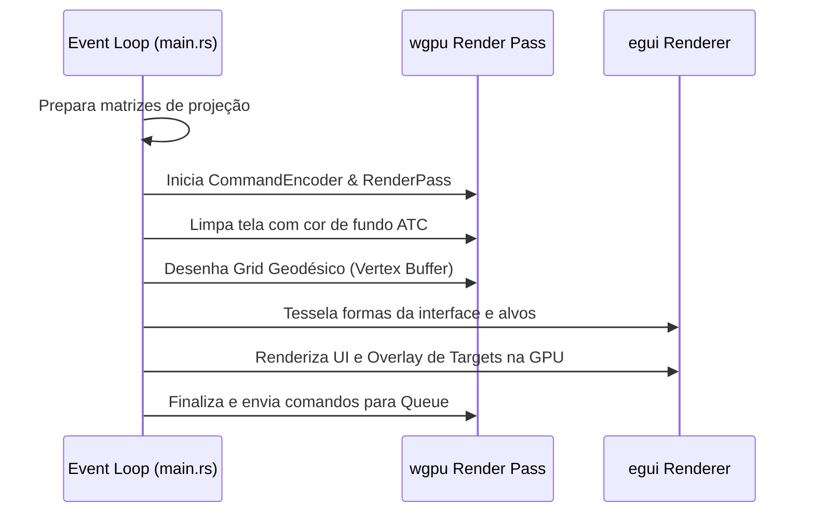

# Arquitetura: Native Layer Manager

Este documento detalha o design arquitetural e a especificação técnica do componente **Native Layer Manager** do SDK Nativo do Olayer.

---

## 1. Visão Geral

O **Native Layer Manager** gerencia a pilha de camadas de visualização cartográfica e operacional no ambiente nativo desktop. O objetivo principal deste componente é coordenar quais camadas são visíveis, qual a ordem de renderização (compositing) e quando redesenhar cada elemento gráfico para obter eficiência máxima de CPU e GPU.

---

## 2. Estrutura de Camadas e Compositing

As camadas são desenhadas em ordem estrita de profundidade (back-to-front):

```
       [ Topo ]
   ┌───────────────┐
   │ egui HUD / UI │  <-- Camada 3: Controle Interativo e Painéis
   └───────────────┘
   ┌───────────────┐
   │ Radar Targets │  <-- Camada 2: Desenho de Aeronaves e Vetores
   └───────────────┘
   ┌───────────────┐
   │ Grid Geodésico│  <-- Camada 1: Linhas de Longitude e Latitude
   └───────────────┘
   ┌───────────────┐
   │ Background    │  <-- Camada 0: Cor de Fundo de Tela ATC (Limpeza)
   └───────────────┘
      [ Fundo ]
```

### 2.1 Segregação de Ciclos de Renderização
Para evitar redesenhar geometrias de larga escala que mudam raramente (como a grade geodésica), o loop de renderização utiliza o seguinte padrão:
* **Camadas Estáticas (Grade / Mapa Base):** Apenas são regeneradas na CPU e reenviadas para buffers da GPU se a câmera sofrer pan, zoom ou se a projeção ativa for alterada. Do contrário, o pipeline WGPU faz apenas o redesenho rápido a partir de buffers já alocados.
* **Camadas Dinâmicas (Alvos / Interface):** Redesenhadas em todos os frames usando o ciclo de renderização ativa da interface gráfica (`egui` e `egui_wgpu`).

---

## 3. Implementação e Fluxo de Desenho

O loop de renderização nativa (descrito em [main.rs](file:///c:/Users/rafae/projects/rust/olayer/sdk/native/demo/src/main.rs)) realiza o seguinte fluxo a cada frame:



---

## 4. Interfaces e Integração

O desenho é segmentado pelas seguintes áreas de código:
* **Desenho da Grade:** Método `rebuild_grid_buffers` reconstrói o `grid_vertex_buffer` dinamicamente com base no modo de projeção atual (2D/2.5D/3D).
* **Desenho de Alvos e UI:** O método `egui::Context::begin_frame` inicia o contexto no qual o Painter de tela (`egui_ctx.layer_painter`) plota os alvos do radar e caixas de dados, enquanto painéis UI HUD fornecem controles operacionais.
