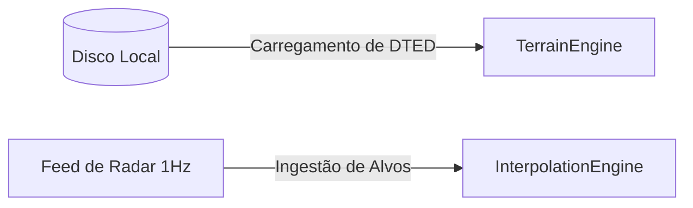

# Arquitetura: Native Map Data Stack

Este documento detalha o design arquitetural e a especificação técnica do componente **Native Map Data Stack** do SDK Nativo do Olayer.

---

## 1. Visão Geral

O **Native Map Data Stack** é a camada de infraestrutura de dados da SDK Nativa. Sua responsabilidade é fornecer, decodificar e gerenciar buffers de memória contendo informações geoespaciais (dados de terreno DTED) e dados dinâmicos de alvos operacionais (radar/ADS-B), alimentando os respectivos motores matemáticos do Core.

---

## 2. Ingestão de Terreno (DTED)

Ao contrário da versão WebAssembly (que consome tiles de elevação via requisições HTTP gerenciadas por TypeScript), o SDK Nativo realiza leituras locais e diretas de disco:
* **Formato:** Suporta a leitura de arquivos binários padrão DTED (Level 0, 1 ou 2).
* **Grid espacial:** A SDK lê o cabeçalho UHL do arquivo, extrai a latitude/longitude do tile e repassa o buffer binário bruto para o `TerrainEngine` do Core através de [load_tile](file:///c:/Users/rafae/projects/rust/olayer/core/src/terrain).
* **Inicialização:** Em [main.rs](file:///c:/Users/rafae/projects/rust/olayer/sdk/native/demo/src/main.rs), é feita a leitura/geração de mock tiles para a área do TMA São Paulo e sua injeção subsequente no controlador.

---

## 3. Ingestão de Alvos Dinâmicos (Radar Feed)

Os pacotes de telemetria das aeronaves no espaço aéreo (geralmente recebidos de feeds de radar ou ADS-B a uma frequência de 1 Hz) são injetados no sistema:
* **Dead Reckoning Setup:** O estado atual (latitude, longitude, altitude, velocidade, rumo e timestamp) é enviado para o `InterpolationEngine` via [update_target](file:///c:/Users/rafae/projects/rust/olayer/core/src/interpolator).
* **Atualização:** Em [main.rs](file:///c:/Users/rafae/projects/rust/olayer/sdk/native/demo/src/main.rs), um timer simula a atualização de posições a cada segundo, atualizando o modelo físico geodésico correspondente.

---

## 4. Integração C-FFI para Sistemas Host

Para aplicações hosts escritas em C/C++, o carregamento e manipulação desses dados são expostos através de funções FFI seguras localizadas em [c_ffi_bridge/mod.rs](file:///c:/Users/rafae/projects/rust/olayer/sdk/native/src/c_ffi_bridge/mod.rs):

* **Carregar Terreno:** `olayer_terrain_engine_load_tile`
* **Descarregar Terreno:** `olayer_terrain_engine_unload_tile`
* **Atualizar Alvo:** `olayer_interpolator_update`
