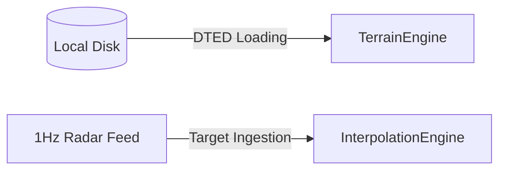

# Architecture: Native Map Data Stack

This document details the architectural design and technical specification of the **Native Map Data Stack** component of the Olayer Native SDK.

---

## 1. Overview

The **Native Map Data Stack** is the data infrastructure layer of the Native SDK. Its responsibility is to provide, decode, and manage memory buffers containing geospatial information (DTED terrain data) and dynamic operational target data (radar/ADS-B), feeding the respective mathematical engines of the Core.



---

## 2. Data Source Abstraction (`MapDataSource`)

The native stack uses a generic `MapDataSource` trait to register multiple providers (terrain, raster, vector) behind a unified registry:
```rust
pub trait MapDataSource {
    fn id(&self) -> &str;
    fn clear_cache(&mut self);
    fn cache_size(&self) -> usize;
}
```
* `NativeMapDataStack` holds a `HashMap<String, Box<dyn MapDataSource>>` and provides:
  * `register_source(source: Box<dyn MapDataSource>) -> Result<(), String>`
  * `get_source(id: &str) -> Option<&dyn MapDataSource>`
  * `clear_cache()` — clears all registered sources.
  * `get_cache_size() -> usize` — aggregate cache size.

---

## 3. Terrain Ingestion (DTED)

Unlike the WebAssembly version (which consumes elevation tiles via HTTP requests managed by TypeScript), the Native SDK performs local and direct disk readings:
* **Format:** Supports reading of standard binary DTED files (Level 0, 1, or 2).
* **Spatial grid:** The SDK reads the UHL file header, extracts the tile's latitude/longitude, and passes the raw binary buffer to the Core's `TerrainEngine` through [load_tile](file:///c:/Users/rafae/projects/rust/olayer/core/src/terrain).
* **Direct helpers:** `NativeMapDataStack` provides backward-compatible helpers:
  * `load_dted_file(path: &str, terrain: &mut TerrainEngine) -> Result<(), String>`
  * `load_dted_buffer(buffer: &[u8], terrain: &mut TerrainEngine) -> Result<(), String>`
* **Concrete source:** `TerrainDataSource` wraps a `TerrainEngine` and tracks loaded tiles so it can implement `clear_cache` and `cache_size`:
  * `load_file(path: &str) -> Result<(), String>`
  * `load_buffer(buffer: &[u8]) -> Result<(), String>`
  * `unload_tile(lat_deg: i32, lon_deg: i32) -> bool`
  * `get_elevation(lat_deg: f64, lon_deg: f64) -> Result<f64, String>`
* **Initialization:** In [main.rs](file:///c:/Users/rafae/projects/rust/olayer/sdk/native/demo/src/main.rs), mock tile reading/generation is performed for the São Paulo TMA area and its subsequent injection into the controller.

---

## 4. Dynamic Target Ingestion (Radar Feed)

Aircraft telemetry packets in the airspace (usually received from radar or ADS-B feeds at a frequency of 1 Hz) are injected into the system:
* **Dead Reckoning Setup:** The current state (latitude, longitude, height, speed, heading, and timestamp) is sent to the `InterpolationEngine` via [update_target](file:///c:/Users/rafae/projects/rust/olayer/core/src/interpolator).
* **Update:** In [main.rs](file:///c:/Users/rafae/projects/rust/olayer/sdk/native/demo/src/main.rs), a timer simulates position updates every second, updating the corresponding geodetic physical model.

---

## 5. C-FFI Integration for Host Systems

For C/C++ host applications, the loading and manipulation of these data are exposed through safe FFI functions located in [c_ffi_bridge/mod.rs](file:///c:/Users/rafae/projects/rust/olayer/sdk/native/src/c_ffi_bridge/mod.rs):

* **Load Terrain:** `olayer_terrain_engine_load_tile`
* **Unload Terrain:** `olayer_terrain_engine_unload_tile`
* **Update Target:** `olayer_interpolator_update`
