# Component Architecture: Native Tactical Tools (sdk/native/tools)
## Tactical Aeronautical Measurement Tools & Procedural Overlays (`GIS-PROP-003`)

The **Native Tactical Tools Component** (`sdk/native/src/tools`) provides native Rust routines and C-compatible FFI interfaces for tactical aeronautical measurement, kinematic track prediction, procedure geometry generation, and dynamic ATC radar overlays.

---

## 1. Responsibilities and Design Goals

* **Aeronautical Geodesy:** Geodesic distance calculation in Nautical Miles ($1\text{ NM} = 1852.0\text{ m}$) and kilometers, initial True bearing, WMM-2025 magnetic declination bearing correction, and estimated time en route (ETE).
* **Kinematic Prediction (PPL):** Projection of aircraft vector leaders along current track headings at specified time intervals (e.g., 1 min, 2 min, 5 min).
* **Standard Holding Patterns:** Procedural racetrack holding pattern generation with standard rate-one ($3^\circ/\text{s}$) turns, configurable leg duration, and inbound bearing orientation.
* **ILS Precision Approach Geometry:** Approach corridor funnel generation with customizable field-of-view, extended centerline, and distance crossbars.
* **Range Rings & Compass Rose:** Dynamic concentric distance circles and azimuth spokes anchored to arbitrary radar/navaid centers.
* **Radar Snail Trails (History Dots):** Time-decaying historical radar hit buffer with configurable retention and linear/exponential opacity decay.
* **C-FFI Interoperability:** C-compatible ABI exports (`libolayer_native.h`) for integration into C/C++ desktop radar displays.

---

## 2. Component Class & Module Diagram

```mermaid
graph TB
    classDef rustStruct fill:#C8E6C9,stroke:#388E3C,color:#1B5E20,stroke-width:2px;
    classDef cffi fill:#FFF9C4,stroke:#FBC02D,color:#5D4037,stroke-width:2px;
    classDef coreModule fill:#E1F5FE,stroke:#0288D1,color:#01579B,stroke-width:2px;

    subgraph Native_Tools ["olayer_native::tools"]
        tactical_manager["TacticalToolsManager"]:::rustStruct
        rbl["RblMeasurement<br>compute_rbl()"]:::rustStruct
        ppl["PplLeader / PplTick<br>generate_ppl()"]:::rustStruct
        holding["HoldingPatternConfig<br>generate_holding_pattern()"]:::rustStruct
        ils["IlsConeConfig / IlsGeometry<br>generate_ils_cone()"]:::rustStruct
        rings["RangeRingsConfig<br>generate_range_rings()"]:::rustStruct
        snail["SnailTrailManager / HistoryDot<br>push_hit() / update_decay()"]:::rustStruct
    end

    subgraph C_FFI ["C-FFI Bridge (libolayer_native.h)"]
        c_rbl["olayer_tools_compute_rbl"]:::cffi
        c_ppl["olayer_tools_generate_ppl"]:::cffi
        c_holding["olayer_tools_generate_holding_pattern"]:::cffi
        c_ils["olayer_tools_generate_ils_cone"]:::cffi
        c_rings["olayer_tools_generate_range_rings"]:::cffi
    end

    subgraph Rust_Core ["olayer_core::geodesy"]
        vincenty["VincentySolver / HaversineSolver"]:::coreModule
        magnetic["MagneticModel (WMM-2025)"]:::coreModule
        ellipsoid["Ellipsoid::wgs84()"]:::coreModule
    end

    tactical_manager --> rbl
    tactical_manager --> ppl
    tactical_manager --> holding
    tactical_manager --> ils
    tactical_manager --> rings
    tactical_manager --> snail

    rbl --> vincenty
    rbl --> magnetic
    ppl --> vincenty
    holding --> vincenty
    ils --> vincenty
    rings --> vincenty

    c_rbl --> rbl
    c_ppl --> ppl
    c_holding --> holding
    c_ils --> ils
    c_rings --> rings
```



---

## 3. C-FFI Export Summary

The following functions are exposed in `libolayer_native.h`:

```c
// Range & Bearing Line
int32_t olayer_tools_compute_rbl(
    double from_lat_deg, double from_lon_deg,
    double to_lat_deg, double to_lon_deg,
    double speed_knots, double epoch_year,
    C_RblMeasurement* out_measurement
);

// Projected Position Leader
int32_t olayer_tools_generate_ppl(
    double lat_deg, double lon_deg,
    double ground_speed_knots, double track_deg,
    const double* intervals_min, size_t num_intervals,
    C_PplTick* out_ticks, size_t max_ticks,
    size_t* out_written_ticks
);

// Racetrack Holding Pattern
int32_t olayer_tools_generate_holding_pattern(
    double fix_lat_deg, double fix_lon_deg,
    double inbound_bearing_deg, int32_t is_standard_right,
    double leg_time_min, double airspeed_kts,
    size_t points_per_turn,
    double* out_lat_lons, size_t max_points,
    size_t* out_written_points
);

// ILS Approach Cone
int32_t olayer_tools_generate_ils_cone(
    double threshold_lat_deg, double threshold_lon_deg,
    double runway_heading_deg, double length_nm,
    double fov_deg, size_t arc_steps,
    double* out_lat_lons, size_t max_points,
    size_t* out_written_points
);

// Range Rings
int32_t olayer_tools_generate_range_rings(
    double center_lat_deg, double center_lon_deg,
    const double* radii_nm, size_t num_radii,
    size_t points_per_ring,
    double* out_lat_lons, size_t max_points,
    size_t* out_written_points
);
```
