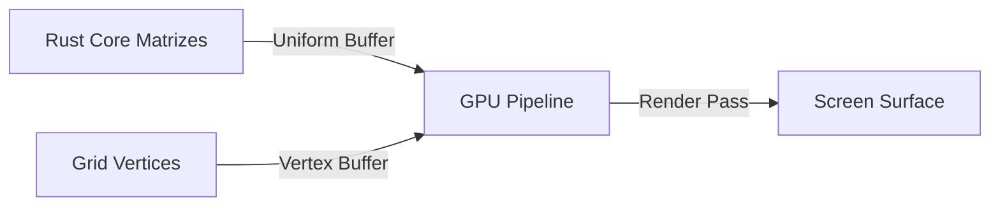

# Arquitetura: wgpu GPU Pipeline

Este documento detalha o design arquitetural e a especificação técnica do componente **wgpu GPU Pipeline** do SDK Nativo do Olayer.

---

## 1. Visão Geral

O **wgpu GPU Pipeline** é o motor de renderização gráfica acelerada por hardware do SDK Nativo, implementado através da biblioteca multiplataforma `wgpu` em Rust. Ele é projetado para desenhar elementos geográficos de grande escala com alta taxa de quadros e baixa latência de barramento (CPU/GPU), aproveitando APIs nativas como Vulkan, Metal e DirectX 12.



---

## 2. Configuração e Inicialização

1. **Instância WGPU:** Criada com o descritor padrão.
2. **Superfície:** Vinculada à janela nativa do `winit`.
3. **Adaptador & Dispositivo:** Requisitados com preferência para alta performance (`HighPerformance`).
4. **Configuração da Superfície:** Define a largura/altura e o formato de cores com base nas dimensões da janela física.
O processo de inicialização do WGPU e criação da superfície ocorre de forma nativa e síncrona no ponto de entrada [main.rs](file:///c:/Users/rafae/projects/rust/olayer/sdk/native/demo/src/main.rs):

---

## 3. Pipeline de Desenho e Shader WGSL

### 3.1 Shader WGSL
O shader de grade base (linhas de latitude e longitude) é escrito na linguagem de sombreamento WGSL e compilado em tempo de execução:
```rust
struct VertexOutput {
    @builtin(position) position: vec4<f32>,
    @location(0) color: vec4<f32>,
};

@group(0) @binding(0)
var<uniform> view_proj: mat4x4<f32>;
@group(0) @binding(1)
var<uniform> grid_color: vec4<f32>;

@vertex
fn vs_main(@location(0) pos: vec3<f32>) -> VertexOutput {
    var out: VertexOutput;
    out.position = view_proj * vec4<f32>(pos, 1.0);
    out.color = grid_color;
    return out;
}

@fragment
fn fs_main(in: VertexOutput) -> @location(0) vec4<f32> {
    return in.color;
}
```

### 3.2 Alocação de Buffers e Pipeline de Renderização
* **Uniform Buffer:** Aloca 80 bytes (64 bytes para a matriz de projeção `view_proj` e 16 bytes para o vetor de cor `grid_color`).
* **Vertex Buffer:** Gerenciado em `rebuild_grid_buffers`. Reconstrói os pontos de linhas de grade e os envia à GPU quando a projeção ativa é alterada.
* **Pipeline de Renderização:** Configurado com topologia `LineList` para desenho rápido de linhas, blend de cores habilitado (`ALPHA_BLENDING`) e escrita em todos os canais de cores.

---

## 4. Integração no Frame Rendering Loop

Durante a repintura (Redraw), o `CommandEncoder` e o `RenderPass` correspondente desenham a grade na GPU aplicando os buffers apropriados:

```rust
render_pass.set_pipeline(&pipeline);
render_pass.set_bind_group(0, &bind_group, &[]);
render_pass.set_vertex_buffer(0, buffer.slice(..));
render_pass.draw(0..(grid_vertices.len() / 3) as u32, 0..1);
```
