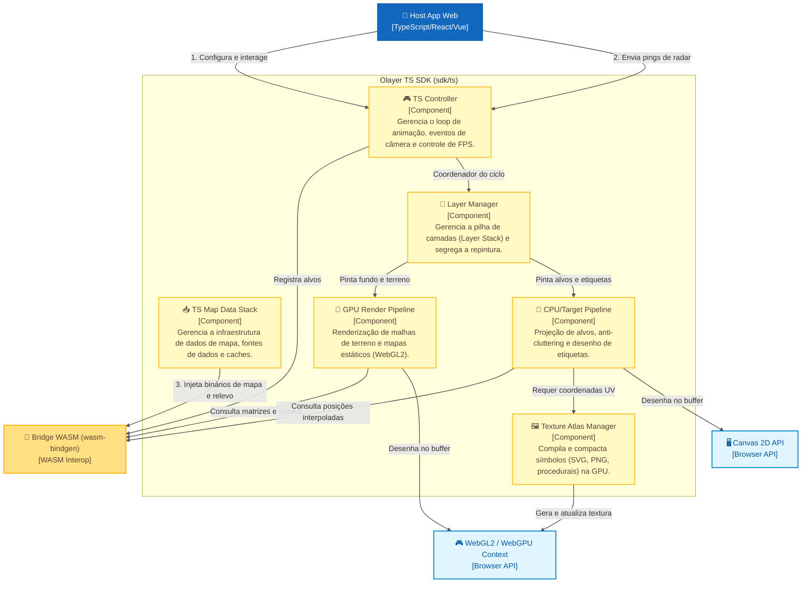

# SDK TypeScript (Web)
## Componentes da SDK TypeScript (C4 Model - Nível 3)

Este documento apresenta a organização de alto nível dos componentes do **Olayer TS SDK** (localizado em `sdk/ts`), servindo como mapa de navegação para a documentação de arquitetura específica de cada submódulo.

---

## 1. Diagrama de Componentes da SDK TS

O diagrama abaixo detalha a estrutura interna da SDK TypeScript e suas interações com a ponte WebAssembly, a aplicação Host e as APIs gráficas do navegador.

---

## 2. Detalhamento e Arquitetura dos Submódulos

Cada componente principal da SDK está documentado em um arquivo de arquitetura detalhado (`arch.md`) localizado em seu respectivo diretório de especificação técnica:

### 🎮 2.1 TS Controller
Ponto de entrada unificado da SDK. Atua como o maestro do ciclo de vida, loop principal e throttling dinâmico de FPS.
* Detalhamento técnico completo: [arch.md](file:///c:/Users/rafae/projects/rust/olayer/docs/sdk/ts/controller/arch.md)

### 🥞 2.2 Layer Manager
Coordenador da pilha de camadas (Layer Stack), responsável pela ordenação e pela otimização de renderização segregada entre elementos dinâmicos e estáticos.
* Detalhamento técnico completo: [arch.md](file:///c:/Users/rafae/projects/rust/olayer/docs/sdk/ts/layers/arch.md)

### 📥 2.3 Map Data Stack (Providers)
Módulo encarregado do carregamento sob demanda, paginação e cacheamento inteligente (com política LRU) de dados cartográficos (MVT, WMTS) e de terreno (DTED).
* Detalhamento técnico completo: [arch.md](file:///c:/Users/rafae/projects/rust/olayer/docs/sdk/ts/providers/arch.md)

### 🎨 2.4 Render Pipelines & Texture Atlas
Motores gráficos de desenho. Contém o pipeline de renderização GPU (WebGL2), o pipeline de radar CPU (com algoritmo de prevenção de sobreposição de etiquetas/anti-cluttering) e o Texture Atlas Manager.
* Detalhamento técnico completo: [arch.md](file:///c:/Users/rafae/projects/rust/olayer/docs/sdk/ts/renderer/arch.md)
