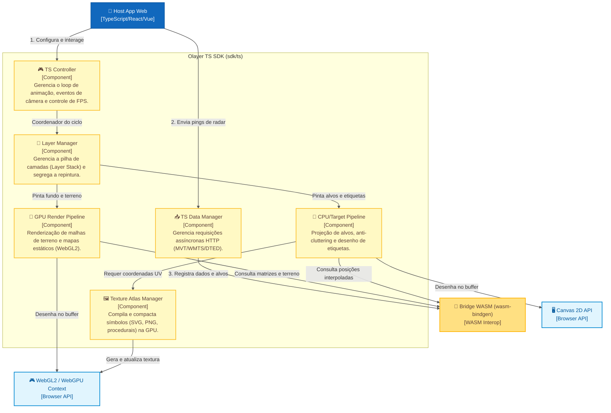

# SDK TypeScript (Web)
## Componentes da SDK TypeScript (C4 Model - Nível 3)

Este documento descreve o design detalhado, a estrutura de classes, as responsabilidades e os fluxos de trabalho do **Olayer TS SDK**, localizado em `sdk/ts`. Este contêiner é responsável por coordenar a interface visual com o usuário, gerenciar o loop de renderização do navegador, requisitar dados externos e realizar a plotagem híbrida (GPU/CPU) integrando-se ao core via ponte WebAssembly.

---

## 1. Diagrama de Componentes da SDK TS

O diagrama abaixo detalha a estrutura interna da SDK TypeScript e suas interações com a ponte WebAssembly, a aplicação Host e as APIs gráficas do navegador.



---

## 2. Responsabilidades dos Componentes

### 🎮 2.1 TS Controller (`sdk/ts/src/controller`)
Ponto de entrada unificado da SDK. Atua como o maestro do ciclo de vida da visualização ATC.
* **Responsabilidades:**
  * Implementar o loop principal do sistema utilizando `requestAnimationFrame`.
  * Gerenciar o **Throttling Dinâmico de FPS** para otimização de recursos de hardware:
    * **Modo Ativo (60 FPS):** Ativado automaticamente durante interações de câmera (zoom, pan, rotação) ou arraste de elementos na tela.
    * **Modo Econômico (15 FPS):** Ativado quando a visualização permanece estática (câmera imóvel), preservando ciclos de CPU/GPU e bateria em painéis ATC de longa duração.
  * Manter e atualizar a estrutura de dados de controle de câmera (escala, centro em coordenadas geodésicas, rotação) e repassá-la para o resolvedor de projeção do WASM.
  * Capturar eventos nativos de mouse e teclado (zoom da roda do mouse, cliques, arraste) e traduzi-los em coordenadas geográficas coerentes.

### 🥞 2.2 Layer Manager (`sdk/ts/src/layers`)
Responsável pela organização, ordem de sobreposição (*z-index*) e segregação das camadas visuais.
* **Responsabilidades:**
  * Manter uma pilha de camadas estruturada contendo camadas estáticas de fundo de mapa, linhas de setores, aerovias, altitudes de relevo, radar meteorológico e alvos de tráfego aéreo.
  * Otimizar o ciclo de repintura do Canvas através da **Segregação de Pintura**:
    * **Camadas Estáticas:** Renderizadas no contexto WebGL/GPU apenas sob modificação física de câmera e salvas em cache local de Framebuffer.
    * **Camadas Dinâmicas (Alvos & Radar):** Atualizadas em tempo real a cada frame do loop principal (até 60 FPS) sobrepondo-se à textura composta das camadas estáticas através de *blitting* de buffer.

### 📥 2.3 TS Data Manager (`sdk/ts/src/providers`)
Módulo responsável pelas operações de rede e transporte de arquivos binários geográficos para o core Rust.
* **Responsabilidades:**
  * Realizar requisições assíncronas HTTP (`fetch`) para obter tiles vetoriais Mapbox (MVT) e imagens WMTS baseadas no GeoServer.
  * Requisitar e baixar pedaços de elevação digital de terreno (arquivos binários DTED) conforme a câmera expõe novas coordenadas.
  * Alimentar passivamente a heap do WebAssembly injetando buffers binários (`ArrayBuffer` / `Uint8Array`) através da interface `load_tile` de forma **Zero-Copy**, evitando cópias desnecessárias na memória.
  * Gerenciar o cache local de tiles MVT e DTED na thread principal do JS.

### 🎨 2.4 GPU Render Pipeline (`sdk/ts/src/renderer/gpu`)
Motor de renderização focado na GPU, encarregado de desenhar a malha geográfica complexa.
* **Responsabilidades:**
  * Configurar o contexto WebGL 2.0 (ou WebGPU) compartilhado com a tela.
  * Compilar e gerenciar os shaders da GPU (Vertex e Fragment Shaders) necessários para renderizar o terreno e geometrias de mapa.
  * Requisitar as matrizes de Projeção-Visualização $4 \times 4$ (ortográficas 2D ou perspectiva 3D) compiladas pelo Core WASM e injetá-las como variáveis uniformes na GPU.
  * Fazer o upload das elevações de terreno para texturas e convertê-las em deformações tridimensionais no Vertex Shader.
  * **Renderização 3D do Globo:** Gerar proceduralmente a malha de vértices de uma esfera (elipsoide terrestre) e renderizá-la no WebGL com suporte a linhas de grade curvadas em 3D.

### 🎯 2.5 CPU/Target Pipeline (`sdk/ts/src/renderer/cpu`)
Pipeline focada em renderizar com extrema clareza e fidelidade pixel-perfect os alvos dinâmicos na tela.
* **Responsabilidades:**
  * Consultar a lista de aeronaves ativas com posições suavizadas via Dead Reckoning (`interpolate_all`) do Core Rust WASM.
  * Converter posições geodésicas (2D ou ECEF 3D) em coordenadas de tela $(X,Y)$ usando a matriz de câmera ativa (ortográfica ou perspectiva).
  * Renderizar a simbologia correta (proveniente do Atlas de Texturas) orientada à câmera (*Billboard* automático para visualizações 3D).
  * Executar a plotagem de réguas interativas (ex: vetor de rumo preditivo de 1 a 5 minutos, anéis de distância e alertas de proximidade).
  * Integrar-se ao **Label Manager** para desenhar etiquetas de dados e evitar a sobreposição de textos.
  * **Visualização 2.5D:** Desenhar perfis longitudinais do terreno e trajetórias verticais de altitude a partir dos dados gerados por `get_vertical_profile`.

### 🖼️ 2.6 Texture Atlas Manager (`sdk/ts/src/renderer/atlas`)
Gerenciador dinâmico de spritesheets para garantir que milhares de símbolos sejam desenhados em pouquíssimas chamadas de GPU.
* **Responsabilidades:**
  * Criar e expandir dinamicamente um buffer de textura 2D único na GPU (Texture Atlas).
  * Rasterizar proceduralmente em um canvas oculto (*offscreen*) símbolos ICAO e modificadores militares baseados nas geometrias vetoriais obtidas do `Symbol Registry` do Core Rust.
  * Permitir a importação de ícones customizados **SVG** e **PNG**:
    * Símbolos **PNG** são decodificados em buffers de pixel e transferidos diretamente para as coordenadas livres do atlas.
    * Símbolos **SVG** são desenhados no canvas offscreen na escala física de tela necessária para evitar serrilhados (suporte nativo a telas Retina/High-DPI) antes de serem inseridos no atlas.
  * Fornecer e mapear o dicionário de coordenadas UV de cada símbolo indexado para que o pipeline instanciador realize o desenho via `drawElementsInstanced`.

---

## 3. Interfaces e Estrutura de Classes da SDK

A estrutura lógica do código no diretório `sdk/ts/src` é projetada conforme os componentes:

### 3.1 Definição do Controlador Principal
```typescript
import {
  WasmTerrainEngine,
  WasmInterpolationEngine,
  WasmProjection,
  WasmCameraState,
} from "olayer-wasm";

export interface OlayerConfig {
  glCanvas: HTMLCanvasElement;
  canvas2D: HTMLCanvasElement;
  projection: WasmProjection;
  initialCenterLatRad?: number;
  initialCenterLonRad?: number;
  initialZoom?: number;
  viewportBaseMeters?: number;
}

export class OlayerController {
  public readonly glCanvas: HTMLCanvasElement;
  public readonly canvas2D: HTMLCanvasElement;
  public readonly gl: WebGL2RenderingContext;
  public readonly ctx2d: CanvasRenderingContext2D;

  public terrainEngine: WasmTerrainEngine;
  public interpolator: WasmInterpolationEngine;
  public projection: WasmProjection;

  public layerManager: LayerManager;
  public dataManager: DataManager;

  private centerLat: number;
  private centerLon: number;
  private centerHeight: number;
  private zoom: number;
  private rotation: number;
  private viewportBaseMeters: number;

  private is3D: boolean;
  public currentViewProjMatrix: Float32Array;

  constructor(config: OlayerConfig) {
    // Inicializa contextos gráficos, WASM e subsistemas
  }

  public startLoop(): void;
  public stopLoop(): void;
  public triggerActive(): void;
  public getFPS(): number;
  
  public getIs3D(): boolean;
  public setIs3D(value: boolean): void;

  public getCenterLat(): number;
  public getCenterLon(): number;
  public getCenterHeight(): number;
  public getZoom(): number;
  public getRotation(): number;
  public getViewportBaseMeters(): number;

  public setCenter(latRad: number, lonRad: number): void;
  public setZoom(zoom: number): void;
  public setRotation(rotationRad: number): void;
}
```

### 3.2 Gerenciamento de Camadas (Layers)
```typescript
export abstract class Layer {
  public id: string;
  public visible: boolean = true;
  public opacity: number = 1.0;

  constructor(id: string) {}

  public abstract renderStatic(gl: WebGL2RenderingContext, matrix: Float32Array): void;
  public abstract renderDynamic(ctx: CanvasRenderingContext2D, time: number): void;
}

export class LayerManager {
  private layers: Layer[] = [];

  public addLayer(layer: Layer): void;
  public removeLayer(id: string): boolean;
  public reorderLayer(id: string, index: number): void;
  
  // Renderização segregada
  public renderStaticLayers(gl: WebGL2RenderingContext, matrix: Float32Array): void;
  public renderDynamicLayers(ctx: CanvasRenderingContext2D, time: number): void;
}
```

### 3.3 Gerenciamento de Dados de Rede
```typescript
export class DataManager {
  private terrainCache: Map<string, Uint8Array> = new Map();
  private controller: OlayerController;

  constructor(controller: OlayerController) {}

  /**
   * Baixa um tile DTED via HTTP e o registra de forma Zero-Copy no Core WASM
   */
  public async loadDtedTile(lat: number, lon: number): Promise<void> {
    const tileKey = `${lat}_${lon}`;
    if (this.terrainCache.has(tileKey)) return;

    const url = `/terrain/dted/dted0_lat${lat}_lon${lon}.dt0`;
    const response = await fetch(url);
    const arrayBuffer = await response.arrayBuffer();
    const bytes = new Uint8Array(arrayBuffer);

    // Salva no cache do JS
    this.terrainCache.set(tileKey, bytes);

    // Envia o Uint8Array diretamente. O wasm-bindgen mapeia o slice de memória
    this.controller.terrainEngine.load_tile(bytes);
  }
}
```

---

## 4. Gerenciamento de Memória & Ciclo de Vida (ADR-004)

Pelo fato de o WebAssembly utilizar memória linear que não é monitorada pelo Garbage Collector (GC) do JavaScript, a SDK TypeScript implementa regras estritas de ciclo de vida para evitar vazamentos de memória (*Memory Leaks*):

### 4.1 Desalocação Explícita de Objetos WASM
Ao destruir o controlador `OlayerController` ou reconfigurar as engines, todos os recursos em Rust devem ser liberados na heap chamando o método `.free()` exposto pela ponte WASM:
```typescript
public destroy(): void {
  this.stopLoop();
  
  // Desalocação de memória nativa
  if (this.terrainEngine) {
    this.terrainEngine.free(); // Libera arrays DTED carregados
  }
  if (this.interpolator) {
    this.interpolator.free();  // Libera a tabela de alvos dinâmicos
  }
}
```

### 4.2 Política de Cache LRU de Terreno
Para relevo digital denso, a SDK mantém um cache limitador do tipo **LRU (Least Recently Used)** contendo no máximo $N$ tiles ativos de terreno. Quando a câmera se move e exige um novo tile, o mais antigo é desalocado:
```typescript
private handleTerrainEviction(evictedLat: number, evictedLon: number): void {
  // 1. Notifica o Core Rust para liberar a matriz de elevações correspondente
  this.terrainEngine.unload_tile(evictedLat, evictedLon);
  
  // 2. Remove o buffer do cache JS
  const tileKey = `${evictedLat}_${evictedLon}`;
  this.terrainCache.delete(tileKey);
}
```

---

## 5. Estratégias de Otimização Visual

### 5.1 Prevenção de Sobreposição de Etiquetas (Anti-cluttering)
Para que telas de radar complexas mantenham-se legíveis em alta densidade de tráfego, a pipeline de renderização CPU (`CPUPipeline`) implementa o seguinte algoritmo de posicionamento dinâmico na thread do JS:
1. **Fração de Projeção:** Cada coordenada geodésica suavizada é convertida em uma coordenada plana de tela $(X,Y)$ e classificada por profundidade.
2. **Definição de Bounding Box:** É calculado o retângulo limitador (*Bounding Box*) ocupado pelo símbolo e o texto da etiqueta (com base no tamanho da fonte e na quantidade de caracteres).
3. **Mapeamento de Ocupação:** Uma árvore estática 2D de posicionamento rápido ou tabela de colisão em tela (*Grid Collision Table*) armazena os retângulos já ocupados por alvos prioritários.
4. **Resolução de Conflitos (Offset Alternado):** Caso o retângulo de um novo alvo coincida com uma região já ocupada:
   * A SDK tenta rotacionar a âncora da etiqueta para posições livres predefinidas (Nordeste -> Sudeste -> Sudoeste -> Noroeste).
   * Se nenhuma posição estiver disponível, a etiqueta secundária é ocultada e apenas a plota do radar é renderizada na tela para evitar poluição visual.

### 5.2 Fluxo do Loop Dinâmico de FPS (FPS Throttling)
A transição autônoma de taxas de frames é orquestrada conforme a sequência abaixo:

```mermaid
sequenceDiagram
    autonumber
    participant Host as Host App
    participant SDK as TS Controller
    participant Loop as requestAnimationFrame

    Host->>SDK: Inicializa Visualização (Câmera Estática)
    SDK->>SDK: Define modo econômico (15 FPS)
    Loop->>SDK: Tick de frame
    SDK->>SDK: Calcula e renderiza (15 quadros por segundo)
    
    Note over Host, SDK: Usuário começa a arrastar o mapa (Pan/Zoom)
    Host->>SDK: Evento de Câmera (Mouse Move)
    SDK->>SDK: Transiciona para Modo Ativo (60 FPS)
    Loop->>SDK: Tick de frame acelerado
    SDK->>SDK: Renderiza com alta fluidez (60 quadros por segundo)
    
    Note over Host, SDK: Usuário solta o mouse e a câmera para de se mover
    SDK->>SDK: Aguarda timeout de estabilização (ex: 200ms)
    SDK->>SDK: Transiciona de volta para Modo Econômico (15 FPS)
    Loop->>SDK: Tick de frame desacelerado
```
