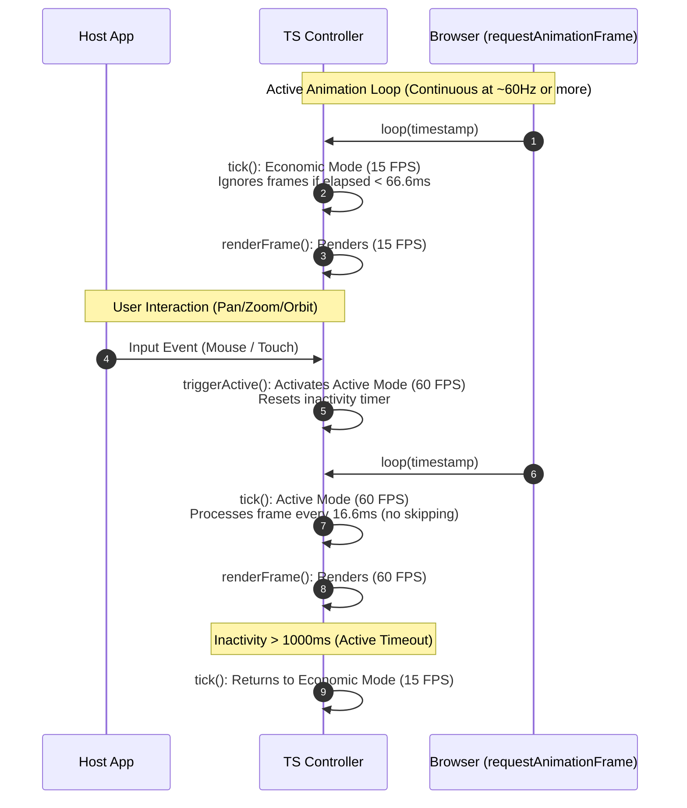

# SDK TS Component: Controller (`sdk/ts/src/controller`)

The **TS Controller** is the maestro and main entry point of the TypeScript SDK. It coordinates the map visual element lifecycle, captures user interaction, and orchestrates the frame loop rhythm.

---

## 1. Responsibilities
* **Main Animation Loop:** Controls periodic paint calls using the browser's `requestAnimationFrame` API.
* **Dynamic FPS Throttling (FPS Throttling):** Autonomously toggles the frame rate to save computational resources and battery:
  * **Active Mode (60 FPS):** Activated while the user interacts (zoom, pan, orbit) or targets are actively changing.
  * **Economic Mode (15 FPS):** Activated automatically after the camera stabilization or idleness timeout.
* **User Input Processing:** Intercepts and decodes mouse clicks, movements, wheel scroll (wheel), and touch clicks.
* **Camera Attitude Management:** Maintains camera variables (`center`, `zoom`, `bearing`, `pitch`, `roll`) and sends them to the WASM bridge for matrix computation.

---

## 2. Interfaces and Class Structure

```typescript
import {
  WasmTerrainEngine,
  WasmInterpolationEngine,
  WasmProjection,
  WasmCameraState,
} from "olayer-wasm";
import { LayerManager } from "../layers";
import { MapDataStack } from "../providers";

export type ViewMode = "2D" | "2.5D" | "3D";

export interface OlayerConfig {
  glCanvas: HTMLCanvasElement;
  canvas2D: HTMLCanvasElement;
  projection: WasmProjection;
  initialCenterLatRad?: number;
  initialCenterLonRad?: number;
  initialZoom?: number;
  viewportBaseMeters?: number;
}

export class OlayerController {
  public readonly glCanvas: HTMLCanvasElement;
  public readonly canvas2D: HTMLCanvasElement;
  public readonly gl: WebGL2RenderingContext;
  public readonly ctx2d: CanvasRenderingContext2D;

  public readonly terrainEngine: WasmTerrainEngine;
  public readonly interpolator: WasmInterpolationEngine;
  public readonly projection: WasmProjection;

  public readonly layerManager: LayerManager;
  public readonly dataManager: MapDataStack;

  private centerLat: number; // radians
  private centerLon: number; // radians
  private centerHeight: number = 0.0;
  private zoom: number;
  private rotation: number = 0.0; // bearing
  private pitch: number = 0.0;    // tilt
  private roll: number = 0.0;
  private viewportBaseMeters: number;

  private viewMode: ViewMode = "2D";
  public currentViewProjMatrix: Float32Array = new Float32Array(16);

  constructor(config: OlayerConfig);
  
  public startLoop(): void;
  public stopLoop(): void;
  public triggerActive(): void;
  public getFPS(): number;
  
  public getViewMode(): ViewMode;
  public setViewMode(value: ViewMode): void;

  public getCenterLat(): number;
  public getCenterLon(): number;
  public getZoom(): number;
  public getRotation(): number;
  public getPitch(): number;
  public setPitch(pitchRad: number): void;
  public getRoll(): number;
  public setRoll(rollRad: number): void;
  public setCenter(latRad: number, lonRad: number): void;
  public setZoom(zoom: number): void;
  public setRotation(rotationRad: number): void;
  
  private setupInteractions(): void;
  private resizeCanvas(): void;
  private tick(timestamp: number): void;
  private renderFrame(): void;
}
```

---

## 3. Processing Flow (FPS Throttling Sequence)


