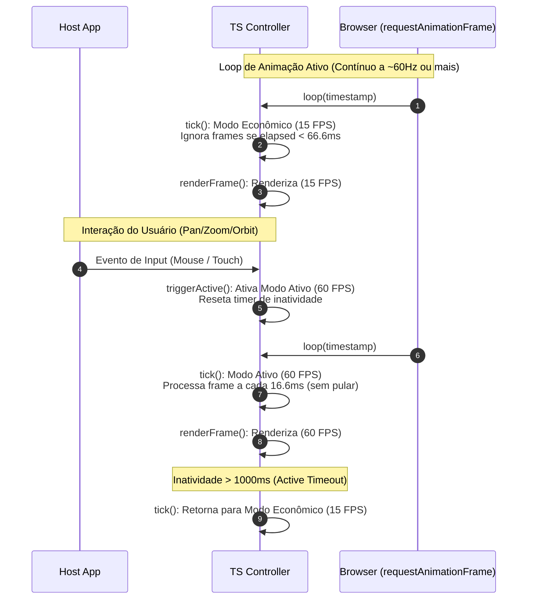

# Componente SDK TS: Controller (`sdk/ts/src/controller`)

O **TS Controller** é o maestro e o ponto de entrada principal do SDK TypeScript. Ele coordena o ciclo de vida do elemento visual do mapa, captura a interação do usuário e orquestra o ritmo do loop de frames.

---

## 1. Responsabilidades
* **Loop de Animação Principal:** Controla as chamadas de pintura periódicas usando a API `requestAnimationFrame` do navegador.
* **Throttling Dinâmico de FPS (FPS Throttling):** Alterna autonomamente a taxa de quadros para poupar recursos computacionais e bateria:
  * **Modo Ativo (60 FPS):** Ativado enquanto o usuário interage (zoom, pan, órbita) ou alvos estão mudando ativamente.
  * **Modo Econômico (15 FPS):** Ativado automaticamente após o tempo limite de estabilização da câmera ou ociosidade.
* **Processamento de Inputs do Usuário:** Intercepta e decodifica cliques do mouse, movimentos, rolagem de roda (wheel) e cliques de toque.
* **Gerenciamento de Atitude da Câmera:** Mantém variáveis de câmera (`center`, `zoom`, `bearing`, `pitch`, `roll`) e as envia à ponte WASM para computação matricial.

---

## 2. Interfaces e Estrutura de Classes

```typescript
import {
  WasmTerrainEngine,
  WasmInterpolationEngine,
  WasmProjection,
  WasmCameraState,
} from "olayer-wasm";
import { LayerManager } from "../layers";
import { MapDataStack } from "../providers";

export type ViewMode = "2D" | "2.5D" | "3D";

export interface OlayerConfig {
  glCanvas: HTMLCanvasElement;
  canvas2D: HTMLCanvasElement;
  projection: WasmProjection;
  initialCenterLatRad?: number;
  initialCenterLonRad?: number;
  initialZoom?: number;
  viewportBaseMeters?: number;
}

export class OlayerController {
  public readonly glCanvas: HTMLCanvasElement;
  public readonly canvas2D: HTMLCanvasElement;
  public readonly gl: WebGL2RenderingContext;
  public readonly ctx2d: CanvasRenderingContext2D;

  public readonly terrainEngine: WasmTerrainEngine;
  public readonly interpolator: WasmInterpolationEngine;
  public readonly projection: WasmProjection;

  public readonly layerManager: LayerManager;
  public readonly dataManager: MapDataStack;

  private centerLat: number; // radianos
  private centerLon: number; // radianos
  private centerHeight: number = 0.0;
  private zoom: number;
  private rotation: number = 0.0; // bearing
  private pitch: number = 0.0;    // tilt
  private roll: number = 0.0;
  private viewportBaseMeters: number;

  private viewMode: ViewMode = "2D";
  public currentViewProjMatrix: Float32Array = new Float32Array(16);

  constructor(config: OlayerConfig);
  
  public startLoop(): void;
  public stopLoop(): void;
  public triggerActive(): void;
  public getFPS(): number;
  
  public getViewMode(): ViewMode;
  public setViewMode(value: ViewMode): void;

  public getCenterLat(): number;
  public getCenterLon(): number;
  public getZoom(): number;
  public getRotation(): number;
  public getPitch(): number;
  public setPitch(pitchRad: number): void;
  public getRoll(): number;
  public setRoll(rollRad: number): void;
  public setCenter(latRad: number, lonRad: number): void;
  public setZoom(zoom: number): void;
  public setRotation(rotationRad: number): void;
  
  private setupInteractions(): void;
  private resizeCanvas(): void;
  private tick(timestamp: number): void;
  private renderFrame(): void;
}
```

---

## 3. Fluxo de Processamento (Sequência de FPS Throttling)


