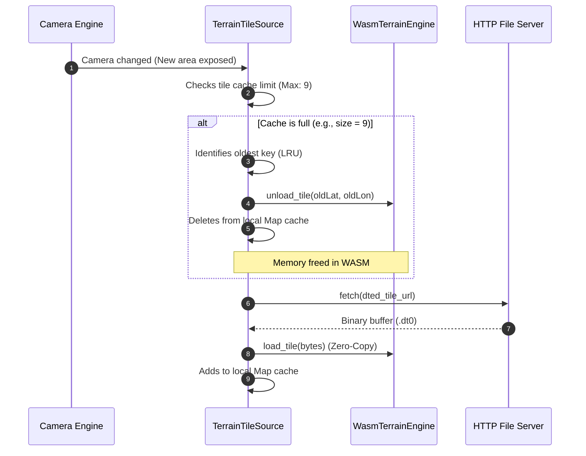

# SDK TS Component: Map Data Stack (`sdk/ts/src/providers`)

The **TS Map Data Stack** manages all ingestion and caching of cartographic data (raster and vector MVT) from GeoServer/GeoWebCache and terrain elevations (DTED files), decoupling network I/O operations from real-time main rendering.

---

## 1. Responsibilities
* **Data Source Management (`MapDataSource`):** Abstract the network under static and dynamic map providers.
* **Terrain Paging and Loading (DTED):** Asynchronously download terrain elevation tiles based on camera geographic coordinates.
* **Limited Cache Management (LRU Cache):** Maintain strict memory buffer limits (avoiding memory leaks in WebAssembly) with algorithms for evicting oldest blocks (*Least Recently Used*).
* **Parallel asynchronous consumption:** Control HTTP request queues and delegate heavy MVT/DTED file processing to background threads using Web Workers.

---

## 2. Interfaces and Class Structure

```typescript
/**
 * Common interface for all map data providers and repositories.
 */
export interface MapDataSource {
  id: string;
  loadTile(x: number, y: number, z: number): Promise<void>;
  unloadTile(x: number, y: number, z: number): void;
  clearCache(): void;
}

/**
 * Dynamic provider for Digital Terrain Elevation Data (DTED) tiles.
 */
export class TerrainTileSource implements MapDataSource {
  public id: string = "terrain_dted";
  private terrainCache: Map<string, Uint8Array> = new Map();
  private terrainEngine: any; // WasmTerrainEngine instance

  constructor(terrainEngine: any);

  /**
   * Downloads a DTED tile via HTTP and registers it in Zero-Copy in the Core WASM memory.
   */
  public loadTile(lat: number, lon: number, _unused?: number): Promise<void>;

  /**
   * Removes the tile from the JS cache and unloads from the WebAssembly heap.
   */
  public unloadTile(lat: number, lon: number, _unused?: number): void;

  /**
   * Clears cache and deallocates everything from the WASM heap.
   */
  public clearCache(): void;
}

/**
 * Provider for vector map files (Mapbox Vector Tiles - MVT) from GeoServer.
 */
export class VectorTileSource implements MapDataSource {
  public id: string = "geoserver_mvt";
  
  public loadTile(x: number, y: number, z: number): Promise<void>;
  public unloadTile(x: number, y: number, z: number): void;
  public clearCache(): void;
}

/**
 * Provider for rasterized image tiles (WMTS / OpenStreetMap).
 */
export class RasterTileSource implements MapDataSource {
  public id: string = "wmts_raster";

  public loadTile(x: number, y: number, z: number): Promise<void>;
  public unloadTile(x: number, y: number, z: number): void;
  public clearCache(): void;
}
```

---

## 3. Memory Management Flow (LRU Eviction)


