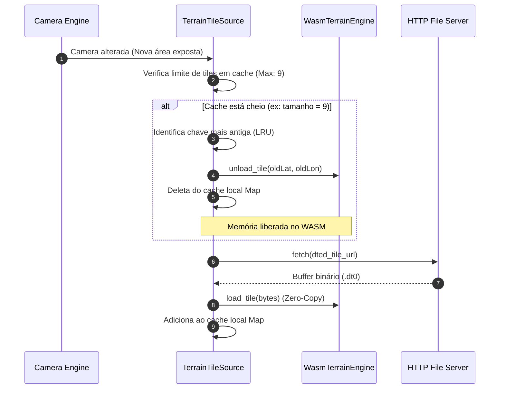

# Componente SDK TS: Map Data Stack (`sdk/ts/src/providers`)

O **TS Map Data Stack** gerencia toda a ingestão e cacheamento de dados cartográficos (raster e vetores MVT) do GeoServer/GeoWebCache e elevações do terreno (arquivos DTED), desacoplando operações de I/O de rede da renderização principal de tempo real.

---

## 1. Responsabilidades
* **Gerenciamento de Fontes de Dados (`MapDataSource`):** Abstrair a rede sob provedores estáticos e dinâmicos de mapa.
* **Paginação e Carregamento de Relevo (DTED):** Baixar assincronamente tiles de elevação de terreno baseados em coordenadas geográficas de câmera.
* **Gerenciamento de Caches Limitados (LRU Cache):** Manter limites estritos de buffers de memória (evitando memory leaks no WebAssembly) com algoritmos de despejo de blocos mais antigos (*Least Recently Used*).
* **Consumo assíncrono paralelo:** Controlar filas de requisições de rede HTTP e delegar o processamento pesado de arquivos MVT/DTED em segundo plano utilizando Web Workers.

---

## 2. Interfaces e Estrutura de Classes

```typescript
/**
 * Interface comum para todos os provedores e repositórios de dados de mapa.
 */
export interface MapDataSource {
  id: string;
  loadTile(x: number, y: number, z: number): Promise<void>;
  unloadTile(x: number, y: number, z: number): void;
  clearCache(): void;
}

/**
 * Provedor dinâmico para tiles de relevo digital de terreno DTED.
 */
export class TerrainTileSource implements MapDataSource {
  public id: string = "terrain_dted";
  private terrainCache: Map<string, Uint8Array> = new Map();
  private terrainEngine: any; // Instância do WasmTerrainEngine

  constructor(terrainEngine: any);

  /**
   * Baixa um tile DTED via HTTP e o registra de forma Zero-Copy na memória do Core WASM.
   */
  public loadTile(lat: number, lon: number, _unused?: number): Promise<void>;

  /**
   * Remove o tile do cache JS e descarrega da heap do WebAssembly.
   */
  public unloadTile(lat: number, lon: number, _unused?: number): void;

  /**
   * Limpa cache e desaloca tudo da heap do WASM.
   */
  public clearCache(): void;
}

/**
 * Provedor para arquivos vetoriais de mapa (Mapbox Vector Tiles - MVT) do GeoServer.
 */
export class VectorTileSource implements MapDataSource {
  public id: string = "geoserver_mvt";
  
  public loadTile(x: number, y: number, z: number): Promise<void>;
  public unloadTile(x: number, y: number, z: number): void;
  public clearCache(): void;
}

/**
 * Provedor de tiles de imagens rasterizadas (WMTS / OpenStreetMap).
 */
export class RasterTileSource implements MapDataSource {
  public id: string = "wmts_raster";

  public loadTile(x: number, y: number, z: number): Promise<void>;
  public unloadTile(x: number, y: number, z: number): void;
  public clearCache(): void;
}
```

---

## 3. Fluxo de Gerenciamento de Memória (Evicção LRU)


