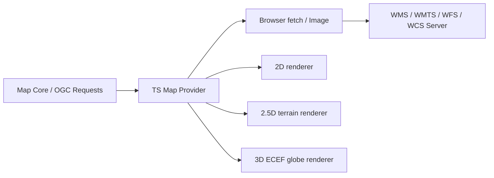
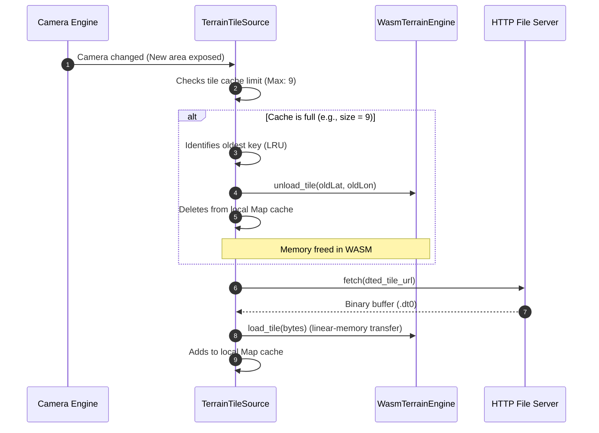

# SDK TS Component: Map Data Stack (`sdk/ts/src/map_provider`)

The **TS Map Provider layer** executes browser I/O for cartographic data while consuming transport-independent request contracts from `olayer-map-core`. It supports raster and vector data from GeoServer/GeoWebCache, terrain elevations and WMS/WMTS/WFS/WCS adapters, decoupling network I/O from real-time rendering.

The provider owns `fetch`, browser decoding, cancellation, retries, cache eviction and WebGL/WASM upload. CRS mathematics and OGC request semantics belong to the shared Map Core/OGC crates.

---

## 1. Responsibilities
* **Data Source Management (`MapDataSource`):** Executes requests produced by Map Core under static and dynamic map providers.
* **OGC Runtime Adapters:** Execute WMS images, WMTS tiles, WFS features and WCS coverages in browser APIs.
* **Terrain Paging and Loading (DTED):** Asynchronously download terrain elevation tiles based on camera geographic coordinates.
* **COG/GeoTIFF Injection:** Fetch local or remote elevation rasters and pass their bytes to `WasmTerrainEngine.load_geotiff_tile`.
* **Limited Cache Management (LRU Cache):** Maintain strict memory buffer limits (avoiding memory leaks in WebAssembly) with algorithms for evicting oldest blocks (*Least Recently Used*).
* **Parallel asynchronous consumption:** Control HTTP request queues and delegate heavy MVT/DTED/WCS processing to background workers where available.

---

## 2. Interfaces and Class Structure

```typescript
/**
 * Common interface for all map data providers and repositories.
 */
export interface MapDataSource {
  id: string;
  loadTile(x: number, y: number, z?: number, options?: TileRequestOptions): Promise<void>;
  unloadTile(x: number, y: number, z: number): void;
  clearCache(): void;
  getCacheStats?(): TileCacheStats;
}

export interface TileRequestOptions {
  signal?: AbortSignal;
  maxRetries?: number;
}

export interface TileCacheStats {
  items: number;
  bytes: number;
  hits: number;
  misses: number;
  evictions: number;
}

/**
 * Dynamic provider for Digital Terrain Elevation Data (DTED) tiles.
 */
export class TerrainTileSource implements MapDataSource {
  public id: string = "terrain_dted";
  private terrainCache: Map<string, Uint8Array> = new Map();
  private terrainEngine: any; // WasmTerrainEngine instance

  constructor(terrainEngine: any);

  /**
   * Downloads a DTED tile via HTTP and transfers it through the WASM boundary into the Core terrain cache.
   */
  public loadTile(lat: number, lon: number, _unused?: number, options?: TileRequestOptions): Promise<void>;

  /**
   * Removes the tile from the JS cache and unloads from the WebAssembly heap.
   */
  public unloadTile(lat: number, lon: number, _unused?: number): void;

  /**
   * Clears cache and deallocates everything from the WASM heap.
   */
  public clearCache(): void;
  public getCacheStats(): TileCacheStats;
}

/**
 * Provider for a Cloud-Optimized GeoTIFF or standard GeoTIFF elevation raster.
 */
export class CogTerrainSource implements MapDataSource {
  public id: string;
  constructor(id: string, terrainEngine: any, url: string);
  public loadTile(_x: number, _y: number, _z?: number, options?: TileRequestOptions): Promise<void>;
  public unloadTile(_x: number, _y: number, _z?: number): void;
  public clearCache(): void;
}

/**
 * Provider for vector map files (Mapbox Vector Tiles - MVT) from GeoServer.
 */
export class VectorTileSource implements MapDataSource {
  public id: string = "geoserver_mvt";
  
  public loadTile(x: number, y: number, z: number, options?: TileRequestOptions): Promise<void>;
  public unloadTile(x: number, y: number, z: number): void;
  public clearCache(): void;
  public getCacheStats(): TileCacheStats;
}

/**
 * Provider for rasterized image tiles (WMTS / OpenStreetMap).
 */
export class RasterTileSource implements MapDataSource {
  public id: string = "wmts_raster";

  public loadTile(x: number, y: number, z: number, options?: TileRequestOptions): Promise<void>;
  public unloadTile(x: number, y: number, z: number): void;
  public clearCache(): void;
  public getCacheStats(): TileCacheStats;
}
```

---

## 3. OGC and Display-Mode Boundary


```mermaid
graph LR
    MC[Map Core / OGC Requests] --> TS[TS Map Provider]
    TS --> HTTP[Browser fetch / Image]
    HTTP --> OGC[WMS / WMTS / WFS / WCS Server]
    TS --> R2[2D renderer]
    TS --> R25[2.5D terrain renderer]
    TS --> R3[3D ECEF globe renderer]
```

The same request contract is used in 2D, 2.5D and 3D. Only tessellation, coordinate conversion, visibility and rendering differ.

## 4. Memory Management Flow (LRU Eviction)


```mermaid
sequenceDiagram
    autonumber
    participant Camera as Camera Engine
    participant MDS as TerrainTileSource
    participant WASM as WasmTerrainEngine
    participant Network as HTTP File Server

    Camera->>MDS: Camera changed (New area exposed)
    MDS->>MDS: Checks tile cache limit (Max: 9)
    alt Cache is full (e.g., size = 9)
        MDS->>MDS: Identifies oldest key (LRU)
        MDS->>WASM: unload_tile(oldLat, oldLon)
        MDS->>MDS: Deletes from local Map cache
        Note over MDS, WASM: Memory freed in WASM
    end
    MDS->>Network: fetch(dted_tile_url)
    Network-->>MDS: Binary buffer (.dt0)
    MDS->>WASM: load_tile(bytes) (linear-memory transfer)
    MDS->>MDS: Adds to local Map cache
```
