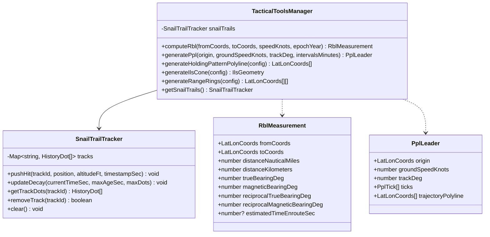

# Component Architecture: TypeScript Tactical Tools (sdk/ts/tools)
## Tactical Aeronautical Measurement Tools & Procedural Overlays (`GIS-PROP-003`)

The **TypeScript Tactical Tools Component** (`sdk/ts/src/tools`) provides specialized aviation calculation routines and dynamic ATC overlay generators. It enables air traffic controllers and tactical operators to measure distances, predict aircraft trajectories, visualize standard instrument holding patterns, render precision approach cones, display range rings, and track radar target history decay.

---

## 1. Responsibilities and Design Goals

* **Aeronautical Geodesy:** Accurate calculation of great-circle/geodesic distance in Nautical Miles ($1\text{ NM} = 1852.0\text{ m}$) and kilometers, initial True bearing, magnetic declination-adjusted Magnetic bearing (via WMM-2025), and estimated time en route (ETE).
* **Kinematic Prediction (PPL):** Projection of aircraft vector leaders along current track headings at specified time intervals (e.g., 1 min, 2 min, 5 min).
* **Standard Holding Patterns:** Procedural racetrack holding pattern generation with standard rate-one ($3^\circ/\text{s}$) turns, configurable leg duration, and inbound bearing orientation.
* **ILS Precision Approach Geometry:** Approach corridor funnel generation with customizable field-of-view, extended centerline, and distance crossbars.
* **Range Rings & Compass Rose:** Dynamic concentric distance circles and azimuth spokes anchored to arbitrary radar/navaid centers.
* **Radar Snail Trails (History Dots):** Time-decaying historical radar hit buffer with configurable retention and linear/exponential opacity decay.

---

## 2. Component Class Diagram



---

## 3. Usage Examples

### 3.1 Range and Bearing Line (RBL / CRSR)
```typescript
import { TacticalToolsManager } from "olayer-sdk";

const tools = new TacticalToolsManager();
const rbl = tools.computeRbl(
  { lat: 40.64, lon: -73.78 }, // JFK
  { lat: 42.36, lon: -71.01 }, // BOS
  450.0,                       // 450 knots ground speed
  2025.0                       // Magnetic epoch
);

console.log(`Distance: ${rbl.distanceNauticalMiles.toFixed(1)} NM`);
console.log(`True Bearing: ${rbl.trueBearingDeg.toFixed(1)}°`);
console.log(`Magnetic Bearing: ${rbl.magneticBearingDeg.toFixed(1)}°`);
console.log(`ETE: ${(rbl.estimatedTimeEnrouteSec! / 60).toFixed(1)} min`);
```

### 3.2 Projected Position Leader (PPL)
```typescript
const ppl = tools.generatePpl(
  { lat: 40.0, lon: -74.0 },
  480.0,                       // 480 knots
  90.0,                        // Eastbound track
  [1.0, 2.0, 5.0]             // 1m, 2m, 5m ticks
);

ppl.ticks.forEach(tick => {
  console.log(`Tick ${tick.timeMinutes}m: ${tick.distanceNauticalMiles} NM at [${tick.position.lat}, ${tick.position.lon}]`);
});
```

### 3.3 Racetrack Holding Pattern
```typescript
const holdingPoly = tools.generateHoldingPatternPolyline({
  fixCoords: { lat: 51.5, lon: -0.1 },
  inboundBearingDeg: 270.0,
  turnDirection: "StandardRight",
  legTimeMinutes: 1.0,
  airspeedKnots: 210.0,
  pointsPerTurn: 16
});
```

### 3.4 Snail Trails (History Dots)
```typescript
const tracker = tools.getSnailTrails();
tracker.pushHit("AFR123", { lat: 48.85, lon: 2.35 }, 10000, 100);
tracker.updateDecay(108, 20.0, 10);
const activeDots = tracker.getTrackDots("AFR123");
```
