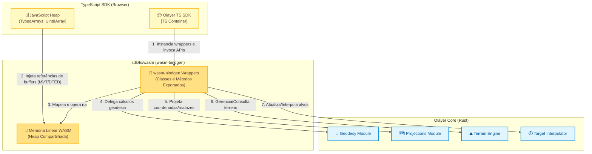

# Arquitetura: Bridge WebAssembly (WASM)

Este documento descreve o design detalhado, a estrutura de interfaces e a gestão de recursos da ponte de interoperabilidade **WebAssembly (WASM)** do Olayer, localizada em [wasm](file:///c:/Users/rafae/projects/rust/olayer/sdk/ts/wasm).

Este componente é responsável por traduzir dados e expor as capacidades do [Olayer Core](file:///c:/Users/rafae/projects/rust/olayer/core) para o SDK TypeScript rodando no navegador.

---

## 1. Diagrama do Contêiner WASM (C4 Model - Nível 3)

A ponte WASM atua como um adaptador bidirecional entre o runtime do JavaScript (Engine V8) e o motor em Rust compilado para código de máquina WASM.



---

## 2. Responsabilidades

O componente **WASM Bridge** possui as seguintes atribuições principais:
1. **Exposição de APIs do Core:** Empacotar tipos internos do Rust em estruturas marcadas com `#[wasm_bindgen]` para que fiquem disponíveis como classes JavaScript normais.
2. **Tradução e Marshaling de Dados:** Converter estruturas dinâmicas complexas utilizando a ponte de serialização rápida `serde-wasm-bindgen` ou mapeando arrays de tipos primitivos (*flat-arrays*).
3. **Gerenciamento Otimizado de I/O de Terreno e Mapas (Zero-Copy):** Mapear arrays binários do navegador (`ArrayBuffer`/`Uint8Array`) diretamente como slices de bytes do Rust (`&[u8]`) no heap do WASM sem realizar cópia física de dados.
4. **Gerenciamento de Ciclo de Vida da Heap WASM:** Fornecer ganchos claros para desalocação de memória de structs nativas do Rust a partir da thread principal do JavaScript.

---

## 3. Interfaces Projetadas (WASM Exports)

Os wrappers definidos na pasta [wasm](file:///c:/Users/rafae/projects/rust/olayer/sdk/ts/wasm) atuam como fachadas de conversão para as estruturas reais do Rust Core:

### 3.1 Coordenadas
```rust
#[wasm_bindgen]
pub struct WasmLatLon {
    pub lat: f64,    // em radianos
    pub lon: f64,    // em radianos
    pub height: f64, // em metros
}

#[wasm_bindgen]
impl WasmLatLon {
    #[wasm_bindgen(constructor)]
    pub fn new(lat: f64, lon: f64, height: f64) -> WasmLatLon {
        WasmLatLon { lat, lon, height }
    }
}

#[wasm_bindgen]
pub struct WasmTileKey {
    pub lat_deg: i32,
    pub lon_deg: i32,
}
```

### 3.2 Engine de Terreno (DTED)
Para o carregamento de dados geográficos densos, a interface WASM consome ponteiros diretos do buffer para obter a máxima performance de I/O.
```rust
#[wasm_bindgen]
pub struct WasmTerrainEngine {
    inner: TerrainEngine,
}

#[wasm_bindgen]
impl WasmTerrainEngine {
    #[wasm_bindgen(constructor)]
    pub fn new() -> WasmTerrainEngine {
        WasmTerrainEngine { inner: TerrainEngine::new() }
    }

    /// Carrega o buffer binário de elevação de forma passiva.
    /// O parâmetro data mapeia diretamente um Uint8Array do JS como slice Rust.
    /// Retorna a chave do tile (coordenadas de origem em graus inteiros).
    pub fn load_tile(&mut self, data: &[u8]) -> Result<WasmTileKey, JsValue> { ... }

    /// Remove um tile pelo seu índice de graus inteiros.
    pub fn unload_tile(&mut self, lat_deg: i32, lon_deg: i32) -> bool { ... }

    /// Retorna a elevação interpolada para coordenadas geográficas em **graus decimais**.
    pub fn get_elevation(&self, lat_deg: f64, lon_deg: f64) -> Result<f64, JsValue> { ... }

    /// Gera um perfil vertical de terreno ao longo de uma rota.
    /// As coordenadas de entrada devem ser passadas como um array plano em **graus decimais**:
    /// [lat0, lon0, height0, lat1, lon1, height1, ...]
    /// O retorno é um array plano com 5 elementos por ponto:
    /// [distance0, elevation0, lat0, lon0, height0, distance1, elevation1, lat1, lon1, height1, ...]
    pub fn get_vertical_profile(&self, route_coords: &[f64], step_meters: f64) -> Result<Vec<f64>, JsValue> { ... }
}
```

### 3.3 Interpolação de Alvos (Dead Reckoning)
```rust
#[wasm_bindgen]
pub struct WasmInterpolationEngine {
    inner: InterpolationEngine,
}

#[wasm_bindgen]
impl WasmInterpolationEngine {
    #[wasm_bindgen(constructor)]
    pub fn new() -> WasmInterpolationEngine {
        WasmInterpolationEngine { inner: InterpolationEngine::new() }
    }

    /// Construtor alternativo com limiar de obsolescência customizado (segundos).
    #[wasm_bindgen(constructor)]
    pub fn with_stale_threshold(stale_threshold: f64) -> WasmInterpolationEngine {
        WasmInterpolationEngine {
            inner: InterpolationEngine::with_stale_threshold(stale_threshold),
        }
    }

    /// Atualiza ou insere o estado de um alvo.
    /// As coordenadas lat/lon devem ser passadas em **radianos**; altitude em metros.
    pub fn update_target(
        &mut self,
        id: &str,
        lat_rad: f64,
        lon_rad: f64,
        height: f64,
        speed_mps: f64,
        track_heading_rad: f64,
        vertical_rate_mps: f64,
        last_ping_time: f64,
    ) -> Result<(), JsValue> { ... }

    /// Remove um alvo pelo identificador.
    pub fn remove_target(&mut self, id: &str) -> bool { ... }

    /// Executa o Dead Reckoning de todos os alvos e retorna um array JSON serializado.
    pub fn interpolate_all(&self, current_time: f64) -> Result<JsValue, JsValue> { ... }
}
```

---

## 4. Gestão de Memória na Web (ADR-004)

WebAssembly gerencia a execução através de uma **Memória Linear**. Objetos de Rust criados dentro do WASM (usando `new WasmTerrainIndex()`, por exemplo) residem no heap interno do WASM e não são monitorados pelo Garbage Collector (GC) do JavaScript.

### 4.1 Ciclo de Desalocação
* **Regra Rígida da SDK:** Ao instanciar qualquer objeto Rust na SDK TypeScript, o desenvolvedor host deve chamar explicitamente `.free()` para liberar os recursos do heap do WASM quando o componente for destruído.
  ```typescript
  // Exemplo correto na SDK TS
  const terrain = new WasmTerrainEngine();
  try {
      const tileKey = terrain.load_tile(dtedBuffer);
      const elevation = terrain.get_elevation(-23.5, -46.6);
  } finally {
      terrain.free(); // Desaloca os dados de Rust na heap linear
  }
  ```
* Se o método `.free()` não for chamado, a memória linear do WebAssembly se expandirá a cada nova criação de dados até atingir o limite físico da aba do navegador, causando um crash catastrófico (*Out of Memory*).

### 4.2 LRU Tile Eviction
* Para o relevo global (DTED), a SDK TS deve gerenciar o cache contendo no máximo $N$ tiles ativos.
* Ao remover um tile antigo do cache LRU na SDK, a SDK deve chamar `terrain.unload_tile(lat_deg, lon_deg)` para remover a matriz de elevações, liberando o espaço correspondente do heap do WASM.

---

## 5. Estratégia de Performance: Zero-Copy Transfers

Para manter taxas de 60 FPS operacionais no navegador durante interações geográficas densas, a transferência de dados do JS para o Rust utiliza a flexibilidade da memória linear compartilhada.

```
+-------------------------------------------------------------+
|               Memória Linear do WebAssembly                 |
|                                                             |
|   [ JS Uint8Array View ]                                    |
|   Permite que o JavaScript escreva na memória do WASM       |
|                                                             |
|   [ Rust Slice &[u8] ]                                      |
|   Mapeia diretamente sobre o endereço da View sem copiar     |
+-------------------------------------------------------------+
```

* Ao transferir um buffer DTED (geralmente $1.5\text{ MB}$ por bloco Nível 1):
  1. A SDK TS lê o arquivo binário como um `ArrayBuffer` usando o navegador (`fetch`).
  2. A ponte WASM recebe a referência do array tipado (`Uint8Array`) do JavaScript.
  3. A biblioteca `wasm-bindgen` converte a referência diretamente em um slice seguro `&[u8]` apontando para os bytes residentes na memória compartilhada.
  4. O Rust Core processa e monta o grid diretamente desse slice geográfico sem alocações adicionais no buffer, poupando ciclos de CPU.
