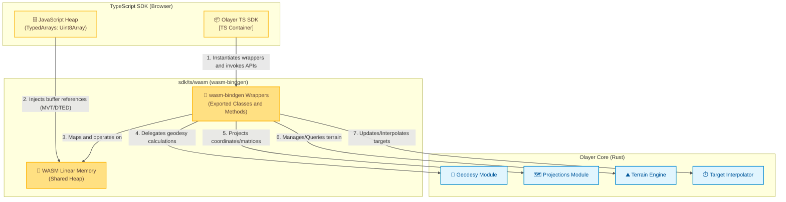

# Architecture: WebAssembly (WASM) Bridge

This document describes the detailed design, interface structure, and resource management of the **WebAssembly (WASM)** interoperability bridge of Olayer, located in [wasm](../../../../sdk/ts/wasm).

This component is responsible for translating data and exposing the capabilities of the [Olayer Core](../../../../core) to the TypeScript SDK running in the browser.

---

## 1. WASM Container Diagram (C4 Model - Level 3)

The WASM bridge acts as a bidirectional adapter between the JavaScript runtime (V8 Engine) and the Rust engine compiled to WASM machine code.



---

## 2. Responsibilities

The **WASM Bridge** component has the following main assignments:
1. **Core API Exposure:** Package internal Rust types into structures marked with `#[wasm_bindgen]` so they are available as normal JavaScript classes.
2. **Data Translation and Marshaling:** Convert complex dynamic structures using the fast serialization bridge `serde-wasm-bindgen` or mapping primitive type arrays (*flat-arrays*).
3. **Optimized Terrain and Map I/O Management (Zero-Copy):** Map browser binary arrays (`ArrayBuffer`/`Uint8Array`) directly as Rust byte slices (`&[u8]`) on the WASM heap without performing physical data copy.
4. **WASM Heap Lifecycle Management:** Provide clear hooks for deallocating memory of native Rust structs from the main JavaScript thread.

---

## 3. Designed Interfaces (WASM Exports)

The wrappers defined in the [wasm](../../../../sdk/ts/wasm) folder act as conversion facades for the real structures of the Rust Core:

### 3.1 Coordinates
```rust
#[wasm_bindgen]
pub struct WasmLatLon {
    pub lat: f64,    // in radians
    pub lon: f64,    // in radians
    pub height: f64, // in meters
}

#[wasm_bindgen]
impl WasmLatLon {
    #[wasm_bindgen(constructor)]
    pub fn new(lat: f64, lon: f64, height: f64) -> WasmLatLon {
        WasmLatLon { lat, lon, height }
    }
}

#[wasm_bindgen]
pub struct WasmTileKey {
    pub lat_deg: i32,
    pub lon_deg: i32,
}
```

### 3.2 Terrain Engine (DTED)
For the loading of dense geographic data, the WASM interface consumes direct buffer pointers for maximum I/O performance.
```rust
#[wasm_bindgen]
pub struct WasmTerrainEngine {
    inner: TerrainEngine,
}

#[wasm_bindgen]
impl WasmTerrainEngine {
    #[wasm_bindgen(constructor)]
    pub fn new() -> WasmTerrainEngine {
        WasmTerrainEngine { inner: TerrainEngine::new() }
    }

    /// Loads the elevation binary buffer passively.
    /// The data parameter maps a JS Uint8Array directly as a Rust slice.
    /// Returns the tile key (origin coordinates in integer degrees).
    pub fn load_tile(&mut self, data: &[u8]) -> Result<WasmTileKey, JsValue> { ... }

    /// Removes a tile by its integer degree index.
    pub fn unload_tile(&mut self, lat_deg: i32, lon_deg: i32) -> bool { ... }

    /// Returns the interpolated elevation for geographic coordinates in **decimal degrees**.
    pub fn get_elevation(&self, lat_deg: f64, lon_deg: f64) -> Result<f64, JsValue> { ... }

    /// Returns the interpolated elevation for geographic coordinates in **radians**.
    pub fn get_elevation_rad(&self, lat_rad: f64, lon_rad: f64) -> Result<f64, JsValue> { ... }

    /// Sets the maximum number of DTED tiles kept in memory.
    pub fn set_cache_capacity(&self, capacity: usize) -> Result<(), JsValue> { ... }

    /// Returns the current number of cached tiles.
    pub fn cache_size(&self) -> usize { ... }

    /// Clears all cached tiles.
    pub fn clear_cache(&self) { ... }

    /// Generates a terrain vertical profile along a route.
    /// Input coordinates must be passed as a flat array in **decimal degrees**:
    /// [lat0, lon0, height0, lat1, lon1, height1, ...]
    /// The return is a flat array with 5 elements per point:
    /// [distance0, elevation0, lat0, lon0, height0, distance1, elevation1, lat1, lon1, height1, ...]
    pub fn get_vertical_profile(&self, route_coords: &[f64], step_meters: f64) -> Result<Vec<f64>, JsValue> { ... }
}
```

### 3.3 Target Interpolation (Dead Reckoning)
```rust
#[wasm_bindgen]
pub struct WasmInterpolationEngine {
    inner: InterpolationEngine,
}

#[wasm_bindgen]
impl WasmInterpolationEngine {
    #[wasm_bindgen(constructor)]
    pub fn new() -> WasmInterpolationEngine {
        WasmInterpolationEngine { inner: InterpolationEngine::new() }
    }

    /// Alternative constructor with custom obsolescence threshold (seconds).
    #[wasm_bindgen(constructor)]
    pub fn with_stale_threshold(stale_threshold: f64) -> WasmInterpolationEngine {
        WasmInterpolationEngine {
            inner: InterpolationEngine::with_stale_threshold(stale_threshold),
        }
    }

    /// Updates or inserts a target state.
    /// Lat/lon coordinates must be passed in **radians**; altitude in meters.
    pub fn update_target(
        &mut self,
        id: &str,
        lat_rad: f64,
        lon_rad: f64,
        height: f64,
        speed_mps: f64,
        track_heading_rad: f64,
        vertical_rate_mps: f64,
        last_ping_time: f64,
    ) -> Result<(), JsValue> { ... }

    /// Removes a target by identifier.
    pub fn remove_target(&mut self, id: &str) -> bool { ... }

    /// Executes Dead Reckoning of all targets and returns a serialized JSON array.
    pub fn interpolate_all(&self, current_time: f64) -> Result<JsValue, JsValue> { ... }
}
```

---

## 4. Web Memory Management (ADR-004)

WebAssembly manages execution through a **Linear Memory**. Rust objects created within the WASM (using `new WasmTerrainEngine()`, for example) reside in the WASM's internal heap and are not monitored by the JavaScript Garbage Collector (GC).

### 4.1 Deallocation Cycle
* **Strict SDK Rule:** When instantiating any Rust object in the TypeScript SDK, the host developer must explicitly call `.free()` to release the WASM heap resources when the component is destroyed.
  ```typescript
  // Correct example in the TS SDK
  const terrain = new WasmTerrainEngine();
  try {
      const tileKey = terrain.load_tile(dtedBuffer);
      const elevation = terrain.get_elevation(-23.5, -46.6);
  } finally {
      terrain.free(); // Deallocates Rust data on the linear heap
  }
  ```
* If the `.free()` method is not called, the WebAssembly linear memory will expand with each new data creation until reaching the physical limit of the browser tab, causing a catastrophic crash (*Out of Memory*).

### 4.2 LRU Tile Eviction
* For global relief (DTED), the TS SDK must manage the cache containing at most $N$ active tiles.
* When removing an old tile from the LRU cache in the SDK, the SDK must call `terrain.unload_tile(lat_deg, lon_deg)` to remove the elevation matrix, freeing the corresponding space from the WASM heap.

---

## 5. Performance Strategy: Zero-Copy Transfers

To maintain operational 60 FPS rates in the browser during dense geographic interactions, data transfer from JS to Rust uses the flexibility of the shared linear memory.

```
+-------------------------------------------------------------+
|               WebAssembly Linear Memory                 |
|                                                             |
|   [ JS Uint8Array View ]                                    |
|   Allows JavaScript to write to WASM memory       |
|                                                             |
|   [ Rust Slice &[u8] ]                                      |
|   Maps directly over the View address without copying     |
+-------------------------------------------------------------+
```

* When transferring a DTED buffer (usually $1.5\text{ MB}$ per Level 1 block):
  1. The TS SDK reads the binary file as an `ArrayBuffer` using the browser (`fetch`).
  2. The WASM bridge receives the typed array reference (`Uint8Array`) from JavaScript.
  3. The `wasm-bindgen` library converts the reference directly into a safe `&[u8]` slice pointing to the bytes residing in the shared memory.
  4. The Rust Core processes and builds the grid directly from this geographic slice without additional buffer allocations, saving CPU cycles.
